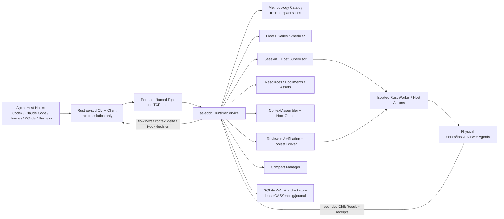

# ae-sdd Full Daemon Capability Migration Implementation Plan

> **For Hermes:** Use subagent-driven-development skill to implement this plan task-by-task.

**Goal:** 将 ae-sdd 所有适合运行时化的确定性能力迁入 Rust daemon 控制平面，使任意受支持 Agent 在首次调用或 Hook 触发时自动连接同一个 per-user daemon，由 daemon 统一完成路由、系列调度、上下文装配、门禁、文档/资产、Review、验证证据、Compact 和生命周期管理；主会话只推进流程、向用户汇报并聚合有界子结果。

**Architecture:** 保留“Agent 负责语义、daemon 负责控制”的边界。daemon 加载版本化 Methodology IR/compact slices，而不是把 RA/DR/Story/Coding/Review 的自然语言推理硬编码进 Rust。CLI、Hook 和 host adapter 都是薄客户端，经 Windows Named Pipe 访问单用户单 daemon；daemon 通过受认证的 Host Adapter 调度物理 series/task/reviewer Agent，并通过 SQLite WAL、ProjectMutationStore、lease/revision/fencing/idempotency/journal 保证并发与崩溃恢复。外部命令、测试和 MCP 类工具由 daemon 调度的隔离 worker/host action 执行，不在 daemon 主进程中执行任意 shell。

**Tech Stack:** Rust 1.97.1 stable、Edition 2024、Tokio、clap、serde/serde_json、SQLite WAL/rusqlite、Windows Named Pipe（Unix 继续保留 UDS 契约）、Ed25519 capability、notify inventory、隔离 Rust worker、Cargo release tests、Windows PowerShell E2E；发布运行时不含 Python worker/fallback，不新增 TCP/HTTP 端口。

---

## 0. 计划地位、路由与实施红线

本文件是完整实施路线图，不是已经获批的 `state.executionPlan`，也不授权直接 Coding。

1. 本需求横跨 protocol、flow、runtime、store、operations、integrations、build、hooks、documents、assets、review、verification 和 release，自动 `classify` 曾以 0.4 置信度误判为微任务；按实际影响面人工覆盖为 **large / multi-Story program**。
2. 实施的第一步必须创建新的 PRD/RA/DR/Stories，并通过 `G-CODEPLAN-SRC`、`G-14`、`G-08`；随后把紧凑 `state.executionPlan` 展示给用户并取得明确批准。
3. Coding 前重新加载并验证四个上下文：项目约束、完整 Thinking Engine、当前 Story、Story verification matrix。
4. 不创建 Proposal、CodingReport、TestReport、CodeReview report 或 changelog 文件。测试只记录真实 evidence；Review 只记录 `status/findings`。
5. 当前工作树已有大量用户 WIP。实施时只改当前 Story 声明的路径，不做 reset、checkout、批量格式化或无关清理。
6. `apps/ae-sdd-monitor/**` 明确排除；Monitor 不是本计划依赖，也不是 Windows 完工条件。

## 1. 已确定的产品决策

| 决策 | 终态 |
| --- | --- |
| daemon 启动时机 | 任意 daemon-bound CLI/Hook 首次调用先 call；endpoint 不存在或本地 transport unavailable 时 singleflight 启动 `ae-sddd`，ready 后原请求最多重放一次。`SessionStart` 只做预热与 bootstrap，不是正确性唯一入口。 |
| 网络接口 | Windows 使用 per-user Named Pipe；不设端口，不监听 TCP/HTTP，不新增防火墙规则。 |
| 多 Agent 共享 | 同一 OS 用户一个 daemon，可服务多个 workspace、多个 Agent/会话；allowed roots 在首次启动时冻结，后续不能静默扩大。 |
| 主会话职责 | 只请求 `flow.next`、执行 daemon 返回的编排动作、收集有界 ChildResult、向用户汇报/询问；不执行 RA/DR/Story/Coding/Test/Review 系列正文。 |
| 流程执行者 | daemon 是 workflow/control-plane executor；物理 series/task/reviewer Agent 是 semantic executor。二者缺一不可。 |
| Skill 装载 | daemon 加载所有 Skill 的版本化 IR、依赖、gates、输入/输出契约及 compact slice；全量 fallback 文本按需提供给 Agent，不在 daemon 常驻，也不由 Rust解释语义。 |
| Hook/Gate | Hook 快路径只读取预计算、有 digest/freshness 的 authoritative projection；不在 250 ms 路径中全仓扫描、构建、等待 Agent 或等待 compact。 |
| Compact | daemon 依据可信 pressure telemetry、host capability 和 generation CAS 主动发起；只有匹配 ACK + rehydrate 才算成功。宿主不支持时返回 manual/rotate，绝不伪造 ACK。 |
| Python | Python 迁移期只作只读 differential oracle，禁止 Rust/Python 双写；Windows release 终态无 Python runtime、worker 或 fallback。 |
| 任意状态写 | 不恢复 `state.write`；只提供窄 schema、可审计、带 lease/revision/fencing/idempotency 的业务操作。 |
| 完工平台 | 用户已指定 Windows 实机通过即可本轮完工。其他 OS 保留协议和单元契约，但 live acceptance 延后，不阻塞本计划 terminal state。 |

## 2. “全部做进 daemon” 的准确边界

### 2.1 必须进入 daemon 控制平面的能力

1. Methodology/Skill Catalog、plugin override 解析、版本和 digest 校验。
2. 权威 RouteDecision、SeriesPlan、FlowRuntime 系列调度和恢复。
3. daemon 自动启动、workspace/session bootstrap、Hook binding、capability issuance。
4. Host Adapter supervisor：spawn/send/wait/cancel/attest/compact。
5. DocumentStorage、resource resolver、assets、constraints、Thinking Engine、Story/DR/verification matrix 解析。
6. ContextAssembler、role-aware/delta bundle、LoadedContextProof 和 cache invalidation。
7. Native HookGuard、Gate truth、scanner 结果和 mutation admission。
8. WorkItem/Story/PRD typed lifecycle、文档 finalization、PRD summary/compact linkage。
9. ReviewSupervisor：Tier、角色独立、batch/round、fingerprint、预算、clean streak、retry/exit。
10. Verification coordinator、isolated test/build worker、toolset/evidence receipts。
11. Automation、baseline、preflight、perf、update-check、iteration-check 和 project assets 更新。
12. Context pressure、Compact cycle、snapshot/ACK/rehydrate/recovery。
13. RustCanary -> RustSoleWriter 切换、兼容审计、Windows install/release/lifecycle。

### 2.2 保留为声明式内容或外部执行，但由 daemon 管理

| 能力 | 为什么不直接写成 daemon 语义代码 | daemon 如何管理 |
| --- | --- | --- |
| RA/DR/Story/Coding/Test/Review 的分析与写作 | 需要 LLM 语义推理，规则会演进；硬编码会造成僵化和误判 | 选择 MethodologyRef、装配上下文、调度物理 Agent、校验 deliverables/receipts、决定下一动作 |
| 用户批准/覆盖 | 只能由用户作出 | 持久化待批准 plan/route，校验 confirmation token，未批准 fail closed |
| Postman MCP/Sonar host tool | 凭证属于 Host/MCP，不能进入 daemon manifest 或日志 | daemon 发出受约束 host action，接收 attested receipt 和 evidence ref |
| build/install/self-update 的二进制替换 | daemon 不能安全地在同一进程内替换自身 | daemon 调度签名 Rust build/service helper，drain 后原子切换，再重新 handshake |
| 不支持的宿主事件 | daemon 不能发明物理会话或 ACK | capability negotiation 后显式 `unsupported/manual/rotate` |

### 2.3 按物理部署划分的三层边界

“全部做进 daemon”指所有**确定性裁决权、状态权和监督权**归 daemon，不代表所有代码、Markdown、Agent 和外部工具都塞进 `ae-sddd.exe` 一个进程。

| 层 | 组件 | 权威与限制 |
| --- | --- | --- |
| **daemon 进程内** | Named Pipe/RPC admission、workspace/session/capability、Methodology Catalog、Route/Series/Flow、typed lifecycle、Document/Resource/Assets service、ContextAssembler/cache、HookGuard/Gates、ReviewSupervisor、Verification planner/receipt validator、Compact policy/state、update plan、SQLite WAL/event/journal | 独占确定性判断和状态推进；允许有界文件解析/hash/SQLite/cache；禁止任意 shell、长时间 build/test、MCP 调用和 LLM 语义推理 |
| **daemon 监督但进程外** | `ae-sdd.exe`/Hooks 薄客户端、`ae-sdd-worker.exe`、Host Adapter bridge、root/series/task/reviewer Agent、Postman/Sonar/MCP action、Git/DB/build/test 子进程、Rust install/update helper、迁移期 Python oracle | daemon 发计划、scope、deadline、actionId 和 receipt contract；外部执行后返回真实 attestation/evidence；Python 只读不双写且不进入 Windows release |
| **外部事实/最终权威** | 用户批准、Agent Host 的真实 session/token pressure/compact capability/ACK、Skill Markdown/templates、workspace 代码和文档、Git/数据库/远端服务、credential store、Windows service manager、Electron Monitor | daemon 可引用、hash、校验或请求操作，但不能伪造；凭证不进入 state/manifest/log；Monitor 永远只读且排除本计划 |

几个容易混淆的例子：

- **Skill：** Catalog IR、版本、digest、路由和契约在 daemon；自然语言正文仍在包/文件系统，语义执行由 Agent 完成。
- **DocumentStorage：** resolver、路径、版本、事务、index 和 proof 在 daemon；Markdown 文件本体仍位于 workspace。
- **Hook：** Hook 进程在 daemon 外；HookGuard 和 allow/deny/block 裁决在 daemon 内。
- **Host Adapter：** HostCoordinator/HostSupervisor 在 daemon 内；真正调用 Codex/Claude/Hermes 等宿主的 bridge/物理会话在外。
- **Compact：** pressure policy、cycle state、generation CAS 在 daemon；真实 pressure 和 ACK 来自 Host，compact 动作在外执行。
- **主流程监控器：** 指 daemon 内的 Flow/Series/Review/Verification supervisors；不是 `apps/ae-sdd-monitor` Electron UI。

## 3. 目标架构



### 3.1 责任边界

| 层 | Owns | Must not own |
| --- | --- | --- |
| 主会话/root Agent | 用户沟通、执行 daemon 编排动作、汇总有界结果 | 系列正文、子 Agent transcript、任意状态推进 |
| series/task/reviewer Agent | 单一语义系列或受限实现/评审任务 | 全局 transition、伪造 evidence/physical identity |
| Methodology Catalog | Skill identity/version/digest/route/input/output/gates/tool deps/compact refs | LLM 推理结果 |
| Flow/Series Scheduler | route、依赖、并发、重试、nextAction、恢复 | 直接写设计/代码 |
| Resources/Context | authoritative 文件解析、hash、slice、delta、proof | 猜测缺失上下文 |
| HookGuard/Gates | 基于 fresh proof 的 admit/deny/block | Hook 内扫描或长任务 |
| Review/Verification | reviewer 独立性、预算、运行计划、真实 receipt | 手工写 PASS |
| Host/Worker | 受约束物理执行和 attestation | 业务流程裁决 |
| Store | revision、lease、fencing、journal、event replay | 接受任意自由结构写入 |

## 4. 当前能力与迁移缺口

| 能力域 | 当前状态 | 本计划终态 |
| --- | --- | --- |
| autostart / IPC | 已有 `runtime ensure`、Named Pipe、endpoint manifest | 增加原子 session bootstrap；所有 Hook/CLI 都能 call-first recovery |
| Flow/Gates/store | reducer、transition、36 Gates、lease/CAS/fencing/journal 已有 | 增加 RouteDecision、SeriesPlan、LoadedContextProof、typed lifecycle |
| Methodology | 仅 Agent 读取 Skill/compiled slices | daemon 加载完整版本化 Catalog，并把 skill/context refs 绑定 delegation |
| physical delegation | protocol/state machine 已有 | 生产 Host Adapter worker、真实 spawn/send/wait/cancel/attest |
| context | projection/delta/compact 框架已有 | 实际装载四必需上下文、角色切片、资源缓存、真实 freshness proof |
| HookGuard | 主要相信 state 中已有 `hookGuard` | daemon 后台计算；Hook 只做 bounded lookup/freshness check |
| documents/resources | 只有 `document.resolve/save` 的浅层映射 | resolve/read/save/finalize、intent registry、版本、index、resource fallback |
| assets | read/check/query/stats 已有，生成端 `.json` 与读取端 `.md` 不一致 | `.assets.md` SSOT；generate/update/index/cache 全原子化 |
| WorkItem/PRD | 多项 legacy mutation 被拒绝 | 新建、绑定、complete/archive、summary/compact 全 typed |
| Review | `review.record` 只有 status/findings | 完整 ReviewSupervisor 和 Gate truth |
| verification/evidence | plan/record/finalize 已有 | daemon 调度真实 build/test worker并自动绑定 evidence |
| tools | Git/DB/Memory/Assets jobs 部分已有 | dependency broker、mandatory receipt、Postman/Sonar host action |
| automation/update | 多个 mutation rejected；update-check 仅 UC-01 实现完整 | 全量 Rust semantic check registry 和 typed mutations |
| compact | 状态机/pressure 已有 | 与 host worker、PRD summary、root recovery 形成完整事务 |
| release | Rust 二进制和 Windows autostart 已有 | 业务 Python route=0，Windows 全链路/并发/性能/安全证据闭环 |

## 5. 核心数据/API 契约

这些契约在 M0/M1 的 DR 和 golden fixtures 中冻结；字段变化必须同步 protocol/operation schema、compatibility manifest 和测试。

为了让四个实现 Part 真正独立，所有跨 Part DTO、错误码、版本协商和 trait 边界由协调者先固化在只含契约的 `crates/ae-sdd-contracts/`；四个 Part 只能依赖该 crate，不能直接依赖其他 Part 的实现 crate。

### 5.1 Methodology IR

新增 crate：`crates/ae-sdd-methodology/`。

```rust
#[derive(Clone, Debug, Deserialize, Serialize)]
#[serde(rename_all = "camelCase", deny_unknown_fields)]
pub struct MethodologyEntry {
    pub skill_id: String,
    pub version: String,
    pub digest: String,
    pub series_kind: SeriesKind,
    pub route_predicates: Vec<RoutePredicate>,
    pub required_inputs: Vec<ResourceRequirement>,
    pub deliverable_contracts: Vec<DeliverableContract>,
    pub required_gates: Vec<String>,
    pub tool_dependencies: Vec<ToolDependency>,
    pub compact_slice_ref: ArtifactRef,
    pub fallback_ref: Option<ArtifactRef>,
}
```

约束：

- 构建期从 source/compiled manifest 生成，不由 daemon 猜测 Markdown。
- daemon 启动只加载 bounded IR/index；full fallback 按需读取并做 digest 校验。
- project override > user/global > packaged default 的 winner 可审计；winner digest 变化使旧 context/review 失效。
- bundle 篡改、缺项、duplicate skillId、未知 schema 一律拒绝启动或拒绝刷新。

### 5.2 RouteDecision、SeriesPlan 与 NextAction

```rust
pub struct SeriesPlan {
    pub plan_id: String,
    pub work_item_id: String,
    pub series_kind: SeriesKind,
    pub role: WireAgentRole,
    pub methodology_ref: MethodologyRef,
    pub context_ref: ContextBundleRef,
    pub deliverables: Vec<DeliverableContract>,
    pub verification_contract: VerificationContractRef,
    pub dependency_ids: Vec<String>,
    pub deadline_unix_ms: u64,
    pub retry_policy: RetryPolicy,
}

pub enum NextAction {
    AwaitRouteApproval { decision_id: String },
    RunSeries { plan_id: String },
    AwaitSeries { plan_id: String },
    CollectSeries { plan_id: String },
    EvaluateGates { target: ProcessPhase, required_gates: Vec<RequiredGate> },
    ApplyTransition { target: ProcessPhase },
    ProvideCorrection,
    Halt { reason: HaltReason },
}
```

`DelegationCreatePayload` 增加 `seriesKind`、`methodologyRef`、`contextRef`、`deliverableContractRef`、`seriesPlanId`。重复 idempotency key 返回同一 delegation/action，不重复 spawn。

### 5.3 Session bootstrap

协议采用 additive v1.x capability，新增 `session.bootstrap`；旧 client 仍可按 `workspace.register -> session.open -> context.project` 组合。

```text
Hook/CLI call
  -> client tries handshake
  -> only endpoint missing/transport unavailable triggers ensure
  -> daemon ready
  -> session.bootstrap(workspace, externalSession, agent, hostCapabilities)
  -> workspace register + session open + scoped grant + initial context projection
  -> original Hook/business call replay once
```

bootstrap 必须 singleflight、幂等、可恢复；protocol/auth/policy/business error 不触发重启循环。

### 5.4 Resource、Document 与 Context proof

```rust
pub struct LoadedContextProof {
    pub work_item_id: String,
    pub story_ref: ArtifactRef,
    pub constraints_ref: ArtifactRef,
    pub thinking_engine_ref: ArtifactRef,
    pub verification_ref: ArtifactRef,
    pub methodology_ref: MethodologyRef,
    pub state_revision: u64,
    pub inventory_generation: u64,
    pub bundle_digest: String,
    pub computed_at_unix_ms: u64,
}
```

G-00/G-08/G-14 和 HookGuard 只接受 daemon 生成的 proof，不接受调用方布尔字段。root projection 保持 <=64 KiB；ChildResult <=64 KiB、summary <=8 KiB。

### 5.5 Review session

```rust
pub struct ReviewSession {
    pub review_id: String,
    pub tier: ReviewTier,
    pub required_roles: Vec<ReviewerRole>,
    pub input_fingerprint: String,
    pub ruleset_fingerprint: String,
    pub round: u32,
    pub clean_streak: u32,
    pub budget: ReviewBudget,
    pub status: ReviewStatus,
}
```

`STALLED`、`INVALID_INFRA`、缺 reviewer、identity 不独立、fingerprint drift 都不得产生 PASS。

### 5.6 Verification/Tool receipt

每次真实执行生成 canonical receipt：workspace/workItem/Story、command/tool identity、input fingerprint、exit/status、bounded stdout/stderr refs、artifact digests、started/finished、timeout/cancel、worker identity。Gate 只信 fresh receipt，不信文档陈述。

## 6. 实施任务

每个 Story 都按 RED -> GREEN -> REFACTOR；只运行与当前 Story 匹配的写入。以下命令均从 `D:\Item\ae-sdd` 执行。

### Task 0：建立正式 large-program 文档与批准点

**Files:**

- Create: `ae-sdd-doc/PRD/PRD-AE-SDD-DAEMON-CONTROL-PLANE-002.md`
- Create: `ae-sdd-doc/RA/RA-AE-SDD-DAEMON-CONTROL-PLANE-002.md`
- Create: `ae-sdd-doc/DR/DR-AE-SDD-DAEMON-CONTROL-PLANE-002.md`
- Create: `ae-sdd-doc/Story/STORY-AE-SDD-METHODOLOGY-SERIES-002.md`
- Create: `ae-sdd-doc/Story/STORY-AE-SDD-SESSION-HOST-002.md`
- Create: `ae-sdd-doc/Story/STORY-AE-SDD-RESOURCE-CONTEXT-002.md`
- Create: `ae-sdd-doc/Story/STORY-AE-SDD-WORKITEM-LIFECYCLE-002.md`
- Create: `ae-sdd-doc/Story/STORY-AE-SDD-REVIEW-RUNTIME-002.md`
- Create: `ae-sdd-doc/Story/STORY-AE-SDD-VERIFICATION-TOOLSET-002.md`
- Create: `ae-sdd-doc/Story/STORY-AE-SDD-COMPACT-CUTOVER-002.md`
- Update through typed document operation: `ae-sdd-doc/index.json`

**Steps:**

1. 用 ae-sdd 新建并绑定新 Work Item；将 `PRD-AE-SDD-RUST-DAEMON-001` 作为 upstream dependency，不改写其已完成 Story 事实。
2. RA 逐项列出本计划的 13 个能力域、现状证据、误判来源、性能/安全/并发目标和 Windows 完工口径。
3. DR 冻结新增 crates、protocol additive 版本、Methodology IR、SeriesPlan、resource intent、review schema、worker isolation、cutover 策略。
4. 每个 Story 填全 contracts、fields、main flow、data model、AC、verification matrix；复杂矩阵可增加 TestCase，但不是默认必需。
5. 调用 `get_constraints(projectKey)`、`get_thinking_engine(projectKey)`、`doc resolve --intent STORY`，把四个必需上下文写入 execution evidence。
6. 生成紧凑 `state.executionPlan`，向用户展示并等待明确批准。
7. 运行 blocker Gates；任何 FAIL/STALE 按 gate remediation 修复，不能绕过。

**Stop condition:** 用户未批准 `state.executionPlan` 时，后续 Task 全部保持 pending。

### Task 1：冻结兼容基线、schema 与迁移开关

**Files:**

- Modify: `constraints/api.md`
- Modify: `constraints/security.md`
- Modify: `constraints/testing.md`
- Modify: `Cargo.toml`
- Modify: `tests/fixtures/protocol/rpc-methods.v1.json`
- Modify: `tests/fixtures/compatibility/legacy-surface.v1.json`
- Modify: `tests/fixtures/compatibility/cli-routing.v1.json`
- Create: `tests/fixtures/methodology/catalog.v1.json`
- Create: `tests/fixtures/resources/document-layout.v1.json`
- Create: `tests/fixtures/review/review-session.v2.json`
- Create: `source/standards/runtime/methodology-ir.schema.json`
- Create: `source/standards/runtime/series-plan.schema.json`
- Create: `source/standards/runtime/context-bundle.schema.json`
- Create: `source/standards/runtime/review-session.schema.json`

**RED:**

- 给 protocol/operations/build compatibility tests 增加新 schema/capability 的失败断言。
- 固化现有 Python 文档路径、route、review、update-check 输出为只读 golden oracle；不得调用其 mutation 路径。
- 增加 `daemon-native-v2` feature capability；未实现操作仍返回 stable `NOT_IMPLEMENTED_NATIVE`/typed remediation，不能落入 Python。

**GREEN:**

- 加入 additive protocol negotiation、operation schema digest、compatibility manifest 字段。
- Workspace mode 继续使用 `Shadow -> RustCanary -> RustSoleWriter`，禁止跳级。
- 所有新 mutation 默认 disabled，只有对应 Story parity evidence 完整后才打开。

**Verify:**

```powershell
cargo test -p ae-sdd-protocol -p ae-sdd-operations -p ae-sdd-build --release
```

Expected: golden schema、旧 v1 client compatibility、未知字段拒绝、未迁移命令 fail closed 全通过。

### Task 2：实现 Methodology IR、Catalog 与 plugin winner

**Files:**

- Create: `crates/ae-sdd-methodology/Cargo.toml`
- Create: `crates/ae-sdd-methodology/src/lib.rs`
- Create: `crates/ae-sdd-methodology/src/catalog.rs`
- Create: `crates/ae-sdd-methodology/src/bundle.rs`
- Create: `crates/ae-sdd-methodology/src/resolver.rs`
- Create: `crates/ae-sdd-methodology/src/error.rs`
- Create: `crates/ae-sdd-methodology/tests/catalog_contract.rs`
- Create: `crates/ae-sdd-methodology/tests/tamper_rejected.rs`
- Create: `crates/ae-sdd-methodology/tests/override_precedence.rs`
- Modify: `crates/ae-sdd-build/src/jobs/compile.rs`
- Modify: `crates/ae-sdd-build/src/offline/verify.rs`
- Modify: `crates/ae-sdd-integrations/src/jobs/plugin.rs`
- Modify: `crates/ae-sdd-runtime/src/config.rs`
- Modify: `crates/ae-sdd-runtime/src/ports.rs`
- Modify: `bins/ae-sdd-daemon/src/main.rs`

**RED:**

1. Catalog count 必须等于 compiler manifest count，不硬编码数量。
2. duplicate skillId、digest mismatch、missing compact slice、override 越权、未知 schema 都拒绝。
3. full fallback 不得在 daemon startup 全量读入内存。

**GREEN:**

1. build 生成 signed/digested Methodology bundle。
2. daemon 启动验证 bundle 并建立只读 Catalog snapshot。
3. plugin winner 进入 catalog；digest 改变发布 inventory invalidation event。
4. 暴露内部 `MethodologyCatalogPort::resolve(series_kind, project_scope)`，不向 Agent 返回任意磁盘路径。

**Verify:**

```powershell
cargo test -p ae-sdd-methodology -p ae-sdd-build --release
cargo test -p ae-sdd-build --release --test offline_kernels --test migration_oracle
```

Expected: bundle byte-stable、篡改拒绝、override trace 可审计、release daemon 不依赖 Python。

### Task 3：权威 RouteDecision、SeriesPlan 与 Flow nextAction

**Files:**

- Modify: `crates/ae-sdd-flow/src/model.rs`
- Modify: `crates/ae-sdd-flow/src/runtime.rs`
- Modify: `crates/ae-sdd-flow/tests/reducer_replay.rs`
- Create: `crates/ae-sdd-flow/tests/series_plan_replay.rs`
- Create: `crates/ae-sdd-flow/tests/route_approval.rs`
- Modify: `crates/ae-sdd-runtime/src/model.rs`
- Modify: `crates/ae-sdd-runtime/src/flow_supervisor.rs`
- Modify: `crates/ae-sdd-runtime/src/delegation_supervisor.rs`
- Modify: `crates/ae-sdd-runtime/src/host_coordinator.rs`
- Modify: `crates/ae-sdd-operations/src/registry.rs`
- Modify: `crates/ae-sdd-operations/src/request.rs`
- Modify: `crates/ae-sdd-integrations/src/business.rs`
- Modify: `crates/ae-sdd-integrations/src/jobs/misc.rs`
- Create: `migrations/0003_route_series_plan.sql`

**New typed operations:**

- `route.record`
- `route.approve`
- `series.plan`
- `series.cancel`

**RED:**

- route 未经用户确认不能进入 RA/Coding。
- 同一 revision/fingerprint 的重复 plan 不生成第二份。
- root 以外角色请求全局 transition 必须拒绝。
- daemon restart 后 nextAction/digest 必须一致。
- classification 低置信度必须返回待确认，不能自动下调流程。

**GREEN:**

- reducer 加 `AwaitRouteApproval/RunSeries/AwaitSeries/CollectSeries`。
- `DelegationCreatePayload` 绑定 MethodologyRef、ContextRef、DeliverableContract。
- 主会话只拿到下一编排动作和 bounded summary；series agent 才拿 series projection。
- Route/Series event 进入 durable event store，支持 replay 和 cancel。

**Verify:**

```powershell
cargo test -p ae-sdd-flow -p ae-sdd-runtime -p ae-sdd-operations --release
```

Expected: reducer deterministic、同 idempotency key spawn=1、32 并发同 WorkItem series owner=1。

### Task 4：Session bootstrap、Hook binding 与生产 Host Adapter

**Files:**

- Modify: `crates/ae-sdd-protocol/src/method.rs`
- Modify: `crates/ae-sdd-protocol/tests/protocol_contract.rs`
- Modify: `crates/ae-sdd-client/src/client.rs`
- Modify: `crates/ae-sdd-client/src/hook.rs`
- Modify: `bins/ae-sdd-cli/src/bootstrap.rs`
- Modify: `bins/ae-sdd-cli/src/main.rs`
- Create: `crates/ae-sdd-runtime/src/session_bootstrap.rs`
- Create: `crates/ae-sdd-integrations/src/host_supervisor.rs`
- Modify: `crates/ae-sdd-integrations/src/command.rs`
- Modify: `crates/ae-sdd-integrations/src/lib.rs`
- Modify: `crates/ae-sdd-runtime/src/service_sessions.rs`
- Modify: `crates/ae-sdd-runtime/src/service_host.rs`
- Modify: `bins/ae-sdd-daemon/src/main.rs`
- Modify: `.codex/hooks.json`
- Modify generated source only through builder: `source/HARNESS.md`
- Create: `bins/ae-sdd-cli/tests/session_bootstrap.rs`
- Create: `crates/ae-sdd-runtime/tests/session_bootstrap_singleflight.rs`
- Create: `crates/ae-sdd-integrations/tests/host_process_worker.rs`

**RED:**

1. daemon stopped + first Hook/CLI -> single serving daemon and original request continues。
2. unbound trusted SessionStart -> bootstrap workspace/session/grant/context；缺少可信 host identity 仍 fail closed。
3. protocol/auth/policy/business error 不重启。
4. child create/send/wait/cancel/attest/compact 的 actionId/ackId/sessionId 必须关联；假 ACK、跨 session、过期 credential 拒绝。
5. 父 CLI 退出不杀 daemon；worker 退出/超时不拖死 daemon。

**GREEN:**

- 增加 additive `session.bootstrap` method 和 capability negotiation。
- CLI 仅做 host JSON -> typed payload 翻译及 recovery；业务校验全部在 daemon。
- daemon 启动 host worker loop，实例化现有 `HostProcessAdapter`。
- Hook host profile 覆盖 `ClaudeCode/Codex/Hermes/Harness/Zcode`；不支持的物理能力明确标为 unsupported。
- Host registry 持久化 capability、capacity、health、affinity 和 in-flight 数；按约束做 deterministic selection。未 claim 的失败 action 可换健康 adapter 重派，已 claim 的执行必须以新 attempt/new identity 重试，不能覆盖原物理证据。
- Windows 子进程使用 program+args、allowlisted env、hidden window、deadline、bounded output、process-tree cleanup；禁止 shell string。

**Verify:**

```powershell
cargo test -p ae-sdd-cli -p ae-sdd-client -p ae-sdd-runtime -p ae-sdd-integrations --release
```

Expected: cold/warm/bootstrap/credential/restart matrix 全绿；没有伪造 physical delegation/compact ACK。

### Task 5：Resource、DocumentStorage、Assets 与 ContextBundle

**Files:**

- Create: `crates/ae-sdd-resources/Cargo.toml`
- Create: `crates/ae-sdd-resources/src/lib.rs`
- Create: `crates/ae-sdd-resources/src/intent.rs`
- Create: `crates/ae-sdd-resources/src/document.rs`
- Create: `crates/ae-sdd-resources/src/resource.rs`
- Create: `crates/ae-sdd-resources/src/assets.rs`
- Create: `crates/ae-sdd-resources/src/context.rs`
- Create: `crates/ae-sdd-resources/src/error.rs`
- Create: `crates/ae-sdd-resources/tests/document_intents.rs`
- Create: `crates/ae-sdd-resources/tests/windows_containment.rs`
- Create: `crates/ae-sdd-resources/tests/context_bundle.rs`
- Create: `crates/ae-sdd-integrations/src/resources/mod.rs`
- Create: `crates/ae-sdd-integrations/src/resources/filesystem.rs`
- Create: `crates/ae-sdd-integrations/src/resources/backend.rs`
- Modify: `crates/ae-sdd-integrations/src/business.rs`
- Modify: `crates/ae-sdd-integrations/src/jobs/assets.rs`
- Modify: `crates/ae-sdd-build/src/offline/assets.rs`
- Modify: `crates/ae-sdd-context/src/projection.rs`
- Modify: `crates/ae-sdd-runtime/src/context_cache.rs`
- Modify: `crates/ae-sdd-runtime/src/service_hook_context.rs`
- Modify: `crates/ae-sdd-operations/src/registry.rs`
- Modify: `crates/ae-sdd-operations/src/request.rs`

**Typed APIs/operations:**

- `document.resolve/read/save/finalize`
- `resource.resolve`
- `assets.resolve/check/read/query/section/stats/generate/update`
- `context.bundle.get`（内部可用现有 `context.get/project` wire）

**RED:**

- Windows path traversal、junction/reparse/symlink escape、duplicate override、absolute target injection 全拒绝。
- intent + version 自动分配并发无冲突。
- RA prerequisite、Story ambiguity、docWorkspacePath fallback、legacy layout 有 golden fixture。
- `.assets.json` 生成与 `.assets.md` 读取不一致的测试先失败。
- save/finalize 在 kill points 后 journal replay 收敛，不能内容覆盖或半写。
- context 缺 constraints/Thinking Engine/Story/verification 任一项都不能生成 complete proof。

**GREEN:**

- `.ae-sdd/assets/{projectKey}/{projectKey}.assets.md` 成为 canonical SSOT；machine index 使用 `ae-sdd-doc/index.json`，不恢复 STORING/changelog 机制。
- project override -> packaged default 资源解析可追踪。
- ContextBundle 由实际 artifact digest 构造，按 root/series/task/reviewer 裁剪。
- cache key 至少绑定 workspace、stateRevision、inventoryGeneration、methodologyDigest、role、seriesPlanId。
- watcher delta 只失效受影响 selector/bundle。

**Verify:**

```powershell
cargo test -p ae-sdd-resources -p ae-sdd-context -p ae-sdd-integrations --release
```

Expected: 文档/资产/上下文全部 Rust 原生；并发、Windows containment、crash recovery、delta budget 通过。

### Task 6：Native HookGuard 与 Gate authoritative proof

**Files:**

- Modify: `crates/ae-sdd-integrations/src/gate_source/contracts.rs`
- Modify: `crates/ae-sdd-integrations/src/gate_source/predicate.rs`
- Modify: `crates/ae-sdd-integrations/src/gate_source/scanner.rs`
- Modify: `crates/ae-sdd-integrations/src/gate_source/mod.rs`
- Modify: `crates/ae-sdd-integrations/src/business.rs`
- Modify: `crates/ae-sdd-runtime/src/context_cache.rs`
- Modify: `crates/ae-sdd-runtime/src/service_hook_context.rs`
- Modify: `crates/ae-sdd-policy/src/hook.rs`
- Modify: `crates/ae-sdd-gates/src/registry.rs`
- Create: `crates/ae-sdd-integrations/tests/native_hook_guard.rs`
- Create: `crates/ae-sdd-runtime/tests/hook_guard_freshness.rs`

**RED:**

- state/inventory/policy/methodology/input fingerprint 任一 stale -> non-PASS。
- bad path/phase/story/memory/PRD complete 都必须被物理拦截。
- engaged/unengaged Hook 输出符合 host contract；daemon unavailable engaged=deny/block。
- Hook 路径中检测到全仓扫描、build、Agent wait、compact wait 时测试失败。

**GREEN:**

- context worker/explicit refresh 计算 `AuthoritativeGateRuntime + LoadedContextProof + HookGuard`。
- Hook 只 lookup、验证 freshness、返回 host decision。
- Python `gate_intercept` 只在 Shadow/RustCanary 作为 oracle；mismatch deny + diagnostic，绝不双写。

**Performance verify:**

```powershell
cargo test -p ae-sdd-runtime --release --test hook_deadline_budget --test hook_context_refresh --test hook_guard_freshness
cargo run -p ae-sdd-build --release -- benchmark-hook --warmup 1000 --samples 10000 --histogram hdr
```

Expected: cached Hook p95 <=50 ms；invalidated non-external Hook p95 <=250 ms；cached read p95 <=100 ms。

### Task 7：WorkItem、Story、PRD 与文档 finalization 生命周期

**Files:**

- Create: `crates/ae-sdd-integrations/src/work_item_lifecycle.rs`
- Modify: `crates/ae-sdd-integrations/src/operation_semantics/governance.rs`
- Modify: `crates/ae-sdd-integrations/src/business.rs`
- Modify: `crates/ae-sdd-operations/src/registry.rs`
- Modify: `crates/ae-sdd-operations/src/request.rs`
- Modify: `crates/ae-sdd-store/src/model.rs`
- Modify: `crates/ae-sdd-store/src/service.rs`
- Create: `migrations/0004_work_item_lifecycle.sql`
- Create: `crates/ae-sdd-integrations/tests/work_item_lifecycle.rs`
- Create: `crates/ae-sdd-store/tests/legacy_state_migration.rs`

**New narrow operations:**

- `workitem.create`
- `story.bind`
- `story.register_completion`
- `state.file_lock` / `state.file_unlock`
- `prd.initialize`
- `prd.check_complete`
- `prd.complete`
- `prd.archive`
- `prd.compact_prepare`

**RED:**

- legal phase/scale chain、nested Story routing、PRD 四层 AND、用户 confirmation replay/conflict。
- file-lock/revision/fencing 并发；daemon restart/journal recovery。
- 旧 state migration fixtures；未知 legacy shape fail closed 并给 remediation。
- Agent 自填的 “approved/completed” 不得替代用户批准或 evidence。

**GREEN:**

- 所有 lifecycle mutation 复用 `ProjectMutationStore`。
- `document.finalize` 与 state/index update 在同一 PREPARED/COMMITTED journal transaction 中。
- `prd.compact_prepare` 原子生成 summary artifact、更新 binding、创建 Compact request，不把 snapshot 当 ACK。
- 旧命令先映射到 typed operation；稳定后删除 legacy writer。

**Verify:**

```powershell
cargo test -p ae-sdd-store -p ae-sdd-operations -p ae-sdd-integrations --release
```

Expected: 任意 state.write 继续被拒；typed lifecycle replay/crash/concurrency 全部收敛。

### Task 8：ReviewSupervisor v2

**Files:**

- Create: `crates/ae-sdd-review/Cargo.toml`
- Create: `crates/ae-sdd-review/src/lib.rs`
- Create: `crates/ae-sdd-review/src/model.rs`
- Create: `crates/ae-sdd-review/src/policy.rs`
- Create: `crates/ae-sdd-review/src/fingerprint.rs`
- Create: `crates/ae-sdd-review/src/supervisor.rs`
- Create: `crates/ae-sdd-review/tests/tier_matrix.rs`
- Create: `crates/ae-sdd-review/tests/restart_replay.rs`
- Create: `crates/ae-sdd-review/tests/finding_dedup.rs`
- Create: `crates/ae-sdd-runtime/src/review_supervisor.rs`
- Modify: `crates/ae-sdd-runtime/src/delegation_supervisor.rs`
- Modify: `crates/ae-sdd-integrations/src/operation_semantics/governance.rs`
- Modify: `crates/ae-sdd-integrations/src/gate_source/contracts.rs`
- Modify: `crates/ae-sdd-operations/src/registry.rs`
- Create: `migrations/0005_review_runtime.sql`

**Operations:**

- `review.start`
- `review.collect`
- `review.verify_exit`
- `review.retry_role`
- `review.abort`
- 保留 `review.record` 作为最终 status/findings 写入，不承载 supervisor 状态机。

**RED:**

- Tier 1/2/3 required role matrix。
- root/self-review、重复 physical session、错误 lineage、无 attestation 一律无效。
- input/ruleset fingerprint drift 清零 clean streak。
- `INVALID_INFRA` 不增加 clean；只重试失败 reviewer；预算耗尽为 `STALLED`。
- duplicate finding 做 deterministic fingerprint dedup。
- restart/replay 不双记 batch/round。

**GREEN:**

- ReviewSupervisor 复用 physical delegation 和 MethodologyRef。
- Gate `G-REVIEW-LOOP` 只接受 supervisor exit receipt，不再检查任意 `status=passed` 字段。
- Python `review_loop.py/review_batch.py` 只做 canary oracle，SoleWriter 后移除路由。

**Verify:**

```powershell
cargo test -p ae-sdd-review -p ae-sdd-runtime -p ae-sdd-integrations --release
```

Expected: 所有 Tier/身份/fingerprint/预算/restart truth table 通过；false PASS=0。

### Task 9：Verification、Toolset、Automation 与外部适配

**Files:**

- Create: `crates/ae-sdd-execution/Cargo.toml`
- Create: `crates/ae-sdd-execution/src/lib.rs`
- Create: `crates/ae-sdd-execution/src/plan.rs`
- Create: `crates/ae-sdd-execution/src/policy.rs`
- Create: `crates/ae-sdd-execution/src/receipt.rs`
- Create: `bins/ae-sdd-worker/Cargo.toml`
- Create: `bins/ae-sdd-worker/src/main.rs`
- Create: `crates/ae-sdd-runtime/src/worker_supervisor.rs`
- Modify: `crates/ae-sdd-runtime/src/service_jobs.rs`
- Modify: `crates/ae-sdd-integrations/src/jobs/mod.rs`
- Modify: `crates/ae-sdd-integrations/src/jobs/assets.rs`
- Modify: `crates/ae-sdd-integrations/src/jobs/baseline.rs`
- Modify: `crates/ae-sdd-integrations/src/jobs/perf.rs`
- Modify: `crates/ae-sdd-integrations/src/jobs/diagnostics/update.rs`
- Modify: `crates/ae-sdd-integrations/src/jobs/database.rs`
- Modify: `crates/ae-sdd-integrations/src/jobs/plugin.rs`
- Modify: `crates/ae-sdd-integrations/src/operation_semantics/evidence.rs`
- Create: `crates/ae-sdd-integrations/src/jobs/preflight.rs`
- Create: `crates/ae-sdd-integrations/src/jobs/toolset.rs`
- Create: `crates/ae-sdd-execution/tests/command_policy.rs`
- Create: `crates/ae-sdd-integrations/tests/verification_worker.rs`

**Capabilities:**

- daemon 根据 Story verification matrix 生成 allowlisted `VerificationExecutionPlan`。
- worker 执行 program+args，不接收 shell string；timeout/cancel/process-tree kill、bounded stdout/stderr、artifact hash。
- `toolset.required` 与 `toolset.receipt.record` 绑定 Methodology dependency、workspace、workItem、input fingerprint。
- SQLite DB adapter 完整 Rust 化；其他未声明支持的 driver 继续 stable `blocked`，不能假执行。
- Postman/Sonar 通过受认证 host action/MCP 执行；secret 不进 daemon log、state 或 report。
- `automation.enable/disable`、`baseline.create`、`preflight.collect`、`perf.clear`、`assets.generate/update` 转 typed mutation/job。
- `update-check` 使用 Rust `UpdateGraph` registry 完成全部 UC；版本真值来自 Cargo/build manifest，不再读 `tools/lib/paths.py`。
- `runtime.update.plan/apply` 由 daemon 生成签名更新计划并要求用户确认；真正二进制替换交给 Rust `ae-sdd-build`/service helper，在 daemon drain 后执行并重新 handshake。首次安装仍由 Rust build/install 入口完成，因为 daemon 尚不存在，但不允许回退到 Python installer 业务逻辑。

**RED:**

- shell injection、env 泄漏、handle inheritance、超时 orphan、超大输出、worker crash。
- mandatory toolset 无 fresh receipt -> Gate non-PASS。
- fake evidence、手填 exit=0、stale artifact digest 拒绝。
- update-check UC golden 与 Python oracle differential。

**Verify:**

```powershell
cargo test -p ae-sdd-execution -p ae-sdd-integrations -p ae-sdd-runtime --release
```

Expected: worker crash 不影响 daemon；所有 evidence 有真实 execution identity；外部工具不可用时明确 blocked。

### Task 10：主动 Compact、root 有界恢复与会话续接

**Files:**

- Modify: `crates/ae-sdd-context/src/compact.rs`
- Modify: `crates/ae-sdd-context/src/pressure.rs`
- Modify: `crates/ae-sdd-runtime/src/host_coordinator.rs`
- Modify: `crates/ae-sdd-runtime/src/service_host.rs`
- Modify: `crates/ae-sdd-runtime/src/service_hook_context.rs`
- Modify: `crates/ae-sdd-resources/src/context.rs`
- Modify: `crates/ae-sdd-integrations/src/work_item_lifecycle.rs`
- Modify: `crates/ae-sdd-host/src/action.rs`
- Create: `crates/ae-sdd-runtime/tests/root_session_bounded.rs`
- Create: `crates/ae-sdd-runtime/tests/proactive_compact_lifecycle.rs`
- Create: `crates/ae-sdd-runtime/tests/unsupported_compact_truth.rs`

**RED:**

- 只有可信 telemetry 同 generation 连续 2 个样本 >=800 permille 才触发；<600 解除滞回；cooldown 300 秒。
- wrong session/generation/action ACK、duplicate/out-of-order ACK、timeout 均不得 `context-restored`。
- daemon/host restart 后 awaiting compact 可恢复；无 capability 时只给 manual/rotate。
- root projection 不含 transcript、完整 series 文档、源码或原始测试输出，始终 <=64 KiB。

**GREEN:**

- compact 前持久化 root workflow capsule、active series refs、pending decision、summary digest。
- host action ACK 后重新生成 ContextBundle delta；rehydrate digest 对上才提交 generation。
- PostCompact/SessionStart/普通下一次 Hook 都能恢复同一 WorkItem，不要求用户重新调用 ae-sdd。

**Verify:**

```powershell
cargo test -p ae-sdd-context -p ae-sdd-host -p ae-sdd-runtime --release --test compact_request_ack --test compact_restart_recovery --test proactive_compact_lifecycle --test root_session_bounded
```

Expected: false trigger=0、false ACK=0、root context 超界=0、流程续接不丢 pending action。

### Task 11：Python runtime cutover 与 Windows 终态验收

**Files:**

- Modify/remove runtime routes: `tools/bin/ae-sdd`
- Modify/remove migrated business modules: `tools/lib/document_storage.py`, `tools/lib/review_loop.py`, `tools/lib/review_batch.py`, `tools/lib/state.py`, `tools/lib/update_graph.py` and remaining runtime-dispatch Python files discovered by compatibility audit
- Modify: `bins/ae-sdd-cli/src/legacy/router.rs`
- Modify: `bins/ae-sdd-cli/src/legacy/rpc_adapter.rs`
- Modify: `crates/ae-sdd-build/src/compatibility/audit.rs`
- Modify: `crates/ae-sdd-build/src/release.rs`
- Modify: `README.md`
- Modify generated harness through builder: `.harness/README.md`, `.harness/agent.md`, `.harness/.adapter.lock`
- Modify: `.github/workflows/ae-sdd-rust.yml`
- Create: `tests/windows/runtime_full_daemon.ps1`
- Create: `tests/windows/session_host_e2e.ps1`
- Create: `tests/windows/concurrency_recovery.ps1`
- Create: `tests/windows/no_python_no_tcp.ps1`

**Cutover sequence:**

1. 每个 capability 先 Shadow/RustCanary 做只读 differential；mismatch 阻止切换。
2. mutation capability 独立进入 RustSoleWriter；禁止全局一次性开关和双写。
3. 旧 CLI 命令先成为 Rust daemon adapter；稳定后删除 Python dispatch。
4. build compatibility audit 扫描所有 command/job/gate/method，要求每项为 native 或明确 unsupported，不允许 stub/fallthrough。
5. 生成 Windows release 包，安装 sibling `ae-sdd.exe`、`ae-sddd.exe`、`ae-sdd-worker.exe`。

**Windows final commands:**

```powershell
cargo fmt --all -- --check
cargo clippy --workspace --all-targets --all-features -- -D warnings
cargo test --workspace --release
cargo llvm-cov --workspace --release --lcov --output-path target/coverage/lcov.info
cargo build --workspace --locked --release
cargo run -p ae-sdd-build --locked --release -- compatibility-audit --manifest tests/fixtures/compatibility/legacy-surface.v1.json
cargo run -p ae-sdd-build --locked --release -- verify-release --artifact-dir target/release
powershell -NoProfile -ExecutionPolicy Bypass -File tests/windows/runtime_full_daemon.ps1
powershell -NoProfile -ExecutionPolicy Bypass -File tests/windows/session_host_e2e.ps1
powershell -NoProfile -ExecutionPolicy Bypass -File tests/windows/concurrency_recovery.ps1
powershell -NoProfile -ExecutionPolicy Bypass -File tests/windows/no_python_no_tcp.ps1
```

**Windows acceptance:**

- stopped daemon + 32 concurrent first calls -> one serving PID/bootId/Named Pipe，orphan=0。
- `Get-Command ae-sdd` 命中原生 exe；runtime process tree 中 Python=0。
- ae-sdd 没有 TCP listener；无 port config。
- 100 sessions / 10 workspaces 下无 cross-workspace capability、state、context 泄漏。
- root 只推进/汇报；所有 required series 有真实 physical attestation。
- cached Hook p95 <=50 ms，invalidated non-external p95 <=250 ms，cached read p95 <=100 ms。
- workspace overall coverage >=80%；critical crates（runtime/store/flow/resources/review/execution）>=90%。
- migration oracle、operation/protocol/gate/catalog count 全一致；所有新 mutation crash/replay/concurrency 通过。
- release compatibility audit 中 Python business fallback、stub、silent fallthrough 数量为 0。
- final ReviewSupervisor exit receipt 为 PASS 且 findings 为空；Work Item 才可进入 completed。

## 7. 四个互不依赖的实施 Part

原 Task 2–10 不能直接平均分给四个 Agent：它们会同时修改 `runtime/*`、`integrations/business.rs`、operations/gate registry、daemon main 和全局 fixtures。以下所有权规则**覆盖第 6 节中为了描述终态而列出的共享文件修改项**。

严格定义如下：

- 四个 Part 都只依赖同一个 C0 frozen-contract baseline，不依赖其他 Part 的实现或交付顺序。
- 四个 Part 在不同 worktree/branch 中执行，独占生产文件不重叠。
- Part 可以在自己的 worktree 临时接线用于本地测试，但共享 wiring 必须放在单独 commit/patch 中，协调者不得直接整包合并。
- 根 `Cargo.toml/Cargo.lock`、daemon/runtime assembly、全局 registry、store wiring、compatibility fixtures 和最终 cutover 只有协调者可修改。

```text
Coordinator C0: contracts / traits / golden fixtures
       |-------------|-------------|-------------|
       v             v             v             v
    Part A         Part B        Part C        Part D
 Control Plane   Session/Host   Resource      Review/Execution
       |             |             |             |
       +-------------+-------------+-------------+
                             |
                             v
Coordinator C1: wiring / migrations / cutover / Windows acceptance
```

### 7.1 C0：协调者冻结公共契约（不算第五个 Part）

**目标：** 形成四个 Part 唯一共同依赖的版本化 contract baseline；完成后四个 Part 不再互相等待。

**Coordinator-owned files:**

- Create: `crates/ae-sdd-contracts/Cargo.toml`
- Create: `crates/ae-sdd-contracts/src/lib.rs`
- Create: `crates/ae-sdd-contracts/src/methodology.rs`
- Create: `crates/ae-sdd-contracts/src/series.rs`
- Create: `crates/ae-sdd-contracts/src/lifecycle.rs`
- Create: `crates/ae-sdd-contracts/src/session.rs`
- Create: `crates/ae-sdd-contracts/src/host.rs`
- Create: `crates/ae-sdd-contracts/src/resource.rs`
- Create: `crates/ae-sdd-contracts/src/review.rs`
- Create: `crates/ae-sdd-contracts/src/execution.rs`
- Create: `crates/ae-sdd-contracts/src/compact.rs`
- Create: `crates/ae-sdd-contracts/src/error.rs`
- Create: `crates/ae-sdd-contracts/tests/wire_contract.rs`
- Create compile-empty skeletons and manifests for: `crates/ae-sdd-methodology/`, `crates/ae-sdd-lifecycle/`, `crates/ae-sdd-session/`, `crates/ae-sdd-resources/`, `crates/ae-sdd-review/`, `crates/ae-sdd-execution/`, `bins/ae-sdd-worker/`
- Modify: `Cargo.toml`
- Modify: `Cargo.lock`
- Modify: 第 5 节列出的 `source/standards/runtime/*.schema.json` 和 golden fixtures

**必须冻结的内容：**

- `MethodologyRef`、`RouteDecision`、`SeriesPlan`、`LifecycleCommand/MutationPlan`
- `SessionBootstrapRequest/Response`、`HostAction/AttestedAck`
- `ArtifactRef`、`ContextBundleRef`、`LoadedContextProof`、`DocumentTxnPlan`
- `ReviewSession/ReviewExitReceipt`、`VerificationExecutionPlan/Receipt`
- `CompactRequest/CompactAck`、idempotency key、error code、大小上限、版本协商
- migration 编号：Part A=`0003/0004`，Part C=`0005`，Part B=`0006`，Part D=`0007/0008`，C1 只允许新增 `0009+`
- extension traits：`OperationDescriptorProvider`、`GateProofProvider`、`RuntimeModuleFactory`、`MutationIntentApplier`

**完成条件：** C0 contract tests/golden digest 通过，所有空骨架可在 workspace 中编译，并形成四个 worktree 可共同使用的不可变 baseline。当前仓库已有大量未提交 daemon WIP；协调者不得擅自 stage/commit。多 Agent 写入前必须由用户批准一个明确 baseline commit/branch，或提供等价的只读快照。之后 contract 变更只能由协调者提升 schema/version；Part Agent 不得自行修改。

### 7.2 Part A：Control Plane — Methodology、Route、Series、Lifecycle

**目标：** 交付纯确定性控制面决策引擎；不负责 daemon 接线、store 写入或物理 Agent 执行。

**包含原任务：** Task 2、Task 3 的 reducer/planner、Task 7 的生命周期状态机、Task 9 的 plugin winner。

**独占文件：**

- `crates/ae-sdd-methodology/**`
- `crates/ae-sdd-flow/**`
- Create: `crates/ae-sdd-lifecycle/**`
- `crates/ae-sdd-build/src/jobs/compile.rs`
- `crates/ae-sdd-build/src/offline/verify.rs`
- `crates/ae-sdd-integrations/src/jobs/plugin.rs`
- `migrations/0003_route_series_plan.sql`
- `migrations/0004_work_item_lifecycle.sql`
- 上述 crates 内 tests

**交付接口：**

- `MethodologyCatalogPort::resolve`
- `RouteEngine::decide`
- `SeriesPlanner::next`
- `LifecycleEngine::plan`
- 只返回 frozen DTO、decision 和 mutation intent，不直接操作 daemon/store

**独立验收：**

```powershell
cargo test --manifest-path crates/ae-sdd-methodology/Cargo.toml --release
cargo test --manifest-path crates/ae-sdd-lifecycle/Cargo.toml --release
cargo test -p ae-sdd-flow --release
```

Expected: catalog/route/reducer/lifecycle replay deterministic；不启动 daemon 也能完成全部 contract tests。

**禁止触碰：** `crates/ae-sdd-runtime/**`、operations registry、store service、daemon main、`integrations/business.rs`、gate wiring。

**估算：** 25–34 人日；约 0.34–0.50M model tokens。

### 7.3 Part B：Session/Host — Bootstrap、Physical Agent、Host Compact

**目标：** 完成 call-first 后的会话绑定，以及真实 physical Agent/compact action 的执行、取消和认证；不决定工作流内容。

**包含原任务：** Task 4 的 client/bootstrap/Host Adapter 核心；Task 10 的 Host capability/action/ACK/cancel/recovery handoff。

**独占文件：**

- Create: `crates/ae-sdd-session/**`
- `crates/ae-sdd-host/**`
- `crates/ae-sdd-client/**`
- `bins/ae-sdd-cli/src/bootstrap.rs`
- `bins/ae-sdd-cli/tests/session_bootstrap.rs`
- `crates/ae-sdd-integrations/src/command.rs`
- Create: `crates/ae-sdd-integrations/src/host_supervisor.rs`
- `migrations/0006_host_session.sql`
- 上述 crates/modules 内 tests

**交付接口：**

- `SessionBootstrapPort::bootstrap`
- `HostSupervisorPort::{register, dispatch, cancel, compact}`
- `Client::call_with_ensure`
- `AttestedHostResult`、`CompactAck`

**独立验收：**

```powershell
cargo test --manifest-path crates/ae-sdd-session/Cargo.toml --release
cargo test -p ae-sdd-host -p ae-sdd-client --release
```

Expected: Windows child process、timeout、process-tree cleanup、cross-session、credential expiry、fake ACK tests 通过；使用 frozen HostAction/Compact contract，不需要 Part A/C/D 实现。

**禁止触碰：** protocol method registry、CLI main、daemon main、runtime service、hooks/HARNESS；这些由 C1 集中接线。

**估算：** 18–24 人日；约 0.30–0.45M model tokens。

### 7.4 Part C：Resource Plane — Document、Assets、Context、HookGuard

**目标：** 交付 authoritative resource resolution、文档事务、ContextBundle、LoadedContextProof、pressure/capsule/rehydrate 和快速 Hook 判定。

**包含原任务：** Task 5、Task 6、Task 7 的 document transaction、Task 9 的 assets、Task 10 的 pressure/capsule/rehydrate/delta。

**独占文件：**

- `crates/ae-sdd-resources/**`
- `crates/ae-sdd-context/**`
- `crates/ae-sdd-integrations/src/resources/**`
- `crates/ae-sdd-integrations/src/jobs/assets.rs`
- `crates/ae-sdd-build/src/offline/assets.rs`
- `crates/ae-sdd-policy/src/hook.rs`
- `migrations/0005_resource_context.sql`
- 资源、Windows containment、context、compact、Hook 性能 tests

**交付接口：**

- `DocumentPort::{resolve, read, save, finalize}`
- `ResourcePort::resolve`、`AssetsPort`
- `ContextPort::{bundle, refresh}`
- `HookGuardPort::decide`
- `DocumentTxnPlan`、`LoadedContextProof`、`CompactStateDelta`

**独立验收：**

```powershell
cargo test --manifest-path crates/ae-sdd-resources/Cargo.toml --release
cargo test -p ae-sdd-context -p ae-sdd-policy --release
```

Expected: junction/reparse escape、并发版本、kill-point、四上下文、cache invalidation、root 64 KiB 和 Hook benchmark 通过；proof/txn plan 不直接写 store。

**禁止触碰：** `integrations/business.rs`、runtime context service、gate registry/contracts、store service；C1 负责把 proof/transaction 接入。

**估算：** 30–36 人日；约 0.43–0.65M model tokens。

### 7.5 Part D：Assurance Plane — Review、Verification、Toolsets、Automation

**目标：** 交付 ReviewSupervisor、隔离 worker、真实 verification/tool receipts，以及剩余 native job/automation/update engine。

**包含原任务：** Task 8；Task 9 中除 plugin winner/assets 外的全部内容；Task 11 的 compatibility/cutover 检测逻辑但不执行最终删除/接线。

**独占文件：**

- `crates/ae-sdd-review/**`
- `crates/ae-sdd-execution/**`
- `bins/ae-sdd-worker/**`
- `crates/ae-sdd-integrations/src/jobs/baseline.rs`
- `crates/ae-sdd-integrations/src/jobs/perf.rs`
- `crates/ae-sdd-integrations/src/jobs/database.rs`
- `crates/ae-sdd-integrations/src/jobs/diagnostics/update.rs`
- Create: `crates/ae-sdd-integrations/src/jobs/preflight.rs`
- Create: `crates/ae-sdd-integrations/src/jobs/toolset.rs`
- `crates/ae-sdd-integrations/src/operation_semantics/evidence.rs`
- `crates/ae-sdd-build/src/compatibility/**`
- `crates/ae-sdd-build/src/release.rs`
- `migrations/0007_review_runtime.sql`
- `migrations/0008_execution_receipts.sql`
- 上述 crates/modules 内 tests

**交付接口：**

- `ReviewPort::{start, collect, verify_exit, retry, abort}`
- `ExecutionPort::execute`、`ToolsetPort`
- `ReviewExitReceipt`、`VerificationReceipt`
- automation/update-check typed result 和 cutover findings

**独立验收：**

```powershell
cargo test --manifest-path crates/ae-sdd-review/Cargo.toml --release
cargo test --manifest-path crates/ae-sdd-execution/Cargo.toml --release
cargo test --manifest-path bins/ae-sdd-worker/Cargo.toml --release
```

Expected: Tier/fingerprint/budget/restart truth、worker isolation、tool receipt、update-check golden 和 compatibility findings 通过；使用 frozen HostActionSink mock，不需要 Part B 实现。

**禁止触碰：** delegation supervisor、gate contracts、operations registry、daemon worker startup、Python runtime routes；C1 统一接线和删除。

**估算：** 25–35 人日；约 0.38–0.58M model tokens。

### 7.6 四个 Part 共同禁止修改的共享文件

- 根 `Cargo.toml`、`Cargo.lock`
- `crates/ae-sdd-contracts/**`
- `crates/ae-sdd-protocol/**`
- `crates/ae-sdd-operations/**`
- `crates/ae-sdd-runtime/**`
- `crates/ae-sdd-store/src/model.rs`、`service.rs`、`repository.rs`、`sqlite.rs`
- `crates/ae-sdd-integrations/src/lib.rs`、`business.rs`、`jobs/mod.rs`
- governance/gate shared contracts 和 registries
- `bins/ae-sdd-daemon/src/main.rs`
- `bins/ae-sdd-cli/src/main.rs` 与 legacy router
- `.codex/hooks.json`、`source/HARNESS.md`、`.harness/**`
- 全局 compatibility/protocol fixtures、README、CI、Python cutover files、Windows 全链路 E2E

如果 Part 为了本地编译临时改这些文件，必须把它们隔离为 `WIRING-ONLY` patch；协调者只参考，不直接 cherry-pick。

### 7.7 C1：协调者集中集成与终态切换

1. 把四组 crates 注册进 workspace，统一处理 `Cargo.lock`。
2. 在 daemon actor/service 中接入四个 module/ports。
3. 注册 RPC、typed operations、capabilities、Gate providers 和 CLI aliases。
4. 接通 `SeriesPlan -> Host -> Context -> Review/Verification` 完整链。
5. 接通 `DocumentTxnPlan/LifecycleMutation -> ProjectMutationStore` 单事务。
6. 将 LoadedContextProof、ReviewExitReceipt、VerificationReceipt 接入 Gate truth。
7. 接通 Hook/bootstrap/compact/session recovery；应用 migrations 并做 restart replay。
8. 执行 Shadow -> RustCanary -> RustSoleWriter；删除 Python runtime dispatch/fallback。
9. 完成 Task 11 的 Windows 并发、性能、安全、release 和 no-Python/no-TCP 验收。
10. final evidence + ReviewSupervisor 收口，合法完成 Work Item。

**C1 估算：** 17–25 人日；约 0.38–0.60M model tokens。

## 8. 工期与 Token 估算

### 8.1 人日工作量

| 范围 | 估算人日 |
| --- | ---: |
| C0 contracts/docs/golden baseline | 5–7 |
| Part A Control Plane | 25–34 |
| Part B Session/Host | 18–24 |
| Part C Resource Plane | 30–36 |
| Part D Assurance Plane | 25–35 |
| C1 integration/cutover/Windows | 17–25 |
| **合计** | **120–161 人日** |

四个 Part 并行只缩短墙钟时间，不降低总工作量；C0/C1 是刻意保留的单 owner 集成瓶颈，用于避免共享 daemon 代码被四方同时修改。

### 8.2 Model token 口径与预算

这里的 token 指 Agent 实际接收的上下文/工具输出，以及生成的代码、测试、补丁和摘要；不含命令运行时间，也无法精确计算不可见的模型内部消耗。估算假设工具输出有界、每 Part 一轮实现加一轮修复、没有反复把全仓库灌入上下文。

| 范围 | Optimistic | Expected | High |
| --- | ---: | ---: | ---: |
| C0 contracts/fixtures | 0.12M | 0.18M | 0.28M |
| Part A | 0.34M | 0.42M | 0.50M |
| Part B | 0.30M | 0.37M | 0.45M |
| Part C | 0.43M | 0.54M | 0.65M |
| Part D | 0.38M | 0.48M | 0.58M |
| C1 wiring/review/E2E | 0.38M | 0.49M | 0.60M |
| **单一主 Agent 完整实施** | **1.95M** | **2.48M** | **3.06M** |

常规跨模块返工和 Windows 真实进程问题可能再增加 20%–30%；如果超过两轮大范围修复或工具输出未限流，会进入更高的病理区间。因此：

- **最可能消耗：约 2.4M–2.8M tokens。**
- **建议实际准备：3.2M tokens。**
- **常规高风险：约 3.7M–4.0M tokens；病理上限可能达到 4.5M–5.0M。**

如果四个 Part 分给四个 Agent，总 token 通常因重复加载 contract/仓库背景增加约 10%–15%，预计约 2.1M–3.5M 基础消耗；主要收益是缩短日历时间，而不是节约 token。

委托某个 Part 后，主协调 Agent 仍需为该 Part 支付以下比例的 token 做 contract、安全、merge 和真实 E2E 复核：

| Part | 主协调者仍需保留 |
| --- | ---: |
| A | 该 Part 的 20%–25% |
| B | 30%–40% |
| C | 20%–30% |
| D | 30%–40% |

B/D 涉及真实 Host、worker、Review、状态写入和 cutover，不能只接受子 Agent 的 mock/unit 结论。

### 8.3 预计日历时间

假设：

- 2026-07-24 开始执行；
- C0 完成后四个 Part 同时启动；协调者不兼任一个完整 Part；
- 用户对 route/executionPlan/高风险兼容决策在 1 个工作日内确认；
- Windows 是唯一 live terminal platform；Monitor 继续排除；
- 不在中途新增方法论或宿主范围。

| 时间 | 里程碑 |
| --- | --- |
| 2026-07-24 ～ 2026-07-31 | C0 正式文档、contracts、golden baseline、用户批准 |
| 2026-08-03 ～ 2026-09-18 | Part A/B/C/D 并行；每 Part 独立 contract tests |
| 2026-09-07 ～ 2026-09-25 | 已完成 Part 提前进入 coordinator review；不等待所有 Part 才开始审查 |
| 2026-09-21 ～ 2026-10-02 | C1 接线、migration、Canary/SoleWriter、Windows E2E/性能/安全 |
| 2026-10-05 ～ 2026-10-16 | 兼容与 Host 高风险缓冲，只修真实 blocker |

**预计 Windows 功能完工：2026-10-02。**

**带风险缓冲的承诺窗口：最晚 2026-10-16。**

如果只委托一部分而不是四 Part 全并行，完工日期取决于未委托 Part 的串行情况；如果后续把 macOS/Linux live acceptance 纳入同一 terminal state，追加约 3–4 周。

## 9. 风险与止损规则

| 风险 | 防护/止损 |
| --- | --- |
| Host 无法提供真实 child/compact identity | capability 显式 unsupported；不写 running/completed/ACK；该 host 使用 manual/rotate，不伪造 |
| Context/Gate 迁移造成新误判 | 先 shadow 记录 native/legacy decision digest；任何 mismatch 阻止 SoleWriter；Hook 快路径只读 fresh proof |
| legacy state/document 形态过多 | versioned migration + backup + fixture；未知形态 fail closed，不猜测 |
| daemon 被任意外部命令拖死 | 独立 Rust worker、allowlist、deadline、output cap、process-tree cleanup、secret redaction |
| 共享 daemon 跨 workspace 泄漏 | canonical root containment、scoped capability、workspace/session binding、100-session/10-workspace test |
| 计划范围失控 | Monitor、语义推理硬编码、未声明 DB driver、跨平台 live acceptance 不进入本轮 |
| Python/Rust 双写真值分裂 | Python 只读 oracle；每个 capability 独立 RustSoleWriter；mutation 无 dual-write 模式 |
| 大量 WIP 冲突 | 每 Story 精确 path allowlist；共享文件单 owner；不做批量 reset/format/cleanup |
| 性能回退 | 10k Hook benchmark；超阈值停止功能扩展，先修 cache/invalidation/IO |

## 10. 完成定义

只有同时满足下列条件，才能向用户报告“全部做进 daemon，Windows 完工”：

1. 所有 source/compiled Skill 都在 Methodology Catalog 中有合法 IR、digest 和 route；不是说 full Markdown 常驻内存。
2. 首次 ae-sdd 调用或 Hook 能自动启动/复用 daemon 并完成可信 session bootstrap。
3. daemon 返回 `RunSeries/AwaitSeries/CollectSeries`；root 主会话只推进和汇报，series 由真实物理 Agent 执行。
4. 四必需 Coding 上下文来自实际 artifact proof，Gate 不再信调用方布尔标记。
5. DocumentStorage、Assets、WorkItem/PRD、Review、Verification、Automation、Update、Compact 都有 Rust typed path。
6. 所有 mutation 都经过 lease/revision/fencing/idempotency/journal；无任意 `state.write`。
7. Hook 和 context 达到性能阈值，Windows 并发/重启/crash/containment/security 测试通过。
8. Windows release 中 Python business process/fallback=0、TCP listener=0、Named Pipe 单例正确。
9. ae-sdd Test evidence 已 final；ReviewSupervisor PASS 且 findings=0；Work Item 合法进入 completed。
