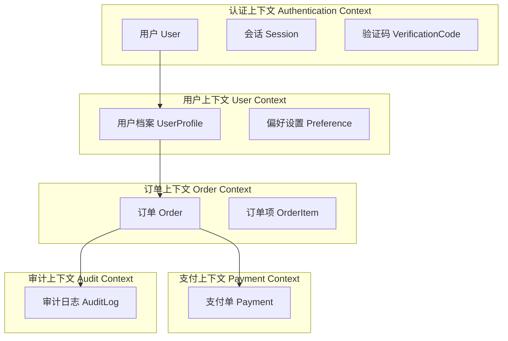
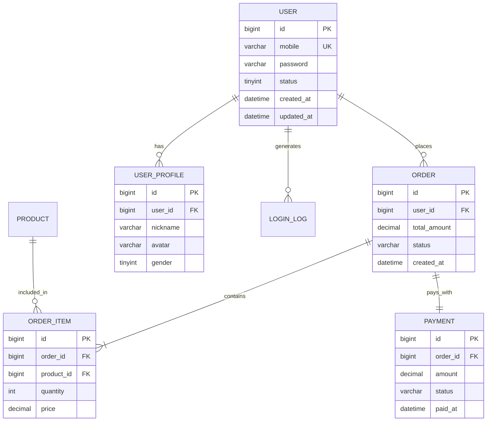

# 需求分析报告（完整版）

> **适用场景**：复杂系统、新产品、架构级变更

---

## 1. 执行摘要

### 1.1 业务背景

**用户任务（JTBD）**：
- **功能性任务**：用户雇佣此系统完成什么操作？
- **情感性任务**：用户期望什么感受？（安全感/成就感/便捷性）
- **社交性任务**：他人如何看待使用此系统的用户？

**核心痛点**：
- 当前解决方案的不足？
- 用户的进步诉求（Progress）？

### 1.2 核心目标（Impact Mapping - Why）

| 业务目标 | 量化指标 | 当前值 | 目标值 | 时间 | 度量方式 |
|----------|----------|--------|--------|------|----------|
| | | | | | |

### 1.3 项目范围

**包含（In Scope）**：
- 功能模块1：[描述]
- 功能模块2：[描述]

**不包含（Out of Scope）**：
- [明确不做的功能]
- [后续Phase规划]

**边界说明**：
- 与系统A的集成边界：[描述]
- 与系统B的职责划分：[描述]

### 1.4 关键假设

- [假设1]
- [假设2]

### 1.5 约束条件

**技术约束**：
- 技术栈：[语言/框架/数据库]
- 现有系统限制：[描述]
- 第三方依赖：[服务名称及限制]

**业务约束**：
- 合规要求：[GDPR/等保三级/行业规范]
- 审批流程：[描述]
- SLA承诺：[对外承诺指标]

**资源约束**：
- 开发周期：[X周]
- 人力配置：[前端X人/后端Y人/测试Z人]
- 预算限制：[如有]

---

## 2. 利益相关者分析（Stakeholder Analysis）

| 角色 | 诉求 | 影响（对系统的期望） | 优先级 | 决策权重 |
|------|------|---------------------|--------|----------|
| 新用户 | | | 🔴高 | |
| 老用户 | | | 🟠中 | |
| 产品经理 | | | 🔴高 | |
| 运营人员 | | | 🟡中 | |
| 开发团队 | | | 🟡中 | |
| 安全团队 | | | 🔴高 | |
| 管理层 | | | 🔴高 | |

---

## 3. 功能性需求（Functional Requirements）

### 3.1 需求总览（Impact Mapping）

```
Why: [业务目标，量化]
├─ Who: [关键角色1]
│   ├─ How: [行为影响1]
│   │   ├─ What: [需求ID] [功能名称]
│   │   └─ What: [需求ID] [功能名称]
│   └─ How: [行为影响2]
│       └─ What: [需求ID] [功能名称]
├─ Who: [关键角色2]
│   └─ How: [行为影响]
│       └─ What: [需求ID] [功能名称]
└─ Who: [关键角色3]
    └─ How: [行为影响]
        └─ What: [需求ID] [功能名称]
```

### 3.2 功能列表（Kano + MoSCoW）

| ID | 功能名称 | Kano分类 | 优先级 | 来源 | 估算(SP) | 依赖 | 风险 |
|----|----------|----------|--------|------|----------|------|------|
| F001 | | 基本型 | 🔴Must | PRD-X.Y | 5 | 无 | 低 |
| F002 | | 期望型 | 🟠Should | PRD-X.Z | 8 | F001 | 中 |
| F003 | | 兴奋型 | 🟡Could | 用户访谈 | 13 | F002 | 高 |

**MVP范围**：F001 + F002（核心功能，满足基本型+期望型需求）

---

### 3.3 用户故事（User Stories）

#### US001：[功能名称]

**用户故事**：
```
As a [角色]
I want to [行动]
So that [价值]
```

**验收条件**（Acceptance Criteria - Given-When-Then）：
```gherkin
Scenario: [正常场景 - 主流程]
  Given [前置条件1]
  And [前置条件2]
  When [用户执行动作]
  Then [系统响应]
  And [状态变化]

Scenario: [异常场景1 - 参数错误]
  Given [前置条件]
  When [用户输入错误参数]
  Then [系统提示错误信息]
  And [不改变系统状态]

Scenario: [异常场景2 - 权限不足]
  Given [用户无操作权限]
  When [用户尝试操作]
  Then [系统拒绝访问]
  And [记录审计日志]

Scenario: [边界场景 - 极限情况]
  Given [边界条件]
  When [触发边界操作]
  Then [系统正确处理]
```

**INVEST检查**：
- ✅ **Independent（独立）**：[说明此故事与其他故事的独立性]
- ✅ **Negotiable（可协商）**：[可讨论的实现细节]
- ✅ **Valuable（有价值）**：[业务价值说明 + 预期效果]
- ✅ **Estimable（可估算）**：[X] Story Points
- ✅ **Small（小）**：[1-2 个 Sprint 可完成]
- ✅ **Testable（可测试）**：有明确验收标准

**业务价值**：[预计提升X指标Y%]

**技术风险**：
- 风险：[描述]
- 影响：[高/中/低]
- 缓解措施：[具体方案]

**依赖**：
- 第三方服务：[服务名称 + SLA]
- 现有模块：[模块名称 + 接口]
- 数据依赖：[数据来源]

---

### 3.4 用例详述（Use Cases）

#### UC001：[用例名称]

**用例ID**：UC001  
**用例名称**：[动宾结构]  
**简述**：[一句话说明]

**参与者**：
- **主要参与者（Primary Actor）**：[发起用例的角色]
- **次要参与者（Secondary Actor）**：[支持系统，如第三方服务/外部系统]

**前置条件（Preconditions）**：
- [用户状态要求]
- [系统状态要求]
- [数据要求]

**后置条件（Postconditions）**：
- **成功场景**：
  - [状态变化1]
  - [数据变化2]
- **失败场景**：
  - [系统回滚至初始状态]

**触发条件（Trigger）**：[用户操作/系统事件/定时任务]

**主成功场景（Main Success Scenario）**：
1. [主要参与者] [执行动作]
2. 系统 [处理逻辑]
3. 系统 [验证条件]
4. 系统 [调用外部服务/查询数据]
5. 系统 [计算/处理]
6. 系统 [更新数据]
7. 系统 [返回结果]
8. [主要参与者] [看到反馈]

**扩展场景（Extensions）**：
```
2a. [异常情况1 - 参数校验失败]
  2a1. 系统校验发现参数不符合规则
  2a2. 系统返回错误码[CODE] + 提示"[消息]"
  2a3. 系统不改变数据状态
  2a4. 用例失败

3a. [异常情况2 - 权限不足]
  3a1. 系统检查用户权限，发现无操作权限
  3a2. 系统返回错误码[CODE] + 提示"权限不足"
  3a3. 系统记录审计日志
  3a4. 用例失败

4a. [异常情况3 - 外部服务调用失败]
  4a1. 系统调用外部服务超时（3s）
  4a2. 系统重试3次（指数退避：1s, 2s, 4s）
  4a3. 若仍失败，系统切换备用服务
  4a4. 若备用服务也失败，系统返回"服务暂不可用，请稍后重试"
  4a5. 系统记录告警日志（severity: HIGH）
  4a6. 用例失败

5a. [异常情况4 - 业务规则违反]
  5a1. 系统发现违反业务规则[BR00X]
  5a2. 系统返回错误提示"[具体规则说明]"
  5a3. 用例失败

6a. [异常情况5 - 并发冲突]
  6a1. 系统发现数据版本号不匹配（乐观锁）
  6a2. 系统返回"数据已被他人修改，请刷新后重试"
  6a3. 用例失败

7a. [替代路径1 - 可选分支]
  7a1. 系统检测到[条件X]
  7a2. 系统执行[替代处理]
  7a3. 继续步骤8

*a. [全局异常 - 任何步骤]
  *a1. 系统发生未预期错误
  *a2. 系统回滚事务
  *a3. 系统记录错误日志（包含堆栈信息）
  *a4. 系统返回"系统错误，请联系管理员"
  *a5. 系统发送告警通知
  *a6. 用例失败
```

**业务规则（Business Rules）**：
- **BR001**：[规则描述]
  - 触发条件：[when]
  - 验证逻辑：[what]
  - 错误提示：[message]
- **BR002**：[规则描述]

**频率（Frequency）**：[每日X次/高峰期并发Y]

**性能需求**：
- 接口响应时间：P95 < Xms, P99 < Yms
- 并发支持：QPS ≥ X
- 数据库查询：单次 < Xms

**安全需求**：
- 认证：[要求]
- 授权：[角色权限]
- 敏感数据：[加密/脱敏规则]
- 审计：[日志记录要求]

**可用性需求**：
- SLA：[X个9]
- 降级方案：[描述]
- 熔断策略：[触发条件 + 恢复策略]

**可观测性**：
- 关键日志点：[步骤3/步骤6记录业务日志]
- 监控指标：[成功率/耗时/错误码分布]
- 告警规则：[条件 + 通知人]

---

### 3.5 领域模型（Domain Model - DDD）

#### 3.5.1 限界上下文（Bounded Contexts）



**上下文关系**：
- 认证上下文 → 用户上下文：共享内核（用户ID）
- 订单上下文 → 支付上下文：开放主机服务（OHS）
- 所有上下文 → 审计上下文：发布-订阅（事件驱动）

#### 3.5.2 聚合设计（Aggregates）

**聚合：订单（Order Aggregate）**

```
聚合根：Order（订单）
├─ 实体：OrderItem（订单项）
├─ 值对象：Money（金额）
├─ 值对象：Address（地址）
└─ 领域服务：OrderPricingService（订单定价服务）

不变量（Invariants）：
- 订单总金额 = Σ(订单项金额)
- 订单状态变更遵循状态机
- 订单创建后，用户信息不可变

生命周期：
创建中 → 待支付 → 已支付 → 配送中 → 已完成
         ↓
       已取消/已退款
```

**聚合边界**：
- 一次事务只能修改一个聚合
- 跨聚合操作通过领域事件实现最终一致性

#### 3.5.3 领域事件（Domain Events）

| 事件名称 | 触发时机 | Payload | 订阅者 |
|----------|----------|---------|--------|
| UserRegistered | 用户注册成功 | userId, mobile, timestamp | 用户上下文/营销上下文 |
| OrderCreated | 订单创建完成 | orderId, userId, amount | 支付上下文/库存上下文 |
| PaymentCompleted | 支付完成 | paymentId, orderId | 订单上下文/物流上下文 |

#### 3.5.4 统一语言（Ubiquitous Language）

| 术语 | 英文 | 定义 | 上下文 |
|------|------|------|--------|
| 用户 | User | 系统注册用户，通过手机号唯一标识 | 认证上下文 |
| 会话 | Session | 用户登录后的有效期状态，由Token标识 | 认证上下文 |
| 订单 | Order | 用户购买商品的交易记录，聚合根 | 订单上下文 |
| 聚合根 | Aggregate Root | DDD中保证一致性的边界 | 技术术语 |

---

## 4. 非功能性需求（Non-Functional Requirements）

### 4.1 性能需求（Performance Requirements）

**4.1.1 响应时间**

| 接口类型 | P95 | P99 | 测试工具 |
|----------|-----|-----|----------|
| 核心查询接口 | < 200ms | < 500ms | JMeter |
| 核心写接口 | < 300ms | < 800ms | JMeter |
| 批量操作接口 | < 1s | < 2s | JMeter |
| 报表查询 | < 3s | < 5s | JMeter |

**4.1.2 吞吐量**

| 接口 | QPS | TPS | 并发用户数 |
|------|-----|-----|------------|
| 登录接口 | ≥ 1000 | - | 支持10万在线 |
| 订单创建 | ≥ 500 | ≥ 500 | - |
| 支付回调 | ≥ 300 | ≥ 300 | - |

**4.1.3 资源占用**

| 资源类型 | 阈值 | 监控工具 |
|----------|------|----------|
| CPU使用率（单机） | 正常负载 < 60%，峰值 < 80% | Prometheus |
| 内存占用（JVM堆） | < 4GB | JVM监控 |
| 数据库连接数 | < 200 | MySQL慢查询日志 |
| Redis连接数 | < 500 | Redis INFO |

**4.1.4 性能测试场景**

| 测试类型 | 场景描述 | 持续时间 | 验收标准 |
|----------|----------|----------|----------|
| 基准测试 | 10并发，理想环境 | 10分钟 | 建立性能基线 |
| 负载测试 | 500并发，模拟日常负载 | 30分钟 | 满足性能指标 |
| 压力测试 | 1000→2000并发，找拐点 | 1小时 | 找到系统极限 |
| 稳定性测试 | 300并发，长时间运行 | 24小时 | 无内存泄漏、性能不衰减 |

---

### 4.2 安全需求（Security Requirements）

**4.2.1 STRIDE威胁建模**

| 威胁类型 | 具体风险 | 防护措施 | 验证方法 |
|----------|----------|----------|----------|
| **S**poofing（身份伪造） | 攻击者伪造Token登录 | JWT签名验证 + Token黑名单 | 安全测试 |
| **T**ampering（篡改） | 请求参数被中间人篡改 | HTTPS强制 + 请求签名 | 抓包测试 |
| **R**epudiation（抵赖） | 用户否认操作行为 | 审计日志（操作人/时间/IP） | 日志审计 |
| **I**nformation Disclosure（信息泄露） | 敏感数据泄露 | 字段加密 + 日志脱敏 + 权限控制 | 安全扫描 |
| **D**enial of Service（拒绝服务） | 恶意请求打垮系统 | 限流（令牌桶）+ 熔断 + WAF | 压力测试 |
| **E**levation of Privilege（权限提升） | 普通用户越权访问 | RBAC + 接口权限校验 | 渗透测试 |

**4.2.2 认证（Authentication）**

- **方式**：JWT Token（HS256签名）
- **Token结构**：Header + Payload(userId, username, roles, expireAt) + Signature
- **有效期**：7天
- **刷新机制**：过期前1天自动续期
- **Token存储**：Redis（key: `user:token:{userId}`, TTL: 7天）
- **Token失效**：用户登出/密码修改/强制下线时加入黑名单
- **多因素认证（MFA）**：敏感操作（修改密码/绑定银行卡）需短信验证码二次确认

**4.2.3 授权（Authorization）**

- **权限模型**：RBAC（基于角色的访问控制）
- **角色定义**：
  - 超级管理员：所有权限
  - 部门管理员：本部门数据CRUD
  - 普通用户：只读自己的数据
- **权限粒度**：模块级（可配置到按钮级）
- **权限校验**：
  - 接口层：`@PreAuthorize("hasRole('ADMIN')")`
  - 数据层：动态SQL拼接（仅查询当前用户/部门数据）
- **权限缓存**：用户权限缓存到Redis，TTL 30分钟

**4.2.4 数据加密**

| 数据类型 | 加密方式 | 密钥管理 |
|----------|----------|----------|
| 密码 | BCrypt（cost=10） | 单向散列，不可逆 |
| 身份证号 | AES-256-GCM | 密钥存储于密钥管理服务（KMS） |
| 手机号（存储） | AES-256-GCM | 同上 |
| 手机号（展示） | 脱敏（138****8000） | - |
| 传输数据 | HTTPS（TLS 1.3） | 证书管理 |

**4.2.5 审计日志**

**记录范围**：
- 所有登录行为（成功/失败）
- 敏感数据访问（查询/导出）
- 权限变更（授权/撤权）
- 数据删除操作
- 异常登录（异地/异常设备）

**日志字段**：
```json
{
  "userId": 12345,
  "username": "zhangsan",
  "action": "LOGIN",
  "resource": "/api/v1/auth/login",
  "ip": "192.168.1.100",
  "device": "Chrome/Windows",
  "result": "SUCCESS",
  "timestamp": "2026-09-09T10:30:00Z",
  "traceId": "abc123"
}
```

**日志保留期**：180天（合规要求）

**日志安全**：
- 存储加密
- 只读权限（禁止篡改）
- 定期归档

**4.2.6 防护措施**

| 攻击类型 | 防护措施 | 实现方式 |
|----------|----------|----------|
| SQL注入 | 参数化查询 | MyBatis PreparedStatement |
| XSS | 输出转义 | 前端框架自动转义 + CSP策略 |
| CSRF | Token验证 | Spring Security CSRF Token |
| 接口重放 | 请求签名 + Nonce | Nonce 5分钟内有效 |
| 暴力破解 | 限流 + 验证码 | 错误5次触发图形验证码 |
| DDoS | WAF + CDN | 接入阿里云WAF |

---

### 4.3 可用性需求（Availability Requirements）

**4.3.1 SLA目标**

| 服务类型 | 可用性 | 年故障时间 | 月故障时间 | 适用场景 |
|----------|--------|------------|------------|----------|
| 核心服务 | 99.9% | 8.76小时 | 43.2分钟 | 登录/订单/支付 |
| 非核心服务 | 99% | 3.65天 | 7.2小时 | 报表/数据分析 |

**4.3.2 容灾方案**

**部署架构**：
- 应用服务器：双机房部署（同城灾备），负载均衡
- 数据库：主从复制（延迟 < 1s），自动故障切换
- Redis：哨兵模式（3节点），自动故障转移
- 消息队列：集群部署（3节点）

**数据备份**：
- 全量备份：每日凌晨2点
- 增量备份：每小时
- 备份保留期：30天
- 备份验证：每周模拟恢复演练

**4.3.3 降级策略**

| 触发条件 | 降级方案 | 预期影响 |
|----------|----------|----------|
| 数据库RT > 1s | 启用缓存兜底（读请求） | 数据延迟最多1分钟 |
| 第三方服务不可用 | 返回默认值/提示稍后重试 | 部分功能受限 |
| 系统负载 > 80% | 限制非核心功能（报表/导出） | 仅保证核心交易 |
| Redis故障 | 降级为数据库直查 | 性能下降，RT+500ms |

**4.3.4 熔断规则**

**熔断触发**：
- 错误率 > 50%（1分钟内）
- 接口RT P95 > 2s（1分钟内）

**熔断策略**：
- **熔断时长**：初始10s，动态调整（最长5分钟）
- **半开状态**：熔断10s后，放行10%流量探测
- **恢复条件**：探测流量成功率 > 90%，持续30s

**熔断降级**：
- 返回默认值（如推荐列表返回热门商品）
- 返回缓存数据（标注数据时效）
- 友好提示"服务繁忙，请稍后重试"

**4.3.5 限流策略**

| 限流维度 | 规则 | 算法 |
|----------|------|------|
| 单IP限流 | 每秒10次请求 | 令牌桶 |
| 单用户限流 | 每分钟300次请求 | 滑动窗口 |
| 接口总QPS | 根据容量评估设定 | 令牌桶 |
| 敏感接口（发短信） | 同一手机号60s内1次 | 计数器 |

**4.3.6 监控告警**

**监控指标**：
| 指标 | 阈值 | 告警级别 | 通知人 |
|------|------|----------|--------|
| 接口成功率 | < 99.5% | 🔴严重 | 值班+技术负责人 |
| 接口RT P95 | > 500ms | 🟠警告 | 值班 |
| 数据库连接数 | > 150 | 🟠警告 | DBA |
| 服务器CPU | > 80% | 🔴严重 | 运维+值班 |
| 错误日志 | ERROR级别出现 | 🟡提示 | 值班 |

**告警方式**：
- 🔴严重：电话 + 短信 + 企业微信
- 🟠警告：短信 + 企业微信
- 🟡提示：企业微信

---

### 4.4 可维护性需求（Maintainability Requirements）

**4.4.1 MTTR目标**

**平均修复时间（Mean Time To Repair）**：< 30分钟

**可观测性三支柱**：
| 支柱 | 工具 | 用途 |
|------|------|------|
| **日志（Logging）** | ELK（Elasticsearch + Logstash + Kibana） | 问题定位、业务分析 |
| **指标（Metrics）** | Prometheus + Grafana | 性能监控、容量规划 |
| **追踪（Tracing）** | SkyWalking / Jaeger | 分布式链路追踪 |

**4.4.2 日志规范**

**日志级别**：
- **ERROR**：系统错误，需人工介入（数据库连接失败/第三方服务调用失败）
- **WARN**：潜在问题，需关注（缓存未命中/重试机制触发）
- **INFO**：关键业务节点（用户登录/订单创建/支付完成）
- **DEBUG**：开发调试信息（生产环境关闭）

**日志格式（JSON）**：
```json
{
  "timestamp": "2026-09-09T10:30:00.123Z",
  "level": "INFO",
  "traceId": "abc123",
  "spanId": "def456",
  "service": "order-service",
  "class": "com.example.OrderService",
  "method": "createOrder",
  "message": "订单创建成功",
  "userId": 12345,
  "orderId": 67890,
  "amount": 99.99,
  "ip": "192.168.1.100",
  "duration": 120
}
```

**日志脱敏规则**：
| 字段类型 | 脱敏规则 | 示例 |
|----------|----------|------|
| 密码 | 完全隐藏 | ****** |
| 手机号 | 保留前3后4 | 138****8000 |
| 身份证号 | 保留前6后4 | 110101****1234 |
| 银行卡号 | 保留后4位 | **** **** **** 1234 |
| Token | 只记录前8位 | eyJhbGci... |

**日志采样策略**：
- 正常请求：采样率10%（降低存储成本）
- 错误请求：100%记录
- 慢请求（RT > 1s）：100%记录
- 敏感操作：100%记录

**4.4.3 监控指标**

**业务指标**：
- 注册用户数（日/周/月）
- 活跃用户数（DAU/MAU）
- 订单量（日/周/月）
- GMV（日/周/月）
- 转化率（注册→下单→支付）

**技术指标**：
- QPS/TPS
- 接口成功率
- 接口响应时间（P50/P95/P99）
- 错误码分布
- 数据库慢查询数量
- 缓存命中率

**基础设施指标**：
- CPU使用率
- 内存使用率
- 磁盘IO
- 网络带宽
- JVM GC次数/耗时

**4.4.4 链路追踪**

**TraceId传递**：
- 前端生成TraceId（UUID）
- 请求头携带：`X-Trace-Id: xxx`
- 后端服务透传TraceId
- 所有日志/监控/告警关联TraceId

**链路可视化**：
- 调用链拓扑图
- 每个节点耗时
- 异常节点标红

**4.4.5 扩展性设计**

**水平扩展**：
- 应用服务器：无状态设计，支持动态扩容
- 数据库：分库分表（按userId/orderId取模）
- 缓存：Redis Cluster支持动态扩容

**配置中心**：
- 使用Nacos/Apollo集中管理配置
- 配置变更实时生效（无需重启）
- 配置版本管理（可回滚）

---

### 4.5 兼容性需求（Compatibility Requirements）

**4.5.1 浏览器兼容**

| 浏览器 | 版本 | 测试覆盖 |
|--------|------|----------|
| Chrome | 90+ | ✅ 主测试 |
| Firefox | 88+ | ✅ 覆盖测试 |
| Safari | 14+ | ✅ 覆盖测试 |
| Edge | 90+ | ✅ 覆盖测试 |
| IE 11 | - | ❌ 不支持 |

**4.5.2 移动端兼容**

| 平台 | 版本 | 备注 |
|------|------|------|
| iOS | 13+ | 支持Safari/微信内置浏览器 |
| Android | 8.0+ | 支持Chrome/微信内置浏览器 |

**4.5.3 API版本兼容**

**版本控制策略**：
- URL版本控制：`/api/v1/xxx`, `/api/v2/xxx`
- 向后兼容原则：旧版本API保留6个月
- 废弃通知：提前3个月通知客户端，响应头携带 `X-API-Deprecated: true`

**版本演进示例**：
```
v1.0（2026-01-01上线）
  ├─ v1.1（2026-03-01）：新增字段（向后兼容）
  ├─ v2.0（2026-06-01）：重大变更（v1.0标记废弃）
  └─ v1.0下线（2026-12-01）
```

**字段变更规则**：
- **新增字段**：必须有默认值，旧客户端忽略
- **删除字段**：先标记 `@Deprecated`，6个月后删除
- **修改字段**：创建新字段（如 `amountV2`），保留旧字段6个月

**4.5.4 第三方集成兼容**

| 第三方系统 | 版本 | 兼容性维护 |
|------------|------|------------|
| 微信开放平台 | API 2.0 | 监听官方公告，提前适配 |
| 支付宝 | SDK 4.x | 锁定SDK版本，定期升级 |

---

### 4.6 合规性需求（Compliance Requirements）

**4.6.1 数据隐私（GDPR / 《个人信息保护法》）**

**用户同意**：
- 收集个人信息前必须获得明确同意（非默认勾选）
- 同意书明确说明：收集哪些信息/用途/存储期限/第三方共享

**数据最小化**：
- 只收集必要数据（如登录只收集手机号，不收集生日）

**用户权利**：
- **访问权**：用户可查询自己的个人信息
- **更正权**：用户可修改错误信息
- **删除权**：用户可申请删除数据（账号注销）
- **携带权**：用户可导出自己的数据（CSV格式）
- **撤回同意权**：用户可撤回授权

**数据生命周期**：
- 活跃用户数据：持续保留
- 注销用户数据：180天后物理删除
- 日志数据：180天后归档，2年后删除

**4.6.2 等级保护（三级）**

| 要求 | 实现方式 |
|------|----------|
| 身份鉴别 | 双因素认证（密码+短信验证码） |
| 访问控制 | RBAC（基于角色） + ACL（细粒度） |
| 安全审计 | 审计日志保留6个月，不可篡改 |
| 入侵防范 | 部署WAF、IDS |
| 数据完整性 | 关键数据签名 + 校验 |
| 数据保密性 | 敏感数据加密存储（AES-256） |
| 备份恢复 | 每日全量备份，异地存储 |

**4.6.3 行业规范**

**支付行业（PCI-DSS）**：
- 禁止存储CVV/CVC（卡片安全码）
- 银行卡号加密存储
- 支付日志单独存储，保留1年

**医疗行业（HIPAA）**：
- [如涉及医疗数据，补充要求]

**金融行业（银监会要求）**：
- [如涉及金融业务，补充要求]

---

## 5. 数据需求（Data Requirements）

### 5.1 概念模型（ER图）



### 5.2 数据字典

#### 表1：sys_user（用户表）

| 字段名 | 类型 | 长度 | 约束 | 默认值 | 说明 |
|--------|------|------|------|--------|------|
| id | BIGINT | - | PK, AUTO_INCREMENT | - | 用户ID |
| mobile | VARCHAR | 11 | UK, NOT NULL | - | 手机号（加密存储） |
| password | VARCHAR | 60 | NULL | NULL | 密码（BCrypt加密） |
| status | TINYINT | - | NOT NULL | 1 | 状态：0-禁用，1-正常 |
| created_at | DATETIME | - | NOT NULL | CURRENT_TIMESTAMP | 创建时间 |
| updated_at | DATETIME | - | NOT NULL | CURRENT_TIMESTAMP ON UPDATE | 更新时间 |
| is_deleted | TINYINT | - | NOT NULL | 0 | 逻辑删除：0-未删除，1-已删除 |
| version | INT | - | NOT NULL | 0 | 乐观锁版本号 |

**索引**：
- PRIMARY KEY (id)
- UNIQUE KEY uk_mobile (mobile)
- INDEX idx_status (status)
- INDEX idx_created_at (created_at)

**分表策略**：按 id 取模，分16表（`sys_user_00` ~ `sys_user_15`）

#### 表2：sys_login_log（登录日志表）

| 字段名 | 类型 | 长度 | 约束 | 默认值 | 说明 |
|--------|------|------|------|--------|------|
| id | BIGINT | - | PK, AUTO_INCREMENT | - | 日志ID |
| user_id | BIGINT | - | NOT NULL | - | 用户ID |
| ip | VARCHAR | 45 | NOT NULL | - | 登录IP（支持IPv6） |
| device | VARCHAR | 200 | NULL | NULL | 设备信息 |
| status | VARCHAR | 20 | NOT NULL | - | 状态：SUCCESS/FAILED |
| fail_reason | VARCHAR | 100 | NULL | NULL | 失败原因 |
| login_time | DATETIME | - | NOT NULL | CURRENT_TIMESTAMP | 登录时间 |

**索引**：
- PRIMARY KEY (id)
- INDEX idx_user_id (user_id)
- INDEX idx_login_time (login_time)

**分表策略**：按 login_time 按月分表（`sys_login_log_202601`）

---

### 5.3 数据量级预估

| 表名 | 初期 | 年增长 | 3年后 | 单表容量 | 分表方案 |
|------|------|--------|--------|----------|----------|
| sys_user | 1万 | 10万 | 31万 | < 100万 | 按id取模16表 |
| sys_order | 5万 | 100万 | 305万 | < 500万 | 按order_id取模32表 |
| sys_login_log | 10万 | 500万 | 1510万 | > 1000万 | 按月分表 |
| sys_operation_log | 50万 | 2000万 | 6050万 | > 1000万 | 按月分表 |

**数据归档策略**：
- sys_login_log：保留6个月热数据，超期归档到OSS（对象存储）
- sys_operation_log：保留3个月热数据，超期归档

**数据清理策略**：
- 已注销用户数据：180天后物理删除
- 测试数据：定期清理

---

### 5.4 数据迁移方案（如有存量系统）

**迁移范围**：
- 用户数据：[X万条]
- 订单数据：[Y万条]

**迁移策略**：
- 全量迁移：[时间窗口]
- 增量同步：双写方案，新旧系统并行运行1个月
- 数据校验：迁移后逐条对比，一致性 > 99.9%

**回滚方案**：
- 保留旧系统数据1个月
- 发现问题可快速切回

---

## 6. 接口需求（Interface Requirements）

### 6.1 外部系统依赖

| 系统名称 | 接口 | 用途 | SLA | 超时时间 | 降级方案 | 负责人 |
|----------|------|------|-----|----------|----------|--------|
| 阿里云短信 | dysmsapi.aliyuncs.com | 发送验证码 | 99.5% | 3s | 切换腾讯云 | 张三 |
| 微信开放平台 | api.weixin.qq.com | 第三方登录 | 99.9% | 5s | 提示稍后重试 | 李四 |
| 支付宝支付 | openapi.alipay.com | 支付 | 99.99% | 10s | 提示支付失败 | 王五 |

**依赖风险**：
- 阿里云短信：单点依赖 → 缓解：接入腾讯云备用通道
- 微信API变更：版本升级 → 缓解：防腐层隔离 + 版本锁定

---

### 6.2 RESTful API设计

#### API-001：发送验证码

**基本信息**：
- **URL**：`POST /api/v1/auth/sms-code`
- **版本**：v1.0
- **描述**：向指定手机号发送验证码
- **认证**：无需认证
- **限流**：同一手机号60秒内只能调用1次，同一IP每秒10次

**请求**：
```json
{
  "mobile": "13800138000"
}
```

**请求参数**：
| 参数名 | 类型 | 必填 | 说明 | 校验规则 | 错误码 |
|--------|------|------|------|----------|--------|
| mobile | string | 是 | 手机号 | 11位数字，1开头 | 1002 |

**响应（成功 200）**：
```json
{
  "code": 0,
  "message": "验证码已发送",
  "data": {
    "expireAt": 1694239800
  },
  "traceId": "abc123",
  "timestamp": 1694239500
}
```

**响应（失败 429）**：
```json
{
  "code": 1001,
  "message": "请勿重复获取验证码，请60秒后重试",
  "traceId": "abc123",
  "timestamp": 1694239500
}
```

**错误码**：
| 错误码 | 说明 | HTTP状态码 | 解决方案 |
|--------|------|------------|----------|
| 0 | 成功 | 200 | - |
| 1001 | 请求频繁 | 429 | 等待后重试 |
| 1002 | 手机号格式错误 | 400 | 检查输入 |
| 1003 | 短信发送失败 | 500 | 稍后重试 |

**性能要求**：
- P95 < 300ms（含短信网关调用）
- QPS ≥ 100

---

#### API-002：用户登录

**基本信息**：
- **URL**：`POST /api/v1/auth/login`
- **版本**：v1.0
- **描述**：使用手机号+验证码登录
- **认证**：无需认证
- **限流**：同一IP每秒10次

**请求**：
```json
{
  "mobile": "13800138000",
  "code": "123456"
}
```

**请求参数**：
| 参数名 | 类型 | 必填 | 说明 | 校验规则 |
|--------|------|------|------|----------|
| mobile | string | 是 | 手机号 | 11位数字，1开头 |
| code | string | 是 | 验证码 | 6位数字 |

**响应（成功 200）**：
```json
{
  "code": 0,
  "message": "登录成功",
  "data": {
    "token": "eyJhbGciOiJIUzI1NiIsInR5cCI6IkpXVCJ9...",
    "expireAt": 1694844600,
    "user": {
      "id": 12345,
      "mobile": "138****8000",
      "nickname": "张三",
      "avatar": "https://cdn.example.com/avatar/12345.jpg"
    }
  },
  "traceId": "def456",
  "timestamp": 1694239800
}
```

**响应（失败 400）**：
```json
{
  "code": 2001,
  "message": "验证码错误，剩余重试次数 2 次",
  "traceId": "def456",
  "timestamp": 1694239800
}
```

**错误码**：
| 错误码 | 说明 | HTTP状态码 |
|--------|------|------------|
| 0 | 成功 | 200 |
| 2001 | 验证码错误 | 400 |
| 2002 | 验证码已过期 | 400 |
| 2003 | 用户不存在 | 404 |
| 2004 | 账号已被禁用 | 403 |
| 2005 | 账号已锁定（错误次数过多） | 423 |

**性能要求**：
- P95 < 200ms
- QPS ≥ 1000

---

### 6.3 API通用规范

**通用响应格式**：
```json
{
  "code": 0,
  "message": "成功",
  "data": {},
  "traceId": "xxx",
  "timestamp": 1234567890
}
```

**通用HTTP状态码**：
- 200：成功
- 400：请求参数错误
- 401：未认证
- 403：权限不足
- 404：资源不存在
- 429：请求频繁
- 500：服务器内部错误
- 503：服务不可用

**分页规范**：
```json
// 请求
GET /api/v1/orders?page=1&pageSize=20

// 响应
{
  "code": 0,
  "data": {
    "list": [],
    "total": 100,
    "page": 1,
    "pageSize": 20
  }
}
```

**时间格式**：
- 请求/响应：ISO 8601格式（`2026-09-09T10:30:00Z`）
- 时区：UTC（前端根据用户时区转换）

---

## 7. 场景分析（Scenario Analysis）

### 7.1 场景矩阵

| 场景ID | 类型 | 前置条件 | 触发动作 | 预期结果 | 优先级 |
|--------|------|----------|----------|----------|--------|
| S001 | 正常 | 用户已获取验证码 | 输入正确手机号+验证码登录 | 登录成功，返回Token | 🔴P0 |
| S002 | 异常-输入 | - | 手机号为空 | 提示"手机号不能为空" | 🔴P0 |
| S003 | 异常-输入 | - | 手机号格式错误（10位） | 提示"手机号格式错误" | 🔴P0 |
| S004 | 异常-输入 | 用户输入错误验证码 | 登录 | 提示"验证码错误，剩余X次" | 🔴P0 |
| S005 | 异常-输入 | 验证码已过期（>5分钟） | 登录 | 提示"验证码已过期" | 🔴P0 |
| S006 | 异常-状态 | 用户状态=禁用 | 登录 | 提示"账号已被禁用" | 🔴P0 |
| S007 | 边界-重试 | 用户错误输入5次 | 第6次登录 | 提示"账号已锁定1小时" | 🟠P1 |
| S008 | 边界-并发 | 用户在2个设备同时登录 | 登录 | 后登录Token使前Token失效 | 🟠P1 |
| S009 | 边界-容量 | 数据库RT>1s | 登录 | 降级使用缓存，成功登录 | 🟡P2 |
| S010 | 异常-依赖 | 短信网关故障 | 获取验证码 | 切换备用通道，成功发送 | 🔴P0 |
| S011 | 组合 | 用户错误4次+验证码过期 | 登录 | 提示"验证码已过期" | 🟡P2 |
| S012 | 时序 | 用户先登录再获取验证码 | 登录 | 提示"请先获取验证码" | 🟡P2 |

---

### 7.2 边界值测试

**手机号输入边界**：
| 测试值 | 分类 | 预期结果 |
|--------|------|----------|
| 空字符串 | 最小值-1 | "手机号不能为空" |
| "1000000000"（10位） | 最小值 | "手机号格式错误" |
| "13000000000"（11位，1开头） | 最小值+1 | ✅ 有效 |
| "13800138000" | 正常值 | ✅ 有效 |
| "19999999999" | 最大值-1 | ✅ 有效 |
| "20000000000"（11位，2开头） | 最大值 | "手机号格式错误" |
| "200000000000"（12位） | 最大值+1 | "手机号格式错误" |

**验证码错误次数边界**：
| 错误次数 | 预期结果 |
|----------|----------|
| 0次 | 正常 |
| 1次 | 提示"剩余4次" |
| 4次 | 提示"剩余1次" |
| 5次（临界值） | 锁定账号1小时 |
| 6次+ | 仍处于锁定状态 |

**并发场景测试**：
- 同一用户在2个设备同时登录 → 后登录成功，前Token失效
- 同一手机号同时发送2次验证码 → 第2次请求拒绝（60s限制）
- 1000个用户同时登录 → 所有请求成功，RT < 200ms

---

## 8. 验收标准（Acceptance Criteria）

### 8.1 功能验收（DOD）

#### F001：手机号+验证码登录

- [ ] **正常流程**：
  - [ ] 输入正确手机号+验证码，登录成功
  - [ ] 返回有效Token（JWT格式）
  - [ ] Token有效期7天
  - [ ] 跳转到首页

- [ ] **异常流程**：
  - [ ] 验证码错误：提示准确，显示剩余次数
  - [ ] 验证码过期：提示"验证码已过期"
  - [ ] 手机号格式错误：前端实时校验，后端也校验
  - [ ] 用户被禁用：提示"账号已被禁用"

- [ ] **边界场景**：
  - [ ] 错误5次后锁定1小时
  - [ ] 同一用户多设备登录，后Token使前Token失效
  - [ ] 高并发（1000 QPS）下功能正常

- [ ] **性能**：
  - [ ] 接口RT P95 < 200ms
  - [ ] 接口RT P99 < 500ms

- [ ] **安全**：
  - [ ] 验证码加密存储
  - [ ] Token签名验证通过
  - [ ] 密码字段不出现在日志中
  - [ ] 审计日志记录完整

---

### 8.2 质量门禁

| 门禁项 | 标准 | 检查方式 | 责任人 |
|--------|------|----------|--------|
| **代码覆盖率** | 核心业务逻辑 ≥ 80% | JaCoCo报告 | 开发 |
| | 核心方法 100% | 单元测试 | 开发 |
| **静态扫描** | 无阻断型问题 | SonarQube | 开发 |
| | Checkstyle通过 | Maven插件 | 开发 |
| **安全扫描** | 无高危漏洞 | OWASP Dependency-Check | 安全 |
| | 敏感信息检测通过 | 代码审查 | 安全 |
| **性能测试** | P95 < 200ms | JMeter压力测试 | 测试 |
| | QPS ≥ 1000 | JMeter压力测试 | 测试 |
| | 稳定性测试24小时无异常 | 测试环境长稳测试 | 测试 |
| **接口文档** | 100%覆盖 | Swagger/Apifox | 开发 |
| **代码审查** | 无阻断型问题 | Code Review | Tech Lead |

---

## 9. 风险识别与应对（Risk Management）

| 风险ID | 风险类型 | 风险描述 | 影响 | 概率 | 缓解措施 | 应急预案 | 负责人 |
|--------|----------|----------|------|------|----------|----------|--------|
| R001 | 技术风险 | 短信网关不稳定，验证码发送失败 | 高 | 中 | 接入备用短信通道（腾讯云） | 手动切换通道 | 后端负责人 |
| R002 | 业务风险 | 用户量超预期，系统负载过高 | 高 | 低 | 提前扩容，限流保护 | 紧急扩容+降级 | 运维负责人 |
| R003 | 安全风险 | 验证码被爆破 | 中 | 中 | 错误次数限制+图形验证码 | 临时封禁IP | 安全负责人 |
| R004 | 合规风险 | 隐私数据泄露 | 高 | 低 | 敏感数据加密+日志脱敏 | 上报+数据加固 | 全员 |
| R005 | 依赖风险 | 微信API变更导致第三方登录失败 | 中 | 中 | 防腐层隔离+版本锁定 | 回退到旧版本API | 后端负责人 |
| R006 | 性能风险 | 数据库慢查询导致接口超时 | 中 | 中 | 索引优化+缓存预热 | 降级为缓存兜底 | DBA |
| R007 | 人力风险 | 核心开发人员离职 | 中 | 低 | 知识文档化+结对编程 | 内部调配人员 | 项目经理 |

**风险矩阵**：
```
高 |    R004       R001
影 |              R002
响 |    R003       
   |    R005
   |    R006
中 |    R007
   |________________
   低     概率     高
```

**风险监控**：
- 每周风险review
- 高影响风险每日跟踪
- 风险触发立即启动应急预案

---

## 10. 待确认问题清单（Open Issues）

| 问题ID | 问题描述 | 待确认方 | 优先级 | 截止日期 | 状态 | 决策结果 |
|--------|----------|----------|--------|----------|------|----------|
| Q001 | 验证码有效期是5分钟还是10分钟？ | 产品 | 高 | 2026-09-10 | 🔴待确认 | |
| Q002 | 是否需要支持邮箱登录？若需要，优先级如何？ | 产品 | 中 | 2026-09-12 | 🔴待确认 | |
| Q003 | Token过期后是否需要刷新机制？还是重新登录？ | 产品+技术 | 高 | 2026-09-10 | 🔴待确认 | |
| Q004 | 支付宝登录是否在MVP范围内？ | 产品 | 低 | 2026-09-15 | 🟡讨论中 | |
| Q005 | 是否需要支持多设备同时登录？还是互踢？ | 产品 | 中 | 2026-09-12 | 🔴待确认 | |
| Q006 | 数据库主从延迟能接受到多少？1s还是100ms？ | 技术+DBA | 中 | 2026-09-11 | 🔴待确认 | |
| Q007 | 是否需要支持国际手机号（+86以外）？ | 产品 | 低 | 2026-09-20 | 🟢已确认 | 暂不支持 |

**问题升级机制**：
- 高优先级问题超期未确认 → 升级到项目经理
- 阻塞开发的问题 → 立即同步call确认

---

## 11. 需求追溯矩阵（Traceability Matrix）

| 需求ID | 来源 | 业务目标 | 用户故事 | 用例 | 设计方案 | 代码模块 | 测试用例 | 状态 |
|--------|------|----------|----------|------|----------|----------|----------|------|
| F001 | PRD-3.1 | 提升留存10% | US001 | UC001 | [待设计] | UserService.login() | TC001-TC010 | 🔴待开发 |
| F002 | PRD-3.2 | 降低客诉率 | US002 | UC002 | [待设计] | TokenRefreshFilter | TC011-TC015 | 🔴待开发 |
| F003 | PRD-3.3 | 支持主流平台 | US003 | UC003 | [待设计] | WechatLoginService | TC016-TC020 | 🔴待开发 |
| NFR-001 | 性能需求 | 提升用户体验 | - | - | 缓存设计 | RedisService | PT001-PT005 | 🔴待开发 |
| NFR-002 | 安全需求 | 合规要求 | - | - | 加密方案 | EncryptionUtil | ST001-ST005 | 🔴待开发 |

**追溯关系说明**：
- 每个功能需求必须追溯到业务目标
- 每个用户故事对应1个或多个用例
- 每个用例对应具体的设计方案和代码模块
- 每个功能有对应的测试用例（单元测试+集成测试）

---

## 12. 附录（Appendix）

### 12.1 业务术语表（Ubiquitous Language Glossary）

| 术语 | 英文 | 定义 | 上下文 |
|------|------|------|--------|
| 用户 | User | 系统注册用户，通过手机号唯一标识 | 认证上下文 |
| 验证码 | Verification Code | 6位数字，用于验证用户身份，有效期5分钟 | 认证上下文 |
| 令牌 | Token | JWT Token，用于会话保持，有效期7天 | 认证上下文 |
| 会话 | Session | 用户登录后的有效期状态，由Token标识 | 认证上下文 |
| 聚合根 | Aggregate Root | DDD中保证一致性的边界，事务边界 | DDD技术术语 |
| 限界上下文 | Bounded Context | DDD中明确的业务边界，有自己的统一语言 | DDD技术术语 |
| 领域事件 | Domain Event | 领域中发生的有业务含义的事件 | DDD技术术语 |

### 12.2 参考资料（References）

**需求工程**：
- [1] 《需求工程：软件需求的分析与管理》- Karl E. Wiegers
- [2] IEEE 830-1998: Recommended Practice for Software Requirements Specifications
- [3] BABOK v3 - Business Analysis Body of Knowledge（IIBA）

**方法论**：
- [4] 《用户故事地图》- Jeff Patton
- [5] 《影响地图》- Gojko Adzic
- [6] 《事件风暴》- Alberto Brandolini
- [7] 《与成功有约：高效能人士的七个习惯》中的JTBD理论

**架构设计**：
- [8] 《领域驱动设计》- Eric Evans
- [9] 《实现领域驱动设计》- Vaughn Vernon
- [10] 《微服务架构设计模式》- Chris Richardson

**安全合规**：
- [11] OWASP Top 10
- [12] STRIDE威胁建模方法（Microsoft）
- [13] 《个人信息保护法》（中国）
- [14] GDPR（欧盟通用数据保护条例）

**项目文档**：
- [15] PRD v1.0（产品需求文档）
- [16] 系统架构图 v1.0
- [17] 数据库设计文档 v1.0

### 12.3 变更历史（Change Log）

| 版本 | 日期 | 变更类型 | 变更内容 | 变更人 | 审批人 |
|------|------|----------|----------|--------|--------|
| v1.0 | 2026-09-09 | 新增 | 初始版本 | AI Agent | [待审批] |
| v1.1 | 2026-09-10 | 修订 | Q001确认结果：验证码有效期5分钟 | AI Agent | [待审批] |
| v1.2 | 2026-09-11 | 补充 | 新增安全需求章节：STRIDE威胁建模 | 安全团队 | [待审批] |

**变更影响分析**：
- v1.1：无代码影响，补充需求说明
- v1.2：需调整安全设计方案，预计+3天开发周期

---

## 13. 审批记录（Approval）

| 角色 | 姓名 | 审批意见 | 日期 | 签名 |
|------|------|----------|------|------|
| 产品负责人 | [待填写] | | | |
| 技术负责人 | [待填写] | | | |
| 架构师 | [待填写] | | | |
| 安全负责人 | [待填写] | | | |
| DBA | [待填写] | | | |
| 测试负责人 | [待填写] | | | |
| 项目经理 | [待填写] | | | |

**审批流程**：
1. 产品负责人审批（业务准确性）
2. 技术负责人审批（技术可行性）
3. 架构师审批（架构合理性）
4. 安全负责人审批（安全合规性）
5. DBA审批（数据设计合理性）
6. 测试负责人审批（可测试性）
7. 项目经理终审（整体协调）

**审批通过标准**：
- 所有待确认问题已解决
- 无阻断型风险
- 质量门禁标准明确
- 各角色无重大异议

---

**文档状态**：🔴草稿 | 🟡评审中 | 🟢已批准

**文档版本**：v1.0

**最后更新**：2026-09-09

---

**文档结束**
