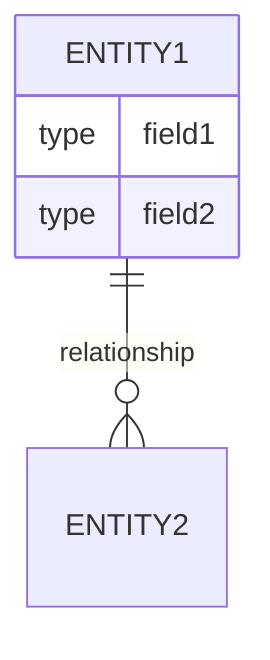

# 需求分析报告（标准版）

> **适用场景**：独立模块、常规功能开发

---

## 1. 执行摘要

### 1.1 业务背景
**用户任务（JTBD）**：用户雇佣这个功能来完成什么任务？

**核心痛点**：当前解决方案的不足？

### 1.2 核心目标

| 业务目标 | 量化指标 | 当前值 | 目标值 | 时间 |
|----------|----------|--------|--------|------|
| | | | | |

### 1.3 项目范围

**包含（In Scope）**：
- 

**不包含（Out of Scope）**：
- 

### 1.4 关键假设与约束

**假设**：
- 

**约束**：
- 技术栈：
- 开发周期：
- 合规要求：

---

## 2. 利益相关者分析

| 角色 | 诉求 | 影响 | 优先级 |
|------|------|------|--------|
| | | | |

---

## 3. 功能性需求

### 3.1 需求总览（Impact Mapping）

```
Why: [业务目标]
├─ Who: [角色1]
│   └─ How: [行为影响]
│       └─ What: [需求ID] [功能名称]
└─ Who: [角色2]
    └─ How: [行为影响]
        └─ What: [需求ID] [功能名称]
```

### 3.2 功能列表

| ID | 功能名称 | Kano分类 | 优先级 | 来源 | 估算(SP) |
|----|----------|----------|--------|------|----------|
| F001 | | | 🔴Must | | |

### 3.3 用户故事

#### US001：[功能名称]

**用户故事**：
```
As a [角色]
I want to [行动]
So that [价值]
```

**验收条件**（Given-When-Then）：
```gherkin
Scenario: [正常场景]
  Given [前置条件]
  When [触发动作]
  Then [预期结果]

Scenario: [异常场景1]
  Given [前置条件]
  When [异常触发]
  Then [错误处理]
```

**INVEST检查**：
- ✅ Independent：不依赖其他故事
- ✅ Negotiable：[实现细节可讨论项]
- ✅ Valuable：[业务价值说明]
- ✅ Estimable：[X] Story Points
- ✅ Small：1 个 Sprint 可完成
- ✅ Testable：有明确验收标准

**依赖**：[第三方服务/现有模块]

**技术风险**：[风险描述] → [缓解措施]

---

### 3.4 用例详述

#### UC001：[用例名称]

**参与者**：
- **主要**：[主要参与者]
- **次要**：[次要参与者，如第三方系统]

**前置条件**：
- [条件1]
- [条件2]

**后置条件**：
- [状态变化1]
- [状态变化2]

**主成功场景**：
1. [步骤1]
2. [步骤2]
3. [步骤3]
...

**扩展场景**：
```
2a. [异常情况]
  2a1. [系统处理步骤]
  2a2. [返回结果]
  2a3. 用例失败/返回步骤X

3a. [替代路径]
  3a1. [处理步骤]
  3a2. 继续步骤4
```

**业务规则**：
- BR001：[规则描述]
- BR002：[规则描述]

**性能需求**：
- 接口响应时间：P95 < Xms
- 并发支持：QPS ≥ X

**安全需求**：
- [认证方式]
- [授权控制]
- [敏感数据处理]

---

## 4. 非功能性需求

### 4.1 性能需求

| 指标 | 目标值 | 度量方法 |
|------|--------|----------|
| 接口响应时间（RT） | P95 < Xms, P99 < Yms | APM监控 |
| QPS（核心接口） | ≥ X | 压力测试 |
| 数据库查询时间 | 单次 < Xms | 慢查询日志 |

### 4.2 安全需求

**认证（Authentication）**：
- [认证方式]
- [Token机制]

**授权（Authorization）**：
- [权限模型：RBAC/ABAC]
- [角色定义]

**数据保护**：
- 传输加密：[HTTPS/TLS版本]
- 存储加密：[敏感字段加密算法]
- 日志脱敏：[脱敏规则]

**防护措施**：
- 限流：[策略]
- 防重放：[机制]
- SQL注入防护：[参数化查询]
- XSS防护：[转义规则]

### 4.3 可用性需求

**SLA目标**：[X个9，月故障时间 < Y分钟]

**容灾方案**：
- [部署架构]
- [数据备份]

**降级策略**：
- 场景1：[触发条件] → [降级方案]
- 场景2：[触发条件] → [降级方案]

**监控告警**：
- [关键指标] < [阈值] 时告警
- [错误类型] 时告警

### 4.4 兼容性需求

**浏览器/设备**：
- [浏览器及版本]
- [移动端系统版本]

**API版本**：
- [版本控制策略]
- [向后兼容规则]

---

## 5. 数据需求

### 5.1 概念模型



### 5.2 数据字典

**表：[table_name]**

| 字段名 | 类型 | 长度 | 约束 | 默认值 | 说明 |
|--------|------|------|------|--------|------|
| id | BIGINT | - | PK, AUTO_INCREMENT | - | 主键 |
| | | | | | |

**索引**：
- PRIMARY KEY (id)
- UNIQUE KEY uk_xxx (field)
- INDEX idx_xxx (field)

### 5.3 数据量级

| 表名 | 初期数据量 | 年增长量 | 3年后数据量 | 归档策略 |
|------|------------|----------|------------|----------|
| | | | | |

---

## 6. 接口需求

### 6.1 外部系统依赖

| 系统名称 | 接口 | 用途 | SLA | 超时 | 降级方案 |
|----------|------|------|-----|------|----------|
| | | | | | |

### 6.2 API设计

#### API-001：[接口名称]

**基本信息**：
- **URL**：`[METHOD] /api/v1/xxx`
- **描述**：[接口功能]
- **限流**：[限流规则]

**请求**：
```json
{
  "param1": "value1"
}
```

**请求参数**：
| 参数名 | 类型 | 必填 | 说明 | 校验规则 |
|--------|------|------|------|----------|
| param1 | string | 是 | | |

**响应（成功）**：
```json
{
  "code": 0,
  "message": "成功",
  "data": {}
}
```

**响应（失败）**：
```json
{
  "code": 1001,
  "message": "错误描述",
  "traceId": "xxx"
}
```

**错误码**：
| 错误码 | 说明 | HTTP状态码 |
|--------|------|------------|
| 0 | 成功 | 200 |
| 1001 | | 400 |

---

## 7. 场景分析

### 7.1 场景矩阵

| 场景ID | 类型 | 条件组合 | 预期结果 |
|--------|------|----------|----------|
| S001 | 正常 | | |
| S002 | 异常-输入 | | |
| S003 | 异常-状态 | | |
| S004 | 异常-依赖 | | |
| S005 | 边界 | | |
| S006 | 组合 | | |

### 7.2 边界值测试

**[参数名]输入边界**：
- 最小值-1：[值] → [预期结果]
- 最小值：[值] → [预期结果]
- 最小值+1：[值] → [预期结果]
- 正常值：[值] → [预期结果]
- 最大值-1：[值] → [预期结果]
- 最大值：[值] → [预期结果]
- 最大值+1：[值] → [预期结果]

---

## 8. 验收标准（DOD）

### 8.1 功能验收

- [ ] **[功能ID]**：
  - [ ] 正常流程：[验收条件]
  - [ ] 异常流程：[验收条件]
  - [ ] 边界场景：[验收条件]
  - [ ] 性能：[指标要求]
  - [ ] 安全：[安全要求]

### 8.2 质量门禁

| 门禁项 | 标准 | 检查方式 |
|--------|------|----------|
| 代码覆盖率 | 核心逻辑 ≥ 80% | JaCoCo报告 |
| 静态扫描 | 无阻断型问题 | SonarQube |
| 安全扫描 | 无高危漏洞 | OWASP检查 |
| 性能测试 | 达到性能指标 | 压力测试 |
| 接口文档 | 100%覆盖 | Swagger/Apifox |

---

## 9. 风险识别

| 风险ID | 类型 | 描述 | 影响 | 概率 | 缓解措施 | 负责人 |
|--------|------|------|------|------|----------|--------|
| R001 | 技术 | | 高/中/低 | 高/中/低 | | |

**风险矩阵**：
```
高 |  [R00X]    [R00Y]
影 |
响 |  [R00Z]
   |
低 |________________
   低    概率    高
```

---

## 10. 待确认问题清单

| 问题ID | 问题描述 | 待确认方 | 优先级 | 截止日期 | 状态 |
|--------|----------|----------|--------|----------|------|
| Q001 | | 产品/技术 | 高/中/低 | YYYY-MM-DD | 🔴待确认 |

---

## 11. 需求追溯矩阵

| 需求ID | 来源 | 业务目标 | 用户故事 | 用例 | 设计方案 | 测试用例 | 状态 |
|--------|------|----------|----------|------|----------|----------|------|
| F001 | PRD-X.Y | [目标] | US001 | UC001 | [待设计] | TC001-TC00X | 🔴待开发 |

---

## 12. 附录

### 12.1 业务术语表

| 术语 | 英文 | 定义 |
|------|------|------|
| | | |

### 12.2 参考资料

- [1] [文档名称]

### 12.3 变更历史

| 版本 | 日期 | 变更内容 | 变更人 |
|------|------|----------|--------|
| v1.0 | YYYY-MM-DD | 初始版本 | |

---

## 审批记录

| 角色 | 姓名 | 审批意见 | 日期 | 签名 |
|------|------|----------|------|------|
| 产品负责人 | | | | |
| 技术负责人 | | | | |
