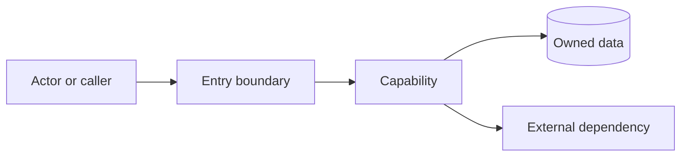
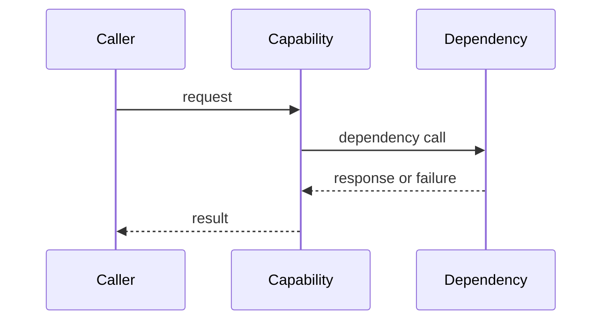
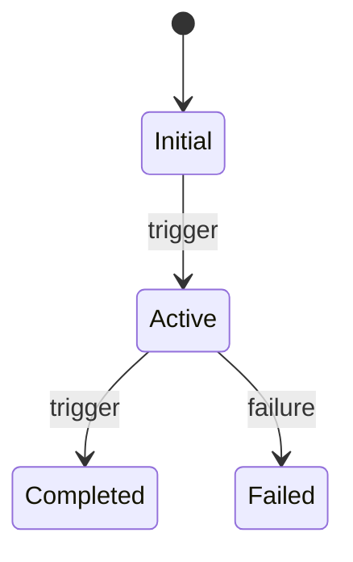

# DR-{number} - {Design title}

> This template is required context for the `dr` SKILL. Load the invoking SKILL
> first; its body is the authoritative DR writing specification. Project-specific
> rules are optional additions selected by `project_id`.
> Related documents may be cited, but none
> is required to create or review this DR.

## 1. Metadata and Design Intent

```yaml
spec_id: DR-{number}
spec_type: dr
scope: global-or-project
project_id: <stable project id or none>
status: draft
version: 0.1.0
owner: <role or person>
updated: YYYY-MM-DD
```

- Design intent in one sentence:
- Evidence inspected (repository paths, contracts, user statements):
- Optional related Specs:

## 2. Goals, Scope, and Non-Goals

### Goals

-

### In Scope

-

### Out of Scope

-

### Success Signals

| ID | Design outcome | Measurement / observation | Target |
|----|----------------|--------------------------|--------|
| OUT-DR-001 | | | |

## 3. Constraints and Assumptions

| Constraint / assumption | Source or evidence | Binding? | Design impact |
|-------------------------|-------------------|----------|---------------|
| | | MUST / SHOULD / assumption | |

Explicitly distinguish confirmed facts from assumptions and unresolved questions.

## 4. Design Decisions

### Implementation decision baseline (when implementation choices are non-trivial)

Before fixing a non-obvious implementation choice, record the existing-capability
scan, mature alternatives, five-dimension quality assessment, and the unique
owner of the capability. This is design evidence, not a workflow gate.

| Implementation point | Existing capability / search evidence | Reuse, extend, or new | Mature alternatives considered | Selected choice and reason | Owner |
|----------------------|----------------------------------------|----------------------|--------------------------------|----------------------------|-------|
| | | | | | |

| Candidate | Usability | Efficiency | Maintainability | Robustness | Readability | Conclusion |
|----------|-----------|------------|-----------------|------------|------------|------------|
| Reuse / extend / new | | | | | | |

| Business capability | Unique owner component/method | Allowed callers | Reuse mechanism | Prohibited duplicate location | Side effects |
|---------------------|-----------------------------|----------------|------------------|------------------------------|-------------|
| | | | | | |

### DEC-001 - {Decision title}

- Context and constraints:
- Options considered:

| Option | Benefits | Costs / risks | Evidence |
|--------|----------|---------------|----------|
| | | | |

- Selected option:
- Rejected alternatives and why:
- Accepted cost or risk:
- Owner and decision date:

## 5. Architecture Overview



### Component Responsibilities

| Component / module | Responsible for | Must not do | Owned data / contract |
|--------------------|-----------------|-------------|-----------------------|
| | | | |

### Layer Responsibilities (when applicable)

| Layer | Responsibilities | Prohibited concerns | Evidence |
|-------|------------------|--------------------|----------|
| Interface / adapter | | | |
| Application / orchestration | | | |
| Domain | | | |
| Infrastructure / persistence | | | |

## 6. Key Sequences (Optional)

Only draw non-obvious or cross-component interactions.



## 7. Data Model and State

### Entities and Ownership

| Entity / table / event | Owner | Lifecycle | Key / uniqueness | Retention |
|------------------------|-------|-----------|-----------------|-----------|
| | | | | |

### Data Changes

| Object | Change type | Fields / schema | Indexes / constraints | Migration / rollback |
|--------|-------------|-----------------|----------------------|----------------------|
| | add / alter / remove | | | |

### Invariants and State Machine

- Invariants:
- Allowed transitions and triggers:
- Forbidden transitions and expected response:
- Idempotency, concurrency, and consistency:



## 8. Interfaces and Contracts

| Contract ID | Direction | Endpoint / topic / SPI | Auth / headers | Request | Response | Errors | Idempotency / retry |
|-------------|-----------|------------------------|----------------|---------|----------|--------|--------------------|
| API-001 | | | | | | | |

For each contract, state versioning, timeout, rate limit, compatibility, and
whether failure is synchronous, asynchronous, retried, compensated, or surfaced.

## 9. Business Rules and Cross-Component Behavior

| Rule ID | Rule | Owning component/layer | Inputs | Observable result |
|---------|------|------------------------|--------|-------------------|
| BR-001 | | | | |

## 10. Failure Modes and Recovery

| Flow | Failure point | Resulting state | Handling / compensation | Manual action / evidence |
|------|---------------|-----------------|-------------------------|--------------------------|
| | timeout / duplicate / partial success / unavailable | | | |

Cover dependency unavailability, duplicate delivery, partial success,
transaction rollback, retry exhaustion, and data repair where relevant.

## 11. Security, Privacy, and Audit

- Authentication and authorization model:
- Tenant/ownership checks:
- Sensitive fields and masking/encryption:
- Audit events, actor identity, and retention:
- Abuse/rate-limit/risk controls:

## 12. Story Decomposition (Optional)

This section is an optional design view of independently deliverable behavior.
It does not require Story documents to exist and does not create a dependency
between this DR and any Story. Keep boundaries, owners, and optional local
implementation order explicit; do not copy a process checklist.

| Story ID | Behavior boundary | Included | Excluded | Owning component | Optional local order | Acceptance/evidence |
|----------|-------------------|----------|----------|------------------|----------------------|--------------------|
| STORY-001 | | | | | | |

## 13. Verification Strategy

| Design claim | Verification level | Command / review action | Expected evidence |
|--------------|--------------------|-------------------------|-------------------|
| | unit / integration / HTTP / E2E / inspection | | |

## 14. Test Strategy (Optional)

- Unit coverage:
- Contract/interface coverage:
- Persistence and transaction coverage:
- Failure and recovery coverage:
- Real dependency requirements:

## 15. Observability and Operations

| Signal | Source | Normal range | Alert threshold | Response |
|--------|--------|--------------|-----------------|----------|
| Metric / log / trace | | | | |

- Dashboards and log correlation fields:
- Health/readiness behavior:
- Capacity and rate limits:

## 16. Release, Migration, and Rollback

- Compatibility window:
- Migration order and validation:
- Staged rollout or feature flag:
- Rollback trigger and procedure:
- Post-release observation:

## 17. Risks and Unknowns

| ID | Risk / unknown | Impact | Likelihood | Mitigation / decision trigger | Owner | Status |
|----|----------------|--------|------------|-------------------------------|-------|--------|
| Q-001 | | | | | | open |

## 18. Optional Related Notes

- Story or behavior considerations:
- TestCase considerations:
- Implementation considerations:
- References to external contracts or project assets:

## 19. Traceability Record (Optional)

| Related ID | Relationship | Location / evidence | Notes |
|------------|--------------|---------------------|-------|
| REQ-001 / STORY-001 / AC-001 / TC-001 / TASK-001 | relates to | | |
