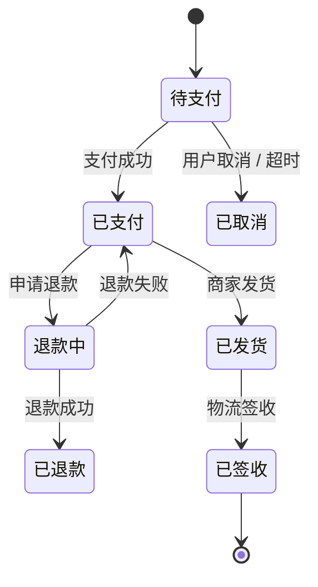

# Requirement Analysis — 需求分析 SKILL（ae-sdd Phase 1 起点）

> **🔴 核心定位（2026-06-17 重大重构）：** 本 SKILL 是 ae-sdd 体系的 **Phase 1 起点**（"入口"），与 `story-generate-skill` / `dr-generate-skill` / `dr-review-skill` 平级但**位置更靠前**——它产出"RA 文档 + 规模裁定 + 路由决策"，再触发下游对应 SKILL。
>
> **与现有 SKILL 的分工：**
> - `ae-sdd-skill.md` = 流程编排（Phase 1 起点在哪）
> - **`requirement-analysis-skill.md`（本文件）** = 需求分析的环节内具体规则（怎么分析）
> - `dr-generate-skill.md` = 设计需求生成（Phase 1 ② 节点，规模 = 大 时触发）
> - `story-generate-skill.md` = Story 生成（规模 = 中 时触发）
> - `task-generate-skill.md` = Task 生成（规模 = 小 时触发）
> - `coding-skill.md` = 编码实施（规模 = 微 / 特殊-BUG / 特殊-非代码 时触发）
> - `dr-review-skill.md` = DR 评审（dr-generate 之后）
> - [`templates/design/ra-template.md`](../../templates/design/ra-template.md) = RA 空白模板
> - [`templates/design/prd-template.md`](../../templates/design/prd-template.md) = PRD 空白模板
> - [`templates/design/issue-template.md`](../../templates/design/issue-template.md) = Issue 空白模板
>
> **🔴 核心立场（2026-06-17 新建）：** 之前 Phase 1 起点只有 `auto-engineering-skill` 中"读 PRD → 启动流程"的一行描述，**没有独立 SKILL**。本次新建补齐——把"需求分析"作为独立环节固化下来，避免下游 SKILL 各做一遍零散的需求理解。

---

## 📦 文档存放前置调用（🔴 横切依赖）

> **🔴 强制：** 本 SKILL 生成的 RA 文档在写入磁盘前**必须先调用 [`document-storage-skill.md`](../cross-cutting/document-storage-skill.md)** 确定：
> 1. **路径**（§2.2 路径模板）：`{工程根}/ae-sdd-doc/iterations/{YYYY-MM-DD}/RA/{RA-ID}.md`
> 2. **命名**（§3.1/3.2 命名规则）：**设计类文档带 v{major}.{minor}**（重入时 v 递增，旧版本保留）
> 3. **重入判定**（§4 重入 SOP）：RA 重入时**新增版本**（v{major}.{minor} 递增）
> 4. **关联性分析**（§6 关联性分析）：通过 `choose_iteration()` 判定属于哪个迭代（业务+逻辑双轨）
> 5. **ChangeLog**（§5 ChangeLog 机制）：每次修改必须追加 ChangeLog 行
> 6. **.gitignore**（§7 .gitignore 自动生成）：首次写入时自动维护

**本 SKILL 输出文档与 document-storage-skill §X 的对应：**

| 输出文档 | 路径模板 | 命名规则 | 重入时动作 |
|---------|---------|---------|----------|
| RA 主文档 | `{工程根}/ae-sdd-doc/iterations/{YYYY-MM-DD}/RA/{RA-ID}-v{major}.{minor}.md` | v{major}.{minor} | 新增版本（v 递增）|
| RA ChangeLog | `{工程根}/ae-sdd-doc/iterations/{YYYY-MM-DD}/RA/ChangeLog/{RA-ID}-changelog.md` | 不带版本号 | 追加新行（每次 RA 修订追加 1 行）|
| PRD（无输入时生成）| `{工程根}/ae-sdd-doc/PRD/{PRD-ID}.md` | 不带版本号 | 原地修改（按 prd-template）|
| Issue（无输入时生成）| `{工程根}/ae-sdd-doc/PRD/Issue-{编号}.md` | 不带版本号 | 原地修改（按 issue-template）|
| RAGeneratePlan | `{工程根}/ae-sdd-doc/iterations/{YYYY-MM-DD}/RA/ChangeLog/{RA-ID}-RAGeneratePlan-r{N}.md` | 带 r{N} | 新增（每轮生成 1 份）|

**项目资产读取：** 通过 [`project-assets-update-skill.md`](../cross-cutting/project-assets-update-skill.md) §G 索引化 API 按需加载：
- `assets.outline()` — 拉资产总览（5 秒了解项目范围）
- `assets.module(name)` — 拉单微服务详情（入口/主表/关键类）
- `assets.table(name)` — 拉单表所有字段（数据要素维度必备）
- `assets.component(name)` — 拉公共组件位置（设计方向论证必备）
- `assets.api(method)` — 拉跨服务 API 契约（接口契约必读）
- `assets.search(keyword)` — 关键词反查（避免重复造轮子）
- `assets.sections(§X.Y)` — 按需拉章节内容（不全文加载）

**🔴 关键约束：**
- ❌ 不允许直接读 `design/`、`.ae-task/`、`.ae-plan/`、`.spec/iterations/` 等旧路径
- ✅ 强制使用 `ae-sdd-doc/` 新路径（document-storage-skill §2.1 强制）
- ✅ 强制调用 `choose_iteration()` 判定迭代（业务=0 ∧ 逻辑=0 → 强制问用户）

---

## 0. 目标

从 PRD/Issue/对话需求生成 **完整、可评审、可路由** 的需求分析（RA）文档，5 大目标：

- **业务全景清晰**（让读者 5 秒内理解需求在做什么、解决什么问题）
- **8 维度挖掘无遗漏**（角色/场景/流程/数据/规则/设计方向/AC/假设）
- **5 问自检通过**（每条结论都有证据/反例/边界/冲突/缺口 5 个角度的检验）
- **5 维规模裁定 + 路由决策**（输出规模结果 + 下游 SKILL + 路径）
- **缺口管理显性化**（缺口不掩盖，所有未决问题有跟踪机制）

---

## 总则（🔴 4 条标尺，贯穿全 SKILL，违反 = 结论无效）

### 标尺 1：穷举优于抽样（🔴 "覆盖所有"必须先有穷举清单）

- 禁止使用"等等"/"其他"/"大概"等省略性措辞
- 任何"覆盖"类结论必须**先列穷举清单**（角色清单、场景清单、字段清单、规则清单、AC 清单），再逐项打钩
- 清单来源：PRD 显式声明 + 业务常识反推 + 用户补充确认

### 标尺 2：证据优于假设（🔴 每条结论可追溯到事实来源）

| 结论类型 | 必填证据格式 | 反例（❌ 不可接受）|
|---------|------------|------------------|
| "角色 X 有需求 Y" | `PRD §X.Y` 段落 + 行号 / `Issue #N 描述` / `用户对话第 N 轮` | "用户需要这个" |
| "场景 X 走主流程" | `PRD §X.Y 业务场景` + 行号 | "应该是这样" |
| "实体 X 有字段 Y" | `PRD §X.Y 数据字段` + `assets.table(X).Y` | "应该有这个字段" |
| "规则 R1 适用" | `PRD §X.Y 业务规则` + `用户确认时间戳` | "我觉得要这样" |
| "AC-001 覆盖主流程" | `PRD §主流程步骤清单` + `AC-001 Given-When-Then` | "覆盖了" |

**红线：**
- **未发现 ≠ 已确认无**。必须先有穷举清单，才能写"无"。
- 任何无法定位到 PRD 章节/Issue 描述/用户对话的 ✅ 视为"未审查"，不算结论。
- 引用 PRD 章节必须 cite 章节号，引用用户对话必须 cite 轮次，引用项目资产必须 cite `assets.X()` 调用结果。

### 标尺 3：冲突显性化（🔴 冲突必须摆到台面讨论）

- 角色冲突：A 角色需要 X，B 角色需要 ¬X（互相排斥）→ 必须显式列出
- 业务冲突：业务规则 R1 与 R2 矛盾 → 必须显式列出
- 流程冲突：主流程 A 与异常流程 B 路径冲突 → 必须显式列出
- 冲突不识别 = 隐藏炸弹，RA 完成阶段必须重过冲突清单

### 标尺 4：缺口不掩盖（🔴 未确认问题必须列入"未决问题"）

- 任何"我不确定" / "用户没说" / "PRD 没说"的结论 → 必须显式列入缺口清单
- 缺口分级（🔴 阻断 / 🟠 严重 / 🟡 一般 / 🟢 建议）+ 处理方式（补充文档/问用户/接受模糊）
- RA 文档完成后，🔴 缺口必须解决（否则不进入规模裁定），🟠🟡🟢 缺口可标注但必须有负责人

---

## 触发条件

| 触发场景 | 触发方式 | 输入类型 |
|---------|---------|---------|
| Phase 1 起点 | `ae-sdd-skill` 编排层自动触发 | 任何 |
| 用户手动 | "分析需求" / "从 PRD 开始" / "需求拆解" / "需求分析" | 任何 |
| 有 PRD 文件 | 用户提供文件路径 | PRD（直接走第零步）|
| 有 Issue 文件 | 用户提供文件路径 | Issue（直接走第零步）|
| 无输入（对话需求 + 复杂）| 多轮对话 | 自动写 PRD → 进入第零步 |
| 无输入（对话需求 + 简单）| 多轮对话 | 自动写 Issue → 进入第零步 |
| BUG/配置类 | 用户描述 | 直接进第零步（用 Issue 模板）|
| 重入（已有 RA）| 用户说"修改 RA" / "重做需求分析" | 修订（按 §重入 SOP）|

---

## Plan-first 生成原则（🔴 写 RA 前硬前置）

> **🔴 强制：** RA 生成前**必须**先有 RAGeneratePlan，按 Plan 执行。
>
> **Plan-first 与下游 SKILL 的差异：**
> - `dr-generate-skill` / `story-generate-skill` 是 "DR-章节-初稿" 单向链
> - 本 SKILL 是 **"输入识别 → 8 维度挖掘 → 自检 → 缺口 → 规模 → 路由"** 6 段链
> - RAGeneratePlan 的目的是把"输入 + 挖掘 + 自检"做成可执行 SOP，避免"边挖边漏"

**RAGeneratePlan 内容：**

```markdown
## RAGeneratePlan - {RA-ID} - {YYYY-MM-DD HH:mm}

### 1. 输入识别
- 输入类型：PRD / Issue / 对话 / 重入
- 输入文件路径：{path}
- 输入复杂度判定：{复杂（>3 功能点）/ 简单（1-3 功能点）/ BUG/配置}
- 写入策略：{直接走 / 多轮对话写 PRD / 多轮对话写 Issue}

### 2. 8 维度挖掘 SOP
- 阶段 A 角色分析：{从 PRD 角色段 + 现有项目角色反推}
- 阶段 B 场景分析：{PRD 业务场景 + 项目资产业务流程}
- 阶段 C 业务流程：{PRD 流程图 + 补充文档}
- 阶段 D 数据要素：{PRD 字段 + assets.table() 反查}
- 阶段 E 业务规则：{PRD 规则段 + assets.sections(§6.X) 约束}
- 阶段 F 设计方向：{PRD 功能 + assets.component() 复用扫描}
- 阶段 G AC 雏形：{PRD 业务场景 + 业务流程}
- 阶段 H 假设挖掘：{PRD 全文反推}

### 3. 5 问自检清单（每条结论）
- [ ] 证据（cite PRD 章节/Issue 描述/用户对话轮次）
- [ ] 反例（有无反例推翻此结论）
- [ ] 边界（此结论在什么边界条件下不成立）
- [ ] 冲突（与其他维度结论有无冲突）
- [ ] 缺口（假设了什么未明确事实）

### 4. 缺口管理策略
- 🔴 阻断型：必须解决（补充文档/用户确认）
- 🟠 严重型：24h 内解决
- 🟡 一般型：48h 内解决
- 🟢 建议型：下次迭代

### 5. 规模裁定算法
- 5 维评分（服务范围/接口变更/架构决策/数据变更/测试层级）
- 规模判定（一票否决：架构决策=4 或 数据变更=4 → 大）
- 路由决策（6 类规模 → 6 类下游 SKILL）

### 6. 与下游 SKILL 衔接
- 规模 = 大 → 触发 `dr-generate-skill`，传入 RA + PRD + 项目资产
- 规模 = 中 → 触发 `story-generate-skill`，传入 RA + PRD + 项目资产
- 规模 = 小 → 触发 `task-generate-skill`，传入 RA + 项目资产
- 规模 = 微/特殊-BUG/特殊-非代码 → 触发 `coding-skill`，传入 RA
```

---

## 整体流程

```
触发（PRD/Issue/对话/重入）
    ↓
第 -1 步：需求来源识别（多轮对话 + PRD/Issue 沉淀）
    ↓
第零步：RA 准入检查（PRD/Issue + 项目资产索引 + 历史 RA + 约束）
    ↓
第一步：8 维度并行挖掘
    ├─ 阶段 A：角色分析
    ├─ 阶段 B：场景分析
    ├─ 阶段 C：业务流程
    ├─ 阶段 D：数据要素
    ├─ 阶段 E：业务规则与约束
    ├─ 阶段 F：设计方向论证
    ├─ 阶段 G：验收标准雏形
    └─ 阶段 H：隐性假设与验证
    ↓
第一步 bis：每条结论 5 问自检（证据/反例/边界/冲突/缺口）
    ↓
第二步：缺口汇总 + 循环迭代
    ↓
第三步：写入 RA 文档（save_doc + choose_iteration）
    ↓
第三步 bis：生成 RAGeneratePlan
    ↓
第四步：🔴 人工审核点（双支柱呈现）
    ↓
第五步：🔴 5 维规模裁定 + 路由决策
    ↓
第六步：触发下游 SKILL
    ↓
第七步：8 道闸
    ↓
完成 → 进入 Phase 1 下游
```

**关键原则：** 每个步骤必须产出中间结果，用户确认后方可进入下一步。未确认禁止继续。

---

## 第 -1 步：需求来源识别

> **🔴 关键：** 本步决定"用什么作为 RA 的输入"——是直接走第零步，还是先做多轮对话沉淀为 PRD/Issue。

### -1.1 输入类型判定子流程

```
For each 输入类型：
  ├─ 有 PRD 文件 → 直接进第零步（不再沉淀）
  ├─ 有 Issue 文件 → 直接进第零步
  ├─ 对话需求 + 复杂（>3 个功能点）→ 多轮对话 → 写 PRD（prd-template）→ 进第零步
  ├─ 对话需求 + 简单（1-3 个功能点）→ 多轮对话 → 写 Issue（issue-template）→ 进第零步
  └─ BUG/配置类 → 直接进第零步（用 Issue 模板，无需多轮对话）
```

### -1.2 多轮对话 SOP

**原则：每次只问 1-3 个关键问题，避免一次性灌入大量问题让用户崩溃。**

| 轮次 | 主题 | 关键问题 |
|------|------|---------|
| 第 1 轮 | 业务背景 + 目标 | "你希望解决什么业务问题？" / "目标用户是谁？" / "成功的标准是什么？" |
| 第 2 轮 | 核心场景 + 角色 | "核心使用场景是什么？" / "涉及哪些角色？" / "每个角色想完成什么？" |
| 第 3 轮 | 边界 + 异常 | "边界条件（如空数据/超长字段/弱网）怎么处理？" / "异常情况如何处理？" |
| 第 4 轮 | 约束 + 依赖 | "性能/安全/合规要求？" / "依赖哪些已有模块/接口/数据？" |

**对话技巧：**
- 用 Given-When-Then 框架引导用户描述（"假设用户 X，想做 Y，应该 Z"）
- 拒绝模糊回答（用户说"合理" → 反问"什么算合理？举 1 个具体场景"）
- 每轮结束时总结 + 让用户确认，再进入下一轮

### -1.3 输入沉淀模板

**PRD 模板**（复杂需求）：参见 [`templates/design/prd-template.md`](../../templates/design/prd-template.md)
- 必填：概述（背景/目标/范围）/ 角色 / 业务场景 / 功能清单 / 业务流程 / 非功能需求 / 已有业务依赖
- 路径：`{工程根}/ae-sdd-doc/PRD/{PRD-ID}.md`

**Issue 模板**（简单需求/BUG）：参见 [`templates/design/issue-template.md`](../../templates/design/issue-template.md)
- 必填：问题描述（现象/复现步骤/期望/实际）/ 影响范围 / 解决方向
- 路径：`{工程根}/ae-sdd-doc/PRD/Issue-{编号}.md`

### -1.4 第 -1 步产出

```markdown
## 需求来源识别记录

| # | 项 | 值 |
|---|----|---|
| 1 | 输入类型 | PRD / Issue / 对话（复杂）/ 对话（简单）/ BUG/配置 |
| 2 | 输入文件 | {path 或"无"} |
| 3 | 对话轮次 | {N 轮} |
| 4 | 沉淀产物 | {PRD-{ID}.md / Issue-{ID}.md / 无} |
| 5 | 用户确认 | ☐ 已确认 ☐ 待确认 |

**门禁：**
- ✅ 输入已沉淀为 PRD/Issue（按适用情况）→ 进第零步
- ❌ 输入未沉淀 → 停止，继续多轮对话
```

---

## 第零步：RA 准入检查（🔴 硬门禁，未通过禁止进入挖掘）

> **🔴 必读清单（8 项）：**

| # | 来源 | 文件 | 读取要求 | 工具 |
|---|------|------|---------|------|
| 1 | 用户提供 | PRD/Issue 文件 | 全文 | Read 全文 |
| 2 | 用户提供 | PRD 补充文档 | 全文（如有）| Read 全文 |
| 3 | 自动加载 | 项目资产大纲 | 关键模块 | `assets.outline()` |
| 4 | 自动加载 | 相关模块详情 | 按需 | `assets.module(name)` |
| 5 | 自动加载 | 相关表字段 | 按需 | `assets.table(name)` |
| 6 | 自动加载 | 相关公共组件 | 按需 | `assets.component(name)` |
| 7 | 自动加载 | 历史 RA 摘要（如有重入）| 同模块或同业务域 | 文件系统扫描 `ae-sdd-doc/iterations/*/RA/*.md` |
| 8 | 模板 | RA 模板 | 必读 | Read `templates/design/ra-template.md` |

**门禁判定：**
- ✅ 全部读取 + 用户确认 → 进第一步
- ❌ 任一缺失 → 停止，补充读取 + 用户确认

**第零步产出：准入检查记录**

```markdown
## RA 准入检查记录 - {RA-ID} - {YYYY-MM-DD HH:mm}

| # | 来源 | 状态 | 备注 |
|---|------|------|------|
| 1 | PRD/Issue | ✅ 已读 / ❌ 未读 | {路径} |
| 2 | 补充文档 | ✅ 已读 / ❌ 无 | {路径} |
| 3 | 项目资产大纲 | ✅ assets.outline() / ❌ | 关键模块：{N} 个 |
| 4 | 相关模块详情 | ✅ assets.module({X}) / ❌ | 涉及：{模块列表} |
| 5 | 相关表字段 | ✅ assets.table({X}) / ❌ | 涉及：{表列表} |
| 6 | 相关组件 | ✅ assets.component({X}) / ❌ | 涉及：{组件列表} |
| 7 | 历史 RA | ✅ {N} 份 / ❌ 无 | 关联：{列表} |
| 8 | RA 模板 | ✅ 已读 / ❌ | |

**用户确认：** ☐ 通过 ☐ 补充后再继续
```

---

## 第一步：8 维度并行挖掘

> **🔴 关键：** 8 维度**并行执行**（不是顺序），每个阶段独立产出，最后汇总为 RA 文档 12 章节。

### 阶段 A：角色分析（→ RA §2）

**输入：**
- PRD/Issue 角色段
- `assets.module(name)` 中的"已涉及角色"反查
- `assets.search("角色")` 关键词反查

**产出（RA §2）：**
- §2.1 角色枚举（穷举，不许"其他"）
- §2.2 角色 × 需求 × 效果矩阵
- §2.3 角色冲突识别清单
- §2.4 角色优先级（P0/P1/P2）

**🔴 必禁：**
- 不可"等等" / "其他" / "大概"
- 不可省略角色（PRD 写了 3 个角色，RA 只能多不能少）

**示例：**
> 角色 1：C 端用户
> - 核心需求：在 App 上查看订单状态
> - 完成动作：进入 App → 点击"我的订单" → 查看列表
> - 期望效果：实时看到订单最新状态
> - 不希望：等待时间长 / 状态更新不及时
> - 优先级：P0

### 阶段 B：场景分析（→ RA §3）

**输入：**
- PRD 业务场景段
- PRD 用户旅程
- 项目资产业务流程

**产出（RA §3）：**
- §3.1 主流程场景（穷举，每个场景编号）
- §3.2 异常场景（按 4 类分组：业务/系统/数据/并发）
- §3.3 边界场景（空数据/超长字段/弱网/离线/大数据量/国际化）
- §3.4 跨场景组合（如"大文件 + 弱网"）

**🔴 必填字段（每个异常场景）：**
- 触发条件
- 检测点
- 处理动作
- 用户提示

### 阶段 C：业务流程（→ RA §4）

**输入：**
- PRD 业务流程段
- PRD 状态机图
- 补充文档中的时序图

**产出（RA §4）：**
- §4.1 状态机图（Mermaid stateDiagram）
- §4.2 主流程时序（Mermaid sequenceDiagram）
- §4.3 异常处理矩阵（异常类型 × 触发条件 × 检测点 × 处理动作 × 用户提示）

**Mermaid 状态机示例：**


### 阶段 D：数据要素（→ RA §5）

**输入：**
- PRD 数据字段段
- `assets.table(name)` 查实际表结构
- `assets.search(字段名)` 反查字段是否在多表出现

**产出（RA §5）：**
- §5.1 核心实体列表（主表/关系表/历史表，穷举）
- §5.2 实体关系图（Mermaid erDiagram）
- §5.3 字段约束矩阵（每字段：类型/约束/枚举/默认值/业务含义）
- §5.4 数据生命周期（创建/读取/更新/删除归档）
- §5.5 数据所有权（创建方/修改方/查询方）

**🔴 必填字段（每实体）：**
- 表名（来自 `assets.table()` 确认存在）
- 字段清单（来自 `assets.table()` 实际字段，禁止猜测）
- 主键 + 索引（PK/UK/普通索引）
- 审计四字段（id/created_by/created_date/last_updated_by/last_updated_date）
- 逻辑删除字段（deleted_flag）

**🔴 必禁：**
- 禁止凭空编造字段（必须 `assets.table()` 反查确认）
- 禁止使用过时的项目资产（`lastAuditedAt > 90 天` 时先触发资产更新）

### 阶段 E：业务规则与约束（→ RA §6）

**输入：**
- PRD 业务规则段
- `assets.sections(§6.X)` 读工程约束
- `standards/constraints/` 8 个 .md

**产出（RA §6）：**
- §6.1 业务规则列表（每条规则 R1/R2/R3 编号）
- §6.2 平台约束（接口路径/数据隔离/分页规范）
- §6.3 合规要求（数据脱敏/审计日志/等保）
- §6.4 性能约束（P99 响应时间/TPS/并发数）

**🔴 必填字段（每规则）：**
- 规则编号（R1, R2, ...）
- 规则描述（来自 PRD）
- 证据来源（cite PRD 章节）
- 违反后果
- 处置方式

### 阶段 F：设计方向论证（→ RA §7）

**输入：**
- PRD 功能清单
- `assets.component(name)` 查公共组件（避免重复造轮子）
- `assets.api(method)` 查现有 API 契约
- 团队既有实现（项目资产 §10 经验文档）

**产出（RA §7）：**
- §7.1 备选方案（至少 2 个，通常 3 个：A/B/C）
- §7.2 方案对比矩阵（维度：复杂度/性能/可维护性/可扩展性/影响面）
- §7.3 取舍说明（选定方案 + 选定理由 + 接受代价）

**🔴 必填字段（每个方案）：**
- 实现思路
- 优点
- 缺点
- 工作量（人天）
- 影响面（涉及哪些工程/模块/接口/表）

**🔴 必禁：**
- 禁止"先用着" / "后面再优化" / "更方便"等模糊理由
- 禁止跳过"现有能力复用扫描"（直接进方案对比）

### 阶段 G：验收标准雏形（→ RA §8）

**输入：**
- PRD 业务场景
- PRD 业务流程
- §3 场景清单
- §4 状态机

**产出（RA §8）：**
- §8 AC 清单（Given-When-Then）
- §8 覆盖矩阵（AC × 主流程/异常/边界/并发 4 类场景）

**🔴 AC 格式（Given-When-Then）：**
- AC_ID: AC-001
- 描述：{一句话}
- Given（前置）：{角色 / 数据 / 状态}
- When（操作）：{操作步骤}
- Then（预期）：{结果 + 错误码}

**🔴 AC 必覆盖：**
- 每个主流程关键步骤至少 1 个 AC
- 每个异常场景至少 1 个 AC
- 每个边界场景至少 1 个 AC
- 状态机（若有）：合法流转 + 非法流转 + 初始态 + 终态 + 并发/幂等
- 性能/安全/合规约束（若有）：至少 1 个 AC

### 阶段 H：隐性假设与验证（→ RA §9）

**输入：**
- PRD 全文（挖掘未明说但实际依赖的事实）
- 业务常识
- 项目资产中的类似实现

**产出（RA §9）：**
- 假设清单（每条 H1/H2/H3 编号）
- 验证方式（补充文档/用户确认/代码反查）
- 验证结果（已确认 / 已反驳 / 待确认）

**🔴 假设来源（4 类）：**
- PRD 提到的但未说明的（如"用户登录" → 假设"用户已有账号"）
- 业务常识反推的（如"订单状态变更" → 假设"会发送通知"）
- 跨模块依赖的（如"调支付" → 假设"支付服务可用"）
- 性能/安全隐含的（如"高频查询" → 假设"需要缓存"）

---

## 第一步 bis：每条结论 5 问自检

> **🔴 强制：** 第一步产出的每条结论必须通过 5 问自检才能进入第二步。
> **范围：** §2 角色 / §3 场景 / §4 流程 / §5 数据 / §6 规则 / §7 设计方向 / §8 AC / §9 假设 — 所有 8 维度的每条结论。

### 5 问清单

| # | 问 | 必填 | 不通过的处理 |
|---|----|------|------------|
| 1 | **证据**：此结论来自 PRD 哪段？或来自哪个补充文档？cite [PRD §X.X] | 必须有具体来源 | 不通过 → 列入"无证据结论"清单 |
| 2 | **反例**：有没有反例能推翻此结论？ | 必须有"无反例"的明确判定 | 不通过 → 列入"反例存在"清单 |
| 3 | **边界**：此结论在什么边界条件下不成立？ | 必须列出边界条件 | 不通过 → 列入"边界模糊"清单 |
| 4 | **冲突**：此结论与其他维度的结论有没有冲突？ | 必须有"无冲突"的明确判定 | 不通过 → 列入"冲突未解决"清单 |
| 5 | **缺口**：此结论假设了什么未明确的事实？ | 必须列出假设 | 不通过 → 列入"未识别假设"清单 |

### 5 问自检记录模板

```markdown
## 5 问自检记录 - {RA-ID} - {YYYY-MM-DD HH:mm}

| 结论 | 维度 | 证据 | 反例 | 边界 | 冲突 | 缺口 | 通过 |
|------|------|------|------|------|------|------|------|
| {结论 1} | A 角色 | PRD §2.1 | 无 | {边界} | 无 | {假设} | ✅ |
| {结论 2} | B 场景 | PRD §3.1 | {反例} | {边界} | {冲突} | {假设} | ❌ |

**通过率：{N}/{total}**

**未通过清单：**
- {结论 2}：反例存在（{说明}）→ 列入第二步缺口管理
```

---

## 第二步：缺口汇总 + 循环迭代

> **🔴 强制：** 第一步 bis 5 问自检不通过的结论 + 用户主动提出的疑问 = 缺口，必须汇总并分级处理。

### 2.1 缺口分级标准

| 级别 | 定义 | 处理方式 | 期限 |
|------|------|---------|------|
| 🔴 **阻断型** | 影响核心业务 / 数据安全 / 系统稳定性 / 规模裁定 | 必须解决：补充文档 / 用户确认 / 接受模糊（带理由）| 立即 |
| 🟠 **严重型** | 影响性能 / 并发安全 / 可维护性 / 验收标准完整性 | 必须解决：用户确认或更新 PRD | 24h 内 |
| 🟡 **一般型** | 影响可读性 / 复用性 / 文档完整性 | 解决或显式标注（带处理计划）| 48h 内 |
| 🟢 **建议型** | 优化类 / 体验类 / 命名风格 | 下次迭代处理 | 不限 |

### 2.2 缺口处理方式

| 方式 | 适用场景 | 动作 |
|------|---------|------|
| **补充文档** | 缺口可由文档补全解决 | 用户提供补充文档 → 重读相关章节 → 重做 5 问自检 |
| **问用户** | 缺口需用户业务判断 | 多轮对话（每次 1-3 个问题）→ 用户确认 → 写入 RA |
| **接受模糊** | 缺口影响小 / 团队有共识 | 显式标注"接受模糊，理由：{N}"→ 列入"未决问题" |

### 2.3 循环迭代算法

```
收集缺口（来自第一步 bis 5 问自检 + 用户疑问）
    ↓
缺口分类（🔴/🟠/🟡/🟢）
    ↓
逐个解决（补充文档/问用户/接受模糊）
    ↓
重新做 5 问自检
    ↓
判定：是否还有新增缺口？
    ├─ 无 → 进第三步
    └─ 有 → 继续循环（最多 5 轮，超过则触发用户决策）
```

### 2.4 5 轮迭代轮次

| 轮次 | 主题 | 产出 |
|------|------|------|
| 第 1 轮 | 粗读 PRD，识别业务主题和核心场景 | §1 业务全景草稿 + 角色清单 + 场景清单 |
| 第 2 轮 | 8 维度并行深挖 | §2-§9 章节草稿 |
| 第 3 轮 | 交叉验证 + 反例推演 | 第一份 5 问自检记录 + 缺口清单初稿 |
| 第 4 轮 | 缺口汇总 + 缺口分级 + 解决方案 | 缺口处理记录 + 修订后的 §2-§9 |
| 第 5 轮 | 用户确认 + 进入第三步 | 用户最终确认 + RA 文档定稿 |

### 2.5 缺口管理产出

```markdown
## 缺口管理记录 - {RA-ID} - {YYYY-MM-DD HH:mm}

| 缺口ID | 描述 | 严重程度 | 解决方案 | 状态 | 截止时间 |
|--------|------|----------|----------|------|----------|
| GAP-001 | {xxx} | 🔴 阻断 | 已请用户确认 | 已解决 | 立即 |
| GAP-002 | {xxx} | 🟠 严重 | 待用户确认 | 待解决 | 24h |
| GAP-003 | {xxx} | 🟡 一般 | 接受模糊，标注 | 已解决 | 48h |
| GAP-004 | {xxx} | 🟢 建议 | 下次迭代 | 已记录 | 不限 |

**统计：**
- 🔴 阻断：{N} 个（必须全部解决才能进入第三步）
- 🟠 严重：{N} 个（24h 内解决）
- 🟡 一般：{N} 个（48h 内解决）
- 🟢 建议：{N} 个（下次迭代）
```

---

## 第三步：写入 RA 文档

> **🔴 强制：** 写入磁盘前**必须先调用** `document-storage-skill.md` 的 API：
> 1. `choose_iteration(doc)` — 判定属于哪个迭代（业务+逻辑双轨关联性分析）
> 2. `get_latest_version(ra_id)` — 获取当前最新版本
> 3. `save_doc(doc)` — 写入新版本（自动处理版本号 + ChangeLog + 目录创建 + .gitignore）
> 4. 首次写入时 `check_and_update_gitignore()` — 自动维护

### 3.1 调用 save_doc 的参数

```python
result = save_doc(doc={
    "doc_id": "RA-001",
    "doc_type": "RA",
    "iteration_date": "2026-06-17",  # 由 choose_iteration 决定
    "version": {"major": 1, "minor": 0},
    "content": "# 需求分析报告：{名称}\n\n## §0 文档信息\n...\n## §1 业务全景\n...\n## §2 角色分析\n...\n## §3 场景分析\n...\n## §4 业务流程\n...\n## §5 数据要素\n...\n## §6 业务规则与约束\n...\n## §7 设计方向论证\n...\n## §8 验收标准雏形\n...\n## §9 隐性假设与验证\n...\n## §10 缺口与未决问题\n...\n## §11 规模裁定\n...\n## §12 自检清单\n",
    "business": {
        "domain": "用户管理",
        "scenario": "用户列表查询",
        "entities": ["User", "Role"],
        "rules": ["权限校验", "分页约束"]
    },
    "logic": {
        "calls": ["BossUserService.list", "BossUserRepository.findByQuery"],
        "dataFlow": ["boss_user.id", "boss_user.status"],
        "stateMachine": None,
        "components": ["PagedModels", "ApiResult"]
    },
    "change_type": "new",
    "change_description": "首次创建",
    "change_source": "requirement-analysis-skill Phase 1 ①"
})
# → 自动写入 ae-sdd-doc/iterations/2026-06-17/RA/RA-001-v1.0.md
# → 自动追加 ChangeLog 行
# → 首次写入时维护 .gitignore
```

### 3.2 关联性分析调用

> **🔴 关键：** `choose_iteration()` 必须传入业务/逻辑双轨标签，关联性分析依赖标签准确性。

**业务关联 4 子规则（任一命中=1）：**

| 子规则 | 含义 | 标签字段 |
|--------|------|---------|
| B1 业务域匹配 | 涉及同一业务域 | `business.domain` |
| B2 业务场景匹配 | 涉及同一业务场景 | `business.scenario` |
| B3 业务实体匹配 | 涉及同一业务实体 | `business.entities` |
| B4 业务规则匹配 | 涉及同一业务规则 | `business.rules` |

**逻辑关联 4 子规则（任一命中=1）：**

| 子规则 | 含义 | 标签字段 |
|--------|------|---------|
| L1 代码调用 | 涉及代码间的调用关系 | `logic.calls` |
| L2 数据流 | 涉及同一数据流 | `logic.dataFlow` |
| L3 状态流转 | 涉及同一状态机的流转 | `logic.stateMachine` |
| L4 组件复用 | 涉及同一组件/工具类/常量 | `logic.components` |

**关联等级判定（业务=0 ∧ 逻辑=0 → 强制问用户）：**

| 业务 | 逻辑 | 等级 | 默认动作 |
|------|------|------|---------|
| 1 | 1 | **强关联** | 默认入当前迭代 |
| 1 | 0 | **中关联** | 默认入当前迭代 |
| 0 | 1 | **中关联** | 默认入当前迭代 |
| 0 | 0 | **无关联** | 🔴 强制问用户（E005） |

**choose_iteration() 调用：**
```python
target_iteration = choose_iteration(doc={
    "doc_id": "RA-001",
    "doc_type": "RA",
    "business": {
        "domain": "用户管理",
        "scenario": "用户列表查询",
        "entities": ["User", "Role"],
        "rules": ["权限校验", "分页约束"]
    },
    "logic": {
        "calls": ["BossUserService.list"],
        "dataFlow": ["boss_user.id", "boss_user.status"],
        "stateMachine": None,
        "components": ["PagedModels", "ApiResult"]
    }
})
# 返回：{ date: "2026-06-15", strength: "strong"/"medium"/"none", reasoning: "..." }
# 强/中关联 → 直接归入
# 无关联 → 强制问用户
```

### 3.3 写入前最后检查

- [ ] RA 文档 12 章节全部填写（§0 元信息 / §1 业务全景 / §2 角色 / §3 场景 / §4 流程 / §5 数据 / §6 规则 / §7 设计方向 / §8 AC / §9 假设 / §10 缺口 / §11 规模 / §12 自检）
- [ ] 8 维度挖掘全部完成（角色/场景/流程/数据/规则/设计方向/AC/假设）
- [ ] 5 问自检全部通过（无未通过条目）
- [ ] 🔴 阻断型缺口已全部解决
- [ ] 业务/逻辑标签已正确打上（关联性分析依赖）

---

## 第三步 bis：生成 RAGeneratePlan

```markdown
## RAGeneratePlan - {RA-ID} - {YYYY-MM-DD HH:mm}

### 1. 输入识别
- 输入类型：{PRD/Issue/对话/重入}
- 输入文件：{path}
- 输入复杂度：{复杂/简单/BUG/配置}

### 2. 8 维度挖掘结论
- 阶段 A 角色分析：{N} 个角色，{M} 个冲突
- 阶段 B 场景分析：{N} 个主流程，{M} 个异常，{K} 个边界
- 阶段 C 业务流程：{N} 个状态，{M} 个转换
- 阶段 D 数据要素：{N} 个实体，{M} 个字段
- 阶段 E 业务规则：{N} 条业务规则
- 阶段 F 设计方向：{N} 个备选方案，选定：{方案}
- 阶段 G AC 雏形：{N} 个 AC
- 阶段 H 假设：{N} 条假设，已确认 {M} 条

### 3. 5 问自检通过率
- 总结论数：{N}
- 通过：{M}（{百分比}%）
- 未通过：{K}（已列入缺口管理）

### 4. 缺口管理结果
- 🔴 阻断：{N} 个（已解决）
- 🟠 严重：{N} 个（已解决 / 待解决）
- 🟡 一般：{N} 个（已标注）
- 🟢 建议：{N} 个（已记录）

### 5. 规模裁定结果
- 5 维评分：服务范围={1/2/3/4} / 接口变更={1/2/3/4} / 架构决策={1/2/3/4} / 数据变更={1/2/3/4} / 测试层级={1/2/3/4}
- 规模 = {大/中/小/微/特殊-BUG/特殊-非代码}
- 路由 = {dr-generate-skill / story-generate-skill / task-generate-skill / coding-skill}

### 6. 与下游 SKILL 衔接
- 触发 SKILL：{name}
- 传入文件：RA 路径 + PRD/Issue 路径
- 项目资产引用：{assets.outline() + assets.module({X})}

### 7. 未解决问题清单
- {Q1}：{描述}（负责人：{X}，截止：{Y}）
```

---

## 第四步：🔴 人工审核点（双支柱呈现）

> **🔴 关键：** 在进入规模裁定前必须获得用户确认。本步采用"双支柱"方式呈现：叙述性讲解 + 对话内直接呈现。

### 4.1 支柱 1：叙述性讲解

向用户叙述以下内容：

```
【RA 文档核心摘要】

业务背景：
- 解决什么问题：{PRD §1 业务背景}
- 目标用户：{PRD §2 角色}
- 核心价值：{PRD §1 业务价值}

8 维度结论：
- 角色：{N} 个（已穷举，已识别 {M} 个冲突）
- 场景：{N} 个主流程 / {M} 个异常 / {K} 个边界
- 流程：{N} 个状态，{M} 个状态转换
- 数据：{N} 个实体，{M} 个字段
- 规则：{N} 条业务规则
- 设计方向：选定方案 {X}，理由 {Y}
- AC：{N} 个验收标准
- 假设：{N} 条假设，已确认 {M} 条

规模裁定：
- 5 维评分：服务范围={1/2/3/4} / 接口变更={1/2/3/4} / 架构决策={1/2/3/4} / 数据变更={1/2/3/4} / 测试层级={1/2/3/4}
- 规模 = {大/中/小/微/特殊-BUG/特殊-非代码}
- 路由建议：{dr-generate-skill / story-generate-skill / task-generate-skill / coding-skill}

关键设计决策：
- {决策 1}：{理由}
- {决策 2}：{理由}

主要风险：
- {风险 1}：{应对措施}
- {风险 2}：{应对措施}
```

### 4.2 支柱 2：对话内直接呈现

在对话中**直接呈现**以下表格（不放在外部文件）：

#### 表 1：角色 × 需求 × 效果矩阵

| 角色 | 核心需求 | 完成动作 | 期望效果 | 不希望发生 | 优先级 |
|------|----------|----------|----------|------------|--------|
| {角色 1} | {需求} | {动作} | {效果} | {不希望} | P0 |
| {角色 2} | {需求} | {动作} | {效果} | {不希望} | P1 |

#### 表 2：场景清单

| 场景 ID | 场景名 | 类型 | 触发条件 | 处理动作 | 用户提示 |
|---------|--------|------|---------|----------|----------|
| S-001 | {主流程 1} | 主流程 | {触发} | {动作} | - |
| S-002 | {异常 1} | 业务异常 | {触发} | {动作} | {提示} |
| S-003 | {边界 1} | 边界 | {触发} | {动作} | {提示} |

#### 图 3：状态机图（Mermaid）

```mermaid
stateDiagram-v2
    {状态 A} --> {状态 B}
    {状态 B} --> {状态 C}
```

#### 表 4：5 维规模评分

| 维度 | 评分 | 说明 |
|------|------|------|
| 服务范围 | {1/2/3/4} | {说明} |
| 接口变更 | {1/2/3/4} | {说明} |
| 架构决策 | {1/2/3/4} | {说明} |
| 数据变更 | {1/2/3/4} | {说明} |
| 测试层级 | {1/2/3/4} | {说明} |

#### 表 5：路由决策

| 规模结果 | 下游 SKILL | 路径 | 触发时机 |
|---------|-----------|------|---------|
| {大/中/小/微/特殊-BUG/特殊-非代码} | {SKILL 名} | `{工程根}/ae-sdd-doc/iterations/{date}/{DocType}/` | 立即 |

#### 表 6：缺口清单

| 缺口 ID | 描述 | 严重程度 | 状态 |
|---------|------|----------|------|
| GAP-001 | {描述} | 🔴 阻断 | 已解决 |
| GAP-002 | {描述} | 🟡 一般 | 已标注 |

### 4.3 用户确认动作

等待用户回复：
- **"确认"** → 进第五步（5 维规模裁定 + 路由决策）
- **"修改 X"** → 用户指出某个结论错误 → 修订 → 重新呈现双支柱
- **"补充 Y"** → 用户补充新信息 → 加入第一步挖掘 → 重新 5 问自检 → 重新呈现

---

## 第五步：🔴 5 维规模裁定 + 路由决策

> **🔴 关键：** 规模裁定 + 路由决策决定下游走哪个 SKILL，是 RA 文档的"出口"。

### 5.1 5 维评分标准

| 维度 | 1=微 | 2=小 | 3=中 | 4=大 |
|------|------|------|------|------|
| **服务范围** | 单文件 / 单类 | 单模块 | 跨模块 | 跨服务 / 跨域 |
| **接口变更** | 无 | 字段级 / 内部 | 新增接口 | 多端 / 多服务 |
| **架构决策** | 无 | 轻微调整（命名/位置）| 需评估（库选型/分层调整）| 必须决策（中间件/缓存/消息）|
| **数据变更** | 无 | 加索引 / 注释 | 加字段（兼容）| 新表 / 迁移 / 大改结构 |
| **测试层级** | 单元测试 | 单测 + 接口 | 全链路（无 UI）| 全链路 + UI |

### 5.2 规模判定算法（一票否决制）

```
if 架构决策=4 或 数据变更=4 → 规模=大
elif 多数维度（≥3）≥ 3 → 规模=中
elif 多数维度（≥3）= 2 → 规模=小
elif 仅单测 + 1-2 个文件 → 规模=微
elif BUG 类（实现与文档不符，需改代码）→ 规模=特殊-BUG
elif 配置/文档类（不需改代码）→ 规模=特殊-非代码
else → 规模=小（默认）
```

**判定示例：**
- 例 1：服务范围=2, 接口变更=2, 架构决策=1, 数据变更=2, 测试层级=1 → 多数=2 → 规模=小
- 例 2：服务范围=3, 接口变更=3, 架构决策=2, 数据变更=3, 测试层级=3 → 多数=3 → 规模=中
- 例 3：服务范围=4, 接口变更=4, 架构决策=4, 数据变更=4, 测试层级=4 → 一票否决（架构=4）→ 规模=大
- 例 4：服务范围=1, 接口变更=1, 架构决策=1, 数据变更=1, 测试层级=1 → 仅单测+1-2文件 → 规模=微

### 5.3 路由决策表

| 规模结果 | 下游 SKILL | 路径模板 | 触发命令 |
|---------|-----------|---------|---------|
| **大** | `dr-generate-skill` | `{工程根}/ae-sdd-doc/iterations/{date}/DR/` | `触发 dr-generate-skill` |
| **中** | `story-generate-skill` | `{工程根}/ae-sdd-doc/iterations/{date}/Story/` | `触发 story-generate-skill` |
| **小** | `task-generate-skill` | `{工程根}/ae-sdd-doc/iterations/{date}/Task/{STORY-ID}/` | `触发 task-generate-skill` |
| **微** | `coding-skill` | `{工程根}/ae-sdd-doc/iterations/{date}/Coding/` | `触发 coding-skill` |
| **特殊-BUG** | `coding-skill` | `{工程根}/ae-sdd-doc/iterations/{date}/Coding/` | `触发 coding-skill`（BUG 路径）|
| **特殊-非代码** | `coding-skill` | `{工程根}/ae-sdd-doc/iterations/{date}/Coding/` | `触发 coding-skill`（配置/文档路径）|

### 5.4 路由决策产出

```markdown
## 规模裁定 + 路由决策 - {RA-ID}

| 维度 | 评分 | 证据 |
|------|------|------|
| 服务范围 | {1/2/3/4} | {cite RA §X} |
| 接口变更 | {1/2/3/4} | {cite RA §X} |
| 架构决策 | {1/2/3/4} | {cite RA §X} |
| 数据变更 | {1/2/3/4} | {cite RA §X} |
| 测试层级 | {1/2/3/4} | {cite RA §X} |

**规模结果：{大/中/小/微/特殊-BUG/特殊-非代码}**

**路由决策：**
- 下游 SKILL：{name}
- 路径：`{工程根}/ae-sdd-doc/iterations/{date}/{DocType}/`
- 传入文件：RA + PRD/Issue + 项目资产
```

---

## 第六步：触发下游 SKILL

按 §5.3 决策触发对应 SKILL，并传入：

| 传入项 | 来源 | 说明 |
|--------|------|------|
| RA 文档路径 | `ae-sdd-doc/iterations/{date}/RA/{RA-ID}-v{major}.{minor}.md` | 完整 RA |
| PRD/Issue 路径 | `ae-sdd-doc/PRD/{PRD-ID}.md` 或 `Issue-{ID}.md` | 原始需求 |
| 项目资产引用 | `assets.outline() + assets.module({X})` 调用记录 | 用于下游 SKILL 精准加载 |
| 规模结果 | §11 规模 | 决定下游 SKILL 类型 |
| 业务/逻辑标签 | `business + logic` | 用于下游 SKILL 关联性分析 |
| 缺口清单 | §10 缺口 | 下游 SKILL 需知 |

**触发命令示例：**
```
触发 dr-generate-skill，传入：
- RA: ae-sdd-doc/iterations/2026-06-17/RA/RA-001-v1.0.md
- PRD: ae-sdd-doc/PRD/PRD-001.md
- 项目资产: {projectKey}.assets.md（lastAuditedAt: 2026-06-10）
- 业务标签: domain=用户管理, scenario=用户列表查询
- 逻辑标签: calls=BossUserService.list
- 规模结果: 大
```

---

## 第七步：8 道闸

| 闸 | 标题 | 门禁 | 闸主 |
|----|------|------|------|
| **闸 1** | 8 维度全部挖掘 | 8 个维度章节都填写完成（角色/场景/流程/数据/规则/设计方向/AC/假设）| 第一步产出 |
| **闸 2** | 5 问自检通过 | 每条结论都通过证据/反例/边界/冲突/缺口 5 个角度检查（不通过率 < 10%）| 第一步 bis 产出 |
| **闸 3** | 冲突已方案化 | 所有角色冲突/业务冲突/流程冲突都有解决方案 | §2.3 + §3.2 + §4.3 |
| **闸 4** | 缺口已解决或标注 | 🔴 缺口已解决（100%），🟠🟡🟢 缺口有处理方案 | §10 缺口清单 |
| **闸 5** | 规模裁定完整 | 5 维评分完整（5 个维度都有评分+说明），规模结果有依据 | §11 规模 |
| **闸 6** | 路由决策有依据 | 路由结果与规模结果一致（按 §5.3 表） | §5.3 决策 |
| **闸 7** | 用户已确认 | 用户在审核点说"确认"（双支柱呈现后）| §第四步 |
| **闸 8** | RA 已落盘 | `documentStorage.save_doc()` 成功，ChangeLog 已记录，`.gitignore` 已维护 | §第三步 |

**闸门失败处理：**
- 闸 1/2/3 失败 → 回到第一步（重做挖掘 + 自检）
- 闸 4 失败 → 回到第二步（重新缺口管理）
- 闸 5/6 失败 → 回到第五步（重新裁定）
- 闸 7 失败 → 回到第四步（重新呈现）
- 闸 8 失败 → 回到第三步（重新写入）

---

## 执行清单（🔴 逐项执行，24 步，对应 TodoWrite）

| # | 步骤 | 动作 | 产出 | 对应章节 |
|---|------|------|------|---------|
| 1 | 第 -1 步 | 需求来源识别 | 输入类型判定 + 多轮对话（如需）| §第 -1 步 |
| 2 | 第 -1 步 | 沉淀为 PRD/Issue | `ae-sdd-doc/PRD/PRD-{ID}.md` 或 `Issue-{ID}.md` | §第 -1 步 |
| 3 | 第零步 | RA 准入检查 | 准入检查记录（8 项）| §第零步 |
| 4 | 第一步-A | 角色分析 | §2 角色矩阵 + 冲突清单 | §阶段 A |
| 5 | 第一步-B | 场景分析 | §3 场景清单（主/异常/边界/组合）| §阶段 B |
| 6 | 第一步-C | 业务流程 | §4 状态机 + 时序 + 异常处理矩阵 | §阶段 C |
| 7 | 第一步-D | 数据要素 | §5 实体 + 关系 + 字段 + 生命周期 | §阶段 D |
| 8 | 第一步-E | 业务规则 | §6 规则 + 平台 + 合规 + 性能约束 | §阶段 E |
| 9 | 第一步-F | 设计方向 | §7 备选 + 对比 + 取舍 | §阶段 F |
| 10 | 第一步-G | AC 雏形 | §8 AC 清单 + 覆盖矩阵 | §阶段 G |
| 11 | 第一步-H | 假设挖掘 | §9 假设清单 + 验证结果 | §阶段 H |
| 12 | 第一步 bis | 5 问自检 | 5 问自检记录（通过率 ≥ 90%）| §第一步 bis |
| 13 | 第二步 | 缺口汇总 | 缺口清单（🔴 全部解决）| §第二步 |
| 14 | 第二步 | 循环迭代 | 5 轮迭代产出 | §第二步 |
| 15 | 第三步 | choose_iteration | 关联性分析结果（强/中/无）| §第三步 |
| 16 | 第三步 | get_latest_version | 当前最新版本 | §第三步 |
| 17 | 第三步 | save_doc | RA 文档 + ChangeLog | §第三步 |
| 18 | 第三步 bis | 生成 RAGeneratePlan | RAGeneratePlan 文档 | §第三步 bis |
| 19 | 第四步 | 双支柱呈现 | 叙述性讲解 + 6 张表 | §第四步 |
| 20 | 第四步 | 用户确认 | "确认" / "修改" / "补充" | §第四步 |
| 21 | 第五步 | 5 维规模裁定 | §11 规模评分 | §第五步 |
| 22 | 第五步 | 路由决策 | 下游 SKILL + 路径 | §第五步 |
| 23 | 第六步 | 触发下游 | 触发命令 + 传入文件清单 | §第六步 |
| 24 | 第七步 | 8 道闸 | 闸门全过 | §第七步 |

---

## 禁止事项

| # | 禁止 | 危害 | 正确做法 |
|---|------|------|---------|
| 1 | 禁止无 Plan 编码 | 流程乱 | §Plan-first 原则（先有 RAGeneratePlan）|
| 2 | 禁止无证据结论 | 不可追溯 | §标尺 2（每条结论 cite PRD/Issue/用户对话）|
| 3 | 禁止"等等" / "其他" / "大概" | 不可穷举 | §标尺 1（先列清单再打钩）|
| 4 | 禁止无冲突识别 | 隐藏炸弹 | §标尺 3（角色/业务/流程冲突摆到台面）|
| 5 | 禁止掩盖缺口 | 不可控风险 | §标尺 4（未确认问题必入缺口清单）|
| 6 | 禁止未做 5 问自检 | 结论无验证 | §第一步 bis（每条结论 5 问）|
| 7 | 禁止 🔴 缺口未解决 | 阻断下游 | §第二步（🔴 必解决，🟠🟡🟢 标注即可）|
| 8 | 禁止未调用 `choose_iteration()` | 文档漂移 | §第三步.2（强/中/无关联判定）|
| 9 | 禁止业务=0 ∧ 逻辑=0 时不问用户 | 归错迭代 | §第三步.2（E005 错误码）|
| 10 | 禁止不写 ChangeLog | 失变更追踪 | §第三步 + document-storage-skill §5 |
| 11 | 禁止不调用 `check_and_update_gitignore()` | 污染 git | §第三步 + document-storage-skill §7 |
| 12 | 禁止规模裁定无依据 | 路由错乱 | §第五步（5 维评分 + 一票否决）|
| 13 | 禁止用户未确认就触发下游 | 流程失控 | §第四步（双支柱 + 等待用户回复）|
| 14 | 禁止 8 道闸未过就结束 | 流程不闭环 | §第七步（8 道闸全过）|
| 15 | 禁止项目资产过期（lastAuditedAt > 90 天）直接使用 | 决策失据 | §第零步（先触发 `project-assets-update-skill` §4 更新）|
| 16 | 禁止凭空编造字段（必须 `assets.table()` 反查）| 数据要素失真 | §阶段 D（用 `assets.table()` 查实际表结构）|

---

## 维护

- **维护人：** 架构组
- **更新频率：** 触发"重入"或新增流程类型时
- **同步对象：**
  - 所有 SKILL 引用本文件作为"需求分析标准"
  - 与 `dr-generate-skill.md` / `story-generate-skill.md` / `task-generate-skill.md` / `coding-skill.md` 协调（边界判定表 + 路由决策表）
  - 与 `document-storage-skill.md §15.1` 协调（调用矩阵新增 1 行：requirement-analysis-skill）
  - 与 `project-assets-update-skill.md §G` 协调（项目资产读取 API）
  - 与 `ae-sdd-skill.md` 协调（Phase 1 起点位置）
- **关键变化（2026-06-17 新建）：**
  - 🆕 **prd-story-skill 拆分为 3 个独立 SKILL**：requirement-analysis（需求分析）+ dr-generate（设计需求生成）+ dr-review（设计需求评审）
  - 🆕 **入口多样**：PRD / Issue / 对话需求 / BUG/配置
  - 🆕 **多轮对话 SOP**：复杂需求写 PRD，简单需求写 Issue
  - 🆕 **8 维度并行挖掘**：角色/场景/流程/数据/规则/设计方向/AC/假设
  - 🆕 **5 问自检**：每条结论必须通过 5 个角度检验
  - 🆕 **5 维规模裁定**：服务范围/接口变更/架构决策/数据变更/测试层级
  - 🆕 **6 类规模路由**：大/中/小/微/特殊-BUG/特殊-非代码 → 6 个下游 SKILL
  - 🆕 **业务+逻辑双轨关联性分析**：调用 `choose_iteration()` 判定迭代
  - 🆕 **项目资产按需加载**：通过 `assets.*()` 索引化 API，不全文加载
  - 🆕 **缺口管理分级**：🔴 阻断 / 🟠 严重 / 🟡 一般 / 🟢 建议
  - 🆕 **RAGeneratePlan**：每轮生成 1 份计划（带 r{N}）
  - 🆕 **双支柱审核**：叙述性讲解 + 对话内直接呈现
  - 🆕 **8 道闸**：从挖掘到落盘全流程门禁
