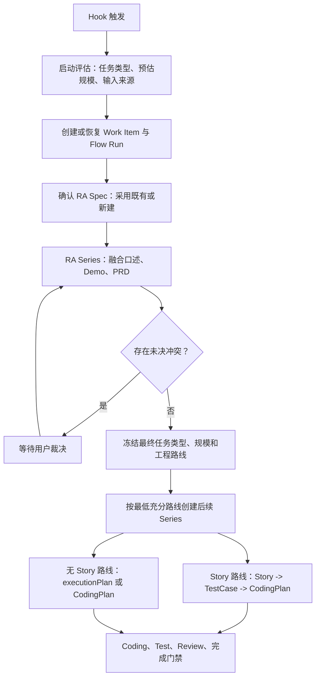
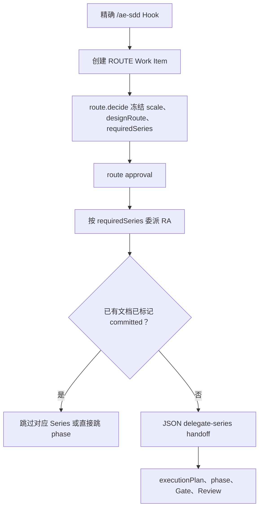

# ae-sdd Daemon 设计一致性审计报告

> 审计日期：2026-07-31
>
> 审计对象：`release` 分支当前 working tree，基线提交 `a118aacc824f`
>
> 目标基线：[`ae-sdd-design.md`](ae-sdd-design.md) 与 [`ae-sdd-daemon-design.md`](ae-sdd-daemon-design.md)
>
> 审计性质：静态设计与实现一致性审计，不包含代码修改和发布判定

---

## 1. 执行结论

当前 daemon **确实存在多余实现，也存在明显设计漂移**，但两者的主要来源不是可靠性基础设施过度建设，而是：

1. **旧流程语义尚未退出**：生产链路仍以“先冻结最终 route，再执行 RA”为中心，并允许既有文档直接跳过 RA。
2. **两套编排中心并存**：类型化 `SeriesPlan/ControlPlaneRuntime` 已经存在，但生产路径仍由 `business.rs` 中的 JSON handoff 驱动。
3. **身份与关系模型未落地**：现有 Work Item、文档树和 delegation 各自有局部身份，但还没有独立的 Flow Run、Series Run、Document Version 和跨 Work Item Spec graph。
4. **上下文与监督停留在 Series 边界**：child 能被安全创建、claim、报告和 collect，但没有得到设计要求的 Series 事务和前提文档集合，daemon 也没有记录 Series 内部子节点。
5. **部分固定流程属于过度或错位实现**：微任务被强制生成 CodingPlan；无 Story 的微/小任务也固定经过 TestCase phase；Story Series 又同时承担 Story 与 CodingPlan，无法表达应有的 `Story -> TestCase -> CodingPlan` 独立子链。

因此，当前最重要的动作不是删除 lease、Gate、review、compact 等基础设施，而是**收敛唯一流程语义中心，并用 RA-first、typed Series 和三类独立关系替换旧编排路径**。

### 1.1 总体判定

| 审计维度 | 当前状态 | 判定 |
| --- | --- | --- |
| Hook、Session、Work Item 启动 | 部分具备 | Hook 与幂等启动可用，但首次注入的是最终路由分析，不是启动评估事务 |
| RA 作为首个业务 Series | 不符合 | route 在 RA 前冻结；既有 PRD 可把 RA 标为完成 |
| 微/小/中/大路由 | 不符合 | 微任务与小任务都进入 CodingPlan；大任务没有多个 Story 实例编排 |
| Story/TestCase/CodingPlan 子链 | 不符合 | TestCase 被静态加入无 Story 路线，Story 与 CodingPlan 又被混在同一 Series；缺少按 Story 一一绑定的独立三段链 |
| `self_update/implementation` | 缺失 | 没有进入 route/state/Series 的 typed 任务类型 |
| 口述、Demo、PRD 融合 | 缺失 | 没有 typed source、逐条追踪或 `RequirementConflict` |
| Flow/Series 身份与流程树 | 部分具备 | 有 Work Item、SeriesId 合同和 delegation，但无生产 FlowRunId/SeriesRunId 和子节点树 |
| Spec 身份与关系图 | 不符合 | 只有单 Work Item 内的读取时树投影，没有稳定版本身份和跨 Work Item 图 |
| child 委派安全 | 基础良好 | Host ACK、claim、attestation、grant、结果校验均应保留 |
| Series 上下文注入 | 不符合 | briefing 过于简单，Root-to-Series `assetRefs` 为空，未绑定 Series 事务 |
| Series 监督 | 部分具备 | 有 delegation 生命周期和恢复，但没有 Series 内进度节点及 pending outputs |
| Gate、Evidence、Review、恢复 | 基础良好 | 属于生产 daemon 必需能力，不应删除 |

---

## 2. 审计范围与口径

### 2.1 目标流程

本次审计采用以下目标语义：

其中，“启动评估”只是 provisional proposal；只有 RA 完成、冲突关闭并经用户批准后，工程 route 才能成为权威事实。

### 2.2 当前实际流程

两者的核心差异不是节点命名，而是**最终 route 的权威输入发生在 RA 前还是 RA 后**。

### 2.3 审计限制

- 当前 working tree 含有未提交的 runtime、delegation、host 和 API 合同修改，因此本报告描述的是“当前本地实现”，不等同于已发布版本。
- 本次没有执行测试套件。审计目标是设计与代码结构对照，且没有修改生产代码。
- 对“未实现”结论采用了类型、生产调用点、持久化字段和测试行为四类静态证据交叉核对。

---

## 3. 主要发现

### F-01 P0：最终工程路由在 RA 前冻结

**证据**

- `ProcessPhase` 顺序为 `Initialized -> RouteSelected -> RequirementAnalyzed`：[`lifecycle.rs`](../../crates/ae-sdd-domain/src/lifecycle.rs#L4)。
- 三条 transition chain 都把 `RouteSelected` 放在 RA 之前：[`transition.rs`](../../crates/ae-sdd-policy/src/transition.rs#L9)。
- `RouteEngine::decide` 直接根据 impact facts 产出 `scale/designRoute/requiredSeries`：[`route.rs`](../../crates/ae-sdd-flow/src/route.rs#L43)、[`route.rs`](../../crates/ae-sdd-flow/src/route.rs#L182)。
- 真实 bootstrap 测试先调用 `route.decide`，之后才得到 `requirement-analysis` delegation：[`bootstrap.rs`](../../crates/ae-sdd-integrations/tests/typed_operations_cli_e2e/bootstrap.rs#L243)、[`bootstrap.rs`](../../crates/ae-sdd-integrations/tests/typed_operations_cli_e2e/bootstrap.rs#L297)、[`bootstrap.rs`](../../crates/ae-sdd-integrations/tests/typed_operations_cli_e2e/bootstrap.rs#L338)。
- `SeriesPlanner` 只有 route 已批准后才允许运行任何 Series：[`series.rs`](../../crates/ae-sdd-flow/src/series.rs#L50)。

**影响**

RA 无法改变最终路线，只能在已经冻结的路线内补文档。启动时的低信息判断因此被错误提升为工程 authority，与目标设计中的 provisional assessment 相反。

**必须调整**

1. 新增独立的 `BootstrapAssessment` 合同，只保存 `taskKindProposal/scaleProposal/inputSources/facts/uncertainties`。
2. 将主链调整为 `Initialized -> AssessmentRecorded -> RequirementAnalyzing -> RequirementAnalyzed -> RouteProposed -> RouteApproved`。
3. `RouteEngine` 只接受经验证的 RA result、风险事实、Spec bindings 和用户裁决，不再直接消费首轮 Agent 猜测作为最终依据。
4. 在 RA 完成前禁止生成最终 `selectedDesign/requiredSeries`，只允许生成 RA SeriesPlan。

**迁移后删除**

- 删除 `analyze-route` 作为最终 route 决策入口的语义。
- 删除“route approval 是 RA Series 前置条件”的判断。

---

### F-02 P0：采用既有文档会绕过 RA 和正常 phase transition

**证据**

- `adopt_provided_documents` 将 adopted 文档直接标记为 generation-complete，并可把根 phase 跳到 `requirement-analyzed/dr-generated/story-generated`：[`business.rs`](../../crates/ae-sdd-integrations/src/business.rs#L4017)、[`business.rs`](../../crates/ae-sdd-integrations/src/business.rs#L4037)、[`business.rs`](../../crates/ae-sdd-integrations/src/business.rs#L4215)。
- adopted PRD 会把 `routeDocuments.RA` 直接设为 `true`：[`business.rs`](../../crates/ae-sdd-integrations/src/business.rs#L4081)。
- 测试明确把“adopted series 被跳过”当作期望行为：[`provided_documents_adoption.rs`](../../crates/ae-sdd-integrations/tests/provided_documents_adoption.rs#L376)。

**影响**

PRD、DR、Story 被混同为“本次 Series 已执行”。既有 PRD 只是 RA 的一个输入，不足以证明当前口述补充、Demo、范围变化和冲突已经被分析。

**必须调整**

- 将“文档存在”建模为 `DocumentBinding`，不要建模为 `SeriesCompleted`。
- 采用既有 RA 时仍创建新的 RA SeriesRun；该 run 可以引用旧 RA 并产出新版本、补充文档或“本次输入与既有结论一致”的验证结果。
- 所有 adopted Spec 只影响 context 和所需输出，不直接修改主 phase。

**必须删除**

- 删除 adoption 时写入 `routeDocuments.RA=true` 的行为。
- 删除 adoption 时直接写入根 phase 的行为。
- 删除“文档已存在等于对应 Series 已完成”的判断。

---

### F-03 P0：生产环境存在两套编排中心

**证据**

- 仓库已有类型化 `SeriesPlan`、`SeriesReceipt`、`SeriesPlanner` 和 `ControlPlaneRuntime`：[`series.rs`](../../crates/ae-sdd-contracts/src/series.rs#L634)、[`series.rs`](../../crates/ae-sdd-flow/src/series.rs#L10)、[`control.rs`](../../crates/ae-sdd-flow/src/control.rs#L101)。
- `FlowSupervisor::decide_control` 能持久化 typed control decision：[`flow_supervisor.rs`](../../crates/ae-sdd-runtime/src/flow_supervisor.rs#L199)。
- 静态调用核对显示，`decide_control` 目前只在 `flow_supervisor.rs` 自身测试中使用，没有接入生产 request/delegation 路径。
- 生产 handoff 由 `route_handoff_action` 读取 JSON `requiredSeries` 和 `routeDocuments` 布尔值后构造 `delegate-series`：[`business.rs`](../../crates/ae-sdd-integrations/src/business.rs#L4832)。
- runtime 再把该 JSON action 转成另一个 `FlowDelegationIntent`：[`service_host.rs`](../../crates/ae-sdd-runtime/src/service_host.rs#L8)、[`service_host.rs`](../../crates/ae-sdd-runtime/src/service_host.rs#L540)。

**影响**

同一流程同时受 typed planner、phase reducer、JSON handoff 和 document marker 四套规则影响。任何路由修复都可能只更新其中一套，产生“合同正确但生产未使用”或“测试通过但实际路径仍旧”的假闭环。

**必须调整**

- 选择 `FlowRuntime -> SeriesPlanner -> ControlPlaneRuntime -> DelegationSupervisor` 作为唯一生产链路。
- `flow.next` 返回 typed control projection；Root 只提交 decision digest，daemon 从已冻结 SeriesPlan 派生 delegation。
- 文档提交、Series receipt 和 phase transition 都通过同一事件流回到 reducer。

**迁移后删除**

- 删除 `route_handoff_action`、`decorate_route_handoff` 中的业务编排分支。
- 删除临时 `flow-delegation-intent/v1` JSON 权威记录，或将其升级为 `SeriesRunDispatch` 的 typed projection。
- 删除 `routeDocuments` 作为编排完成权威的用途。

**应保留**

- 不要删除 `SeriesPlan/SeriesPlanner/ControlPlaneRuntime`。它们是应被接入生产的正确基础，而不是多余代码。

---

### F-04 P1：规模路由与 Story-TestCase-CodingPlan 子链不一致

**证据**

- micro 和 small 都映射到 `DesignRoute::CodingPlan`，required Series 都是 RA + coding-plan：[`route.rs`](../../crates/ae-sdd-flow/src/route.rs#L189)。
- Story handoff 要求同一个 Story Series 同时产出 `STORY` 和 `CODING_PLAN`：[`business.rs`](../../crates/ae-sdd-integrations/src/business.rs#L4875)。
- large route 只持有一个字符串 `story` 和一个布尔 `routeDocuments.STORY`，不能表达多个 Story 实例。
- 三条静态 phase chain 都无条件包含 `TestcaseGenerated`：[`transition.rs`](../../crates/ae-sdd-policy/src/transition.rs#L9)。
- 权威设计要求 TestCase 只属于 Story 路线，并固定处于 Story 与 CodingPlan 之间；微/小任务无 Story，因此不应进入 TestCase Series。

**目标映射**

| 规模 | 必经 Series | 最低设计产物 |
| --- | --- | --- |
| micro | RA | RA + approved `state.executionPlan`，无独立 CodingPlan Markdown |
| small | RA + CodingPlan | RA + CodingPlan Spec |
| medium | RA + Story + TestCase + CodingPlan | RA + Story + 对应 TestCase + CodingPlan；编码前仍需 approved `state.executionPlan` |
| large | RA + DR + N × (Story + TestCase + CodingPlan) | RA + DR + Stories；每个 Story 有独立 TestCase、CodingPlan 和 approved plan |

**必须调整**

- 为 micro 增加 `ExecutionPlan` 或等价的非持久化设计 route，不能复用 `CodingPlan`。
- Story Series 只负责 Story，不应隐式兼任 CodingPlan Series。
- large route 必须创建多个具备独立 `SeriesId/SeriesRunId` 的 Story plans，而不是一个 `STORY=true` 标记。
- 为每个 Story 创建独立且一一绑定的 TestCase Series；只有 TestCase receipt 验证通过后，才能规划对应 CodingPlan。
- 从 micro/small 路线删除 TestCase；保留独立 Test 执行与 evidence，不能用它们替代实现前的 TestCase 设计。

---

### F-05 P1：任务类型和 RA 多来源模型未进入领域合同

**证据**

- `DesignRoute` 只有 `Dr/Story/CodingPlan`，没有 self-update 或 update route：[`lifecycle.rs`](../../crates/ae-sdd-domain/src/lifecycle.rs#L27)。
- `RouteInput` 虽然携带 `requestedIntent/availableArtifacts`，但对外 getter 和 `RouteEngine::decide` 实际只消费 impact facts、confidence 和 approval：[`series.rs`](../../crates/ae-sdd-contracts/src/series.rs#L131)、[`route.rs`](../../crates/ae-sdd-flow/src/route.rs#L43)。
- 生产代码中没有 `taskKindProposal`、`inputSources`、`RequirementConflict` 或 oral/prototype typed source；`taskKind` 只出现在 JSON handoff 的 Series 名称中。

**影响**

- ae-sdd 自更新无法走专用 Update Series。
- 口述、Demo、PRD 的七种非空组合无法被可验证地记录。
- 来源冲突只能由 Agent 在自然语言中处理，daemon 无法进入 `awaiting_user` 并阻止 route。

**必须调整**

- 新增 `TaskKind::{SelfUpdate, Implementation}`。
- 新增 `RequirementSourceRef::{OralTurn, PrototypeArtifact, PrdDocument}` 和逐条 requirement trace。
- 新增 `RequirementConflict`、用户裁决事件和 `awaiting_user` Series 状态。
- Update Series 仍复用四档规模和最低 Spec 规则，只额外加载全局设计、实现架构、constraints 与分发一致性检查。

---

### F-06 P1：三类关系尚未分离，运行身份不足

**证据**

- 当前 state 创建 `stateUuid/stateMachineId/stateMachineName`，UUID 为 v4 或由幂等 digest 截断得到：[`business.rs`](../../crates/ae-sdd-integrations/src/business.rs#L3760)、[`business.rs`](../../crates/ae-sdd-integrations/src/business.rs#L4328)。
- 生产 `FlowDelegationIntent` 只有 work item、decision、series kind、revision 和 artifacts，没有 `flowRunId/seriesId/seriesRunId`：[`service_host.rs`](../../crates/ae-sdd-runtime/src/service_host.rs#L8)。
- `DelegationId` 已由 daemon 幂等生成，这是正确的委派边身份：[`delegation_supervisor.rs`](../../crates/ae-sdd-runtime/src/delegation_supervisor.rs#L272)。
- 全仓静态搜索未发现 `FlowRunId`、`SeriesRunId` 或 `DocumentVersionId` 类型。

**影响**

Work Item、一次流程运行、逻辑 Series、Series 重试和 Agent delegation 无法独立查询。当前 delegation ID 不能替代 SeriesRunId，因为一次 Series 重试可能产生新的物理运行和新的 delegation，但仍属于同一逻辑 Series。

**必须调整**

- 保留 `WorkItemId` 作为稳定业务任务身份。
- 新增时间有序 `FlowRunId`；`createdAt`、可信 `initiatorSessionId/AgentId` 和显示名称作为独立审计字段，不编码进安全身份。
- 新增稳定 `SeriesId` 与每次尝试独立的 `SeriesRunId`。
- delegation 记录绑定 `seriesRunId`；重试创建新 run 和新 delegation，并保留 `retryOf`。
- 执行流程树、Spec graph、delegation tree 使用独立主键和边类型。

**不建议照字面实现的部分**

不要用“当前时间 + Agent 显示名”的字符串拼接直接生成安全 UUID。Agent 显示名可变且可自报；应使用 daemon 铸造的 UUID 与可信 session identity，时间和名称单独保存用于检索。

---

### F-07 P1：现有文档树不是稳定 Spec graph

**证据**

- `providedDocuments.docId` 由调用方提交：[`registry.rs`](../../crates/ae-sdd-operations/src/registry.rs#L217)。
- 该值被直接当作 PRD/DR/Story 容器业务 ID：[`business.rs`](../../crates/ae-sdd-integrations/src/business.rs#L3912)。
- `derive_document_tree` 只是从单个 Work Item state 临时投影 PRD、DR 和 Story 层级：[`business.rs`](../../crates/ae-sdd-integrations/src/business.rs#L4229)。
- 当前树没有 document version、content digest、关系类型、跨 Work Item 查询或 graph membership。

**影响**

路径重命名、内容更新、复制分支、多个 Work Item 引用同一 Spec、一个 Story 引用多个 RA/DR 等场景无法可靠表达。UI 树投影被误当成领域关系树。

**必须调整**

- 建立 daemon 管理的 `DocumentId` 注册表和不可变 `DocumentVersionId/contentDigest`。
- 由 path 解析或铸造 ID，调用者只能提供候选路径和期望 ID，不能自行授予身份。
- 建立有向 Spec graph，至少支持 `analyzes/drives/decomposes_to/implements/references/supersedes/derived_from`。
- Work Item 通过关联边挂靠 graph，不能复制节点。
- 保留当前 `documentTree` 作为只读 UI projection，但从真实 graph 生成。

**应保留**

- workspace-relative path 校验、canonical containment、文件存在性验证和 sha256 计算应原样保留。

---

### F-08 P1：Series 事务和上下文注入没有接通

**证据**

- Root-to-Series briefing 只包含 “Execute the daemon-committed X Series”，最多追加交付物名称：[`service_host.rs`](../../crates/ae-sdd-runtime/src/service_host.rs#L644)。
- 同一 payload 明确设置 `asset_refs: None`：[`service_host.rs`](../../crates/ae-sdd-runtime/src/service_host.rs#L653)。
- production project context 只包含 flow projection、nextAction 和最多两个基础资产类型：constraints index 与按 phase 映射的 methodology skill：[`business.rs`](../../crates/ae-sdd-integrations/src/business.rs#L980)、[`business.rs`](../../crates/ae-sdd-integrations/src/business.rs#L6589)、[`business.rs`](../../crates/ae-sdd-integrations/src/business.rs#L6624)。
- phase-to-skill 映射以“已经达到的 phase”选择 SKILL。例如 `requirement-analyzed` 才返回 RA skill，无法可靠表达当前待执行 Series。
- `ae-sdd-context::ContextService` 已有 typed bundle 和 digest/proof 基础，但静态调用核对显示目前只在该 crate 测试中使用：[`service.rs`](../../crates/ae-sdd-context/src/service.rs#L17)、[`service.rs`](../../crates/ae-sdd-context/src/service.rs#L453)。
- 全仓没有生产 `InstructionEnvelope` 类型。

**影响**

Story Agent 无法被证明拿到了 RA、所属 DR、产品原型、Story 模板和生成规范。当前 context 是“Work Item phase 上下文”，不是“Series 事务上下文”。

**必须调整**

- 以 `SeriesPlan` 派生 typed `InstructionEnvelope`，绑定 flow/series/run/delegation IDs、revision、policy digest、deadline、transaction、deliverables 和 allowed actions。
- 以 `seriesKind + dependencies + document bindings` 构造 context bundle，不再以全局 phase 猜 SKILL。
- 将现有 `ContextService` 接入生产，扩展为 RA/DR/Story/TestCase/CodingPlan/Coding/Test/Review 的最小前提集合。
- 对缺少但不适用的输入显式记录 `not_applicable`；缺少必需输入时阻塞 Series。

**迁移后删除**

- 删除 `phase_skill_path` 作为 child methodology authority 的用途。
- 删除通用字符串 briefing 作为 Series 事务的替代品。

---

### F-09 P1：Series 监督只有边界状态，没有流程子节点

**证据**

- typed `SeriesReceiptStatus` 只有 `Planned/Running/ResultStaged/Collected/Cancelled/Failed`：[`series.rs`](../../crates/ae-sdd-contracts/src/series.rs#L905)。
- delegation lifecycle 更细到 `spawning/running/result-staged/artifacts-validated/memory-cleaned/completed/cancelled`，但仍是委派与结果校验边界：[`delegation_supervisor.rs`](../../crates/ae-sdd-runtime/src/delegation_supervisor.rs#L301)、[`delegation_supervisor.rs`](../../crates/ae-sdd-runtime/src/delegation_supervisor.rs#L684)。
- `FlowEventKind::SeriesCompleted` 不携带 series ID、run ID、节点或产物；reducer 收到它后只生成 compact 建议：[`model.rs`](../../crates/ae-sdd-flow/src/model.rs#L135)、[`runtime.rs`](../../crates/ae-sdd-flow/src/runtime.rs#L388)。
- 全仓没有 `currentMainNode/currentSubNode/series.progress/awaiting_user` 的生产合同。

**影响**

daemon 可以证明 child 是否启动和是否提交了结果，但无法回答“RA 正在 resolve-spec、collect-context、draft 还是 await-user”，也无法按 Series 规则实时纠偏。

**必须调整**

- 将 `SeriesRun` 生命周期与 delegation 生命周期分开。
- 新增 typed `SeriesProgressEvent`，至少携带 `seriesRunId/subNode/status/pendingActions/pendingOutputs/inputFingerprint/eventSeq`。
- 为不同 Series 冻结允许的子节点图和 transition，不接受任意字符串进度。
- `FlowSupervisor` 投影 `currentMainNode/currentSeriesId/currentSeriesRunId/currentSubNode`。
- `SeriesCompleted` 必须绑定具体 SeriesRun 和 validated receipt，不能只是无身份边界信号。

---

### F-10 P1：`inputFingerprint` 被错误替换为 decision digest

**证据**

- 创建 `FlowDelegationIntent` 时把 `decision_digest` 同时赋给 `input_fingerprint`：[`service_host.rs`](../../crates/ae-sdd-runtime/src/service_host.rs#L588)。
- 读取时又要求两者相等：[`service_host.rs`](../../crates/ae-sdd-runtime/src/service_host.rs#L628)。

**影响**

decision digest 证明“daemon 做出了哪个决定”，input fingerprint 证明“这个决定和 child 输入基于什么状态、文档和规则”。两者相等会丢失输入新鲜度语义，使 state 或 Spec 变化无法被独立识别。

**必须调整**

- `inputFingerprint` 由 state revision、DocumentVersion refs、context bundle、policy digest 和 inventory generation 规范计算。
- `decisionDigest` 单独绑定 route/control decision。
- delegation、InstructionEnvelope、ChildResult 和 Gate 同时携带并分别校验两个 digest。

---

### F-11 P1：权威设计已收敛，constraints 和当前实现尚未同步

**证据**

- 全局设计与 daemon 专题设计现已统一采用“启动评估 -> RA -> 工程路由”，并统一 `Story -> TestCase -> CodingPlan` 语义。
- `constraints/api.md` 声明 `workitem.create.entryNode` 只允许 PRD/DR/STORY：[`api.md`](../../constraints/api.md#L95)。
- 当前实现却允许 ROUTE/PRD/DR/STORY：[`business.rs`](../../crates/ae-sdd-integrations/src/business.rs#L3655)。
- 精确 `/ae-sdd` bootstrap 又实际创建 `entryNode=ROUTE`：[`service_hook_context.rs`](../../crates/ae-sdd-runtime/src/service_hook_context.rs#L236)。

**影响**

设计裁决已经明确，但 API constraint 与生产行为仍有两种入口模型。继续实现前必须先把约束合同同步到统一 intake，避免代码继续继承旧 entry-node 路由语义。

**必须调整**

1. 保持全局设计和 daemon 专题设计中的 `BootstrapAssessment`、RA-first、`EngineeringRoute` 与 TestCase 子链定义不变。
2. 冻结统一 Work Item intake，不再让 PRD/DR/STORY 入口直接决定主流程起点；这些值应变为输入/Spec binding 提示。
3. 同步更新 `constraints/api.md`、operation registry、domain enum、migration 和测试，再修改生产流程。
4. 按已冻结术语实现：micro 只有 `state.executionPlan`；small 使用正式 CodingPlan；有 Story 的路线固定经过对应 TestCase 后再进入 CodingPlan。

---

## 4. 应删除的实现

下表中的“删除”均指替代路径完成、数据迁移和兼容窗口结束后删除，不建议先删后补。

| 删除项 | 原因 | 替代物 |
| --- | --- | --- |
| `route_handoff_action` 的 JSON 业务编排 | 与 typed control plane 重复，且依赖字符串和布尔 marker | `SeriesPlanner + ControlPlaneRuntime` |
| `routeDocuments` 作为 Series 完成权威 | 不能表达 run、版本、digest、校验或重试 | validated `SeriesReceipt` + `DocumentBinding` |
| adopted document 直接跳 phase/跳 RA | 文档存在不等于本次分析完成 | RA SeriesRun + adopted DocumentVersion input |
| `entryNode=PRD/DR/STORY` 直接预设 scale/design route | 把文档入口误作工程路线 | 统一 intake + Spec binding hints |
| micro 的独立 CodingPlan 文档要求 | 超出最低充分流程 | approved `state.executionPlan` |
| Story Series 同时产出 Story 和 CodingPlan | 混合两个事务，无法独立监督和重试 | 单一职责 SeriesPlan |
| micro/small 以及其他无 Story route 的 TestCase phase | TestCase 只属于 Story 与 CodingPlan 之间 | 每个 Story 一一绑定的必经 TestCase Series |
| phase 推断 child SKILL 的 authority | phase 不能唯一表示待执行事务 | SeriesPlan.methodologyRef |
| generic briefing 作为流程事务 | 缺少输入、权限、交付和完成合同 | typed `InstructionEnvelope` |
| `flow-delegation-intent/v1` 中 `inputFingerprint=decisionDigest` | 混淆两个不同证明维度 | 分离的 control decision 与 context fingerprint |

可在兼容迁移完成后继续评估删除 `stateMachineName/stateMachineId/stateUuid` 的重复别名，但在 `WorkItemId/FlowRunId` 和旧 state 迁移策略冻结前，不应直接移除。

---

## 5. 应保留不变的能力

以下能力虽然超出最初口述的简化流程，但它们是 production daemon 的必要条件，不属于多余实现：

| 保留能力 | 保留理由 |
| --- | --- |
| Hook fast path、event ID 去重和 engaged fail-closed | 防止重复启动、超时放行和本地 fallback 分叉 |
| Workspace/Session/Turn/WorkItem actor 边界 | 提供可信身份、顺序和恢复域 |
| revision、lease、fencing、CAS、幂等 receipt | 防止并发覆盖和重试重复 mutation |
| PREPARED/COMMITTED journal、fsync 和 event checkpoint | 保证项目文件与审计事实可恢复 |
| capability、role、lineage 和最小 grant | 防止 Root、Series、Task、Reviewer 越权 |
| Host action ACK 与 child claim/attestation 分离 | ACK 不能伪装物理 Agent 已运行 |
| `root -> series -> task|reviewer` 最大深度 2 | 符合全局并行和独立 Review 边界 |
| 有界 `ChildResult`、artifact digest、cleanup receipt | 防止自然语言“完成”替代可验证结果 |
| ContextProjection 大小限制、delta/no-change 和 compact ACK/rehydrate | 控制上下文成本并保证 compact 可证明 |
| Gate 六态、freshness、evidence 和独立 Review | 防止 stale、infra error 或自审被当作成功 |
| daemon restart recovery、checkpoint 和 event replay | 防止未证明的 running 恢复为 completed |
| workspace-relative path containment 与 sha256 | 是文档注册和上下文引用的安全基础 |
| scheduler、deadline、backpressure 和 bounded queue | 防止 Hook 或单个 Agent 阻塞共享 daemon |
| source-read cache 与 Cargo 资源仲裁 | 可保留为独立执行资源优化，但不得参与业务 route 判定 |

### 5.1 保留但必须接入生产的基础

以下不是“原样不动”，而是应保留其方向并补齐生产 wiring：

- `SeriesPlan/SeriesReceipt/SeriesPlanner/ControlPlaneRuntime`
- `ae-sdd-context::ContextService` 与 `ContextBundleRef/LoadedContextProof`
- `FlowRuntime/FlowSupervisor` 的 pure reducer、event replay 和 checkpoint
- `DelegationSupervisor/HostCoordinator`

原则是扩展这些 typed contract 以承载 `FlowRunId/SeriesRunId/DocumentVersionId`，而不是另建第三套 JSON 编排。

---

## 6. 推荐调整顺序

### 阶段 0：先统一权威语义

1. 在全局设计中冻结“启动评估”和“工程路由”两个术语。
2. 冻结四档规模、最低 Spec 映射和 `Story -> TestCase -> CodingPlan` 子链。
3. 冻结 unified intake、TaskKind、DocumentId、FlowRunId、SeriesRunId 和 progress event。
4. 同步 constraints，解决 `entryNode` 与 CodingPlan 语义冲突。

退出条件：设计文档、API、数据库、分层和测试 constraints 不再互相矛盾。

### 阶段 1：建立身份和状态骨架

1. 新增 `FlowRunId/SeriesRunId/DocumentId/DocumentVersionId/SpecGraphId` newtype。
2. 将 Work Item、Flow Run、Series Run、delegation 和 document graph 分表/分 projection。
3. 增加 migration 和旧 state 兼容读取；不做隐式空状态重建。

退出条件：同一 Work Item 的多个 Flow Run、同一 Series 的重试和多个 Work Item 对同一 Document 的引用可分别查询。

### 阶段 2：切换为 RA-first

1. Hook 首次返回 `BootstrapAssessment` InstructionEnvelope。
2. 创建 Work Item/Flow Run 后只规划 RA。
3. RA 完成并关闭冲突后，才运行 EngineeringRoute 和用户批准。
4. 删除 adoption 跳 phase 行为。

退出条件：所有输入组合都先产生可审计 RA run，RA 前不存在最终 route。

### 阶段 3：接通 typed Series 控制面

1. 将 `ControlPlaneRuntime` 接入 `flow.next` 和 `delegation.create`。
2. 将 SeriesPlan 的 methodology、context、deliverables、grant 和 deadline 派生为 InstructionEnvelope。
3. 将 delegation 绑定 SeriesRun，并让 collect 生成带身份的 SeriesReceipt event。

退出条件：生产路径不再调用 JSON `route_handoff_action`。

### 阶段 4：补齐 Spec graph 与上下文

1. 建立 Document registry、version 和 graph edge operations。
2. 将现有路径 resolver 和 hash 校验接入 registry。
3. 按 Series 生成 RA/DR/Story/TestCase/CodingPlan/Coding/Test/Review context bundle。

退出条件：Story Agent 可验证地得到 RA、适用 DR、原型、模板和生成规范；文档移动不改变 DocumentId。

### 阶段 5：补齐监督并移除旧路径

1. 增加 SeriesProgressEvent、subnode reducer、awaiting-user 和 pending outputs。
2. 完成双读/影子对比和恢复测试。
3. 删除旧 JSON handoff、routeDocuments 权威、phase skill 推断、micro CodingPlan 和无 Story 的 TestCase 分支。

退出条件：只有一个生产流程决策中心，daemon 重启后可恢复到具体 Series 子节点。

### 6.1 级联修改核查

本次设计裁决会同时影响设计、合同、方法源、生成物和实现。下表区分“已完成的设计同步”和“进入实现工作流后必须完成的级联”，避免只改一处文字造成新的双 SSOT。

| 级联面 | 当前状态 | 必须保持或执行的调整 |
| --- | --- | --- |
| [`ae-sdd-design.md`](ae-sdd-design.md) | 本次已同步 | 保持 BootstrapAssessment -> RA -> EngineeringRoute、统一 intake、三类关系和四档规模映射 |
| [`ae-sdd-daemon-design.md`](ae-sdd-daemon-design.md) | 本次已同步 | 保持每个 Story 一一对应的 `Story -> TestCase -> CodingPlan` typed Series 子链 |
| [`ae-sdd-implementation-architecture.md`](ae-sdd-implementation-architecture.md) | 本次已同步 | 已把 route-first/entryNode/nested state 标为当前迁移基线，不再写成目标 authority |
| [`ae-sdd-monitor-design.md`](ae-sdd-monitor-design.md) | 本次已同步 | Monitor 改为读取 FlowRun/SeriesRun/subnode projection，并只把旧 phase 链作为 legacy projection |
| 本审计报告 | 本次已同步 | 删除项、保留项、迁移顺序和验收矩阵均采用右侧目标语义；TestCase 不再定义为条件 Series |
| [`constraints/README.md`](../../constraints/README.md)、[`api.md`](../../constraints/api.md)、[`layered-arch.md`](../../constraints/layered-arch.md)、[`database.md`](../../constraints/database.md) | 待正式实现流程 | 增加 TestCase/CodingPlan/Update Series 语义；统一 intake；冻结 FlowRun/SeriesRun/DocumentVersion/Spec graph/progress event 和 migration；移除 root route authority |
| [`source/SKILL.md`](../SKILL.md)、[`L2-DISCIPLINE.md`](../L2-DISCIPLINE.md)、[`HARNESS.md`](../HARNESS.md) | 待正式实现流程 | 删除 Route-first 和 small/micro 共用 CodingPlan；改为 RA-first 四档路线及 Story-TestCase-CodingPlan 子链 |
| [`story-writing-guide.md`](../standards/story/story-writing-guide.md) 与 TestCase/CodingPlan SKILL 源 | 待正式实现流程 | 删除“普通矩阵内嵌 Story、复杂时才独立 TestCase”和“独立文档按需”；TestCase 改为 Story 路线必经 Series，并冻结与 CodingPlan 的前置绑定 |
| requirement-analysis/document-storage fallback | 待正式实现流程 | 删除 adopted 文档直接写 phase、entryNode/nested-state 归入和三值 route；adoption 只创建 DocumentBinding，本次 SeriesRun 仍执行 |
| `source/standards/update-graph.json`、methodology catalog、门禁注册表 | 待正式实现流程 | 增加上述源文件、contracts、generated runtime 和测试的级联边及 fail-closed 一致性检查 |
| `dist/ae-sdd/**`、compiled runtime、各 harness 安装产物 | 待源与实现完成后生成 | 只通过编译/分发链重建，禁止手工修改；必须验证 route/subskills/gates/flow compact 一致 |
| Rust domain/contracts/policy/runtime/store/context/delegation/resources/monitor 与测试 | 待正式实现流程 | 按 F-01 至 F-11 和阶段 1~5 实施；先冻结 DTO/migration，再 RED-GREEN-REFACTOR、focused tests 和独立 Review |

因此，当前不存在遗漏的**设计裁决**：四份设计文档和本报告已经统一。仍未修改的条目是明确登记的实现级级联，不应标记为完成，也不能通过只改 SKILL prose 或生成物绕过。

---

## 7. 最低验收矩阵

| 编号 | 验收场景 | 必须结果 |
| --- | --- | --- |
| A-01 | 新 `/ae-sdd` Hook | 返回启动评估事务，不冻结最终 route |
| A-02 | 口述、Demo、PRD 七种非空组合 | 全部进入 RA，逐条保留 source ref |
| A-03 | 来源冲突 | 进入 `awaiting_user`，用户裁决前无最终 route |
| A-04 | adopted PRD | 绑定 DocumentVersion，但仍执行本次 RA |
| A-05 | micro | 无独立 CodingPlan 文档，有 approved executionPlan |
| A-06 | small | 创建或引用 CodingPlan Spec |
| A-07 | medium | 创建或引用 Story，并严格执行对应 `TestCase -> CodingPlan`，不强制 DR |
| A-08 | large | 创建或引用 DR，并为每个 Story 生成独立 `Story -> TestCase -> CodingPlan` SeriesRun 链 |
| A-09 | self-update | RA 后进入 Update Series，并加载全局设计与分发约束 |
| A-10 | Story/TestCase/CodingPlan child | Story 收到 RA/DR/prototype；TestCase 收到对应 Story；CodingPlan 收到同一 Story 的已批准 TestCase 及各自 digest |
| A-11 | Host 只 ACK 未 claim | delegation 保持 spawning，Series 不得 running |
| A-12 | Series progress | 可查询 main node、series run、subnode、pending outputs |
| A-13 | Series 重试 | 新 SeriesRun/Delegation，不复制逻辑 Series 或 Spec |
| A-14 | 文档重命名 | DocumentId 不变，path 更新 |
| A-15 | 文档内容修改 | 新 DocumentVersionId，旧版本可追踪 |
| A-16 | 同一 Spec 被第二个 Work Item 采用 | 挂靠现有 graph，不复制文档节点 |
| A-17 | state/Spec/policy 变化 | 旧 envelope、Gate、ChildResult 变 stale，不能推进 |
| A-18 | daemon 重启 | 未证明的 running 进入 interrupted/stale，不恢复为 completed |

---

## 8. 最终处置意见

### 8.1 应立即调整

- 将 route 拆为 provisional 启动评估与 RA 后权威工程路由。
- 禁止任何 adopted Spec 跳过 RA 或直接推进主 phase。
- 修正四档规模映射，取消 micro 独立 CodingPlan 和无 Story 路线的 TestCase，并建立必经的 `Story -> TestCase -> CodingPlan` 子链。
- 增加 TaskKind、多来源需求、冲突、FlowRun/SeriesRun/DocumentVersion 和 Spec graph。
- 接通 typed Series control plane、ContextService 和 Series progress supervision。
- 分离 input fingerprint 与 decision digest。
- 先修正文档/constraints 冲突，再实施 schema 和代码迁移。

### 8.2 替代完成后删除

- JSON `route_handoff_action` 编排和临时 `flow-delegation-intent/v1` 语义。
- `routeDocuments` 布尔完成权威。
- adoption 跳 phase、跳 RA 行为。
- entry node 直接决定 scale/design route 的行为。
- phase 推断 SKILL、generic briefing 替代 Series 事务的行为。
- Story/CodingPlan 混合 Series、无 Story 路线的 TestCase 分支，以及任何绕过 Story 对应 TestCase 直接生成 CodingPlan 的分支。

### 8.3 保留不变

- Hook 幂等与 fail-closed。
- actor、lease、revision、fencing、journal 和 checkpoint。
- capability、三层 Agent 边界、Host ACK/claim/attestation。
- 有界上下文、compact、ChildResult、artifact/cleanup 校验。
- Gate 六态、freshness、evidence、独立 Review 和恢复机制。
- 路径 containment、digest、deadline、backpressure 和资源仲裁。

最终判断：**daemon 当前不是“功能普遍做多了”，而是“可靠性底座基本正确，核心流程语义仍旧，且新旧编排重复”。应保留底座，替换语义中心，完成迁移后删除旧路径。**
