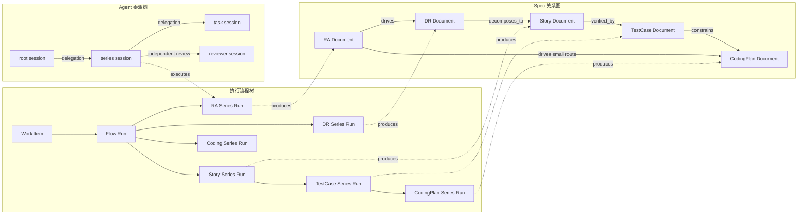
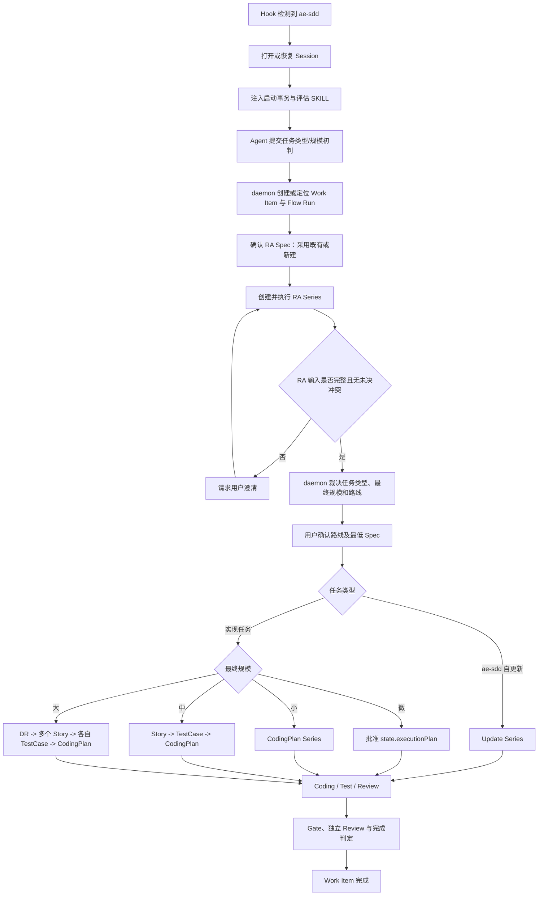
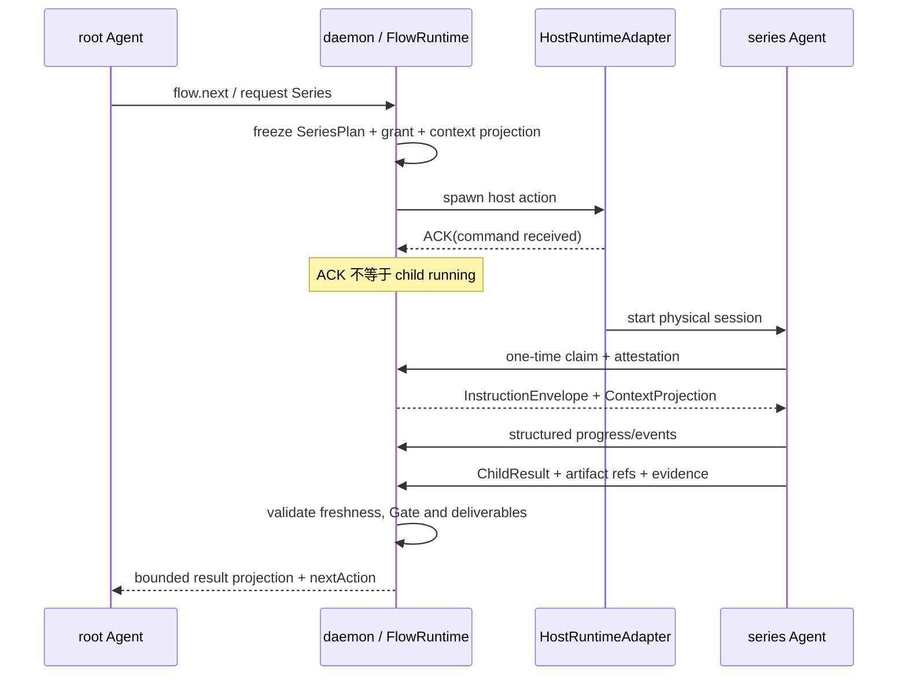

# ae-sdd Daemon 设计文档

> 本文是 [`ae-sdd-design.md`](ae-sdd-design.md) 全局设计之下的 **daemon 专题设计**，与全局设计同步维护。
> [`ae-sdd-design.md`](ae-sdd-design.md) 继续定义 ae-sdd 的全局能力、流程语义与系统边界；
> 本文在该全局设计之下，细化 daemon 如何接管任务、编排 Series、管理 Spec 关系、委派 Agent、
> 注入上下文并持久化进度。本文不替代、不降级、也不将全局设计标记为历史资料。

---

## 1. 文档定位

### 1.1 设计体系中的位置

| 文档 | 负责回答的问题 |
| --- | --- |
| [`ae-sdd-design.md`](ae-sdd-design.md) | ae-sdd 整体提供什么能力、采用什么全局流程语义 |
| 本文 | daemon 如何把全局语义落实为可恢复、可监督、可审计的运行流程 |
| [`ae-sdd-implementation-architecture.md`](ae-sdd-implementation-architecture.md) | 当前代码分层、模块职责与运行时数据流落在哪里 |
| [`constraints/`](../../constraints/README.md) | API、数据库、安全、分层、测试等工程合同的唯一权威定义 |
| [`source/SKILL.md`](../SKILL.md) 及子 SKILL | Agent 在各 Series 中采用的方法、模板和输出合同 |

本文只定义 daemon 领域语义和组件协作。具体 wire method、DTO、错误码、SQLite 表、migration、
安全参数和测试门槛分别以 [`api.md`](../../constraints/api.md)、
[`database.md`](../../constraints/database.md)、[`security.md`](../../constraints/security.md) 和
[`testing.md`](../../constraints/testing.md) 为准。本文与这些权威资产发生冲突时，应修正文档或上游合同，
不得由 Agent 选择性绕过。

### 1.2 目标

daemon 必须实现以下目标：

1. 将任意 ae-sdd 任务纳入一个独立、可恢复的 Work Item，而不是依赖单次对话记忆。
2. 统一以 Requirement Analysis（RA）作为首个业务 Series，再根据 RA 事实裁决后续路线。
3. 按任务类型和规模选择最低充分流程，避免微任务过度设计，也避免复杂任务欠设计。
4. 分离执行流程、Spec 关系和 Agent 委派三类关系，保证每类关系可独立查询和审计。
5. 向每个 Agent 注入其当前事务所需的 SKILL、上下文和权限，而不是注入整个项目或完整子会话。
6. 以确定性状态机、事件、Gate 和结构化结果监督流程，禁止依靠 Agent 自报“已完成”。
7. 支持 daemon 重启、Agent 重连、重复 Hook、Host ACK 丢失和外部文件变更后的安全恢复。

### 1.3 非目标

- daemon 不生成或保存 Agent 的内部推理过程。
- Hook 不承担文档扫描、Gate 执行、子进程等待、Spec 解析或项目 mutation。
- root Agent 不直接成为全局流程状态的权威写入者。
- ae-sdd Monitor 不参与流程裁决；它仍是只读投影，边界见
  [`ae-sdd-monitor-design.md`](ae-sdd-monitor-design.md)。
- 本文不在设计层复制具体 SQL schema、RPC schema 或安全密钥格式。

---

## 2. 核心设计原则

### 2.1 RA 是统一业务入口

所有任务都必须先经过 RA，再进入其他业务 Series。这里需要区分两个概念：

> 术语以 [`ae-sdd-design.md`](ae-sdd-design.md) §2 为准，本节只作 daemon 侧展开，不另立定义。

- **启动评估（`BootstrapAssessment`）**：Hook 触发后，对任务类型、预估规模和输入来源做初步判断，
  目的是初始化 Work Item 和选择 RA 的上下文，不构成最终工程路线。
- **工程路由（`EngineeringRoute`）**：RA 完成后，daemon 根据经验证的需求、影响面、风险和已有 Spec
  裁决自更新、DR、`Story -> TestCase -> CodingPlan`、独立 CodingPlan 或 executionPlan 路线。

因此，“先分类再 RA”与“所有业务流程先走 RA”并不冲突：分类只是启动证据，RA 才是首个业务 Series；
在 RA 完成前，daemon 不得把预估规模固化为最终设计路线。

### 2.2 daemon 是流程权威，Agent 是语义执行者

- Agent 负责理解需求、产出 Spec、编码、测试、Review 和报告结构化事实。
- FlowRuntime 根据已提交 state、ordered events、policy digest 和 input fingerprint 计算唯一下一步。
- WorkItemActor 是单个 Work Item mutation 的唯一进程内 owner。
- FlowSupervisor 监督 Series 和全局节点，不从 prompt 文本猜测流程是否完成。
- 用户负责需求冲突、Spec 采用、路线、计划和关键设计结果的批准。

Agent 对任务类型、规模或完成状态的报告都是 **proposal/evidence**，不是越过 daemon 和 Gate 的 authority。

### 2.3 最小充分流程

任务规模只决定 RA 之后的流程深度，不决定是否需要 RA、Plan-first、测试或独立 Review。
任何路线都必须保留经批准的 `state.executionPlan`；微任务只是免除额外的独立 Markdown CodingPlan，
不是免除计划、验证和 Review。

TestCase 是 **Story 与 CodingPlan 之间的独立子 Series**。凡路线中存在 Story，必须对每个 Story 依次执行
`Story -> TestCase -> CodingPlan`；没有 Story 的微任务和小任务不创建 TestCase Series。TestCase 负责把
Story 的 AC、契约、不变量和风险转化为有界、可追踪的验证设计；它不能被 Story 内嵌矩阵、CodingPlan
章节或实际 Test/evidence 执行替代。

### 2.4 身份、位置和内容版本分离

- ID 表示稳定逻辑身份。
- path 表示当前定位信息。
- digest 表示某一内容版本。
- createdAt 和 Agent 名称只用于审计与展示，不承担身份唯一性或授权语义。

禁止用文件 inode、绝对路径、Agent 自报名称或“时间 + 名称”的字符串拼接直接作为安全身份。

---

## 3. 组件与角色边界

| 组件/角色 | 核心职责 | 禁止事项 |
| --- | --- | --- |
| Hook Adapter | 识别 ae-sdd 触发、打开/恢复 session、提交 Hook event、映射 daemon decision | 扫描项目、执行 Gate、写 state、直接 spawn 子 Agent |
| daemon RPC 层 | 鉴权、schema 校验、幂等、deadline、typed error | 解释业务语义或自行推进 phase |
| Workspace/Session/Turn Actor | 管理 workspace、物理 session、turn 和重连 | 接受 Agent 自报 role/lineage 作为授权依据 |
| WorkItemActor | 串行化单 Work Item mutation，执行 revision/lease/fencing 校验 | 在长 I/O 期间占用 mutation 临界区 |
| FlowRuntime | 计算合法 `nextAction` 和 decision digest | 读取 prompt 猜流程、直接调用 Host 或项目 I/O |
| FlowSupervisor | 消费 committed event，监督主流程、Series、Gate 和恢复 | 把 Host ACK、进程退出码或 Agent 口头报告当作完成 |
| ContextProjection | 按角色生成有界上下文和增量投影 | 向 root 注入 child transcript、完整源码或无界文档 |
| HostRuntimeAdapter | 执行 spawn/send/wait/cancel/compact 等宿主原生命令 | 决定流程、伪造 child claim 或业务结果 |
| root Agent | 与用户交互、提交 typed action、请求 Series、汇总有界结果 | 代替 Series 生成全文、直接修改全局状态 |
| series Agent | 完成一个 RA/DR/Story/TestCase/CodingPlan/Coding/Test/Review/Update Series | 扩大授权、访问 sibling Series、批准全局路线 |
| task Agent | 在限定路径和操作内实现或验证切片 | 再委派、修改未授权共享合同 |
| reviewer Agent | 在独立 session 审查 Spec、diff、evidence | 修改被审实现、与 worker 共用物理 session |

---

## 4. 身份模型与三类关系

### 4.1 类型化身份

| 身份 | 语义 | 生成与稳定性 |
| --- | --- | --- |
| `WorkspaceId` | daemon 识别的规范化工作区 | daemon 铸造并持久绑定 canonical workspace |
| `WorkItemId` | 用户需求对应的稳定业务任务身份 | daemon 创建或解析；沿用全局 Work Item 合同 |
| `FlowRunId` | 一次主流程运行实例 | daemon 使用时间有序 UUID 生成；重试不复用，恢复同一运行时保持不变 |
| `SeriesId` | RA/DR/Story/TestCase/CodingPlan/Coding 等逻辑 Series 身份 | 由 SeriesPlan 冻结；同一逻辑 Series 的幂等重放保持不变 |
| `SeriesRunId` | 某个 Series 的一次物理执行尝试 | daemon 生成 UUID；重试产生新 run，并关联同一 `SeriesId` |
| `DelegationId` | parent 向 child 授权的一条委派边 | daemon 生成；不得由 parent 或 child 自选 |
| `SessionId` | Agent 的独立物理 session | daemon/认证宿主共同建立并验证 |
| `DocumentId` | Spec 的稳定逻辑身份 | daemon 文档注册器生成或读取；路径变化时保持不变 |
| `DocumentVersionId` | Spec 的一个不可变内容版本 | 由 `DocumentId + contentDigest + version` 确定 |

`FlowRunId` 满足“按当前时间创建主流程实例”的可排序需求；发起 Agent 的可信 `SessionId`、角色、
展示名称和 `createdAt` 作为独立字段记录。这样既能按时间和 Agent 检索，又不会把可变名称编码进 UUID。

### 4.2 三类关系必须分离



三类关系的含义不同：

1. **执行流程树**回答“当前任务运行到哪个主节点、哪个 Series 和哪个子节点”。
2. **Spec 关系图**回答“当前任务引用或产出了哪些需求/设计文档，这些文档如何派生”。
3. **Agent 委派树**回答“谁被谁授权、在哪个物理 session 中完成哪项事务”。

一个 Series 可以重试多次，一个 Agent session 也可能因恢复而更换；这些变化不得创建重复 Spec，
也不得改变 Work Item 的业务身份。

---

## 5. 端到端主流程

### 5.1 总体流程



### 5.2 步骤 0：Hook 触发与 Session 恢复

1. Hook Adapter 识别明确的 ae-sdd 触发，并为本次 Hook event 提交唯一事件 ID。
2. daemon 鉴权后打开或恢复 session，恢复可信 Work Item binding、role、lineage 和 capability。
3. 重复的同一 Hook event 必须返回原 decision；新的 Hook event 刷新 session 生命周期，但不得丢失任务绑定。
4. engaged 状态下 daemon 不可用、协议不兼容或决策超时必须 fail closed。

### 5.3 步骤 1：启动评估

daemon 返回第一份 `InstructionEnvelope`，要求 root Agent 只完成以下事务：

- 判断任务类型建议值：`self_update` 或 `implementation`。
- 判断任务规模建议值：`micro`、`small`、`medium` 或 `large`。
- 列出判断事实，而不是只返回枚举。
- 标出未知项、冲突项和需要用户确认的内容。
- 回传输入来源清单：口述、原型/Demo、PRD，可多选。

概念输出如下；具体 DTO 以 API 合同为准：

```json
{
  "taskKindProposal": "implementation",
  "scaleProposal": "medium",
  "inputSources": ["oral", "prototype", "prd"],
  "facts": [
    {"dimension": "interfaceImpact", "value": "3 related APIs"}
  ],
  "uncertainties": [],
  "userQuestions": []
}
```

daemon 校验该报告后创建或定位 Work Item，并铸造本次 `FlowRunId`。预估结果写入审计事实，
但保持 `provisional`，直到 RA 完成。

### 5.4 步骤 2：执行 RA

daemon 为 RA 生成独立 `SeriesPlan`、`SeriesId` 和 `SeriesRunId`，并先解决 RA Spec 的绑定：

- 用户选择采用既有 RA 时，绑定既有 `DocumentId` 和本次读取的内容版本。
- 用户选择新建时，预留新的 `DocumentId` 和受控输出位置。
- 既有 RA 只覆盖部分新增需求时，RA Series 必须生成同一文档的新版本或显式补充文档，不能静默沿用旧结论。

RA 是所有规模的必经 Series。微任务可采用紧凑 RA 模板，但不得跳过来源核对、范围、风险、
验收目标和规模事实。

### 5.5 步骤 3：工程路由

RA 产出经校验后，daemon 才冻结：

- `taskKind`
- `finalScale`
- `selectedDesign`
- `requiredSeries`
- `requiredSpecKinds`
- 路由依据与 decision digest

用户批准后，route decision 才能成为后续 SeriesPlan 和 `state.executionPlan` 的前置事实。

### 5.6 步骤 4：循环执行子 Series

对每个 required Series，daemon 重复以下闭环：

1. 解析或创建所需 Spec binding。
2. 生成 Series 事务、上下文投影、SKILL 引用和最小 capability。
3. 通过 HostRuntimeAdapter 创建物理 child Agent。
4. 等待 child 一次性 claim 与 attestation，进入 `running`。
5. 监督节点事件、deadline、Gate、偏移和用户等待状态。
6. 校验 `ChildResult`、artifact digest、evidence 和 memory cleanup receipt。
7. 将有界结果投影给 root，并重新计算 `flow.next`。

root Agent 不凭记忆选择下一流程；每一步都以 daemon 返回的 typed next action 为准。

当 `requiredSeries` 含 Story 时，FlowRuntime 必须按 Story 身份建立一一对应的后继链：Story receipt
验证通过后才规划该 Story 的 TestCase；TestCase receipt 验证通过后才规划对应 CodingPlan。大任务可在
DR 批准后并行多个 Story 分支，但同一分支内的 `Story -> TestCase -> CodingPlan` 顺序不可并行穿越。

---

## 6. RA 多来源输入模型

### 6.1 支持的输入来源

| 来源 | 主要价值 | 必须保留的追踪信息 |
| --- | --- | --- |
| 用户口述 | 目标、补充约束、临时决策和隐含优先级 | 原始 turn/session 引用、结构化摘要、确认状态 |
| 原型/Demo | 交互行为、页面状态、接口示例和可操作预期 | artifact ref、版本/digest、观察到的行为 |
| PRD | 正式业务范围、术语、规则、验收和非目标 | `DocumentId`、路径、内容 digest、版本 |

三种来源可以任意组合。RA 必须对每条需求记录来源，不允许把融合后的结论伪装成单一来源原文。

### 6.2 融合与冲突规则

1. daemon 先构造来源清单和不可变内容引用，再交给 RA Agent 分析。
2. RA Agent 将需求拆为可追踪条目，每条记录 source refs、解释和置信状态。
3. 口述、Demo 与 PRD 不设静默覆盖优先级。语义冲突必须生成 `RequirementConflict`。
4. 冲突影响范围、验收、数据、安全或路线时，FlowSupervisor 进入 `awaiting_user`，禁止继续路由。
5. 用户裁决形成新的 committed fact，保留被否决分支和裁决理由的摘要，不改写原始输入。
6. 原型只证明可观察行为，不自动证明后台规则；PRD 只声明设计意图，不自动证明现有实现。

### 6.3 RA 的最低输出

RA Series 至少输出：

- 任务目标和用户价值
- 范围与非范围
- 需求条目及来源追踪
- 原型/Demo 行为提取
- PRD 规则提取
- 未决问题和冲突裁决
- 影响面与风险
- 可验证验收目标
- 任务类型事实
- 规模判定事实
- 推荐设计路线及理由
- RA Spec 的 artifact ref、`DocumentId` 和内容 digest

---

## 7. 任务规模与路线

### 7.1 四档规模定义

| 规模 | 判定基线 | RA 后实现路线 | 最低持久化设计产物 |
| --- | --- | --- | --- |
| 微任务 | 单文件内几行局部改动；目标单一；不改变共享合同、数据结构或安全边界 | `RA -> executionPlan -> Coding -> Test -> Review` | RA Spec + daemon state 中经批准的 `executionPlan`；不要求独立 CodingPlan Markdown |
| 小任务 | 不超过 3 个文件，或单一任务几十行改动；影响局部且可由一个原子计划覆盖 | `RA -> CodingPlan -> Coding -> Test -> Review` | RA Spec + CodingPlan Spec |
| 中任务 | 一个业务/技术系列内的改动，例如不超过 3 个相关接口的逻辑变更 | `RA -> Story -> TestCase -> CodingPlan -> Coding -> Test -> Review` | RA Spec + Story Spec + TestCase Spec + CodingPlan Spec |
| 大任务 | 多个中任务或多个相互协作系列的集合 | `RA -> DR -> N x (Story -> TestCase -> CodingPlan) -> Coding -> Test -> Review` | RA Spec + DR Spec + 每个 Story 对应的 Story/TestCase/CodingPlan Spec |

文件数和行数是快速信号，不是唯一裁决依据。“3 个接口”是中任务示例，不是绕过风险判定的硬上限。

### 7.2 最高影响维度原则

最终规模取各影响维度中的最高等级。以下任一事实可强制升级：

- 共享 DTO、公开 API、RPC contract、schema 或 migration 变化
- 跨 crate、跨服务、跨端或跨部署单元协同
- 并发、事务、幂等、权限、隐私或供应链边界变化
- 数据迁移、兼容性、灰度或回滚需要独立设计
- 无法由单一验收目标和原子计划完整表达
- RA 仍存在高风险未知项

例如，一个只改 2 个文件但改变公开 API 和 migration 的任务，不得判为小任务。

### 7.3 动态升级与降级

- 启动评估与 RA 结论不一致时，以 RA 事实和 daemon policy 裁决为准。
- 执行中发现新影响面时，当前 Series 必须暂停并触发重新评估；不得继续沿用过低路线。
- 规模升级后补齐新增 Spec 和批准节点，再恢复执行。
- 已批准路线的降级必须有新的 RA revision、影响事实和用户批准；Agent 不得自行降级以规避 Gate。

### 7.4 自更新任务

`self_update` 表示修改 ae-sdd 自身的方法、规则、runtime、构建或分发能力。它同样先走 RA，随后进入
专用 Update Series。任务规模仍决定最低 Spec：微任务保留 `executionPlan`，小任务至少有 CodingPlan，
中任务必须经过 `Story -> TestCase -> CodingPlan`，大任务必须经过 DR 和每个 Story 对应的
`TestCase -> CodingPlan`。Update Series 额外执行全局设计、实现架构、
约束和分发一致性检查，但不能替代 Coding/Test/Review。

---

## 8. Spec 绑定与关系图

### 8.1 新建或采用既有 Spec

RA、DR、Story、TestCase、CodingPlan 等持久化 Spec Series 启动前，daemon 必须让 root Agent 向用户确认：

1. 本次采用既有 Spec，还是创建新的 Spec；
2. 若采用既有 Spec，用户确认的是哪个 workspace-relative path；
3. 若 daemon 找到多个候选，用户明确选择哪一个；
4. 当前输入是否要求更新既有 Spec，还是只引用其已冻结版本。

如果用户在本次任务中已经明确给出同一答案，daemon 可以展示解析结果并请求一次确认，
不应在每个节点机械重复询问。

### 8.2 `DocumentRef` 语义

概念上的文档引用至少包含：

```text
DocumentRef
  documentId       稳定逻辑身份
  kind             RA | DR | STORY | TEST_CASE | CODING_PLAN | ...
  logicalName      人可读名称
  path             当前 workspace-relative 定位
  contentDigest    本次消费的内容版本
  version          文档版本
  status           draft | approved | superseded | archived
```

- `documentId` 不因重命名或移动而变化。
- `path` 不能作为数据库主身份，也不能使用 inode 代替 `documentId`。
- 内容修改后产生新的 `DocumentVersionId/contentDigest`，仍可属于同一 `documentId`。
- 复制后独立演进的文档必须获得新 `documentId`，并记录 `derived_from`，不能共享一个逻辑身份。
- 对无 ID 的既有文档，daemon 在受控注册表中铸造 ID 并保存 path/digest 映射；不得靠模糊文件名永久识别。

### 8.3 Spec 关系图

Spec 关系在领域上是有向图，而不是强制单父树，因为一个 Story 可能同时引用多个 RA 事实或共享设计。
UI 和主流程可投影为树，但数据库必须保留真实关系。

建议关系类型：

| 关系 | 含义 |
| --- | --- |
| `analyzes` | RA 分析某个用户输入或 PRD |
| `drives` | RA 驱动某个 DR/Story/CodingPlan |
| `decomposes_to` | DR 拆分为 Story |
| `verified_by` | Story 由对应 TestCase 定义验证设计 |
| `constrains` | TestCase 为对应 CodingPlan 提供验证约束 |
| `implements` | CodingPlan 被某执行切片实现 |
| `references` | 非层级引用 |
| `supersedes` | 新文档版本或替代文档取代旧结论 |
| `derived_from` | 文档分支来源 |

层级关系必须防环；`supersedes` 必须保留旧版本可追踪；删除路径不得级联删除审计身份。

### 8.4 Work Item 挂靠规则

1. daemon 根据用户确认的 path 解析 `DocumentId` 和 digest。
2. 查询该 `DocumentId` 是否已属于某个 Spec graph。
3. 未命中时创建新 graph，并将文档作为当前已知根或锚点。
4. 命中时把当前 Work Item 以引用边挂靠到该 graph，不复制文档节点。
5. 同时提供多个既有 Spec 时，daemon 校验它们是否属于兼容关系；冲突时等待用户裁决，禁止静默合并。
6. 后续 Series 产出的文档先完成 artifact 校验，再以 committed event 加入关系图。

---

## 9. Series 事务与 Agent 委派

### 9.1 Series 事务

每个 Series 必须携带一份不可含糊的流程事务，至少定义：

- `seriesId/seriesRunId/workItemId`
- Series 类型和目标
- 前置状态 revision 与 route decision digest
- 输入 artifact refs 和依赖 Series
- 采用的 SKILL/模板/规范及其 digest
- 允许的 operations 和 paths
- 必交付 artifact、摘要、evidence 和完成条件
- deadline、重试策略和失败升级规则
- 结果回传 schema

Series Agent 只执行该事务。发现事务与上下文冲突时必须上报，不得自行扩展范围。

### 9.2 典型上下文投影

| Series | daemon 注入的最小前提上下文 |
| --- | --- |
| RA | 用户口述摘要、原型/Demo refs、PRD refs、项目约束索引、RA 模板与规范 |
| DR | 已批准 RA、相关架构事实、已有 Spec graph、原型/PRD refs、DR 模板与规范 |
| Story | RA、所属 DR、产品原型、Story 模板、Story 生成规范、相关接口/领域事实 |
| TestCase | 已批准 Story、AC/契约/不变量、风险登记、项目测试约束、TestCase 模板与生成/评审规范 |
| CodingPlan | 小任务加载 RA；Story 路线加载 RA、Story 及其已批准 TestCase；另加载项目约束、代码资产摘要、影响路径、验收目标和计划模板 |
| Coding | 已批准 executionPlan、Story/TestCase/CodingPlan、限定路径、当前约束 digest、测试要求 |
| Test | 验收目标、变更摘要、测试范围、既有 evidence、环境合同 |
| Review | 已批准 Spec/plan、受控 diff、测试 evidence、风险清单、Review 规范 |

Story Series 的上下文必须覆盖用户要求的 RA 文档、DR 文档、产品原型、Story 模板和 Story 生成规范；
缺少适用项时以显式 `not_applicable` 或阻塞原因表达，不能静默省略。
TestCase Series 必须绑定唯一 Story；Story 路线的 CodingPlan Series 必须绑定同一 Story 的已批准
TestCase。daemon 不得使用其他 Story 的 TestCase，也不得用实际测试结果倒推并补签流程前置条件。

### 9.3 委派握手



关键不变量：

- `DelegationId` 由 daemon 生成，并绑定 parent、child role、grant、deadline 和 required deliverables。
- Host ACK 只表示宿主收到命令；只有独立物理 child session 完成一次性 claim 和 attestation 后才可 `running`。
- child capability 必须是 parent grant 的真子集。
- reviewer 与被审 worker 必须物理隔离。
- root 只接收有界 `ChildResult`；完整 Spec 正文通过 artifact ref 管理，不回灌 root transcript。

---

## 10. 指令注入与上下文投影

### 10.1 注入边界

daemon 不直接修改 Agent prompt。daemon 返回可验证的 `InstructionEnvelope` 和 `ContextProjection`，
由 Hook/Host Adapter 映射到各宿主的原生注入能力。宿主无法证明注入成功时，Series 不得进入执行态。

### 10.2 `InstructionEnvelope`

概念结构如下；具体字段以冻结后的 API schema 为准：

```json
{
  "schemaVersion": 1,
  "instructionId": "...",
  "workItemId": "...",
  "flowRunId": "...",
  "seriesId": "...",
  "seriesRunId": "...",
  "delegationId": "...",
  "stateRevision": 12,
  "mainNode": "story",
  "subNode": "collect-context",
  "transaction": {
    "objective": "...",
    "requiredOutputs": ["..."],
    "reportSchema": "..."
  },
  "skillRefs": [{"id": "story-generate", "digest": "..."}],
  "contextProjectionRef": {"id": "...", "digest": "..."},
  "allowedActions": ["..."],
  "expiresAt": "...",
  "policyDigest": "..."
}
```

Envelope 必须绑定 state revision、policy digest、角色和 deadline，避免旧指令在新状态上重放。

### 10.3 按角色投影

- root：当前主节点、待用户决策、Series 摘要、artifact refs、Gate 状态和下一动作。
- series：本 Series 所需的完整 Spec 版本、方法资产、事务和受限项目事实。
- task：assignment paths、局部代码上下文、计划切片和验证入口。
- reviewer：只读 diff、Spec、evidence 和 finding schema。

ContextProjection 必须有大小上限、revision、digest 和来源清单。prompt、child transcript、无界日志、
凭据和 Agent 内部推理不得进入持久化投影。

---

## 11. 流程树、节点与监督

### 11.1 两级当前位置

每个活跃 Work Item 至少暴露：

- `currentMainNode`：主流程节点，取值即逻辑 `SeriesKind`：`requirement-analysis`、`design-review`、
  `story`、`testcase`、`coding-plan`、`coding`、`test`、`review`。产出 DR 的 Series 名为
  `design-review`；`dr` 是 `DesignRoute` 的路线取值，属另一个轴，不得混用为主节点名。
- `currentSeriesId/currentSeriesRunId`：当前物理 Series。
- `currentSubNode`：Series 内节点，例如 `resolve-spec`、`collect-context`、`draft`、`validate`、`await-user`。
  子节点是 Series *内部*活动，不是独立 Series；`{kind}-generate`/`-review`/`-update` 不是
  `SeriesKind` 取值，methodology catalog 的 `routePredicates` 必须引用上面的逻辑 Series 名。
- `stateRevision`：上述投影对应的权威 revision。
- `pendingActions/pendingOutputs`：尚未满足的动作和交付物。

主节点只由 FlowRuntime transition 改变；Series 内子节点由有效的 Series event 推进，最终仍需 daemon 校验。

### 11.2 概念生命周期

```text
planned
  -> awaiting_spec_binding
  -> ready
  -> spawn_requested
  -> claimed
  -> running
  -> awaiting_user | awaiting_gate | retrying
  -> result_staged
  -> validated
  -> completed

任意非终态 -> failed | cancelled | stale | interrupted
```

具体状态枚举属于 typed contract；实现不得直接复制本图文本作为未版本化字符串状态机。

### 11.3 监督事件

FlowSupervisor 消费 committed、可重放、带全局顺序的事件。至少要能表达以下事实类别：

- Work Item/Flow Run 创建与恢复
- 启动评估提交与裁决
- 输入来源注册、冲突发现和用户裁决
- Spec binding、版本采用和关系边提交
- route proposed/approved/changed
- Series planned/spawned/claimed/progress/result/terminal
- Gate scheduled/outcome/stale
- executionPlan set/approved/superseded
- artifact/evidence/review committed
- external conflict、deadline、cancel 和 recovery

事件只记录业务事实和引用，不记录 Agent 内部推理、完整 prompt、完整文档或源码正文。

### 11.4 偏移处理

- Agent 请求未授权操作：拒绝并记录 finding，不推进节点。
- Agent 输出与事务不匹配：进入 correction，返回缺失项和允许的修复动作。
- 同一错误超过 policy 阈值：暂停 Series，升级 root 或用户。
- state、Spec digest 或 inventory 发生变化：将旧结果标记 stale，重新计算上下文和 Gate。
- daemon 不得通过重复注入同一 prompt 来假装完成纠偏。

---

## 12. 用户确认、Gate 与完成条件

### 12.1 必要确认点

daemon 至少在以下位置要求用户或权威 Gate 确认：

1. RA 输入中的实质冲突和未决范围。
2. Spec 是采用既有文档还是新建，以及采用的具体版本。
3. RA 后的任务类型、最终规模和工程路线。
4. `state.executionPlan` 及其变更范围、顺序、风险、回滚和验证方案。
5. 全局设计定义的 DR、Story、TestCase、CodingPlan 和完成审核节点。

确认必须绑定当前 revision 和内容 digest；“之前说过可以”不能批准已变化的内容。

### 12.2 `ChildResult`

Series 完成时只提交有界、结构化结果：

- outcome 与摘要
- artifact refs、kind、path 和 digest
- acceptance/evidence 映射
- findings 和未决风险
- 实际使用的输入/方法 digest
- 推荐 next action
- cleanup/attestation references

daemon 必须校验 required deliverables、artifact digest、授权范围、state freshness 和独立性后，
才能把结果从 `staged` 提升为 `validated`。

### 12.3 Gate 语义

Gate 必须保留 `PASS/FAIL/ERROR/TIMEOUT/CANCELLED/STALE` 的独立语义：

- 只有 fresh `PASS` 可以放行依赖 mutation。
- 只有 fresh `FAIL` 表示业务条件不满足并进入 correction。
- 基础设施错误、超时、取消和 stale 不得折叠为 FAIL，更不得伪装为 PASS。

### 12.4 Work Item 完成

只有以下条件同时满足时，FlowRuntime 才能返回完成：

- required Series 全部处于合法终态并已 collect
- required Spec 已批准且关系图完整
- 当前 revision 的 executionPlan 已批准
- Coding 变更与计划/授权路径一致
- focused test evidence 有效
- 独立 Review 无 blocker/major finding
- 所有 required Gate 为 fresh PASS
- ChildResult、artifact、memory cleanup 和审计引用完整
- pending actions/outputs 为空
- 用户完成全局设计规定的最终审核

---

## 13. 持久化、并发与恢复

### 13.1 权威载体

| 数据 | 权威载体 |
| --- | --- |
| Work Item、route、executionPlan、批准、Spec graph、evidence、review | 项目级业务状态与正式 artifact |
| mutation 审计与恢复 | Work Item state directory 下的 committed journal/event |
| session、delegation、host action、projection、supervisor cursor | 用户级 daemon runtime metadata，可从项目事实和重握手重建 |
| RA/DR/Story/TestCase/CodingPlan 正文 | 项目允许路径下的正式文档，state 只保存引用和 digest |

持久化细节必须遵守 [`database.md`](../../constraints/database.md)，不得把用户级 SQLite 当作项目业务真相。

### 13.2 幂等与并发

- `session.open`、Work Item 创建、Hook event、SeriesPlan、delegation、host action、ChildResult 和 transition
  都必须有独立幂等键和 canonical payload digest。
- 同一幂等键配不同 payload 必须拒绝。
- 每次 mutation 校验 lease、fencing token、expected revision 和 input fingerprint。
- actor 串行只解决进程内顺序，不能替代跨进程锁、CAS、journal 和 fencing。
- 长时间文档解析、Gate、Host wait 或扫描必须在 mutation 临界区之外执行；返回后重新验证 freshness。

### 13.3 恢复规则

daemon 重启或 Agent 重连后：

1. 从项目权威状态、committed journal 和 runtime event 恢复 Work Item/Flow Run 投影。
2. 重新打开 session，并恢复 daemon 已验证的 binding、role 和 lineage。
3. 对未完成 Series 核对 Host 状态、child claim、deadline 和最后 event cursor。
4. 无法证明仍在运行的 Series 标记为 `interrupted/stale`，不得恢复为成功。
5. path 仍存在但 digest 改变时进入文档版本核对；path 丢失时要求重新绑定，不能创建同名替代品。
6. 项目 hash 改变但 revision 未增长时进入 `EXTERNAL_STATE_CONFLICT`，禁止自动覆盖。
7. 恢复完成后重新计算 `flow.next`，而不是复用崩溃前未提交的内存 decision。

---

## 14. 安全、隐私与可观测性

- daemon 默认只通过本地受保护 IPC 服务；身份与 capability 规则以
  [`security.md`](../../constraints/security.md) 为准。
- role、lineage、Work Item binding、Agent 名称和 child session 均不得仅靠 RPC payload 自报。
- 所有路径先规范化为 workspace-relative path，再验证 allowed root、symlink 和授权范围。
- capability 遵循最小权限，并绑定 workspace、session、turn、role、operations、paths、deadline、
  boot ID 和 policy digest。
- 日志关联 request、workspace、Work Item、Flow Run、Series、delegation、session、revision、event 和 outcome，
  但不记录 secret、prompt、transcript、源码或完整 Spec 正文。
- 进度指标来源于 committed event 和 supervisor checkpoint，不来源于 Agent 的自然语言“百分比”。
- Hook fast path 只做鉴权、事件入队和预计算 projection 读取，不同步等待 Series 或 compact。

---

## 15. 与当前 Rust Runtime 的对齐

本文描述 daemon 的完整目标语义，不把目标设计误写成已发布能力。基于当前全局设计和实现架构，
可按下表对齐：

| 设计能力 | 当前基础 | 需要补齐或冻结的部分 |
| --- | --- | --- |
| Work Item + FlowRuntime/WorkItemActor | 已有 Rust runtime、typed state、revision/lease/fencing 基础 | 明确 `FlowRunId` 与 Work Item 生命周期关系 |
| route + RA + SeriesPlan | 已有 route decision、SeriesPlan/Receipt 和 FlowSupervisor 基础 | 将启动评估与 RA 后权威工程路由显式拆开，证明 RA 是首个业务 Series |
| 四档规模与 Plan-first | 全局设计已有大/中/小/微和 executionPlan Gate | 冻结本文规模事实、升级规则与最低 Spec 映射 |
| Story/TestCase/CodingPlan 子链 | 已有 TestCase 方法、模板和部分 phase 基础 | 建立按 Story 一一绑定的独立 typed Series，并强制 `Story -> TestCase -> CodingPlan` |
| Delegation + HostAdapter | 已有 delegation、grant、Host ACK、claim/attestation 设计基础 | 冻结 SeriesRun、重试和进度事件的端到端合同 |
| ContextProjection | 已有角色化、有界 projection 基础 | 增加按 Series 的前提文档集合与缺失项表达 |
| 文档存取 | 已有 intent-based resolve/save/finalize 和 path/digest | 增加稳定 `DocumentId`、DocumentVersion 和 Spec graph 聚合 |
| Spec 挂靠 | 现有 state 支持 Story binding 和嵌套 Work Item | 增加按 `DocumentId` 查询/建图/挂靠 Work Item 的 typed operation |
| Series 监督 | 已有 event、checkpoint、Gate 和 supervisor 基础 | 补齐主节点/子节点投影、awaiting-user 和恢复验证矩阵 |

任何新增 ID、DTO、operation、事件、项目表或 migration 必须先在对应 constraints 和正式 DR/Story 中冻结，
再进入实现；本文不授权实现绕过现有 contract。

---

## 16. 可验证验收标准

1. 口述、Demo、PRD 的 7 种非空组合都能进入 RA，并保留逐条来源追踪。
2. 三种来源冲突时流程稳定进入 `awaiting_user`，用户裁决前不产生最终 route。
3. `self_update` 和 `implementation` 都以 RA 作为首个业务 Series。
4. Agent 的启动规模建议与 RA 事实冲突时，最终路线采用 daemon 裁决并保留差异审计。
5. 微、小、中、大四类任务分别得到本文规定的最低 Spec 和 executionPlan，不得少产或机械过度生成。
6. 共享 API/schema/migration/security 变化即使文件数少，也能触发规模升级。
7. 微/小任务不创建 TestCase Series；中任务严格执行一个 `Story -> TestCase -> CodingPlan`，大任务为每个 Story 分别执行该子链。
8. TestCase 与 Story 一一绑定；对应 TestCase 未批准前，daemon 不规划该 Story 的 CodingPlan。
9. 同一 Hook event 重放不会重复创建 Work Item、Flow Run、Series 或 delegation。
10. 主流程、Spec graph、delegation tree 使用独立 ID，可分别查询且不会因 Series 重试互相污染。
11. 既有 Spec 重命名后 `DocumentId` 不变；内容修改产生新 DocumentVersion；复制分支获得新 ID。
12. 既有 Spec 不在 graph 中时能建图并挂靠 Work Item；已在 graph 中时不重复创建节点。
13. Host ACK 后、child claim 前，Series 始终不能显示为 `running`。
14. child 使用错误 delegation、role、session 或过期 capability 时被稳定拒绝并留下审计事件。
15. Story Agent 得到 RA、适用 DR、产品原型、Story 模板和生成规范的可验证引用。
16. TestCase Agent 得到对应 Story 和测试规范；Story 路线的 CodingPlan Agent 得到同一 Story 的已批准 TestCase。
17. root projection 不包含 child transcript、完整源码、无界日志或未授权 Spec 正文。
18. daemon 重启后能从 committed 事实恢复当前位置；未证明的 running Series 不会恢复为 completed。
19. stale Gate、过期 instruction、旧 state revision 和错误 digest 都不能推进流程。
20. Work Item 只有在 Spec、executionPlan、测试 evidence、独立 Review、Gate 和用户审核全部满足后完成。
21. Monitor 只能读取投影，无法通过 UI 写入 phase、route、Spec graph 或完成状态。

---

## 17. 设计结论

ae-sdd daemon 的核心不是“向 Agent 多发几段提示词”，而是把每次工程任务建模为一个有身份、
有状态、有 Spec 血缘、有委派边界、可监督且可恢复的执行系统。完整闭环为：

```text
Hook
  -> 启动评估
  -> Work Item / Flow Run
  -> RA（统一首个业务 Series）
  -> 任务类型与规模裁决
  -> 最低充分 Spec 路线
     -> 有 Story 时固定 Story -> TestCase -> CodingPlan
  -> SeriesPlan + Delegation + ContextProjection
  -> Coding / Test / Review
  -> Gate + 用户审核
  -> 可验证完成
```

全局流程语义继续由 [`ae-sdd-design.md`](ae-sdd-design.md) 维护；本文作为 daemon 专题设计，
负责确保这些语义在多 Agent、持久化、恢复和审计环境中仍然成立。
