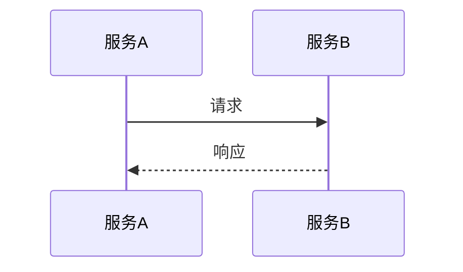
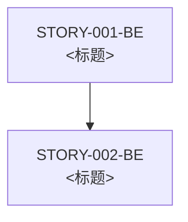
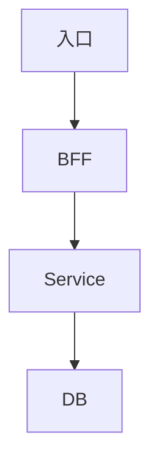
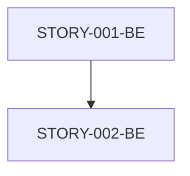

# DR Generate — 从 RA 生成 DR Skill

> **v3.12：** DR 是核心文档，直接生成/更新当前 DR；不生成 GeneratePlan、ReviewCompare、Report 或 changelog 旁车。Review 结论进入 `state.review.status/findings`。

> **核心定位：** 与 `dr-update-skill.md` / `dr-review-skill.md` / `requirement-analysis-skill.md` / `story-generate-skill.md` 同等地位 — **DR Generate 是设计阶段的"生成"环节**（从 RA → DR），DR Review 是"评审"环节，DR Update 是"修订"环节。
>
> **与现有 SKILL 的分工：**
> - `SKILL.md` = 流程编排（Phase 1 ② 在哪）
> - `requirement-analysis-skill.md` = 需求分析（Phase 1 起点，输出 RA）
> - **`dr-generate-skill.md`（本文件）** = DR 生成的环节内具体规则（怎么生成）
> - `dr-review-skill.md` = DR 评审的环节内具体规则（怎么审）
> - `dr-update-skill.md` = DR 修改的环节内具体规则（怎么改）
> - `story-generate-skill.md` = Story 生成（DR 之后，规模=中 时跳过本 SKILL）
> - [`templates/design/dr-template.md`](../../templates/design/dr-template.md) = DR 空白模板
>
> **🔴 核心立场（2026-06-17 新建）：** 之前 Phase 1 ② 节点只有 `auto-engineering-skill` 中"读 PRD → 写 DR"的一行描述，**没有独立 SKILL**。本次新建补齐 — 把"DR 生成"作为独立环节固化下来，与 RA/DR-Review/DR-Update 形成完整 DR 链路。

---

## 📦 文档存放前置调用（🔴 横切依赖）

> **🔴 强制：** 本 SKILL 生成的 DR 文档在写入磁盘前**必须先调用 [`document-storage-skill.md`](../cross-cutting/document-storage-skill.md)** 确定：
> 1. **存文档**：`ae-sdd doc save --intent DR --doc-id {drId} --content-file 草稿.md`（路径全由代码负责，原地更新）
> 2. **命名**（§3.1/3.2 命名规则）：**设计类文档带 v{major}.{minor}**（重入时 v 递增，旧版本保留）
> 3. **重入判定**（§4 重入 SOP）：DR 重入时**新增版本**（v{major}.{minor} 递增，旧版保留）
> 4. **关联性分析**：由 `ae-sdd doc save` 内部 `choose_iteration` 自动判定（业务+逻辑双轨）
> 5. **ChangeLog**（§5 ChangeLog 机制）：每次修改必须追加 ChangeLog 行

**本 SKILL 输出文档与 document-storage-skill §X 的对应：**

| 输出文档 | 路径模板 | 命名规则 | 重入时动作 |
|---------|---------|---------|----------|
| DR 主文档 | `ae-sdd doc save --intent DR --doc-id {drId} --content-file 草稿.md` | 不带版本号（原地更新）|
| DR ChangeLog | `ae-sdd doc save` 自动追加 | — | 追加新行 |
| DRGeneratePlan | `ae-sdd doc save --intent RA_GENERATE_PLAN --doc-id {raId} --content-file 草稿.md` | 带 r{N} |

**项目资产读取：** 通过 [`project-assets-update-skill.md`](../cross-cutting/project-assets-update-skill.md) §6.2 脚本化读取（`ae-sdd assets read`，倒排索引+BM25）：
- `ae-sdd assets read dr-generate --project <projectKey>` — 阶段入口（基线 KEY：AppService/Repository/Converter/Facade/FeignClient/ServiceProviderConstants + §3/§5/§7 整章）
- `ae-sdd assets query "<name>" --project <projectKey>` — 精准查单个模块/组件/字段/API
- `ae-sdd assets section <§X.Y> --project <projectKey>` — 按需拉章节内容

**🔴 关键约束：**
- ❌ 不允许直接读 `design/`、`.ae-task/`、`.ae-plan/`、`.spec/iterations/` 等旧路径
- ✅ 强制使用 document-storage 统一路径（由 `ae-sdd doc save` 内部 resolve 推导；模板见 document-storage-skill §1.3）
- ✅ 强制由 `ae-sdd doc save` 内部 `choose_iteration` 判定迭代

---

## 目标

从 RA 需求分析文档生成 **完整、可执行、可评审** 的 DR 总体设计文档，5 大目标：

- **DR 18 章节齐全**：对齐 dr-template（§1 元信息 / §2 设计目标 / §3 约束承接 / §4 关键决策 / §5 架构概览 / §6 时序 / §7 数据模型 / §8 接口契约 / §9 状态与业务规则 / §10 故障模式 / §11 权限安全审计 / §12 Story 拆分 / §13 测试策略 / §14 可观测性 / §15 发布迁移 / §16 风险 / §17 未决问题 / §18 追踪）
- **与 RA 100% 一致**：业务规则/边界场景/验收标准/数据模型/接口契约 — DR 不是"重写"，是"把 RA 结论按 DR 模板重新组织 + 补充技术决策"
- **实现方案决策基线完整**：4 步强制（复用扫描 / 成熟方案参考 / 五维质量评估 / 核心能力归属）
- **Story 拆分可执行**：DR §12 Story 矩阵清晰，后端/前端 Story 边界明确，依赖关系图完整
- **生成后可立即进入 DR Review SKILL 评审**：8 道闸全过

---

## DR Generate 总则（🔴 4 条标尺，贯穿全 SKILL，违反 = 结论无效）

### 标尺 1：与 RA 100% 一致（🔴 DR 不得偏离 RA）

- 业务规则、验收标准、边界场景、接口契约、字段定义 **必须** 与 RA 100% 一致
- RA 已经梳理的维度（角色/场景/流程/数据/规则/设计方向/AC/假设）— DR 不重做分析，**只是按 DR 模板重新组织**
- RA 没有的设计决策（如：状态机选型/幂等方案/缓存策略）— DR 必须补齐，并标注"DR 决策（RA 无前置）"
- 偏离必须明确标注"偏离声明"，**禁止**默认一致
- 不一致 → 走异常路径 A1（修正 DR 或触发 RA Update）

### 标尺 2：与项目资产对齐（🔴 实现必须基于现有工程能力）

- 分层（api → bff → spi → service）必须匹配项目资产 §3
- 命名（XxxRestImpl / XxxAppService / XxxDO / XxxPO）必须匹配项目资产 §5
- 约束（错误码段、字段类型、审计字段）必须匹配项目资产 §6
- 契约入口（Feign 服务名 / ContextPath）必须从项目资产 §7 读取，**禁止猜测**
- 复用优先：现有能力复用扫描未做，**禁止**写实现方案

### 标尺 3：实现方案决策基线（🔴 复用优先 + 成熟方案参考 + 五维质量）

DR 中所有非平凡实现点都必须先完成决策基线（与 story-generate 标尺 5 对齐）。

**强制顺序：**
1. 先做现有能力复用扫描：项目资产、真实代码、依赖 Story、历史 Story/Task、公共组件、平台能力、团队约定。
2. 再列业内成熟实现方案：通用架构模式、成熟框架/库、框架官方推荐做法、团队已有成功实现。
3. 再做候选方案取舍：复用 / 扩展现有能力 / 新建能力。
4. 最后用五维代码质量标准评估：**可用性、高效性、可维护性、健壮性、可读性**。

**红线：** 未完成实现方案决策基线，禁止写关键决策、接口契约和 Story 拆分。

### 标尺 4：Story 拆分可执行（🔴 DR §12 是下游 Story 的"母版"）

- 每个 Story 边界清晰（核心范围 + 不包含什么）
- 依赖关系是有向无环图（DAG），无循环依赖
- 粒度参考：后端 1~3 天可完成的接口集合；前端 1~3 天可完成的页面/组件
- Story ID 命名规范：后端 `STORY-{序号}-BE` / 前端 `STORY-{序号}-FE`
- 前后端分离：同一功能的前端和后端拆成两个独立 Story，前端依赖后端

---

## 整体流程

```
触发（规模=大 / 用户说"生成 DR" / 重入）
    ↓
第零步：DR 准入检查（PRD + RA + 项目资产 + 产品原型 + dr-template + 约束）
    ↓
第一步：读取输入（继承 RA 8 维度结论 + 重新组织为 DR 章节）
    ├─ 角色分析 → DR §5 架构概览 + §8 接口契约
    ├─ 业务规则 → DR §3 约束承接 + §9 业务规则
    ├─ 数据要素 → DR §7 数据模型
    ├─ 业务流程 → DR §6 时序 + §9 状态机
    ├─ 设计方向 → DR §4 关键决策
    └─ 场景分析 → DR §8 接口契约 + §10 故障模式
    ↓
第一步 bis：实现方案决策基线（🔴 4 步强制）
    ├─ ① 现有能力复用扫描
    ├─ ② 业内成熟方案参考
    ├─ ③ 五维代码质量评估
    └─ ④ 核心能力归属唯一
    ↓
第二步：DR 章节挖掘（按 dr-template 18 章节分维度）
    ├─ §1 元信息
    ├─ §2 设计目标 + 非目标
    ├─ §3 约束承接（9 个 constraints 文件逐一检查）
    ├─ §4 关键决策（备选方案 + 接受的代价）
    ├─ §5 架构概览（架构图 + 工程清单 + 层级职责）
    ├─ §6 关键时序
    ├─ §7 数据模型（ER图 + 关键表说明 + 变更清单）
    ├─ §8 接口契约（幂等性、对应 Story）
    ├─ §9 状态与业务规则
    ├─ §10 故障模式
    ├─ §11 权限安全审计
    ├─ §12 Story 拆分（核心产出）
    ├─ §13 测试策略
    ├─ §14 可观测性
    ├─ §15 发布迁移回滚
    ├─ §16 风险评估
    ├─ §17 未决问题
    └─ §18 追踪
    ↓
第三步：合理性自检（与 RA 一致性 / 可执行性 / 完整性）
    ↓
第四步：写入 DR 草稿（save_doc + choose_iteration）
    ↓
第四步 bis：生成 DRGeneratePlan
    ↓
第五步：🔴 人工审核点（双支柱呈现）
    ├─ 叙述性讲解：核心架构决策 + Story 拆分策略
    └─ 对话内直接呈现：架构图 + 数据模型 + Story 矩阵 + 关键决策表
    ↓
第六步：触发 dr-review-skill
    ↓
第七步：8 道闸
    ↓
完成 → 进入 dr-review-skill
```

**关键原则：** 每个步骤必须产出中间结果，用户确认后方可进入下一步。未确认禁止继续。

---

## 触发条件

| 触发场景 | 触发方式 | 输入 |
|---------|---------|------|
| 规模 = 大 | `requirement-analysis-skill` 路由决策触发 | RA 文档 + PRD + 项目资产 + 5 维规模评分 |
| 用户手动 | "生成 DR" / "写 DR" / "从 RA 生成 DR" / "DR 起草" | PRD/RA + 项目资产 |
| DR Review 触发 | "DR 缺陷修复" → 走 `dr-update-skill.md`（不是本 SKILL） | DR Supplement |
| 重入 | 已有 DR 草稿 | 修订（按 §重入 SOP） |

---

## Plan-first 生成原则（🔴 写 DR 前硬前置）

> **🔴 强制：** DR 生成前**必须**先有 DRGeneratePlan，按 Plan 执行。
> **Plan-first 与 Review-first 的差异：** DR Review SKILL 是"问题-修复计划"双向链（review→plan→update）；DR Generate SKILL 是"RA-章节-初稿"单向链（RA→plan→draft）。

**DRGeneratePlan 内容：**
- RA 章节清单（哪些 RA 维度要展开成 DR 哪些章节）
- 18 章节挖掘 SOP（每章节要查什么）
- 实现方案决策基线：所有实现点的复用扫描、成熟方案参考、五维质量评估和能力归属
- 模板填写顺序（先填必填章节，再填按需章节）
- 与 DR Review 的衔接点（生成完立即进 Review）

---

## 第零步：DR 准入检查（🔴 硬门禁，未通过禁止进入生成）

**🔴 必读清单（8 个文件）：**

| # | 来源 | 文件 | 读取要求 |
|---|------|------|---------|
| 1 | 用户提供 | PRD 文档 | 全文 |
| 2 | 来自 requirement-analysis | RA 文档 | 全文（8 维度结论）|
| 3 | 用户提供 | 产品原型（可选）| 关键页面 + 交互 |
| 4 | 自动加载 | 项目资产大纲 | 全部（`ae-sdd assets outline --project <projectKey>`）|
| 5 | 自动加载 | 相关模块详情 | 按需（`ae-sdd assets query "<name>" --project <projectKey>`）|
| 6 | 模板 | dr-template.md | 全部 18 章节 |
| 7 | 约束 | `standards/constraints/` 全部 9 个 .md | 必读（用于 §3 约束承接）|
| 8 | 标准 | doc-density-standard.md（`DOC_DENSITY_STANDARD`）| 必读（写作密度红线 D-1~D-7）|

**门禁判定：**
- ✅ 8 个文件全部读取 + 用户确认 → 进入第一步
- ❌ 任一文件未读取 / 未确认 → **停止，补充读取 + 用户确认后再继续**
- 🔴 缺 PRD 或 RA → 询问用户（**不编造信息**）

**🔴 机械门禁（v3.9.1，对齐 RA/Coding 三合一）：** prose 清单之外，必须跑：

```bash
ae-sdd gates check --only G-DR-CTX
```

`G-DR-CTX` 校验 `constraints/assets/RA/PRD` 四类上下文已读齐（注册表 `CONTEXT_GATE_REGISTRY`，复用 `document-storage-skill` 的 `get_assets` API + `_iter_ra_files/_find_prd_files`；约束直接读取 `constraints/` 目录，索引 `constraints/README.md`）。未过 → **BLOCK，禁止进入生成**。

**第零步 产出：准入检查记录**

```markdown
## 准入检查记录 - DR-{ID} - {YYYY-MM-DD HH:mm}

| # | 文件 | 状态 | 备注 |
|---|------|------|------|
| 1 | PRD 文档 | ✅ 已读 / ❌ 未读 | {路径} |
| 2 | RA 文档 | ✅ 已读 / ❌ 未读 | {路径} |
| 3 | 产品原型 | ✅ 已读 / ❌ 无 | {路径} |
| 4 | 项目资产大纲 | ✅ `ae-sdd assets outline` / ❌ | 关键模块：{N} 个 |
| 5 | 相关模块详情 | ✅ `ae-sdd assets query "<{X}>"` / ❌ | 涉及：{模块列表} |
| 6 | DR 模板 | ✅ 已读 / ❌ | |
| 7 | 约束文件 | ✅ 9 个 / ❌ | 必读：{列表} |
| 8 | doc-density-standard | ✅ `DOC_DENSITY_STANDARD` / ❌ | 写作密度红线 |

**用户确认：** ☐ 通过 ☐ 补充后再继续
```

---

## 第一步：读取输入（继承 RA 8 维度结论）

> **🔴 核心思想：** DR 不是"重写" RA，DR 是"把 RA 结论按 DR 模板重新组织 + 补充技术决策"。RA 已经做过的 8 维度分析（角色/场景/流程/数据/规则/设计方向/AC/假设）— DR 不重做，**只做映射 + 补全**。

### 1.1 RA → DR 章节映射

| RA 维度 | → DR 章节 | 映射动作 |
|---------|----------|---------|
| A 角色分析 | DR §5 架构概览（层级职责）+ §8 接口契约 | 重新组织：RA 角色 → DR 哪个服务/接口覆盖 |
| B 场景分析 | DR §8 接口契约 + §10 故障模式 | 重新组织：RA 主/异常/边界 → DR 接口契约表 + 故障模式表 |
| C 业务流程 | DR §6 关键时序 + §9 状态与业务规则 | 重新组织：RA 状态机 → DR §9 状态机；RA 时序 → DR §6 时序图 |
| D 数据要素 | DR §7 数据模型 | 重新组织：RA 实体 → DR ER 图 + 关键表说明 + 变更清单 |
| E 业务规则与约束 | DR §3 约束承接 + §9 业务规则 | 重新组织：RA 业务规则 → DR §9 跨功能规则；RA 平台/合规/性能 → DR §3 约束 |
| F 设计方向论证 | DR §4 关键决策 | 重新组织：RA 备选方案 → DR 决策表（必含接受的代价）|
| G 验收标准 | DR §13 测试策略 + 各 Story AC | 重新组织：RA AC → DR 覆盖矩阵（Story × AC）|
| H 隐性假设 | DR §17 未决问题 | 重新组织：RA 假设清单 → DR 未决问题（接受为风险）|

### 1.2 提取 PRD / 产品原型信息

| 信息项 | 来源 | 提取要点 |
|--------|------|---------|
| 业务背景 | PRD | 业务问题 / 目标用户 / 核心价值 |
| UI 流程 | 产品原型 | 页面布局 / 交互流程（用于 Story 拆分的前端 Story 范围）|
| UI 状态 | 产品原型 | 视觉态（用于 §11 权限/审计的可观测性）|
| 边界场景 | 产品原型 + PRD | 空数据 / 超长字段 / 弱网（用于 §10 故障模式）|

### 1.3 提取项目资产信息

| 信息项 | 提取要点 |
|--------|---------|
| §3 分层映射 | 决定 DR 涉及的服务/模块边界 |
| §4 DDD 落点 | 决定包路径模板（用于 Story 拆分）|
| §5 命名约定 | 决定类名风格（用于 Story 详情）|
| §6 工程约束 | 决定接口/数据库/安全/测试规范 |
| §7 契约入口 | 决定 Feign 服务名 / 错误码段 / **各服务 ContextPath** |

### 1.4 产出：输入清单

```
【第一步产出物：输入清单】

DR ID：{DR-ID}
RA ID：{RA-ID}
项目：{projectKey}

已读取：
- [x] PRD 文档（{N} 段 / {M} 业务规则）
- [x] RA 文档（{N} 章 / {M} 业务规则 / {K} AC）
- [x] 产品原型（{N} 页面 / {M} 关键交互）（如适用）
- [x] 项目资产（`ae-sdd assets read dr-generate --project <projectKey>` 返回 §3/§5/§7）
- [x] DR 模板（18 章节）
- [x] 约束文件（9 个 constraints）

【请确认：以上输入是否完整？】
```

**门禁：** 用户确认输入完整后，方可进入第一步 bis。

---

## 第一步 bis：实现方案决策基线（🔴 4 步强制）

> **目的：** 在写关键决策、接口契约和 Story 拆分之前，先证明"为什么这么实现"。所有实现方案都必须复用优先，并参考业内成熟方案；没有证据的方案选择视为不可评审。

### 1bis.1 实现点清单（先穷举）

从 RA / PRD / 主流程中穷举所有需要实现的能力点。至少覆盖：
- 对外接口 / 跨服务接口 / 事件接口
- 领域规则 / 状态机 / 业务不变量 / 计算规则
- 应用编排 / 事务边界 / 补偿重试
- Repository / Mapper / 数据转换 / 索引和查询
- 通知 / 消息 / 定时任务 / 回调 / 外部系统集成
- 缓存 / 幂等 / 并发控制 / 降级熔断

| # | 实现点 | 来源（RA/PRD/主流程） | 业务能力归属 | 是否高风险 | 备注 |
|---|---|---|---|---|---|
| 1 |  |  |  | 是 / 否 |  |

### 1bis.2 现有能力复用扫描（所有实现点必填）

| 实现点 | 搜索范围 | 搜索关键词 / 类名 / 接口名 | 已发现的现有能力 | 结论（复用/扩展/新建） | 不复用理由 | 证据 |
|---|---|---|---|---|---|---|
|  | 项目资产 / 真实代码 / 依赖 Story / 历史 Task / 公共组件 |  |  |  |  | 文件路径:行号 / Story 章节 |

**扫描要求：**
- 真实代码可访问时，必须用代码搜索验证；不能只看项目资产。
- 历史 Story/Task 已实现过同类能力时，必须优先复用其契约或实现点。
- 若选择新建，必须说明现有能力为什么不能满足，不得只写"未找到"。

### 1bis.3 业内成熟方案参考（所有非平凡实现点必填）

| 实现点 | 业内成熟方案 / 常见模式 | 适用条件 | 本 DR 是否采用 | 取舍理由 | 参考证据 |
|---|---|---|---|---|---|
| 状态机 | 事件驱动状态机 / Spring StateMachine / 枚举转移表 / 领域对象 transition | 多状态、多触发事件、多非法流转 | 是 / 否 |  | 官方文档 / 团队既有实现 |

**要求：**
- 状态机、幂等、重试补偿、分布式锁、消息消费、外部集成这类高风险能力，必须列至少 1 个成熟方案或团队既有成熟实现。
- 选择不用成熟框架时，必须说明用轻量实现如何满足同等约束。

### 1bis.4 五维代码质量评估（候选方案必填）

| 实现点 | 候选方案 | 可用性 | 高效性 | 可维护性 | 健壮性 | 可读性 | 结论 |
|---|---|---|---|---|---|---|---|
|  | 复用现有能力 / 扩展现有能力 / 新建能力 |  |  |  |  |  |  |

> 五维定义见 [`SKILL.md §实现方案决策基线`](../../SKILL.md)（🆕 v3.0：主入口已从 `skills/orchestration/ae-sdd-skill.md` 迁至根 `SKILL.md`）。

### 1bis.5 核心能力归属（防重复实现）

| 业务能力 | 所属 Story / 模块 | 唯一实现点 | 允许调用方 | 复用方式 | 禁止重复实现位置 | 副作用 |
|---|---|---|---|---|---|---|
|  |  | 类/方法/领域服务/接口 |  | 直接调用 / 事件触发 / SPI |  | 状态变更 / 通知 / 统计 |

**红线：**
- 同一业务能力只能有一个唯一实现点；多个入口只能调用它，不能各写一套。
- 接单、结单、分配、关闭、超时、通知、状态流转、幂等创建等高风险能力必须填写本表。

### 1bis 出闸条件

- [ ] 已穷举所有实现点
- [ ] 每个实现点已完成现有能力复用扫描
- [ ] 非平凡实现点已参考业内成熟方案或团队既有成熟实现
- [ ] 候选方案已按可用性 / 高效性 / 可维护性 / 健壮性 / 可读性评估
- [ ] 核心业务能力已声明唯一实现点和禁止重复实现位置
- [ ] 所有"不复用 / 新建"结论都有证据和五维影响说明

**任一未满足 → 停止生成关键决策和 Story 拆分，先补决策基线。**

---

## 第二步：DR 章节挖掘（按 dr-template 18 章节分维度）

> **🔴 关键：** 每个章节独立挖掘，**先填必填章节（标记 `核心`）**，再填按需章节。下表是按"重要性"排序的挖掘优先级。

### §1 元信息（必填）

| 字段 | 来源 |
|------|------|
| DR ID | DR-{RA 序号}-{RA title 简写} |
| PRD 引用 | PRD 路径 |
| 作者 | 当前用户 |
| 状态 | Draft |
| 版本号 | v1.0（由 document-storage 自动管理） |

### §2 设计目标 + 非目标（必填）

**粒度要求：** 写清楚"什么叫做完了"，不写方向性描述。每条目标必须可验证。

- 目标 1：{从 RA §1 业务价值提炼}
- 目标 2：{从 RA §11 规模 + RA §1 提炼}
- 非目标：{RA §1 范围外显式声明}
- 范围（包含/不包含）：{从 RA §1 范围章节继承}

### §3 约束承接（必填）

**粒度要求：** 9 个 constraints 文件逐一检查，符合 / 偏离 / 不适用。

| 约束文档 | 关键约束 | 符合 / 偏离 / 不适用 | 说明 |
|---------|---------|--------------------|------|
| technology-stack.md | | | {cite RA §6.2 平台约束} |
| layered-arch.md | | | {cite 项目资产 §3} |
| project-structure.md | | | |
| api.md | | | {cite 项目资产 §7 契约入口} |
| database.md | | | {cite 项目资产 §6.5} |
| code-style.md | | | |
| security.md | | | |
| testing.md | | | {cite DR §13 测试策略} |
| implicit-constraints.md | | | |

### §4 关键决策（必填）

**粒度要求：** 只记录有真实备选方案的决策点。**每个决策必须写"接受的代价"**。

#### 决策 1：<决策点名称>

**背景：** {cite RA §7 设计方向}

**备选方案：**

| 方案 | 优点 | 缺点 |
|------|------|------|
| 方案 A | | |
| 方案 B | | |

**决策：** 选择方案 X。

**理由：** {引用第一步 bis 的五维评估结论}

**接受的代价：** {必填，不能为空}

**决策人：** 架构师 / Tech Lead

#### 决策 2、3、...

{按需展开，每个决策独立编号}

### §5 架构概览（必填）

**粒度要求：** 聚焦模块边界和数据流，不写功能流程细节（那是 Story 的职责）。

**包含：**
- **架构图**（Mermaid flowchart）：入口 → BFF → Service → 数据层
- **工程清单**：每个工程的名称 / 类型（BFF/Service/SPI）/ context-path / 说明
- **层级职责**：每个服务/模块用"负责什么 / 不负责什么"格式描述

### §6 关键时序（按需：跨服务交互时填写）

**粒度要求：** 只画跨服务的复杂交互，单服务内部逻辑不画。



### §7 数据模型（必填）

**粒度要求：** 重点解释非显而易见的设计 — 为什么加这个冗余字段、为什么用这个状态机、为什么这两张表分开建。

**包含：**
- **实体关系图**（Mermaid erDiagram）
- **关键表说明**：每张表一个 block，列出关键字段 + 设计说明
- **变更清单**：新增 / 修改 / 删除（来自 RA §5 + 第一步 bis 决策）

### §8 接口契约（按需：有对外暴露的接口时填写）

**粒度要求：** 列出对外暴露的接口，重点标注幂等性要求。内部实现细节不写。

| 接口 / 事件 / 外部系统 | 方向 | 核心入参 | 核心出参 | 幂等 | 对应 Story |
|----------------------|------|---------|---------|------|----------|
| | 入 / 出 | | | 是 / 否 | |

**接口必须从项目资产 §7 契约入口读取 context-path，禁止猜测。**

### §9 状态与业务规则（按需：跨 Story 状态机时填写）

**粒度要求：** 只写跨 Story 的状态机和业务规则。只在单个 Story 内生效的规则，直接写进 Story 的 AC。

**包含：**
- **状态机**（Mermaid stateDiagram）
- **跨功能业务规则**：BR-01、BR-02（每条规则有"违反即为 bug"的判定标准）

### §10 故障模式（按需：核心链路 / 强一致性要求时填写）

**粒度要求：** 关键流程的每个依赖点逐一分析失败场景。

| 流程 | 故障点 | 故障场景 | 系统状态 | 处理策略 |
|------|--------|---------|---------|---------|
| | | | | 重试 / 补偿 / 降级 / 人工介入 |

### §11 权限、安全与审计（按需：新权限模型 / 敏感数据时填写）

**粒度要求：** 只写本 DR 引入的新权限模型或安全要求，已有的通用机制不重复。

- 权限模型：
- 敏感数据处理：
- 审计日志：
- 风险控制：

### §12 Story 拆分（必填 — DR 核心产出）

**粒度要求：** DR 向下输出的核心。每个 Story 边界清晰 + 依赖关系明确 + 预计开发时间。

#### §12.1 后端 Story 矩阵

| Story ID | 标题 | 优先级 | 核心范围 | 依赖 Story | 预计开发时间 |
|---------|------|--------|---------|----------|------------|
| STORY-001-BE | | P1 | | — | 1~3 天 |
| STORY-002-BE | | P2 | | STORY-001-BE | 1~3 天 |

#### §12.2 前端 Story 矩阵（待后端接口稳定后补充）

> 占位行：前端 Story 依赖对应后端 Story。

#### §12.3 Story 详情

**STORY-001-BE：<标题>**

**核心范围：** 一句话说明边界 + 明确不包含什么。

**要做的事：**
-

**接口：**

| 接口 | 方向 | 说明 |
|------|------|------|
| | | |

#### §12.4 依赖关系图



**🔴 Story 拆分原则：**
- 可独立开发（不依赖同批并行开发的 Story）
- 可独立交付（可独立部署验证）
- 无循环依赖（DAG）
- 前后端分离（前端依赖后端）
- 粒度参考：后端 1~3 天 / 前端 1~3 天

### §13 测试策略（按需：特殊测试要求时填写）

**粒度要求：** 整体分层策略 + 覆盖目标。

**包含：**
- 分层策略（单元 / 接口 / 集成 / UI）
- 覆盖矩阵（Story × AC × 测试层级 × 自动化）

### §14 可观测性（按需：新增核心链路时填写）

**粒度要求：** 上线后怎么知道系统是健康的 — 设计阶段就要想清楚。

- 关键指标（Metrics）
- 关键日志（Logs）
- 告警规则（Alerts）

### §15 发布、迁移与回滚（按需：数据迁移 / 不兼容变更时填写）

- 发布步骤（按顺序）
- 数据迁移（脚本 + 验证）
- 回滚策略
- 兼容性

### §16 风险评估（按需：明确高风险点时填写）

| 风险 | 影响 | 概率 | 缓解方式 | 状态 |
|------|------|------|---------|------|
| | 高 / 中 / 低 | 高 / 中 / 低 | | Open |

### §17 未决问题（按需：待确认的决策点时填写）

| 问题 | 影响范围 | 负责人 | 截止时间 | 状态 |
|------|---------|--------|---------|------|
| | | | | Open |

### §18 追踪

- Story 文档：{path}
- 用例设计：{path}
- 相关任务：{path}
- PR / MR：

---

## 第三步：合理性自检

### 3.1 自检 4 维度

| 维度 | 必查项 |
|------|--------|
| **与 RA 一致性** | 业务规则 / AC / 接口 / 数据模型 / 场景 / 状态机 / 假设 — 与 RA 100% 一致；偏离已声明 |
| **完整性** | 18 章节全填，必填章节无 N/A |
| **可执行性** | 每个关键决策有"接受的代价"；每个 Story 边界清晰、依赖明确 |
| **可评审性** | 命名/路径符合项目资产 §3/§5/§6；ContextPath 从 §7 读取 |

### 3.2 自检结论

| 维度 | 状态 | 备注 |
|------|------|------|
| 与 RA 一致性 | ✅/❌ | |
| 完整性 | ✅/❌ | |
| 可执行性 | ✅/❌ | |
| 可评审性 | ✅/❌ | |
| **小计** | | |

---

## 第四步：写入 DR 文档

> **🔴 强制：** 写入磁盘前**必须先调用** `document-storage-skill.md` 的 API：
> **🔴 强制：** 写入磁盘必须通过 `ae-sdd doc save`，代码自动完成迭代判定 + 目录创建。

### 4.1 调用 save_doc 的参数

```text
# 旧式伪代码已废弃，改用 CLI：
# ae-sdd doc save --intent DR --doc-id DR-001 --content-file 草稿.md
result_skip = save_doc(doc={  # noqa: 保留结构示例，实际用上面 CLI
    "doc_id": "DR-001",
    "doc_type": "DR",
    "iteration_date": "2026-06-17",  # 由 choose_iteration 决定
    "version": {"major": 1, "minor": 0},
    "content": "# DR-{ID}-{title}\n\n## §1 元信息\n...\n## §2 设计目标\n...\n## §3 约束承接\n...\n## §4 关键决策\n...\n## §5 架构概览\n...\n## §6 关键时序\n...\n## §7 数据模型\n...\n## §8 接口契约\n...\n## §9 状态与业务规则\n...\n## §10 故障模式\n...\n## §11 权限安全审计\n...\n## §12 Story 拆分\n...\n## §13 测试策略\n...\n## §14 可观测性\n...\n## §15 发布迁移回滚\n...\n## §16 风险评估\n...\n## §17 未决问题\n...\n## §18 追踪\n",
    "business": {
        "domain": "用户管理",
        "scenario": "用户列表查询",
        "entities": ["User", "Role"],
        "rules": ["权限校验", "分页约束"]
    },
    "logic": {
        "calls": ["BossUserService.list", "BossUserRepository.findByQuery"],
        "dataFlow": ["boss_user.id", "boss_user.status"],
        "stateMachine": None,
        "components": ["PagedModels", "ApiResult"]
    },
    "change_type": "new",
    "change_description": "首次创建（继承 RA-{ID}）",
    "change_source": "dr-generate-skill Phase 1 ②"
})
# → 实际由 ae-sdd doc save 完成，自动写入 ae-sdd-doc/DR/DR-001.md
# → 自动追加 ChangeLog 行
```

### 4.2 关联性分析调用

**业务关联 4 子规则（任一命中=1）：**

| 子规则 | 含义 | 标签字段 |
|--------|------|---------|
| B1 业务域匹配 | 涉及同一业务域 | `business.domain` |
| B2 业务场景匹配 | 涉及同一业务场景 | `business.scenario` |
| B3 业务实体匹配 | 涉及同一业务实体 | `business.entities` |
| B4 业务规则匹配 | 涉及同一业务规则 | `business.rules` |

**逻辑关联 4 子规则（任一命中=1）：**

| 子规则 | 含义 | 标签字段 |
|--------|------|---------|
| L1 代码调用 | 涉及代码间的调用关系 | `logic.calls` |
| L2 数据流 | 涉及同一数据流 | `logic.dataFlow` |
| L3 状态流转 | 涉及同一状态机的流转 | `logic.stateMachine` |
| L4 组件复用 | 涉及同一组件/工具类/常量 | `logic.components` |

**关联等级判定（业务=0 ∧ 逻辑=0 → 强制问用户）：**

| 业务 | 逻辑 | 等级 | 默认动作 |
|------|------|------|---------|
| 1 | 1 | **强关联** | 默认入当前迭代 |
| 1 | 0 | **中关联** | 默认入当前迭代 |
| 0 | 1 | **中关联** | 默认入当前迭代 |
| 0 | 0 | **无关联** | 🔴 强制问用户 |

### 4.3 写入前最后检查

- [ ] DR 文档 18 章节全部填写（必填章节无 N/A）
- [ ] 实现方案决策基线已完成（4 步全过）
- [ ] Story 矩阵与 RA §11 规模裁定一致
- [ ] 所有 RA 业务规则在 DR §3/§9 都有承接
- [ ] 所有 RA 数据实体在 DR §7 数据模型都有体现
- [ ] 所有 RA 场景在 DR §8 接口契约都有覆盖
- [ ] 业务/逻辑标签已正确打上（关联性分析依赖）
- [ ] 每个关键决策都有"接受的代价"
- [ ] ContextPath 全部从项目资产 §7 读取

---

## 第四步 bis：生成 DRGeneratePlan

```markdown
## DRGeneratePlan - {DR-ID} - {YYYY-MM-DD HH:mm}

### 1. 章节填写顺序

**区一：元信息（必填）**
1. §1 元信息
2. §2 设计目标 + 非目标

**区二：承接（必填）**
3. §3 约束承接（9 个 constraints 文件）
4. §4 关键决策（实现方案决策基线 4 步全过）

**区三：架构与设计（必填）**
5. §5 架构概览
6. §6 关键时序（按需）
7. §7 数据模型

**区四：契约（必填）**
8. §8 接口契约
9. §9 状态与业务规则

**区五：质量与运维（按需）**
10. §10 故障模式
11. §11 权限安全审计
12. §13 测试策略
13. §14 可观测性
14. §15 发布迁移回滚

**区六：风险与追踪（必填）**
15. §16 风险评估
16. §17 未决问题
17. §18 追踪

**区七：核心产出（必填）**
18. §12 Story 拆分（最后做，所有决策 + 契约 + 数据都已确定后才能拆分）

### 2. 与下游 SKILL 衔接
- 写入完成后 → 触发 DR Review SKILL（`dr-review-skill.md`）

### 3. 用户确认
- ☐ 通过，按 Plan 写入 DR 文档
- ☐ 需要调整（说明）
```

---

## 第五步：🔴 人工审核点（双支柱呈现）

> **🔴 关键：** 在写入磁盘后必须获得用户确认。本步采用"双支柱"方式呈现：叙述性讲解 + 对话内直接呈现。

### 5.1 支柱 1：叙述性讲解

向用户叙述以下内容：

```
【DR 文档核心摘要】

业务背景：
- 解决什么问题：{RA §1 业务背景}
- 目标用户：{RA §2 角色}
- 核心价值：{RA §1 业务价值}

架构概览：
- 涉及服务：{N} 个（BFF/Service/SPI）
- 涉及工程：{M} 个
- 核心流程：{一句话}

关键决策：
- 决策 1：{决策点} — 选定方案 {X}，接受的代价 {Y}
- 决策 2：{决策点} — 选定方案 {X}，接受的代价 {Y}

数据模型：
- 新增表：{N} 张
- 修改表：{M} 张
- 关键设计：{一句话}

接口契约：
- 对外接口：{N} 个
- 跨服务接口：{M} 个
- 幂等性要求：{接口列表}

Story 拆分：
- 后端 Story：{N} 个
- 前端 Story：{M} 个（待后端接口稳定）
- 总开发周期：{X} 天

主要风险：
- 风险 1：{描述} → 应对：{方案}
- 风险 2：{描述} → 应对：{方案}
```

### 5.2 支柱 2：对话内直接呈现

在对话中**直接呈现**以下表格（不放在外部文件）：

#### 表 1：架构概览（精简版）

| 工程名 | 类型 | context-path | 核心职责 |
|--------|------|-------------|---------|
| {工程 1} | BFF | {path} | {一句话} |
| {工程 2} | Service | — | {一句话} |

#### 表 2：关键决策表

| 决策 | 选定方案 | 接受的代价 |
|------|---------|----------|
| {决策 1} | {方案 X} | {代价} |
| {决策 2} | {方案 Y} | {代价} |

#### 图 3：架构图（Mermaid）



#### 表 4：数据模型变更清单

| 数据对象 / 表 | 变更类型 | 说明 |
|--------------|---------|------|
| | 新增 / 修改 / 删除 | |

#### 表 5：接口契约表

| 接口 / 事件 | 方向 | 核心入参 | 核心出参 | 幂等 | 对应 Story |
|------------|------|---------|---------|------|----------|
| | 入 / 出 | | | 是 / 否 | |

#### 表 6：Story 矩阵

| Story ID | 标题 | 优先级 | 核心范围 | 依赖 | 预计时间 |
|---------|------|--------|---------|------|---------|
| STORY-001-BE | | P1 | | — | |
| STORY-002-BE | | P2 | | STORY-001-BE | |

#### 图 7：Story 依赖关系图（Mermaid）



#### 表 8：风险评估表

| 风险 | 影响 | 概率 | 缓解方式 | 状态 |
|------|------|------|---------|------|
| | 高 / 中 / 低 | 高 / 中 / 低 | | Open |

### 5.3 用户确认动作

等待用户回复：
- **"确认"** → 进第六步（触发 DR Review）
- **"修改 X"** → 用户指出某个决策错误 → 修订 → 重新呈现双支柱
- **"补充 Y"** → 用户补充新信息 → 加入第一步挖掘 → 重新呈现

---

## 第六步：触发下游 SKILL

> **🔴 前置条件：** DR 文档已通过 `ae-sdd doc save --intent DR ...` 落地（G-DOC-STORAGE ✅）后，才能触发下游。

| 下游 | 触发 SKILL | 引用章节 |
|------|-----------|---------|
| DR Review | `dr-review-skill.md` | 整体流程（评审整个 DR） |

---

## 第七步：DR Generate 闸门全集（8 道闸）

| 闸 | 名称 | 等级 | 判定 SOP |
|----|------|------|---------|
| 1 | RA 8 维度全承接闸 | 🔴 阻断 | DR 章节覆盖 RA 所有结论（角色/场景/流程/数据/规则/设计方向/AC/假设）|
| 2 | 实现方案决策基线 4 步全过闸 | 🔴 阻断 | 复用扫描 / 成熟方案 / 五维 / 归属 全部填写 |
| 3 | 数据模型与项目资产对齐闸 | 🔴 阻断 | assets.table 引用；字段符合 §6.5 |
| 4 | 接口契约与 RA 场景一致闸 | 🔴 阻断 | RA 场景全在 DR §8 体现；ContextPath 从 §7 读取 |
| 5 | Story 矩阵可执行闸 | 🔴 阻断 | 每个 Story 边界清晰 + 依赖 DAG + 前后端分离 |
| 6 | 风险评估完整闸 | 🔴 阻断 | DR §16 无遗漏；每个风险有缓解方式 |
| 7 | 用户已确认闸 | 🔴 阻断 | 在审核点说"确认" |
| 8 | DR 已落盘闸 | 🔴 阻断 | `ae-sdd doc save --intent DR` 成功（exit 0）；ChangeLog 已记录 |

**任一闸门 🔴 未过 = DR 文档不通过 → 回到对应步骤重新生成。**

**闸门失败处理：**
- 闸 1 失败 → 回到第一步（重读 RA）
- 闸 2 失败 → 回到第一步 bis（补决策基线）
- 闸 3 失败 → 回到第二步 §7（重做数据模型）
- 闸 4 失败 → 回到第二步 §8（重做接口契约）
- 闸 5 失败 → 回到第二步 §12（重做 Story 拆分）
- 闸 6 失败 → 回到第二步 §16（补风险）
- 闸 7 失败 → 回到第五步（重新呈现）
- 闸 8 失败 → 回到第四步（重新写入）

---

## 执行清单（🔴 逐项执行，24 步，对应 TodoWrite）

| # | 动作 | 产出 | 门禁 |
|---|------|------|------|
| 1 | 读取 7 个输入文件 + 用户确认 | 输入清单 + 准入检查记录 | 7 文件全读 ✅ |
| 2 | 提取 RA / PRD / 原型 / 项目资产信息 | §1.4 输入清单 | 用户确认 |
| 3 | §1bis 实现方案决策基线 | 实现点清单 + 复用扫描 + 成熟方案参考 + 五维质量评估 + 能力归属 | 全部实现点覆盖；不复用有证据 |
| 4 | §2 设计目标 + 非目标 | DR §2 章节 | 完整可验证 |
| 5 | §3 约束承接 | DR §3 章节 | 9 个 constraints 逐一检查 |
| 6 | §4 关键决策 | DR §4 章节 | 每个决策有"接受的代价" |
| 7 | §5 架构概览 | DR §5 章节 | 架构图 + 工程清单 + 层级职责 |
| 8 | §6 关键时序（按需）| DR §6 章节 | 跨服务时序图 |
| 9 | §7 数据模型 | DR §7 章节 | ER 图 + 关键表 + 变更清单 |
| 10 | §8 接口契约 | DR §8 章节 | 接口表 + 幂等性 + Story 关联 |
| 11 | §9 状态与业务规则 | DR §9 章节 | 跨 Story 状态机 + 业务规则 |
| 12 | §10 故障模式（按需）| DR §10 章节 | 故障点 + 处理策略 |
| 13 | §11 权限安全审计（按需）| DR §11 章节 | 权限模型 + 敏感数据 + 审计 |
| 14 | §12 Story 拆分 | DR §12 章节 | 矩阵 + 详情 + 依赖图 |
| 15 | §13 测试策略（按需）| DR §13 章节 | 分层策略 + 覆盖矩阵 |
| 16 | §14 可观测性（按需）| DR §14 章节 | Metrics + Logs + Alerts |
| 17 | §15 发布迁移回滚（按需）| DR §15 章节 | 发布步骤 + 迁移 + 回滚 |
| 18 | §16 风险评估 | DR §16 章节 | 风险表 + 缓解方式 |
| 19 | §17 未决问题 | DR §17 章节 | 未决问题清单 |
| 20 | §闸 1：RA 8 维度全承接闸 | 闸门 1 通过 | 0 遗漏 |
| 21 | §闸 2：实现方案决策基线闸 | 闸门 2 通过 | 0 缺失 |
| 22 | §闸 3-6：数据/接口/Story/风险闸 | 闸门 3-6 通过 | 0 缺失 |
| 23 | §第四步 写入 DR 文档 + choose_iteration | DR 文档 + ChangeLog | 用户确认初稿 |
| 24 | §第四步 bis 生成 DRGeneratePlan + 第五步 双支柱 + 第七步 8 道闸 | Plan + 双支柱 + 闸门 | 8 道闸全过 |

---

## 禁止事项

| # | 禁止 | 危害 | 正确做法 |
|---|------|------|---------|
| 1 | 禁止跳过 RA 直接写 DR | 漏业务规则 / 漏边界场景 | §第零步 必读 RA 全文 |
| 2 | 禁止不参考项目资产 | 命名/分层/契约错乱 | §第零步 必读 `ae-sdd assets outline --project <projectKey>` |
| 3 | 禁止不调用实现方案决策基线 | 重复造轮子 / 方案不可评审 | §第一步 bis 4 步强制 |
| 4 | 禁止把 RA 维度直接照搬到 DR | 章节结构混乱 | §1.1 RA → DR 章节映射表 |
| 5 | 禁止 DR §12 Story 矩阵与 RA §11 规模裁定不一致 | 规模不一致 = 流程错乱 | §第三步 自检 |
| 6 | 禁止跳过人工审核点 | 流程失控 | §第五步 双支柱 + 等待用户"确认" |
| 7 | 禁止不经 dr-review-skill 直接进入下游 | 评审缺失 | §第六步 触发下游 |
| 8 | 禁止不调用 save_doc 直接写文件 | 路径/版本号/ChangeLog 失管 | §第四步 强制走 documentStorage |
| 9 | 禁止不更新 ChangeLog | 失变更追踪 | §第四步 save_doc 自动维护 |
| 10 | 禁止杜撰 RA 没有的设计决策 | 凭空捏造 | §标尺 1 — RA 没有的决策必须标注"DR 决策（RA 无前置）" |
| 11 | 禁止关键决策不写"接受的代价" | 决策不可评审 | §第二步 §4 必填 |
| 12 | 禁止 ContextPath 猜测 | 路由错乱 | §第二步 §8 从项目资产 §7 读取 |

---

## 与其他 SKILL 的关系

```
requirement-analysis-skill (RA)
        ↓ 输出 RA 文档 + 规模=大
dr-generate-skill (本文件) ← 当前位置
        ↓ 输出 DR 文档
dr-review-skill (DR 评审)
        ↓ 输出 DR 评审报告
dr-update-skill (DR 修订，根据 DR Supplement)
        ↓ 输出修订后 DR
story-generate-skill (Story 生成，按 DR §12 拆分)
        ↓ 输出 Story 文档
story-review-skill (Story 评审)
        ↓ ...
```

**上游：** `requirement-analysis-skill`（输入 RA 文档）
**下游：** `dr-review-skill`（评审 DR 草稿）
**横向：** `dr-update-skill`（评审后修订）

---

## 📖 人工审核主动讲解规范 — DR 节点

> **🔴 强制：** 人工审核点（第五步）前必须按本节讲解。

**AI 必须主动讲解的内容（5 维度）：**

| 维度 | 必讲内容 |
|------|---------|
| 业务背景 | 这个 DR 是为「{业务场景}」设计的。典型用户故事：{用户}在{场景}下，遇到{问题}，我们通过{方案}解决。核心业务价值：{一句话}。 |
| 核心架构 | 涉及{N}个服务：{服务列表}。数据流：{入口} → {BFF} → {Service} → {DB}。 |
| 关键设计决策 | 1. 决策 1：{决策点} — 为什么选 {方案 X} 不选 {方案 Y}，接受的代价是 {Y}。2. 决策 2：... 3. 决策 3：... |
| Story 拆分策略 | 后端 {N} 个 Story / 前端 {M} 个 Story。拆分依据：{按 DDD 分层 / 按业务流程 / 按业务实体}。依赖关系：{DAG 描述}。 |
| 已识别风险 | 风险 1：{场景}，设计中的应对是{方案}。风险 2：... |

**输出模板：** `📖 【DR 讲解 - {DR-ID}】`（详见 `SKILL.md §📖 人工审核主动讲解规范`）

---

## 📋 多 Agent 编排（角色 dr-writer）

> **🔴 来源：** ae-sdd-skill.md 角色 dr-writer 的 prompt 模板从 AE-skill 迁入本 SKILL。

### 角色：DR 生成 Agent（`dr-writer`）

| 项 | 内容 |
|----|------|
| 输入 | RA 路径 + DR ID + DR 模板 + PRD + 产品原型 + 项目资产 |
| 输出 | 完整的 DR 主文档（18 章节齐全）|
| 标准 | 走本 SKILL §第零/一/二/三/四/六/七步 |
| 报告格式 | `{DR-ID}-DR-WriterReport.md`：列出生成的章节 + 关键决策 + 待用户确认点 |
| 适用阶段 | Phase 1 ② |
| 数量建议 | 1 个 dr-writer（避免多 writer 写同一文件冲突） |

### 角色 Prompt 模板

```yaml
# 任务分配卡
agent_role: dr-writer
dr_id: DR-XXX
ra_id: RA-XXX
task_id: drgen-{DR-ID}
priority: P0

input:
  - RA 路径: {RA 文件路径}
  - PRD 文档: {PRD 文件路径}
  - 产品原型: {原型文件/链接}（可选）
  - 项目资产: ae-sdd assets read dr-generate --project <projectKey>
  - templates/design/dr-template.md
  - standards/constraints/ 全部 9 个 .md

output:
  deliverable: `ae-sdd doc resolve --intent DR --doc-id {drId}`
  report: {DR-ID}-DR-WriterReport.md

standards:
  - 走 dr-generate-skill.md §第零/一/二/三/四/六/七步 完整流程
  - 18 章节挖掘全跑（必填章节 + 按需章节）
  - 实现方案决策基线 4 步全过（复用扫描 / 成熟方案 / 五维 / 归属）
  - 8 道闸全过（RA 全承接 / 决策基线 / 数据 / 接口 / Story / 风险 / 用户确认 / 已落盘）
  - 每个 ✅ 必附证据（RA 章节号 / PRD 段号 / 项目资产章节号）
  - 🔴 阻断型问题必须 0 才能出文档
  - 输出结构：18 章节齐全

context:
  - 写 DR 焦点: 业务背景 / 架构 / 关键决策 / 数据模型 / 接口契约 / Story 拆分
  - 项目分层来源: ae-sdd assets section §3 --project <projectKey>
  - 契约入口来源: ae-sdd assets section §7 --project <projectKey>（context-path 必从此读取）
  - 与下游衔接: 写完触发 DR Review SKILL

deadline: {最长执行时间}

report_back:
  channel: harness communication
  target: {root session id}
  format: {DR-ID}-DR-WriterReport.md
```

---

## 维护

- **维护人：** 架构组 + 各项目 owner
- **更新频率：** 每次 Phase 1 ② 节点 / 每次用户说"生成 DR"
- **同步对象：**
  - 与 `requirement-analysis-skill.md` 对齐（RA → DR 输入契约）
  - 与 `dr-review-skill.md` 对齐（DR Review 评审 DR Generate 产出）
  - 与 `dr-update-skill.md` 协调（生成 → 评审 → 修改三件套）
  - 与 `story-generate-skill.md` 协调（DR §12 Story 矩阵是下游 Story 生成的输入）
  - 与 `SKILL.md` 协调（AE 编排层角色 dr-writer 指针）
  - 与 `document-storage-skill.md` 协调（文档存放路径 + 版本号 + ChangeLog）
- **关键变化（2026-06-17 新建）：**
  - 🆕 新建独立 SKILL（之前只有 AE-skill 角色 dr-writer 的几行描述）
  - 🆕 4 条总则标尺（与 RA 一致性 / 项目资产对齐 / 实现方案决策基线 / Story 拆分可执行）
  - 🆕 18 章节挖掘 SOP（与 dr-template 严格对齐）
  - 🆕 8 道闸全集（与 dr-review 闸门对齐）
  - 🆕 第一步 bis 实现方案决策基线 4 步强制（复用 / 成熟 / 五维 / 归属）
  - 🆕 第五步双支柱审核（叙述性讲解 + 8 张表/图对话内直接呈现）
  - 🆕 与 requirement-analysis / dr-review / dr-update 形成完整 DR 链路
