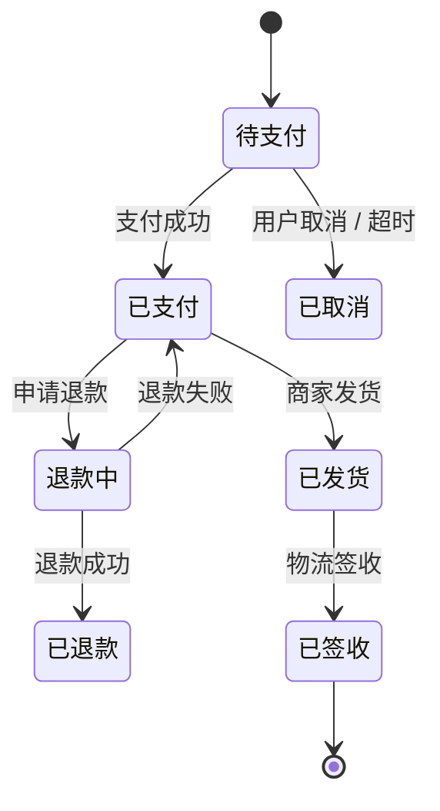

# Requirement Analysis — 需求分析 SKILL（ae-sdd Phase 1 起点）

> **🔴 核心定位（2026-06-17 重大重构）：** 本 SKILL 是 ae-sdd 体系的 **Phase 1 起点**（"入口"），与 `story-generate-skill` / `dr-generate-skill` / `dr-review-skill` 平级但**位置更靠前**——它产出"RA 文档 + 规模裁定 + 路由决策"，再触发下游对应 SKILL。
>
> **与现有 SKILL 的分工：**
> - `ae-sdd-skill.md` = 流程编排（Phase 1 起点在哪）
> - **`requirement-analysis-skill.md`（本文件）** = 需求分析的环节内具体规则（怎么分析）
> - `dr-generate-skill.md` = 设计需求生成（Phase 1 ② 节点，规模 = 大 时触发）
> - `story-generate-skill.md` = Story 生成（规模 = 中 时触发）
> - `task-generate-skill.md` = Task 生成（规模 = 小 时触发）
> - `coding-skill.md` = 编码实施（规模 = 微 / 特殊-BUG / 特殊-非代码 时触发）
> - `dr-review-skill.md` = DR 评审（dr-generate 之后）
> - [`templates/design/ra-template.md`](../../templates/design/ra-template.md) = RA 空白模板
> - [`templates/design/prd-template.md`](../../templates/design/prd-template.md) = PRD 空白模板
> - [`templates/design/issue-template.md`](../../templates/design/issue-template.md) = Issue 空白模板
>
> **🔴 核心立场（2026-06-17 新建）：** 之前 Phase 1 起点只有 `auto-engineering-skill` 中"读 PRD → 启动流程"的一行描述，**没有独立 SKILL**。本次新建补齐——把"需求分析"作为独立环节固化下来，避免下游 SKILL 各做一遍零散的需求理解。

---

## 🟠 门禁强度声明（v3.5.11 AA 诚实降级）

> 本文件「16 道 RA 质量闸 RA-G01~RA-G16」「第零步/第 0.5 步🔴硬门禁」「第七步 RA 挖掘循环」等标注，
> **逐条为软门禁（report-only）**，由 analyst 在 RA 文档内逐项自评判定，**RA-G01~16 无逐条 GATE_REGISTRY 注册**。
>
> **注意区分**：RA 层的**真硬门禁**已存在且机械执行——`tools/lib/gates.py` 的 **G-RA-1~G-RA-5 + G-RA-FLOW-VIOLATION**（v3.5.11 修复后真执行），
> 覆盖 RA 文档存在 / 8 维度完整 / 衍生章节 / 真实性扫描 / 机械派生深度（D1-D5）/ 流程违规审计（R1-R8）。
> RA-G01~16 是**更细颗粒度的 analyst 自评清单**，被 G-RA 系列从外部兜底但非逐条机械。
>
> **全维对齐追踪**见 `ae-sdd update-check` UC-08~UC-12（AA），RA-G 逐条承诺会被 UC-08 持续追踪为「软门禁/待硬化」。

---

## 📦 文档存放前置调用（🔴 横切依赖）

> **🔴 强制：** 本 SKILL 生成的 RA 文档在写入磁盘前**必须先调用 [`document-storage-skill.md`](../cross-cutting/document-storage-skill.md)** 确定：
> 1. **路径**（§2.2 路径模板）：`{工程根}/ae-sdd-doc/iterations/{YYYY-MM-DD}/RA/{RA-ID}.md`
> 2. **命名**（§3.1/3.2 命名规则）：**设计类文档带 v{major}.{minor}**（重入时 v 递增，旧版本保留）
> 3. **重入判定**（§4 重入 SOP）：RA 重入时**新增版本**（v{major}.{minor} 递增）
> 4. **关联性分析**（§6 关联性分析）：通过 `choose_iteration()` 判定属于哪个迭代（业务+逻辑双轨）
> 5. **ChangeLog**（§5 ChangeLog 机制）：每次修改必须追加 ChangeLog 行
> 6. **.gitignore**（§7 .gitignore 自动生成）：首次写入时自动维护

**本 SKILL 输出文档与 document-storage-skill §X 的对应：**

| 输出文档 | 路径模板 | 命名规则 | 重入时动作 |
|---------|---------|---------|----------|
| RA 主文档 | `{工程根}/ae-sdd-doc/iterations/{YYYY-MM-DD}/RA/{RA-ID}-v{major}.{minor}.md` | v{major}.{minor} | 新增版本（v 递增）|
| RA ChangeLog | `{工程根}/ae-sdd-doc/iterations/{YYYY-MM-DD}/RA/ChangeLog/{RA-ID}-changelog.md` | 不带版本号 | 追加新行（每次 RA 修订追加 1 行）|
| PRD（无输入时生成）| `{工程根}/ae-sdd-doc/PRD/{PRD-ID}.md` | 不带版本号 | 原地修改（按 prd-template）|
| Issue（无输入时生成）| `{工程根}/ae-sdd-doc/PRD/Issue-{编号}.md` | 不带版本号 | 原地修改（按 issue-template）|
| RAGeneratePlan | `{工程根}/ae-sdd-doc/iterations/{YYYY-MM-DD}/RA/ChangeLog/{RA-ID}-RAGeneratePlan-r{N}.md` | 带 r{N} | 新增（每轮生成 1 份）|
| RA 修订影响分析报告 | `save_doc(intent="RA_IMPACT", raId, version={N})` | 带 r{N} | 新增（每次修订生成） |
| RA 反向问题登记 | `save_doc(intent="RA_REVERSE_ISSUES", raId)` | 不带版本号 | 原地累加 |

**项目资产读取：** 通过 [`project-assets-update-skill.md`](../cross-cutting/project-assets-update-skill.md) §6.2 脚本化读取（`ae-sdd assets read`，倒排索引+BM25）：
- `ae-sdd assets read requirement-analysis --project <projectKey>` — 阶段入口（基线 KEY：AppService/Repository/DomainService/Service + §A/§B 整章）
- `ae-sdd assets outline --project <projectKey>` — 拉资产总览（5 秒了解项目范围）
- `ae-sdd assets query "<name>" --project <projectKey>` — 精准查模块/组件/字段/API（支持类名/字段名/业务词）
- `ae-sdd assets section <§X.Y> --project <projectKey>` — 按需拉章节内容（不全文加载）

**🔴 关键约束：**
- ❌ 不允许直接读 `design/`、`.ae-task/`、`.ae-plan/`、`.spec/iterations/` 等旧路径
- ✅ 强制使用 `ae-sdd-doc/` 新路径（document-storage-skill §2.1 强制）
- ✅ 强制调用 `choose_iteration()` 判定迭代（业务=0 ∧ 逻辑=0 → 强制问用户）

---

## 🧠 阶段记忆强制调用（🔴 横切依赖）

> **🔴 强制：** 需求分析是 ae-sdd 的上游事实入口，必须在开始前读取 RA/设计/项目记忆，并在输出 RA 后写入阶段记忆。禁止只依赖 Agent 对话记忆。

**进入本 SKILL 第一动作：**

```bash
ae-sdd memory enter --phase ra --story <STORY-ID>
```

**输出 RA 后必须写入：**

```bash
ae-sdd memory write --phase ra --story <STORY-ID> --kind decision --summary "<RA关键结论/缺口/假设/用户确认>"
```

**离开本节点前必须检查：**

```bash
ae-sdd memory exit --phase ra --story <STORY-ID>
```

`memory exit` 未通过 = RA 节点未完成，禁止进入 DR / Story / Task 下游。

---

## 0. 目标

从 PRD/Issue/对话需求生成 **完整、可评审、可路由** 的需求分析（RA）文档，5 大目标：

- **业务全景清晰**（让读者 5 秒内理解需求在做什么、解决什么问题）
- **RequirementAnalysisModel 12 维决策完整**（像 CodingModel 约束代码一样约束需求理解，不允许凭直觉跳结论）
- **8 维度挖掘无遗漏**（角色/场景/流程/数据/规则/设计方向/AC/假设）
- **5 问自检通过**（每条结论都有证据/反例/边界/冲突/缺口 5 个角度的检验）
- **5 维规模裁定 + 路由决策**（输出规模结果 + 下游 SKILL + 路径）
- **缺口管理显性化**（缺口不掩盖，所有未决问题有跟踪机制）

---

## 总则（🔴 4 条标尺，贯穿全 SKILL，违反 = 结论无效）

### 标尺 1：穷举优于抽样（🔴 "覆盖所有"必须先有穷举清单）

- 禁止使用"等等"/"其他"/"大概"等省略性措辞
- 任何"覆盖"类结论必须**先列穷举清单**（角色清单、场景清单、字段清单、规则清单、AC 清单），再逐项打钩
- 清单来源：PRD 显式声明 + 业务常识反推 + 用户补充确认

### 标尺 2：证据优于假设（🔴 每条结论可追溯到事实来源）

| 结论类型 | 必填证据格式 | 反例（❌ 不可接受）|
|---------|------------|------------------|
| "角色 X 有需求 Y" | `PRD §X.Y` 段落 + 行号 / `Issue #N 描述` / `用户对话第 N 轮` | "用户需要这个" |
| "场景 X 走主流程" | `PRD §X.Y 业务场景` + 行号 | "应该是这样" |
| "实体 X 有字段 Y" | `PRD §X.Y 数据字段` + `ae-sdd assets query "X"` 确认 | "应该有这个字段" |
| "规则 R1 适用" | `PRD §X.Y 业务规则` + `用户确认时间戳` | "我觉得要这样" |
| "AC-001 覆盖主流程" | `PRD §主流程步骤清单` + `AC-001 Given-When-Then` | "覆盖了" |

**红线：**
- **未发现 ≠ 已确认无**。必须先有穷举清单，才能写"无"。
- 任何无法定位到 PRD 章节/Issue 描述/用户对话的 ✅ 视为"未审查"，不算结论。
- 引用 PRD 章节必须 cite 章节号，引用用户对话必须 cite 轮次，引用项目资产必须 cite `assets.X()` 调用结果。

### 标尺 3：冲突显性化（🔴 冲突必须摆到台面讨论）

- 角色冲突：A 角色需要 X，B 角色需要 ¬X（互相排斥）→ 必须显式列出
- 业务冲突：业务规则 R1 与 R2 矛盾 → 必须显式列出
- 流程冲突：主流程 A 与异常流程 B 路径冲突 → 必须显式列出
- 冲突不识别 = 隐藏炸弹，RA 完成阶段必须重过冲突清单

### 标尺 4：缺口不掩盖（🔴 未确认问题必须列入"未决问题"）

- 任何"我不确定" / "用户没说" / "PRD 没说"的结论 → 必须显式列入缺口清单
- 缺口分级（🔴 阻断 / 🟠 严重 / 🟡 一般 / 🟢 建议）+ 处理方式（补充文档/问用户/接受模糊）
- RA 文档完成后，🔴 缺口必须解决（否则不进入规模裁定），🟠🟡🟢 缺口可标注但必须有负责人

---

## 🔴 RequirementAnalysisModel（12 维需求分析决策模型）

> **🆕 v3.1.3 强化：** 需求分析能力与 Coding 能力同等重要。Coding 阶段有 CodingModel 11 维决策与 CodingPlan 14 条门禁；RA 阶段必须同样有显式模型，避免"读完 PRD 直接写结论"。本节定义 **RequirementAnalysisModel 12 维决策**，RA 写作前必须逐维完成，任一维度无结论即禁止进入 8 维度挖掘。

### RAModel 12 维

| 维度 | 决策问题 | 必须产出 | 阻断条件 |
|------|---------|----------|----------|
| **RA-01 输入保真** | 输入到底说了什么，哪些是原文事实，哪些是 AI 推断？ | 输入事实清单 + 推断清单 + 引用位置 | 事实/推断混写，或无法引用来源 |
| **RA-02 目标与成功标准** | 需求要解决什么问题，成功如何度量？ | 目标树 + 成功指标 + 非目标 | 只有功能描述，没有业务目标或成功标准 |
| **RA-03 角色与权限边界** | 谁使用、谁受影响、谁决策、谁被限制？ | 角色矩阵 + 权限边界 + 冲突清单 | 角色只列"用户/管理员"等泛称 |
| **RA-04 场景拓扑** | 主流程、异常、边界、组合场景是否穷举？ | 场景拓扑图 + 场景清单 | 写了主流程但缺异常/边界/组合 |
| **RA-05 状态与生命周期** | 是否存在状态机、生命周期、反向流程？ | 状态机 + 生命周期表 + 终态/回滚说明 | 有状态变化但无合法/非法流转 |
| **RA-06 数据语义与所有权** | 哪些实体/字段参与，谁创建、修改、读取？ | 实体关系 + 字段约束 + 所有权 | 字段凭空编造，未用 `ae-sdd assets query` 反查 |
| **RA-07 业务规则与衍生规则** | 主规则触发后会衍生哪些规则？ | 主规则表 + R' 衍生规则登记表 | 状态变更类需求未跑 E.5 |
| **RA-08 跨域级联** | 状态/规则是否影响其他域、缓存、MQ、外部系统？ | 跨域级联效应表 | 涉及跨服务却写"无影响"且无证据 |
| **RA-09 现有能力复用** | 项目里是否已有模块、接口、组件、规则可复用？ | 复用扫描表 + 不复用理由 | 未查 `ae-sdd assets query`（search/component/api） |
| **RA-10 非功能与约束** | 性能、安全、合规、审计、可观测是否有要求？ | 非功能约束矩阵 | 只写业务功能，不写约束 |
| **RA-11 AC 与测试可验证性** | 每个场景/规则/衍生影响是否能被验收？ | AC 覆盖矩阵 + 衍生 AC 覆盖率 | AC 不能追溯到场景或规则 |
| **RA-12 规模与路由置信度** | 规模裁定是否有证据，路由是否正确？ | 5 维评分 + 路由置信度 + 反例 | 路由只凭感觉，无评分依据 |

### RAModel 决策记录模板（RA §0.5 必填）

```markdown
## §0.5 RequirementAnalysisModel 决策记录

| 维度 | 结论 | 证据 | 风险等级 | 后续动作 |
|------|------|------|----------|----------|
| RA-01 输入保真 | {结论} | {PRD §X / Issue / 用户对话轮次} | 🔴/🟠/🟡/🟢 | {动作} |
| RA-02 目标与成功标准 | {结论} | {来源} | {等级} | {动作} |
| ... | ... | ... | ... | ... |
| RA-12 规模与路由置信度 | {结论} | {评分证据} | {等级} | {动作} |

**阻断项：** {N} 个
**未决项：** {N} 个
**结论：** ☐ 可进入 8 维度挖掘 / ☐ 不可进入，需补充输入
```

### 需求风险预判（必须先于 8 维度挖掘）

> **为什么前置：** RA 的 8 维度是"写什么"，但在写之前必须先判断"这个需求最可能漏在哪里"。风险预判缺失，会导致下游 Story/Task/Coding 才发现需求洞，返工成本最高。

| 风险维度 | 判定问题 | 命中后的强制动作 |
|---------|----------|----------------|
| 输入缺失 | PRD/Issue 是否缺目标、角色、场景、规则、数据任一核心项？ | 进入缺口管理，必要时多轮追问 |
| 角色冲突 | 是否存在多角色诉求冲突或权限边界冲突？ | RA §2.3 必须出冲突方案 |
| 状态复杂 | 是否存在状态机、生命周期、反向流程？ | RA §4 + E.5 + G.5 必跑 |
| 跨域级联 | 是否影响 ≥2 个微服务/聚合根/外部系统？ | H.6 必跑，输出级联效应表 |
| 数据敏感 | 是否涉及个人信息、权限、审计、删除、归档？ | RA §5 + §6.3 必须列约束 |
| 复用风险 | 是否可能重复造轮子或绕过团队既有能力？ | F 阶段先做复用扫描 |
| 验收风险 | 是否存在难以测试/验收的模糊目标？ | G 阶段补 AC，不能验证则列缺口 |
| 路由风险 | 规模可能被低估或高估？ | 第五步必须给反例和置信度 |

**门禁：** 风险预判表未完成 → 禁止进入第一步 8 维度挖掘。每个命中风险必须在对应 RA 章节体现；未体现则第七步门禁失败。

---

## 触发条件

| 触发场景 | 触发方式 | 输入类型 |
|---------|---------|---------|
| Phase 1 起点 | `ae-sdd-skill` 编排层自动触发 | 任何 |
| 用户手动 | "分析需求" / "从 PRD 开始" / "需求拆解" / "需求分析" | 任何 |
| 有 PRD 文件 | 用户提供文件路径 | PRD（直接走第零步）|
| 有 Issue 文件 | 用户提供文件路径 | Issue（直接走第零步）|
| 无输入（对话需求 + 复杂）| 多轮对话 | 自动写 PRD → 进入第零步 |
| 无输入（对话需求 + 简单）| 多轮对话 | 自动写 Issue → 进入第零步 |
| BUG/配置类 | 用户描述 | 直接进第零步（用 Issue 模板）|
| 重入（已有 RA）| 用户说"修改 RA" / "重做需求分析" | 修订（按 §重入 SOP）|

---

## Plan-first 生成原则（🔴 写 RA 前硬前置）

> **🔴 强制：** RA 生成前**必须**先有 RAGeneratePlan，按 Plan 执行。
>
> **Plan-first 与下游 SKILL 的差异：**
> - `dr-generate-skill` / `story-generate-skill` 是 "DR-章节-初稿" 单向链
> - 本 SKILL 是 **"输入识别 → 8 维度挖掘 → 自检 → 缺口 → 规模 → 路由"** 6 段链
> - RAGeneratePlan 的目的是把"输入 + 挖掘 + 自检"做成可执行 SOP，避免"边挖边漏"

**RAGeneratePlan 内容：**

```markdown
## RAGeneratePlan - {RA-ID} - {YYYY-MM-DD HH:mm}

### 1. 输入识别
- 输入类型：PRD / Issue / 对话 / 重入
- 输入文件路径：{path}
- 输入复杂度判定：{复杂（>3 功能点）/ 简单（1-3 功能点）/ BUG/配置}
- 写入策略：{直接走 / 多轮对话写 PRD / 多轮对话写 Issue}

### 2. 8 维度挖掘 SOP
- 第 0.5 步 RequirementAnalysisModel：{12 维决策记录 + 需求风险预判，任一阻断项先补齐}
- 阶段 A 角色分析：{从 PRD 角色段 + 现有项目角色反推}
- 阶段 B 场景分析：{PRD 业务场景 + 项目资产业务流程}
- 阶段 C 业务流程：{PRD 流程图 + 补充文档}
- 阶段 D 数据要素：{PRD 字段 + `ae-sdd assets query "<tableName>"` 反查}
- 阶段 E 业务规则：{PRD 规则段 + `ae-sdd assets section §6.X` 约束}
- 阶段 E.5 衍生规则强制追问：{主规则 R → 衍生规则 R' 登记表，命中 H.5 模式编号}
- 阶段 F 设计方向：{PRD 功能 + `ae-sdd assets query "<componentName>"` 复用扫描}
- 阶段 G AC 雏形：{PRD 业务场景 + 业务流程}
- 阶段 G.5 衍生 AC 强制覆盖：{主场景 AC → 衍生 AC，配套 E.5 衍生规则}
- 阶段 H 假设挖掘：{PRD 全文反推}
- 阶段 H.5 通用业务模式 Checklist：{6 大模式 + 衍生影响穷举 + 业务模式匹配表}
- 阶段 H.6 跨域级联效应 Checklist：{5 问追问 + 跨域级联效应表}

### 3. 5 问自检清单（每条结论）
- [ ] 证据（cite PRD 章节/Issue 描述/用户对话轮次）
- [ ] 反例（有无反例推翻此结论）
- [ ] 边界（此结论在什么边界条件下不成立）
- [ ] 冲突（与其他维度结论有无冲突）
- [ ] 缺口（假设了什么未明确事实）

### 4. 缺口管理策略
- 🔴 阻断型：必须解决（补充文档/用户确认）
- 🟠 严重型：24h 内解决
- 🟡 一般型：48h 内解决
- 🟢 建议型：下次迭代

### 5. 规模裁定算法
- 5 维评分（服务范围/接口变更/架构决策/数据变更/测试层级）
- 规模判定（一票否决：架构决策=4 或 数据变更=4 → 大）
- 路由决策（6 类规模 → 6 类下游 SKILL）

### 6. 与下游 SKILL 衔接
- 规模 = 大 → 触发 `dr-generate-skill`，传入 RA + PRD + 项目资产
- 规模 = 中 → 触发 `story-generate-skill`，传入 RA + PRD + 项目资产
- 规模 = 小 → 触发 `task-generate-skill`，传入 RA + 项目资产
- 规模 = 微/特殊-BUG/特殊-非代码 → 触发 `coding-skill`，传入 RA
```

---

## 整体流程

```
触发（PRD/Issue/对话/重入）
    ↓
第 -1 步：需求来源识别（多轮对话 + PRD/Issue 沉淀）
    ↓
第零步：RA 准入检查（PRD/Issue + 项目资产索引 + 历史 RA + 约束）
    ↓
第 0.5 步：RequirementAnalysisModel 12 维决策 + 需求风险预判
    ↓
第一步：8 维度并行挖掘
    ├─ 阶段 A：角色分析
    ├─ 阶段 B：场景分析
    ├─ 阶段 C：业务流程
    ├─ 阶段 D：数据要素
    ├─ 阶段 E：业务规则与约束
    ├─ 阶段 F：设计方向论证
    ├─ 阶段 G：验收标准雏形
    └─ 阶段 H：隐性假设与验证
    ↓
第一步 bis：每条结论 5 问自检（证据/反例/边界/冲突/缺口）
    ↓
第二步：缺口汇总 + 循环迭代
    ↓
第三步：写入 RA 文档（save_doc + choose_iteration）
    ↓
第三步 bis：生成 RAGeneratePlan
    ↓
第四步：🔴 人工审核点（双支柱呈现）
    ↓
第五步：🔴 5 维规模裁定 + 路由决策
    ↓
第六步：触发下游 SKILL
    ↓
第七步：🔴 RA 挖掘循环（引用 review-loop 公共协议 — 反复挖掘 + 连续 3 轮无新增才退出）
    ↓
完成 → 进入 Phase 1 下游
```

**关键原则：** 每个步骤必须产出中间结果，用户确认后方可进入下一步。未确认禁止继续。RAModel 12 维是 8 维度挖掘的硬前置，不允许边写 RA 边补模型。

---

## 第 -1 步：需求来源识别

> **🔴 关键：** 本步决定"用什么作为 RA 的输入"——是直接走第零步，还是先做多轮对话沉淀为 PRD/Issue。

### -1.1 输入类型判定子流程

```
For each 输入类型：
  ├─ 有 PRD 文件 → 直接进第零步（不再沉淀）
  ├─ 有 Issue 文件 → 直接进第零步
  ├─ 对话需求 + 复杂（>3 个功能点）→ 多轮对话 → 写 PRD（prd-template）→ 进第零步
  ├─ 对话需求 + 简单（1-3 个功能点）→ 多轮对话 → 写 Issue（issue-template）→ 进第零步
  └─ BUG/配置类 → 直接进第零步（用 Issue 模板，无需多轮对话）
```

### -1.2 多轮对话 SOP

**原则：每次只问 1-3 个关键问题，避免一次性灌入大量问题让用户崩溃。**

| 轮次 | 主题 | 关键问题 |
|------|------|---------|
| 第 1 轮 | 业务背景 + 目标 | "你希望解决什么业务问题？" / "目标用户是谁？" / "成功的标准是什么？" |
| 第 2 轮 | 核心场景 + 角色 | "核心使用场景是什么？" / "涉及哪些角色？" / "每个角色想完成什么？" |
| 第 3 轮 | 边界 + 异常 | "边界条件（如空数据/超长字段/弱网）怎么处理？" / "异常情况如何处理？" |
| 第 4 轮 | 约束 + 依赖 | "性能/安全/合规要求？" / "依赖哪些已有模块/接口/数据？" |

**对话技巧：**
- 用 Given-When-Then 框架引导用户描述（"假设用户 X，想做 Y，应该 Z"）
- 拒绝模糊回答（用户说"合理" → 反问"什么算合理？举 1 个具体场景"）
- 每轮结束时总结 + 让用户确认，再进入下一轮

### -1.3 输入沉淀模板

**PRD 模板**（复杂需求）：参见 [`templates/design/prd-template.md`](../../templates/design/prd-template.md)
- 必填：概述（背景/目标/范围）/ 角色 / 业务场景 / 功能清单 / 业务流程 / 非功能需求 / 已有业务依赖
- 路径：`{工程根}/ae-sdd-doc/PRD/{PRD-ID}.md`

**Issue 模板**（简单需求/BUG）：参见 [`templates/design/issue-template.md`](../../templates/design/issue-template.md)
- 必填：问题描述（现象/复现步骤/期望/实际）/ 影响范围 / 解决方向
- 路径：`{工程根}/ae-sdd-doc/PRD/Issue-{编号}.md`

### -1.4 第 -1 步产出

```markdown
## 需求来源识别记录

| # | 项 | 值 |
|---|----|---|
| 1 | 输入类型 | PRD / Issue / 对话（复杂）/ 对话（简单）/ BUG/配置 |
| 2 | 输入文件 | {path 或"无"} |
| 3 | 对话轮次 | {N 轮} |
| 4 | 沉淀产物 | {PRD-{ID}.md / Issue-{ID}.md / 无} |
| 5 | 用户确认 | ☐ 已确认 ☐ 待确认 |

**门禁：**
- ✅ 输入已沉淀为 PRD/Issue（按适用情况）→ 进第零步
- ❌ 输入未沉淀 → 停止，继续多轮对话
```

---

## 第零步：RA 准入检查（🔴 硬门禁，未通过禁止进入挖掘）

> **🔴 必读清单（9 项）：**

| # | 来源 | 文件 | 读取要求 | 工具 |
|---|------|------|---------|------|
| 1 | 用户提供 | PRD/Issue 文件 | 全文 | Read 全文 |
| 2 | 用户提供 | PRD 补充文档 | 全文（如有）| Read 全文 |
| 3 | 自动加载 | 项目资产大纲 | 关键模块 | `ae-sdd assets outline --project <projectKey>` |
| 4 | 自动加载 | 相关模块详情 | 按需 | `ae-sdd assets query "<name>" --project <projectKey>` |
| 5 | 自动加载 | 相关表字段 | 按需 | `ae-sdd assets query "<tableName>" --project <projectKey>` |
| 6 | 自动加载 | 相关公共组件 | 按需 | `ae-sdd assets query "<componentName>" --project <projectKey>` |
| 7 | 自动加载 | 历史 RA 摘要（如有重入）| 同模块或同业务域 | 文件系统扫描 `ae-sdd-doc/iterations/*/RA/*.md` |
| 8 | 模板 | RA 模板 | 必读 | Read `templates/design/ra-template.md` |

**门禁判定：**
- ✅ 全部读取 + 用户确认 → 进第一步
- ❌ 任一缺失 → 停止，补充读取 + 用户确认

**第零步产出：准入检查记录**

```markdown
## RA 准入检查记录 - {RA-ID} - {YYYY-MM-DD HH:mm}

| # | 来源 | 状态 | 备注 |
|---|------|------|------|
| 1 | PRD/Issue | ✅ 已读 / ❌ 未读 | {路径} |
| 2 | 补充文档 | ✅ 已读 / ❌ 无 | {路径} |
| 3 | 项目资产大纲 | ✅ `ae-sdd assets outline` / ❌ | 关键模块：{N} 个 |
| 4 | 相关模块详情 | ✅ `ae-sdd assets query "<{X}>"` / ❌ | 涉及：{模块列表} |
| 5 | 相关表字段 | ✅ `ae-sdd assets query "<{X}>"` / ❌ | 涉及：{表列表} |
| 6 | 相关组件 | ✅ `ae-sdd assets query "<{X}>"` / ❌ | 涉及：{组件列表} |
| 7 | 历史 RA | ✅ {N} 份 / ❌ 无 | 关联：{列表} |
| 8 | RA 模板 | ✅ 已读 / ❌ | |
| 9 | RAModel 12 维 | ✅ 已准备 / ❌ | 将写入 RA §0.5 |

**用户确认：** ☐ 通过 ☐ 补充后再继续
```

---

## 第 0.5 步：RAModel 决策 + 需求风险预判（🔴 硬门禁）

> **🔴 关键：** 本步相当于 Coding 阶段的 CodingModel。RA 不是把 PRD 改写成报告，而是先用 RAModel 明确"如何理解、哪里有风险、哪些结论需要证据"。本步未完成禁止进入第一步 8 维度挖掘。

### 0.5.1 RAModel 执行 SOP

1. 逐维填写 RA-01 ~ RA-12 决策记录。
2. 每个维度必须给出"结论 + 证据 + 风险等级 + 后续动作"四列。
3. 风险等级为 🔴 或 🟠 的维度必须进入缺口管理，不允许在 RA 中用模糊文字绕过。
4. RA-09 现有能力复用必须至少调用一次 `ae-sdd assets query "<关键词>"`；如资产无结果，写明调用记录。
5. RA-12 规模与路由置信度必须同时写"支持当前路由的证据"和"可能推翻当前路由的反例"。

### 0.5.2 需求风险预判表（RA §0.6 必填）

```markdown
## §0.6 需求风险预判

| 风险维度 | 是否命中 | 证据 | 强制动作 | 落地章节 |
|---------|----------|------|----------|----------|
| 输入缺失 | 是/否 | {来源} | {追问/补文档/接受模糊} | §10 |
| 角色冲突 | 是/否 | {来源} | {冲突方案} | §2.3 |
| 状态复杂 | 是/否 | {来源} | {状态机 + 衍生规则/AC} | §4/§6.5/§8.5 |
| 跨域级联 | 是/否 | {来源} | {H.6 级联表} | §9-ter |
| 数据敏感 | 是/否 | {来源} | {合规/审计/脱敏} | §5/§6.3 |
| 复用风险 | 是/否 | {assets 调用} | {复用扫描} | §7 |
| 验收风险 | 是/否 | {来源} | {补 AC} | §8 |
| 路由风险 | 是/否 | {评分证据} | {反例/置信度} | §11 |
```

### 0.5.3 出闸条件

- [ ] RA-01 ~ RA-12 全部有结论，且无空白/待补。
- [ ] 所有 🔴 阻断风险均已进入缺口管理，且处理动作明确。
- [ ] 风险预判命中项均能追溯到后续 RA 章节。
- [ ] RA-09 已完成项目资产复用扫描。
- [ ] RA-12 已给出路由置信度与反例。

任一不满足 → 停止，补充输入或回到第 -1 步继续多轮对话。

---

## 第一步：8 维度并行挖掘

> **🔴 关键：** 8 维度**并行执行**（不是顺序），每个阶段独立产出，最后汇总为 RA 文档 12 章节。
>
> **并行执行机制：** 当前为逻辑并行（同一 AI 轮流填充每个维度）。若需物理 sub-agent 并行，参见 [`agent-orchestration-skill.md`](../cross-cutting/agent-orchestration-skill.md) 的任务拆分协议。

### 阶段 A：角色分析（→ RA §2）

**输入：**
- PRD/Issue 角色段
- `ae-sdd assets query "<moduleName>"` 中的"已涉及角色"反查
- `ae-sdd assets query "角色"` 关键词反查

**产出（RA §2）：**
- §2.1 角色枚举（穷举，不许"其他"）
- §2.2 角色 × 需求 × 效果矩阵
- §2.3 角色冲突识别清单
- §2.4 角色优先级（P0/P1/P2）

**🔴 必禁：**
- 不可"等等" / "其他" / "大概"
- 不可省略角色（PRD 写了 3 个角色，RA 只能多不能少）

**示例：**
> 角色 1：C 端用户
> - 核心需求：在 App 上查看订单状态
> - 完成动作：进入 App → 点击"我的订单" → 查看列表
> - 期望效果：实时看到订单最新状态
> - 不希望：等待时间长 / 状态更新不及时
> - 优先级：P0

### 阶段 B：场景分析（→ RA §3）

**输入：**
- PRD 业务场景段
- PRD 用户旅程
- 项目资产业务流程

**产出（RA §3）：**
- §3.1 主流程场景（穷举，每个场景编号）
- §3.2 异常场景（按 4 类分组：业务/系统/数据/并发）
- §3.3 边界场景（空数据/超长字段/弱网/离线/大数据量/国际化）
- §3.4 跨场景组合（如"大文件 + 弱网"）

**🔴 必填字段（每个异常场景）：**
- 触发条件
- 检测点
- 处理动作
- 用户提示

### 阶段 C：业务流程（→ RA §4）

**输入：**
- PRD 业务流程段
- PRD 状态机图
- 补充文档中的时序图

**产出（RA §4）：**
- §4.1 状态机图（Mermaid stateDiagram）
- §4.2 主流程时序（Mermaid sequenceDiagram）
- §4.3 异常处理矩阵（异常类型 × 触发条件 × 检测点 × 处理动作 × 用户提示）

**Mermaid 状态机示例：**


### 阶段 D：数据要素（→ RA §5）

**输入：**
- PRD 数据字段段
- `ae-sdd assets query "<tableName>"` 查实际表结构
- `ae-sdd assets query "<字段名>"` 反查字段是否在多表出现

**产出（RA §5）：**
- §5.1 核心实体列表（主表/关系表/历史表，穷举）
- §5.2 实体关系图（Mermaid erDiagram）
- §5.3 字段约束矩阵（每字段：类型/约束/枚举/默认值/业务含义）
- §5.4 数据生命周期（创建/读取/更新/删除归档）
- §5.5 数据所有权（创建方/修改方/查询方）

**🔴 必填字段（每实体）：**
- 表名（来自 `ae-sdd assets query` 确认存在）
- 字段清单（来自 `ae-sdd assets query` 实际字段，禁止猜测）
- 主键 + 索引（PK/UK/普通索引）
- 审计四字段（id/created_by/created_date/last_updated_by/last_updated_date）
- 逻辑删除字段（deleted_flag）

**🔴 必禁：**
- 禁止凭空编造字段（必须 `ae-sdd assets query` 反查确认）
- 禁止使用过时的项目资产（`lastAuditedAt > 90 天` 时先触发资产更新）

### 阶段 E：业务规则与约束（→ RA §6）

**输入：**
- PRD 业务规则段
- `ae-sdd assets section §6.X` 读工程约束
- `standards/constraints/` 8 个 .md

**产出（RA §6）：**
- §6.1 业务规则列表（每条规则 R1/R2/R3 编号）
- §6.2 平台约束（接口路径/数据隔离/分页规范）
- §6.3 合规要求（数据脱敏/审计日志/等保）
- §6.4 性能约束（P99 响应时间/TPS/并发数）

**🔴 必填字段（每规则）：**
- 规则编号（R1, R2, ...）
- 规则描述（来自 PRD）
- 证据来源（cite PRD 章节）
- 违反后果
- 处置方式

### 阶段 E.5：状态变更衍生规则强制追问（🔴 状态机需求必跑）

> **🆕 2026-06-23 强化：** 原阶段 E 只列业务规则 R1/R2/R3，**没有"状态变更衍生规则 R'"** 的强制追问。导致用户场景下"账号禁用"这条主规则只到 R1 就停了，没有衍生出 R1.1（T 下线）/ R1.2（CS Away）/ R1.3（IM Offline） 等。**本节强制每个状态变更主规则必须显式追问衍生规则。**
>
> **触发条件：** RA §4 状态机涉及任何状态变更主规则 R（如 R1）时必跑。
>
> **🔴 v3.5.9 机器强制：** 本阶段产出由 `G-RA-5` 机械校验（`scripts/ra_depth_scan.py` D1 规则）。**§6.5 有表头无逐行 R→R' 机械派生 = BLOCKER，等同未做。** 每个主规则 R 至少要有 1 行衍生 R'，且每行 R' 的「衍生模式命中」列必须含 H.5/H.5.1/编号（禁止空/「无」）。这是用户"13 个问题 → 被逼出 34 个"案例的直接根因——AI 把已知事实摘来归个类就停了，G-RA-5 把这种"形式通过、内容空转"变成可捕获的 BLOCKER。

#### E.5.1 衍生规则强制追问 SOP

**🔴 强制：每条业务规则 R 必须回答："R 触发后，状态变更衍生出哪些规则 R'?"**

| 追问 # | 问 | 不通过的处理 |
|--------|---|------------|
| 1 | R 触发后，是否有**直接依赖方**需要立刻响应？（同事务内同步调用）| 没回答 → 🔴 缺口 |
| 2 | R 触发后，是否有**间接依赖方**需要异步响应？（MQ / 事件广播）| 没回答 → 🔴 缺口 |
| 3 | R 触发后，是否有**外部副作用**需要清理？（缓存 / 索引 / 文件）| 没回答 → 🔴 缺口 |
| 4 | R 触发后，是否有**通知**需要发送？（站内信 / 邮件 / 短信 / IM）| 没回答 → 🔴 缺口 |
| 5 | R 触发后，是否有**审计 / 合规**要求记录？（操作日志 / 风控）| 没回答 → 🔴 缺口 |
| 6 | R 触发后，是否有**反向操作流程**？（解锁 / 回滚 / 补偿）| 没回答 → 🔴 缺口 |

**🔴 不允许"R 触发后无衍生规则"作为结论**——必须显式标注"经 H.5 模式 #X 的衍生影响 #Y 全检后确认无衍生，理由：{N}"。

#### E.5.2 衍生规则登记表（🔴 RA §6.5 必填）

```markdown
## 衍生规则登记表（RA §6.5）

| 规则 # | 主规则 R | 衍生规则 R'（必填）| 衍生模式命中 | R' 优先级 | R' 验证方式 |
|--------|---------|------------------|------------|----------|-----------|
| R1 | 5 次登录失败锁账号 | R1.1 进行中会话处理（强 T / 弱提示 / 无动作）| H.5.1 模式 1.① | P0 | 用户确认 + 项目资产反查 |
| R1 | 5 次登录失败锁账号 | R1.2 CS Away 状态联动 | H.5.1 模式 1.④ | P0 | 用户确认 + IM/CS 域 RA 关联 |
| R1 | 5 次登录失败锁账号 | R1.3 IM Offline 状态联动 | H.5.1 模式 1.⑤ | P0 | 用户确认 + IM 域 RA 关联 |
| R1 | 5 次登录失败锁账号 | R1.4 待处理工单挂起（客服在跟客户时）| H.5.1 模式 1.⑥ | P0 | 用户确认 + CS 域 RA 关联 |
| R1 | 5 次登录失败锁账号 | R1.5 待处理工单归属（谁接单 / 退回池）| H.5.1 模式 1.⑦ | P1 | 用户确认 + 业务方决策 |
| R1 | 5 次登录失败锁账号 | R1.6 审计日志（操作记录 + 原因 + 操作人）| H.5.1 模式 1.⑧ | P0 | 强制（合规要求）|
| R1 | 5 次登录失败锁账号 | R1.7 通知触达（站内信 / 邮件 / 短信）| H.5.1 模式 1.⑨ | P1 | 用户确认 + 通知中台 |
| R1 | 5 次登录失败锁账号 | R1.8 缓存失效（Redis / 本地缓存）| H.5.1 模式 1.⑩ | P0 | 代码反查 |
| R1 | 5 次登录失败锁账号 | R1.9 反向解锁流程（自助 / 管理员）| H.5.1 模式 1.⑪ | P1 | 用户确认 + 安全域决策 |
| R1 | 5 次登录失败锁账号 | R1.10 数据归档策略 | H.5.1 模式 1.⑫ | P2 | 用户确认 + DBA 决策 |
| R2 | 被分配客服角色可在 CS 端登录 | R2.1 角色变更实时生效 | H.5.1 模式 5.① | P0 | 强制（业务要求）|
| ... | ... | ... | ... | ... | ... |

**🔴 强制：**
- 主规则 R1 至少要有 3 条衍生规则 R1.X（基于 H.5 模式 1 至少 10 个衍生方向）
- 衍生规则必须能追溯到 H.5 模式编号 + 衍生影响编号
- 衍生规则必须走 5 问自检（见第一步 bis）
```

#### E.5.3 衍生规则编号约定

- **主规则 R1** 衍生 → **R1.1, R1.2, R1.3, ...**（按 H.5 模式编号顺序）
- **跨主规则共享的衍生** → **R-cross-1, R-cross-2, ...**（独立编号，注明被哪些 R 共享）
- **跨域级联专用** → **R-cascade-1, R-cascade-2, ...**（基于 H.6 跨域级联效应表）

---

### 阶段 F：设计方向论证（→ RA §7）

**输入：**
- PRD 功能清单
- `ae-sdd assets query "<componentName>"` 查公共组件（避免重复造轮子）
- `ae-sdd assets query "<method>"` 查现有 API 契约
- 团队既有实现（项目资产 §10 经验文档）

**产出（RA §7）：**
- §7.1 备选方案（至少 2 个，通常 3 个：A/B/C）
- §7.2 方案对比矩阵（维度：复杂度/性能/可维护性/可扩展性/影响面）
- §7.3 取舍说明（选定方案 + 选定理由 + 接受代价）

**🔴 必填字段（每个方案）：**
- 实现思路
- 优点
- 缺点
- 工作量（人天）
- 影响面（涉及哪些工程/模块/接口/表）

**🔴 必禁：**
- 禁止"先用着" / "后面再优化" / "更方便"等模糊理由
- 禁止跳过"现有能力复用扫描"（直接进方案对比）

### 阶段 G：验收标准雏形（→ RA §8）

**输入：**
- PRD 业务场景
- PRD 业务流程
- §3 场景清单
- §4 状态机

**产出（RA §8）：**
- §8 AC 清单（Given-When-Then）
- §8 覆盖矩阵（AC × 主流程/异常/边界/并发 4 类场景）

**🔴 AC 格式（Given-When-Then）：**
- AC_ID: AC-001
- 描述：{一句话}
- Given（前置）：{角色 / 数据 / 状态}
- When（操作）：{操作步骤}
- Then（预期）：{结果 + 错误码}

**🔴 AC 必覆盖：**
- 每个主流程关键步骤至少 1 个 AC
- 每个异常场景至少 1 个 AC
- 每个边界场景至少 1 个 AC
- 状态机（若有）：合法流转 + 非法流转 + 初始态 + 终态 + 并发/幂等
- 性能/安全/合规约束（若有）：至少 1 个 AC

### 阶段 G.5：状态变更衍生 AC 强制覆盖（🔴 状态机需求必跑）

> **🆕 2026-06-23 强化：** 原阶段 G AC 覆盖只列"主流程 + 异常 + 边界 + 状态机 + 性能安全"5 类，**没有"状态变更衍生 AC"** 的强制覆盖。导致用户场景下"账号禁用"只到 AC-001（5 次失败锁定），没有衍生 AC-004（T 下线） / AC-005（CS Away） / AC-006（IM Offline） / AC-007（缓存失效） 等。**本节强制每个状态变更场景必须配套 1 个衍生 AC，描述"触发后 N 秒内系统自动 {衍生动作}"。**
>
> **触发条件：** RA §4 状态机涉及任何状态变更场景时必跑。
>
> **🔴 v3.5.9 机器强制：** 本阶段产出由 `G-RA-5` 机械校验（D2 R'→AC 链接完整性 + D3 §8.6 覆盖率真实重算）。**§8.5 写了个 AC 但未追溯到 R' 的「对应规则 R'」列 = BLOCKER；§8.6 声明 K/M 与实际 K/M 不一致（声明≠实际即视为"形式通过、内容空转"）= BLOCKER。**

#### G.5.1 衍生 AC 强制覆盖 SOP

**🔴 强制：每个状态变更主场景必须配套至少 1 个衍生 AC。每个衍生业务规则 R' 必须至少有 1 个衍生 AC'。**

| 衍生类型 | 必填的 AC 类型 | 示例 |
|---------|--------------|------|
| 会话处理 | AC-衍生-N：触发后 X 秒内进行中会话全部断开 | AC-004：账号锁定后 5 秒内 3 个会话断开 |
| 状态联动 | AC-衍生-N：触发后 X 秒内关联域状态变更 | AC-005：账号锁定后 5 秒内 CS Away |
| 缓存失效 | AC-衍生-N：触发后 X 秒内缓存 key 失效 + 下次回源 | AC-006：账号锁定后 1 秒内 Redis 失效 |
| 通知触达 | AC-衍生-N：触发后 X 秒内收到通知（多通道）| AC-007：账号锁定后 5 秒内站内信 + 5 分钟内邮件 |
| 审计日志 | AC-衍生-N：操作记录包含 {字段清单} | AC-008：审计日志含 locked_at / lock_reason / lock_operator |
| 反向流程 | AC-衍生-N：解锁后 X 秒内状态恢复 | AC-009：自助解锁后 5 秒内 IM 重新 Online |
| 工单归属 | AC-衍生-N：客服被锁后工单自动 {动作} | AC-010：客服被锁后 5 个待处理工单进入挂起池 |
| 数据归档 | AC-衍生-N：账号禁用后 N 天数据冷存 | AC-011：账号禁用 30 天后登录日志归档到 OSS |

#### G.5.2 衍生 AC 登记表（🔴 RA §8.5 必填）

```markdown
## 衍生 AC 登记表（RA §8.5）

| AC # | 主场景 | 衍生场景 | 衍生动作 | 时效要求 | Given-When-Then | 对应规则 R' | 状态 |
|------|--------|---------|---------|---------|----------------|-----------|------|
| AC-001 | 5 次登录失败 | 主规则 | 锁定账号 | 即时 | Given 账号 A 第 4 次失败 / When 第 5 次失败 / Then 账号 A 状态变 Locked + 返回错误码 21XXX | R1 | ✅ |
| **AC-004** | 账号锁定 | 进行中会话处理 | 强制 T 下线 | 5 秒内 | Given 客服账号 A 在 CS 端登录且有 3 个进行中会话 / When 账号 A 被锁 / Then 5 秒内 3 个会话全部断开 + CS 状态变 Away + IM 状态变 Offline | R1.1, R1.2, R1.3 | 🟡 待用户确认 |
| **AC-005** | 账号锁定 | 缓存失效 | Redis key DEL | 1 秒内 | Given Redis 中有 user:profile:{A} / When 账号 A 被锁 / Then 1 秒内 Redis key 失效 + 下次读请求回源 DB | R1.8 | 🟡 待用户确认 |
| **AC-006** | 账号锁定 | 通知触达 | 站内信 + 邮件 | 5 秒内 + 5 分钟内 | Given 客服账号 A / When 账号 A 被锁 / Then 5 秒内 A 收到站内信 + 5 分钟内收到邮件 + 触发管理员审计通知 | R1.7 | 🟡 待用户确认 |
| **AC-007** | 账号锁定 | 审计日志 | 写 audit_log | 即时 | Given 账号 A / When 账号 A 被锁 / Then audit_log 表新增记录含 {locked_at, lock_reason, lock_operator} | R1.6 | ✅ 强制合规 |
| **AC-008** | 账号锁定 | 工单挂起 | 工单进挂起池 | 5 秒内 | Given 客服账号 A 当前有 5 个待处理工单 / When 账号 A 被锁 / Then 5 个工单进入"挂起池"等待管理员分配 + 客户收到"客服繁忙"提示 | R1.4, R1.5 | 🟡 待用户确认 |
| **AC-009** | 账号解锁 | 反向流程 | 状态恢复 | 5 秒内 | Given 客服账号 A 已自助解锁 / When 解锁成功 / Then 5 秒内 IM 重新 Online + CS 重新 Available + Redis 回填 | R1.9 | 🟡 待用户确认 |
| ... | ... | ... | ... | ... | ... | ... | ... |

**🔴 强制：**
- 每个主场景 AC-XXX 必须配套至少 1 个衍生 AC-衍生-N
- 衍生 AC 必须有明确的"时效要求"（X 秒内，不是"尽快"）
- 衍生 AC 必须能追溯到 R'（衍生规则登记表）
- "🟡 待用户确认"必须在审核节点前确认状态变 ✅ / ⚠️ 修改
```

#### G.5.3 衍生 AC × 主 AC 覆盖率计算

```markdown
## 衍生覆盖率（RA §8.6）

| 维度 | 数量 | 覆盖率 |
|------|------|--------|
| 主场景 AC（原始）| N | — |
| 衍生规则 R' 总数 | M | — |
| 已配套衍生 AC 数 | K | K / M × 100% |
| 衍生 AC 时效要求明确率 | T | T / K × 100%（要求 100%）|
| 衍生 AC 跨域覆盖数 | C | — |

**🔴 阻断：K / M < 80% 或时效要求明确率 < 100% → 不允许进入 §第四步 用户审核。**
```

---

### 阶段 H：隐性假设与验证（→ RA §9）

**输入：**
- PRD 全文（挖掘未明说但实际依赖的事实）
- 业务常识
- 项目资产中的类似实现

**产出（RA §9）：**
- 假设清单（每条 H1/H2/H3 编号）
- 验证方式（补充文档/用户确认/代码反查）
- 验证结果（已确认 / 已反驳 / 待确认）

**🔴 假设来源（4 类）：**
- PRD 提到的但未说明的（如"用户登录" → 假设"用户已有账号"）
- 业务常识反推的（如"订单状态变更" → 假设"会发送通知"）
- 跨模块依赖的（如"调支付" → 假设"支付服务可用"）
- 性能/安全隐含的（如"高频查询" → 假设"需要缓存"）

### 阶段 H.5：通用业务模式 Checklist（🔴 必跑穷举，不许跳过）

> **🆕 2026-06-23 强化：** 阶段 H 原 4 类假设来源只给一句话示例，LLM 自由发挥容易遗漏深度方向（如"账号禁用 → 进行中会话处理"会漏掉 CS Away / IM Offline / 工单挂起 / 缓存失效 等 11+ 个衍生影响）。本节固化 **6 大通用业务模式 + 每模式衍生影响穷举清单**，强制 LLM 套模式扫齐再写结论。
>
> **🔴 v3.5.9 机器强制：** 本阶段产出由 `G-RA-5` 机械校验（D5 §9-bis 业务模式六选一）。**6 大模式（账号状态变更/订单状态变更/支付状态变更/登录态变更/权限变更/定时任务状态）每个必须明确「适用（含编号）」或「不适用 + 理由」；模式存在但两列皆空 = BLOCKER。**
> **触发条件：** 任何 RA 文档 §3（场景）或 §4（状态机）出现以下关键词时**必跑**：状态变更 / 状态机 / 触发 / 联动 / 禁用 / 启用 / 锁定 / 解锁 / 注销 / 角色变更 / 退款 / 取消 / 登录 / 登出 / 失败 / 超时 / 过期。

#### H.5.1 六大通用业务模式 + 衍生影响穷举

| # | 业务模式 | 典型状态机 | 衍生影响（穷举）|
|---|---------|----------|---------------|
| **1** | **账号状态变更** | 启用 / 禁用 / 锁定 / 注销 / 角色变更 | ① 进行中会话处理（T 下线 / 弱提示 / 无动作）② 多端登录互踢 ③ Token 失效（JWT / Session）④ CS 端状态联动（Away / 隐藏会话）⑤ IM 状态联动（Offline / 隐身）⑥ 客户/工单关联挂起（客服在跟客户时被锁）⑦ 待处理工单归属（谁接单 / 退回池）⑧ 审计日志（操作记录 + 原因 + 操作人）⑨ 通知触达（站内信 / 邮件 / 短信 / 钉钉）⑩ 缓存一致性（Redis / 本地缓存 / 前端 LocalStorage）⑪ 反向解锁流程（自助 / 管理员）⑫ 数据归档（账号禁用后数据是否冷存）|
| **2** | **订单状态变更** | 待支付 / 已支付 / 已发货 / 已签收 / 退款中 / 已退款 / 已取消 | ① 库存释放 / 锁定 ② 优惠券回滚 ③ 积分入账 / 扣回 ④ 通知（用户 / 商家 / 客服）⑤ 物流查询状态同步 ⑥ 财务记账 ⑦ 售后工单创建 ⑧ 审计日志 |
| **3** | **支付状态变更** | 待支付 / 支付中 / 成功 / 失败 / 退款 / 部分退款 | ① 订单状态联动 ② 库存联动 ③ 财务对账 ④ 通知（用户 / 商家 / 风控）⑤ 风控回调（黑名单 / 限流）⑥ 幂等键管理 ⑦ 银行回调签名校验 ⑧ 对账文件生成 |
| **4** | **登录态变更** | 登录 / 登出 / 失败 / 锁定 / 注销 / Token 过期 / 异地登录 / 设备变更 | ① 进行中会话处理 ② 多端互踢 ③ 异地登录告警（短信 / 邮件）④ 弱密码检测 ⑤ 风控策略（验证码升级 / 滑块）⑥ 设备指纹 ⑦ 登录态广播（其他端收到"已在新设备登录"）|
| **5** | **权限变更** | 角色变更 / 权限点变更 / 数据隔离域变更 / 范围变更 | ① 进行中会话权限回收（立刻失效 / 下次请求失效）② 资源访问拦截 ③ CS/IM 状态联动 ④ 审计日志 ⑤ 缓存失效 ⑥ 反向权限回收流程（误操作回滚）⑦ 多租户数据隔离刷新 |
| **6** | **定时任务状态** | 启用 / 停用 / 配置变更 / 调度时间变更 / 失败重试 | ① 调度框架回调（xxl-job / elastic-job）② 历史任务清理 ③ 监控告警 ④ 重试策略 ⑤ 数据一致性（任务中断后中间态处理）⑥ 任务依赖链（Cron B 依赖 Cron A 完成）|

#### H.5.2 业务模式匹配表（🔴 RA 文档必填章节）

```markdown
## 业务模式匹配表（RA §9-bis）

| 套用的模式 | 模式 # | 命中的衍生影响编号 | 转化为业务规则 R# | 转化为 AC # | 备注（不适用理由）|
|------------|-------|-------------------|-----------------|-----------|----------------|
| 账号状态变更 | 1 | ①③④⑤⑥⑦⑧⑨⑩⑪⑫ | R3, R4, R5, R6, R7, R8, R9, R10, R11, R12 | AC-004, AC-005, AC-006, AC-007, AC-008, AC-009, AC-010, AC-011, AC-012, AC-013 | — |
| 订单状态变更 | 2 | 无 | — | — | 本需求不涉及订单 |
| ... | ... | ... | ... | ... | ... |

**🔴 强制：**
- 6 个模式每个都要明确"适用"或"不适用"
- "不适用"必须给出理由（"本需求不涉及 X 业务"或"X 衍生影响已由其他 Story 覆盖，链接：STORY-XXX"）
- 任何模式标"适用"但衍生影响列表为空 → 🔴 阻断（必须解释为何无衍生）
```

#### H.5.3 配套工具调用

```python
# 业务模式匹配表自动生成（伪代码）
def generate_pattern_checklist(requirement_keywords):
    patterns = []
    if any(k in requirement_keywords for k in ["账号", "用户", "登录", "禁用", "锁定", "注销"]):
        patterns.append(PATTERN_ACCOUNT_STATE)
    if any(k in requirement_keywords for k in ["订单", "支付", "退款"]):
        patterns.append(PATTERN_ORDER_STATE)
    if any(k in requirement_keywords for k in ["权限", "角色", "授权"]):
        patterns.append(PATTERN_PERMISSION)
    # ... 其他模式判断
    return patterns
```

---

### 阶段 H.6：跨域级联效应 Checklist（🔴 状态变更类需求必跑）

> **🆕 2026-06-23 强化：** 用户的"锁单 → 账号禁用 → T 下线 + CS Away"是典型的跨域级联需求。原阶段 H 没有专门挖这块。本节固化 **5 问跨域追问 + 验证工具链**，强制状态变更类需求回答完整。
>
> **触发条件：** RA §4 状态机涉及 ≥ 2 个微服务 / ≥ 2 个聚合根 / 触发事件广播时必跑。
>
> **🔴 v3.5.9 机器强制：** 本阶段产出由 `G-RA-5` 机械校验（D4 §9-ter 五问机械覆盖）。**§9-ter 每个触发动作必须覆盖事件/缓存/MQ 至少 3 类，且「时效要求」禁「尽快/及时/立即」等模糊表述 = BLOCKER。** D4 的本质是：用户写出表填了，但每行只回答了 5 问里的 1-2 问（如只填缓存不填事件/MQ），G-RA-5 把这种"形式通过"拦截。

#### H.6.1 跨域级联 5 问（🔴 每条必答，答不出 → 🔴 缺口）

| # | 追问 | 验证方式 | 你的场景示例 |
|---|------|---------|------------|
| **1** | 状态变更 → 触发哪些**域**的状态机？ | `ae-sdd assets query` 反查 + 业务全景 | 账号锁定 → IM 状态机 + CS 状态机 |
| **2** | 状态变更 → 触发哪些**事件**？（域内 + 跨域）| `ae-sdd assets query "event"` 反查事件订阅 | `t_user_locked` 事件 |
| **3** | 状态变更 → 哪些**缓存**需要失效？（Redis / 本地缓存 / 前端本地存储）| 代码反查缓存 key + `ae-sdd assets query "cache"` | `user:profile:{id}`、`user:session:{id}`、`im:presence:{id}` |
| **4** | 状态变更 → 哪些**异步消息**要发？（MQ / WebSocket / SSE）| 代码反查 MQ topic + `ae-sdd assets query "mq"` | `im.presence.update`、`cs.away.trigger` |
| **5** | 状态变更 → 哪些**聚合根**要重建？（CQRS 场景）| `ae-sdd assets query "aggregate"` 反查 | User 聚合根重建、Session 聚合根清理 |

#### H.6.2 跨域级联效应表（🔴 RA §9-ter 必填）

```markdown
## 跨域级联效应表（RA §9-ter）

| 触发动作 | 受影响域 | 受影响状态机 / 事件 / 缓存 / MQ | 触发方式 | 时效要求 | 反向影响（被影响方如何回写）|
|---------|---------|------------------------------|---------|---------|---------------------|
| 账号锁定 | User 域 | User.status: Normal → Locked | 本域事务内 | 即时 | — |
| 账号锁定 | IM 域 | Presence.status: Online → Offline | 事件广播 `t_user_locked` | 5 秒内 | — |
| 账号锁定 | CS 域 | Agent.status: Available → Away | 事件广播 `t_user_locked` | 5 秒内 | — |
| 账号锁定 | Redis | `user:profile:{id}` 失效 | DEL key | 1 秒内 | — |
| 账号锁定 | CS 端 LocalStorage | 强制退出登录 | 收到 WebSocket 推送 | 即时 | — |
| ... | ... | ... | ... | ... | ... |

**🔴 强制：**
- 跨域级联必须填满"受影响域"列，不允许"无跨域影响"作为结论（除非本需求纯单域）
- "时效要求"必须有具体值（"5 秒内"不是"尽快"）
- "反向影响"列说明被影响方是否需要回写触发方（如 CS 工单挂起后是否需要通知 User 域）
```

#### H.6.3 配套工具调用

```python
# 跨域级联效应反查（伪代码）
def find_cross_domain_cascade(trigger_event, project_assets):
    """根据触发事件反查所有受影响域"""
    affected = []
    # 1. 事件订阅反查
    for module in project_assets.modules:
        if trigger_event in module.subscribed_events:
            affected.append({
                "domain": module.name,
                "state_machine": module.state_machine_changes[trigger_event],
                "cache_keys": module.cache_keys_affected[trigger_event]
            })
    # 2. MQ topic 反查
    for mq in project_assets.mq_topics:
        if mq.trigger_event == trigger_event:
            affected.append({
                "domain": mq.consumer_module,
                "message_type": "async_mq"
            })
    return affected
```

#### H.6.4 与 §阶段 E/G 的联动

- **H.6 → E.5**：跨域级联效应表中的每条衍生影响都必须转化为业务规则 R'（见 E.5）
- **H.6 → G.5**：跨域级联效应表中的每条衍生影响都必须配套 1 个衍生 AC（见 G.5）
- **H.6 → §第四步 用户审核**：跨域级联效应表是审核必查项，缺失 = 🔴 阻断

---

### 阶段 H 与下游维度的强关联（2026-06-23 强化版总图）

```
阶段 H.5（通用业务模式 Checklist）
    ↓ 命中的衍生影响列表
阶段 E.5（衍生规则强制追问）
    ↓ 转化为 R' 业务规则
阶段 G.5（衍生 AC 强制覆盖）
    ↓ 转化为 AC' 验收标准
阶段 H.6（跨域级联效应 Checklist）
    ↓ 命中的受影响域列表
（再次进入）阶段 E.5 + 阶段 G.5
    ↓
第四步 用户审核点（双支柱呈现 + 跨域级联效应表必查）
```

---

## 第一步 bis：每条结论 5 问自检

> **🔴 强制：** 第一步产出的每条结论必须通过 5 问自检才能进入第二步。
> **范围：** §2 角色 / §3 场景 / §4 流程 / §5 数据 / §6 规则 / §7 设计方向 / §8 AC / §9 假设 — 所有 8 维度的每条结论。

### 5 问清单

| # | 问 | 必填 | 不通过的处理 |
|---|----|------|------------|
| 1 | **证据**：此结论来自 PRD 哪段？或来自哪个补充文档？cite [PRD §X.X] | 必须有具体来源 | 不通过 → 列入"无证据结论"清单 |
| 2 | **反例**：有没有反例能推翻此结论？ | 必须有"无反例"的明确判定 | 不通过 → 列入"反例存在"清单 |
| 3 | **边界**：此结论在什么边界条件下不成立？ | 必须列出边界条件 | 不通过 → 列入"边界模糊"清单 |
| 4 | **冲突**：此结论与其他维度的结论有没有冲突？ | 必须有"无冲突"的明确判定 | 不通过 → 列入"冲突未解决"清单 |
| 5 | **缺口**：此结论假设了什么未明确的事实？ | 必须列出假设 | 不通过 → 列入"未识别假设"清单 |

### 5 问自检记录模板

```markdown
## 5 问自检记录 - {RA-ID} - {YYYY-MM-DD HH:mm}

| 结论 | 维度 | 证据 | 反例 | 边界 | 冲突 | 缺口 | 通过 |
|------|------|------|------|------|------|------|------|
| {结论 1} | A 角色 | PRD §2.1 | 无 | {边界} | 无 | {假设} | ✅ |
| {结论 2} | B 场景 | PRD §3.1 | {反例} | {边界} | {冲突} | {假设} | ❌ |

**通过率：{N}/{total}**

**未通过清单：**
- {结论 2}：反例存在（{说明}）→ 列入第二步缺口管理
```

---

## 第二步：缺口汇总 + 循环迭代

> **🔴 强制：** 第一步 bis 5 问自检不通过的结论 + 用户主动提出的疑问 = 缺口，必须汇总并分级处理。

### 2.1 缺口分级标准

| 级别 | 定义 | 处理方式 | 期限 |
|------|------|---------|------|
| 🔴 **阻断型** | 影响核心业务 / 数据安全 / 系统稳定性 / 规模裁定 | 必须解决：补充文档 / 用户确认 / 接受模糊（带理由）| 立即 |
| 🟠 **严重型** | 影响性能 / 并发安全 / 可维护性 / 验收标准完整性 | 必须解决：用户确认或更新 PRD | 24h 内 |
| 🟡 **一般型** | 影响可读性 / 复用性 / 文档完整性 | 解决或显式标注（带处理计划）| 48h 内 |
| 🟢 **建议型** | 优化类 / 体验类 / 命名风格 | 下次迭代处理 | 不限 |

### 2.2 缺口处理方式

| 方式 | 适用场景 | 动作 |
|------|---------|------|
| **补充文档** | 缺口可由文档补全解决 | 用户提供补充文档 → 重读相关章节 → 重做 5 问自检 |
| **问用户** | 缺口需用户业务判断 | 多轮对话（每次 1-3 个问题）→ 用户确认 → 写入 RA |
| **接受模糊** | 缺口影响小 / 团队有共识 | 显式标注"接受模糊，理由：{N}"→ 列入"未决问题" |

### 2.3 循环迭代算法

> **🆕 v3.5.8 扩展（2026-06-27）：** 本步的循环对象从"仅缺口维度"扩展为"**缺口 + 8 维度挖掘是否穷尽**"。
>
> **为什么扩展：** 原循环只判定"已有缺口解决没"，**不判定"8 维度挖掘本身是否穷尽"**——AI 解决完已有缺口就停，但可能在解决过程中又漏挖了新的衍生规则/跨域级联/隐性假设。这与第七步 review-loop 闭环对齐：第二步是"挖掘内的迭代"，第七步是"挖掘间的迭代"，两者循环对象一致（都是"缺口 + 穷尽度"），避免两处循环语义打架。
>
> **与第七步 loop 的分工：**
> - 本步（第二步）= **挖掘期迭代**：8 维度挖掘过程中，边挖边发现缺口边补，5 轮内收敛
> - 第七步 = **挖掘后迭代**：8 维度挖完一轮后，重跑 16 道闸 + 回扫，连续 3 轮无新增才退出
> - 两步共享同一套循环对象（缺口 + 穷尽度），不重复定义退出判据（退出判据统一在第七步）

```
收集缺口（来自第一步 bis 5 问自检 + 用户疑问）
    ↓
缺口分类（🔴/🟠/🟡/🟢）
    ↓
逐个解决（补充文档/问用户/接受模糊）
    ↓
【🆕 v3.5.8】8 维度穷尽度回扫：解决缺口过程中是否又漏挖了新的
    ├─ 衍生规则 R'（E.5：状态变更主规则是否配套 R' 表）
    ├─ 衍生 AC（G.5：每条 R' 是否配套 AC'）
    ├─ 跨域级联（H.6：是否影响 ≥2 微服务）
    ├─ 业务模式（H.5：6 大模式是否每个都明确"适用/不适用"）
    └─ 隐性假设（H：是否新增了未验证的假设）
    ↓
重新做 5 问自检
    ↓
判定：是否还有新增缺口/新增漏挖？
    ├─ 无 → 进第三步（挖掘期迭代结束，转第七步挖掘后迭代）
    └─ 有 → 继续循环（最多 5 轮，超过则触发用户决策）
```

> **🔴 与第七步的衔接：** 本步 5 轮内收敛后，RA 进入第三步落盘 → 第四步人工审核预呈现 → 第七步挖掘后循环（review-loop 协议）。第七步的"连续 3 轮无新增"是 RA 整体的最终收敛判据；本步的"5 轮内收敛"是挖掘期内的判据。**两步缺一不可**——只做本步不做第七步 = 挖掘期收敛但挖掘后无 review；只做第七步不做本步 = 8 维度挖一半就进 review。

### 2.4 5 轮迭代轮次

| 轮次 | 主题 | 产出 |
|------|------|------|
| 第 1 轮 | 粗读 PRD，识别业务主题和核心场景 | §1 业务全景草稿 + 角色清单 + 场景清单 |
| 第 2 轮 | 8 维度并行深挖 | §2-§9 章节草稿 |
| 第 3 轮 | 交叉验证 + 反例推演 | 第一份 5 问自检记录 + 缺口清单初稿 |
| 第 4 轮 | 缺口汇总 + 缺口分级 + 解决方案 | 缺口处理记录 + 修订后的 §2-§9 |
| 第 5 轮 | 用户确认 + 进入第三步 | 用户最终确认 + RA 文档定稿 |

### 2.5 缺口管理产出

```markdown
## 缺口管理记录 - {RA-ID} - {YYYY-MM-DD HH:mm}

| 缺口ID | 描述 | 严重程度 | 解决方案 | 状态 | 截止时间 |
|--------|------|----------|----------|------|----------|
| GAP-001 | {xxx} | 🔴 阻断 | 已请用户确认 | 已解决 | 立即 |
| GAP-002 | {xxx} | 🟠 严重 | 待用户确认 | 待解决 | 24h |
| GAP-003 | {xxx} | 🟡 一般 | 接受模糊，标注 | 已解决 | 48h |
| GAP-004 | {xxx} | 🟢 建议 | 下次迭代 | 已记录 | 不限 |

**统计：**
- 🔴 阻断：{N} 个（必须全部解决才能进入第三步）
- 🟠 严重：{N} 个（24h 内解决）
- 🟡 一般：{N} 个（48h 内解决）
- 🟢 建议：{N} 个（下次迭代）
```

---

## 第三步：写入 RA 文档

> **🔴 强制：** 写入磁盘前**必须先调用** `document-storage-skill.md` 的 API：
> 1. `choose_iteration(doc)` — 判定属于哪个迭代（业务+逻辑双轨关联性分析）
> 2. `get_latest_version(ra_id)` — 获取当前最新版本
> 3. `save_doc(doc)` — 写入新版本（自动处理版本号 + ChangeLog + 目录创建 + .gitignore）
> 4. 首次写入时 `check_and_update_gitignore()` — 自动维护

### 3.1 调用 save_doc 的参数

```python
result = save_doc(doc={
    "doc_id": "RA-001",
    "doc_type": "RA",
    "iteration_date": "2026-06-17",  # 由 choose_iteration 决定
    "version": {"major": 1, "minor": 0},
    "content": "# 需求分析报告：{名称}\n\n## §0 文档信息\n...\n## §0.5 RequirementAnalysisModel 决策记录\n...\n## §0.6 需求风险预判\n...\n## §1 业务全景\n...\n## §2 角色分析\n...\n## §3 场景分析\n...\n## §4 业务流程\n...\n## §5 数据要素\n...\n## §6 业务规则与约束\n...\n## §6.5 衍生规则登记表\n...\n## §7 设计方向论证\n...\n## §8 验收标准雏形\n...\n## §8.5 衍生 AC 登记表\n...\n## §8.6 衍生覆盖率\n...\n## §9 隐性假设与验证\n...\n## §9-bis 业务模式匹配表\n...\n## §9-ter 跨域级联效应表\n...\n## §10 缺口与未决问题\n...\n## §11 规模裁定\n...\n## §12 自检清单\n",
    "business": {
        "domain": "用户管理",
        "scenario": "用户列表查询",
        "entities": ["User", "Role"],
        "rules": ["权限校验", "分页约束"]
    },
    "logic": {
        "calls": ["BossUserService.list", "BossUserRepository.findByQuery"],
        "dataFlow": ["boss_user.id", "boss_user.status"],
        "stateMachine": None,
        "components": ["PagedModels", "ApiResult"]
    },
    "change_type": "new",
    "change_description": "首次创建",
    "change_source": "requirement-analysis-skill Phase 1 ①"
})
# → 自动写入 ae-sdd-doc/iterations/2026-06-17/RA/RA-001-v1.0.md
# → 自动追加 ChangeLog 行
# → 首次写入时维护 .gitignore
```

### 3.2 关联性分析调用

> **🔴 关键：** `choose_iteration()` 必须传入业务/逻辑双轨标签，关联性分析依赖标签准确性。

**业务关联 4 子规则（任一命中=1）：**

| 子规则 | 含义 | 标签字段 |
|--------|------|---------|
| B1 业务域匹配 | 涉及同一业务域 | `business.domain` |
| B2 业务场景匹配 | 涉及同一业务场景 | `business.scenario` |
| B3 业务实体匹配 | 涉及同一业务实体 | `business.entities` |
| B4 业务规则匹配 | 涉及同一业务规则 | `business.rules` |

**逻辑关联 4 子规则（任一命中=1）：**

| 子规则 | 含义 | 标签字段 |
|--------|------|---------|
| L1 代码调用 | 涉及代码间的调用关系 | `logic.calls` |
| L2 数据流 | 涉及同一数据流 | `logic.dataFlow` |
| L3 状态流转 | 涉及同一状态机的流转 | `logic.stateMachine` |
| L4 组件复用 | 涉及同一组件/工具类/常量 | `logic.components` |

**关联等级判定（业务=0 ∧ 逻辑=0 → 强制问用户）：**

| 业务 | 逻辑 | 等级 | 默认动作 |
|------|------|------|---------|
| 1 | 1 | **强关联** | 默认入当前迭代 |
| 1 | 0 | **中关联** | 默认入当前迭代 |
| 0 | 1 | **中关联** | 默认入当前迭代 |
| 0 | 0 | **无关联** | 🔴 强制问用户（E005） |

**choose_iteration() 调用：**
```python
target_iteration = choose_iteration(doc={
    "doc_id": "RA-001",
    "doc_type": "RA",
    "business": {
        "domain": "用户管理",
        "scenario": "用户列表查询",
        "entities": ["User", "Role"],
        "rules": ["权限校验", "分页约束"]
    },
    "logic": {
        "calls": ["BossUserService.list"],
        "dataFlow": ["boss_user.id", "boss_user.status"],
        "stateMachine": None,
        "components": ["PagedModels", "ApiResult"]
    }
})
# 返回：{ date: "2026-06-15", strength: "strong"/"medium"/"none", reasoning: "..." }
# 强/中关联 → 直接归入
# 无关联 → 强制问用户
```

### 3.3 写入前最后检查

- [ ] RA 文档全部章节填写（§0 / §0.5 / §0.6 / §1-§12，按是否触发补齐 §6.5 / §8.5 / §8.6 / §9-bis / §9-ter）
- [ ] 8 维度挖掘全部完成（角色/场景/流程/数据/规则/设计方向/AC/假设）
- [ ] RAModel 12 维决策记录完成，需求风险预判命中项均已落地
- [ ] 5 问自检全部通过（无未通过条目）
- [ ] 🔴 阻断型缺口已全部解决
- [ ] 业务/逻辑标签已正确打上（关联性分析依赖）

---

## 第三步 bis：生成 RAGeneratePlan

```markdown
## RAGeneratePlan - {RA-ID} - {YYYY-MM-DD HH:mm}

### 1. 输入识别
- 输入类型：{PRD/Issue/对话/重入}
- 输入文件：{path}
- 输入复杂度：{复杂/简单/BUG/配置}

### 2. 8 维度挖掘结论
- RequirementAnalysisModel：12 维全部完成，阻断项 {N} 个，已解决 {M} 个
- 需求风险预判：命中 {N} 类风险，已闭环 {M} 类
- 阶段 A 角色分析：{N} 个角色，{M} 个冲突
- 阶段 B 场景分析：{N} 个主流程，{M} 个异常，{K} 个边界
- 阶段 C 业务流程：{N} 个状态，{M} 个转换
- 阶段 D 数据要素：{N} 个实体，{M} 个字段
- 阶段 E 业务规则：{N} 条业务规则
- 阶段 F 设计方向：{N} 个备选方案，选定：{方案}
- 阶段 G AC 雏形：{N} 个 AC
- 阶段 H 假设：{N} 条假设，已确认 {M} 条

### 3. 5 问自检通过率
- 总结论数：{N}
- 通过：{M}（{百分比}%）
- 未通过：{K}（已列入缺口管理）

### 4. 缺口管理结果
- 🔴 阻断：{N} 个（已解决）
- 🟠 严重：{N} 个（已解决 / 待解决）
- 🟡 一般：{N} 个（已标注）
- 🟢 建议：{N} 个（已记录）

### 5. 规模裁定结果
- 5 维评分：服务范围={1/2/3/4} / 接口变更={1/2/3/4} / 架构决策={1/2/3/4} / 数据变更={1/2/3/4} / 测试层级={1/2/3/4}
- 规模 = {大/中/小/微/特殊-BUG/特殊-非代码}
- 路由 = {dr-generate-skill / story-generate-skill / task-generate-skill / coding-skill}

### 6. 与下游 SKILL 衔接
- 触发 SKILL：{name}
- 传入文件：RA 路径 + PRD/Issue 路径
- 项目资产引用：{`ae-sdd assets outline` + `ae-sdd assets query "<{X}>"`}

### 7. 未解决问题清单
- {Q1}：{描述}（负责人：{X}，截止：{Y}）
```

---

## 第四步：🔴 人工审核点（双支柱呈现）

> **🔴 关键：** 在进入规模裁定前必须获得用户确认。本步采用"双支柱"方式呈现：叙述性讲解 + 对话内直接呈现。

### 4.1 支柱 1：叙述性讲解

向用户叙述以下内容：

```
【RA 文档核心摘要】

业务背景：
- 解决什么问题：{PRD §1 业务背景}
- 目标用户：{PRD §2 角色}
- 核心价值：{PRD §1 业务价值}

8 维度结论：
- 角色：{N} 个（已穷举，已识别 {M} 个冲突）
- 场景：{N} 个主流程 / {M} 个异常 / {K} 个边界
- 流程：{N} 个状态，{M} 个状态转换
- 数据：{N} 个实体，{M} 个字段
- 规则：{N} 条业务规则
- 设计方向：选定方案 {X}，理由 {Y}
- AC：{N} 个验收标准
- 假设：{N} 条假设，已确认 {M} 条

规模裁定：
- 5 维评分：服务范围={1/2/3/4} / 接口变更={1/2/3/4} / 架构决策={1/2/3/4} / 数据变更={1/2/3/4} / 测试层级={1/2/3/4}
- 规模 = {大/中/小/微/特殊-BUG/特殊-非代码}
- 路由建议：{dr-generate-skill / story-generate-skill / task-generate-skill / coding-skill}

关键设计决策：
- {决策 1}：{理由}
- {决策 2}：{理由}

主要风险：
- {风险 1}：{应对措施}
- {风险 2}：{应对措施}
```

### 4.2 支柱 2：对话内直接呈现

在对话中**直接呈现**以下表格（不放在外部文件）：

#### 表 1：角色 × 需求 × 效果矩阵

| 角色 | 核心需求 | 完成动作 | 期望效果 | 不希望发生 | 优先级 |
|------|----------|----------|----------|------------|--------|
| {角色 1} | {需求} | {动作} | {效果} | {不希望} | P0 |
| {角色 2} | {需求} | {动作} | {效果} | {不希望} | P1 |

#### 表 2：场景清单

| 场景 ID | 场景名 | 类型 | 触发条件 | 处理动作 | 用户提示 |
|---------|--------|------|---------|----------|----------|
| S-001 | {主流程 1} | 主流程 | {触发} | {动作} | - |
| S-002 | {异常 1} | 业务异常 | {触发} | {动作} | {提示} |
| S-003 | {边界 1} | 边界 | {触发} | {动作} | {提示} |

#### 图 3：状态机图（Mermaid）

```mermaid
stateDiagram-v2
    {状态 A} --> {状态 B}
    {状态 B} --> {状态 C}
```

#### 表 4：5 维规模评分

| 维度 | 评分 | 说明 |
|------|------|------|
| 服务范围 | {1/2/3/4} | {说明} |
| 接口变更 | {1/2/3/4} | {说明} |
| 架构决策 | {1/2/3/4} | {说明} |
| 数据变更 | {1/2/3/4} | {说明} |
| 测试层级 | {1/2/3/4} | {说明} |

#### 表 5：路由决策

| 规模结果 | 下游 SKILL | 路径 | 触发时机 |
|---------|-----------|------|---------|
| {大/中/小/微/特殊-BUG/特殊-非代码} | {SKILL 名} | `{工程根}/ae-sdd-doc/iterations/{date}/{DocType}/` | 立即 |

#### 表 6：缺口清单

| 缺口 ID | 描述 | 严重程度 | 状态 |
|---------|------|----------|------|
| GAP-001 | {描述} | 🔴 阻断 | 已解决 |
| GAP-002 | {描述} | 🟡 一般 | 已标注 |

### 4.3 用户确认动作

等待用户回复：
- **"确认"** → 进第五步（5 维规模裁定 + 路由决策）
- **"修改 X"** → 用户指出某个结论错误 → 修订 → 重新呈现双支柱
- **"补充 Y"** → 用户补充新信息 → 加入第一步挖掘 → 重新 5 问自检 → 重新呈现

---

## 第五步：🔴 5 维规模裁定 + 路由决策

> **🔴 关键：** 规模裁定 + 路由决策决定下游走哪个 SKILL，是 RA 文档的"出口"。

### 5.1 5 维评分标准

| 维度 | 1=微 | 2=小 | 3=中 | 4=大 |
|------|------|------|------|------|
| **服务范围** | 单文件 / 单类 | 单模块 | 跨模块 | 跨服务 / 跨域 |
| **接口变更** | 无 | 字段级 / 内部 | 新增接口 | 多端 / 多服务 |
| **架构决策** | 无 | 轻微调整（命名/位置）| 需评估（库选型/分层调整）| 必须决策（中间件/缓存/消息）|
| **数据变更** | 无 | 加索引 / 注释 | 加字段（兼容）| 新表 / 迁移 / 大改结构 |
| **测试层级** | 单元测试 | 单测 + 接口 | 全链路（无 UI）| 全链路 + UI |

### 5.2 规模判定算法（一票否决制）

```
if 架构决策=4 或 数据变更=4 → 规模=大
elif 多数维度（≥3）≥ 3 → 规模=中
elif 多数维度（≥3）= 2 → 规模=小
elif 仅单测 + 1-2 个文件 → 规模=微
elif BUG 类（实现与文档不符，需改代码）→ 规模=特殊-BUG
elif 配置/文档类（不需改代码）→ 规模=特殊-非代码
else → 规模=小（默认）
```

**判定示例：**
- 例 1：服务范围=2, 接口变更=2, 架构决策=1, 数据变更=2, 测试层级=1 → 多数=2 → 规模=小
- 例 2：服务范围=3, 接口变更=3, 架构决策=2, 数据变更=3, 测试层级=3 → 多数=3 → 规模=中
- 例 3：服务范围=4, 接口变更=4, 架构决策=4, 数据变更=4, 测试层级=4 → 一票否决（架构=4）→ 规模=大
- 例 4：服务范围=1, 接口变更=1, 架构决策=1, 数据变更=1, 测试层级=1 → 仅单测+1-2文件 → 规模=微

### 5.3 路由决策表

| 规模结果 | 下游 SKILL | 路径模板 | 触发命令 |
|---------|-----------|---------|---------|
| **大** | `dr-generate-skill` | `{工程根}/ae-sdd-doc/iterations/{date}/DR/` | `触发 dr-generate-skill` |
| **中** | `story-generate-skill` | `{工程根}/ae-sdd-doc/iterations/{date}/Story/` | `触发 story-generate-skill` |
| **小** | `task-generate-skill` | `{工程根}/ae-sdd-doc/iterations/{date}/Task/{STORY-ID}/` | `触发 task-generate-skill` |
| **微** | `coding-skill` | `{工程根}/ae-sdd-doc/iterations/{date}/Coding/` | `触发 coding-skill` |
| **特殊-BUG** | `coding-skill` | `{工程根}/ae-sdd-doc/iterations/{date}/Coding/` | `触发 coding-skill`（BUG 路径）|
| **特殊-非代码** | `coding-skill` | `{工程根}/ae-sdd-doc/iterations/{date}/Coding/` | `触发 coding-skill`（配置/文档路径）|

### 5.4 路由决策产出

```markdown
## 规模裁定 + 路由决策 - {RA-ID}

| 维度 | 评分 | 证据 |
|------|------|------|
| 服务范围 | {1/2/3/4} | {cite RA §X} |
| 接口变更 | {1/2/3/4} | {cite RA §X} |
| 架构决策 | {1/2/3/4} | {cite RA §X} |
| 数据变更 | {1/2/3/4} | {cite RA §X} |
| 测试层级 | {1/2/3/4} | {cite RA §X} |

**规模结果：{大/中/小/微/特殊-BUG/特殊-非代码}**

**路由决策：**
- 下游 SKILL：{name}
- 路径：`{工程根}/ae-sdd-doc/iterations/{date}/{DocType}/`
- 传入文件：RA + PRD/Issue + 项目资产
```

---

## 第六步：触发下游 SKILL

> **🔴 前置条件：** RA 文档已通过 `save_doc(intent="RA", ...)` 落地（G-DOC-STORAGE ✅）后，才能触发下游 SKILL。

按 §5.3 决策触发对应 SKILL，并传入：

| 传入项 | 来源 | 说明 |
|--------|------|------|
| RA 文档路径 | `ae-sdd-doc/iterations/{date}/RA/{RA-ID}-v{major}.{minor}.md` | 完整 RA |
| PRD/Issue 路径 | `ae-sdd-doc/PRD/{PRD-ID}.md` 或 `Issue-{ID}.md` | 原始需求 |
| 项目资产引用 | `ae-sdd assets outline` + `ae-sdd assets query "<{X}>"` 调用记录 | 用于下游 SKILL 精准加载 |
| 规模结果 | §11 规模 | 决定下游 SKILL 类型 |
| 业务/逻辑标签 | `business + logic` | 用于下游 SKILL 关联性分析 |
| 缺口清单 | §10 缺口 | 下游 SKILL 需知 |

**触发命令示例：**
```
触发 dr-generate-skill，传入：
- RA: ae-sdd-doc/iterations/2026-06-17/RA/RA-001-v1.0.md
- PRD: ae-sdd-doc/PRD/PRD-001.md
- 项目资产: {projectKey}.assets.md（lastAuditedAt: 2026-06-10）
- 业务标签: domain=用户管理, scenario=用户列表查询
- 逻辑标签: calls=BossUserService.list
- 规模结果: 大
```

---

## 第七步：RA 挖掘循环（🔴 引用 review-loop 公共协议 + RA 专属配置）

> **🆕 v3.5.8 重构（2026-06-27）：** 原第七步是"16 道闸一次性终检——全过即完成"，**没有反复挖掘闭环、没有收敛判据、没有漏报升级**。导致 AI 跑一遍 16 道闸就交差，8 维度挖掘是否穷尽无机制保障（实测案例：2026-06-27 自我修订建议书诊断的"RA 多轮挖掘流程未执行"系统性漏洞）。
>
> 本步现**引用 [`review-loop-skill.md`](../cross-cutting/review-loop-skill.md) 公共协议**，与 DR Review / Story Review 同等机制：反复挖掘 → 连续 3 轮无新增确认缺陷才退出 → 3 轮仍有 🔴 升级用户 → 漏报升级。RA 是全链路事实源头，其反复挖掘闭环的缺失会让下游 DR/Story/Task/Coding 全部跟着漏，返工成本指数级上升，因此本步闭环不可省略。

### 7.0 loop 骨架（引用 review-loop 三协议）

| 协议 | RA 专属落地 | 出处 |
|---|---|---|
| **协议 1：退出条件** | 连续 3 轮挖掘无新增确认缺口/缺陷才退出。计数器规则：本轮 RA-G 检查 + 8 维度回扫发现新 🔴/🟠/🟡 缺口 → 归零；无新增 → +1；累计到 3 退出 | review-loop §协议 1 |
| **协议 2：循环上限** | 3 轮循环上限。第 3 轮结束仍有 🔴 阻断型缺口未解决 → 升级用户决策（不无限循环）| review-loop §协议 2 |
| **协议 3：Plan-first** | 有确认缺口必先出/更新 RAGeneratePlan（已有载体），按 Plan 修订 RA，Plan 外修改无效 | review-loop §协议 3 + 本 SKILL §Plan-first |

### 7.1 RA 专属检查项（= 原 16 道 RA 质量闸，作为每轮挖掘的检查集）

> **🆕 v3.1.3 强化：** CodingPlan 有 14 条门禁，RA 也必须有可操作的硬门禁。本节把原 8 道闸扩展为 **16 道 RA 质量闸**。v3.5.8 起，这 16 道闸从"一次性终检"改为"每轮挖掘都要重跑一遍"——满足 review-loop 协议 1 的"本轮无新增确认缺陷"判定。

| # | 门禁 | 判定 SOP | 不通过处理 |
|---|------|----------|------------|
| **RA-G01** | 输入保真 | 检查 RA §0.5 中每条事实是否有 PRD/Issue/对话/资产证据；推断是否单独标注 | 回到第 -1 步或第零步补输入 |
| **RA-G02** | RAModel 12 维完整 | RA-01~RA-12 均有结论/证据/风险/动作，无空白 | 只补 §0.5，不重写全文 |
| **RA-G03** | 风险预判闭环 | §0.6 命中风险均在对应章节落地 | 补对应章节，重跑本闸 |
| **RA-G04** | 角色穷举 | §2 角色清单覆盖 PRD/Issue/资产/对话中的全部角色，且无泛称逃避 | 补 §2 |
| **RA-G05** | 场景拓扑完整 | §3 覆盖主流程/异常/边界/组合四类场景 | 补 §3 |
| **RA-G06** | 状态与生命周期完整 | 涉及状态变更时 §4 有合法/非法流转、初态/终态、反向流程 | 补 §4，必要时触发 E.5/G.5 |
| **RA-G07** | 数据语义真实 | §5 实体/字段均来自输入或 `ae-sdd assets query` 反查，无凭空字段 | 补 §5 或列缺口 |
| **RA-G08** | 主规则与衍生规则完整 | §6 主规则均有证据；状态变更类需求有 §6.5 R' 表，**且每条主规则 R 有 ≥1 行 R' 派生数据 + 每行 R' 的「衍生模式命中」列含 H.5/H.5.1/编号（由 G-RA-5 D1 校验）** | 补 §6/§6.5 |
| **RA-G09** | 跨域级联完整 | 命中跨域风险时 §9-ter 列出受影响域、事件、缓存、MQ、时效，**且每触发动作覆盖事件/缓存/MQ 至少 3 类 + 时效要求具体（由 G-RA-5 D4 校验）** | 补 §9-ter |
| **RA-G10** | 复用扫描完成 | §7 设计方向前已查 `ae-sdd assets query`（search/component/api），不复用有理由 | 补 §7 |
| **RA-G11** | AC 可验证 | §8 AC 均有 Given/When/Then，能追溯到场景/规则/数据 | 补 §8 |
| **RA-G12** | 衍生 AC 覆盖 | 有 R' 时 §8.5 每条 R' 至少 1 个 AC，时效要求明确率 100%，**且 §8.6 声明 K/M 须与实际重算 K/M 一致（由 G-RA-5 D2/D3 校验）** | 补 §8.5/§8.6 |
| **RA-G13** | 5 问自检通过 | 每条结论都有证据/反例/边界/冲突/缺口判定，通过率 100%；不得用 90% 逃避阻断项 | 回到第一步 bis |
| **RA-G14** | 缺口管理闭环 | 🔴/🟠 缺口必须解决或用户明确接受；🟡/🟢 有负责人/处理计划 | 回到第二步 |
| **RA-G15** | 规模与路由有依据 | §11 5 维评分有证据，路由结果与评分一致，给出置信度与反例 | 回到第五步 |
| **RA-G16** | 落盘与审核完成 | RA 已按 document-storage 保存、ChangeLog 已写、用户已确认双支柱呈现 | 回到第三/第四步 |

### 7.2 RA 挖掘循环 SOP（每轮必跑）

```
进入第七步（每轮一个 iteration）
    ↓
1. 重跑 RA-G01~RA-G16 全部 16 道闸（不许只跑上轮失败的）
    ↓
2. 8 维度回扫：阶段 A-H 各做一次"还能不能再挖出新的"
   （角色遗漏？场景组合？衍生规则 R'？跨域级联？隐性假设？）
    ↓
3. 判定本轮有无新增确认缺口/缺陷
    ├─ 有新增（🔴/🟠/🟡 任一）→ 计数器归零
    │   ├─ 出/更新 RAGeneratePlan（Plan-first）
    │   ├─ 按 Plan 修订 RA（回到对应第一步阶段）
    │   └─ 进入下一轮
    └─ 无新增 → 计数器 +1
    ↓
4. 退出判定
    ├─ 计数器 = 3（连续 3 轮无新增）→ 满足退出条件 → 转第四步人工审核
    ├─ 已到第 3 轮仍有 🔴 阻断缺口 → 升级用户决策
    └─ 否则继续下一轮
```

### 7.3 RA 漏报升级机制（🔴 与 DR Review 对齐）

> **为什么 RA 也要漏报升级：** RA 的 8 维度是"写什么"的穷举清单。某维度某轮漏挖（如 H.5 业务模式漏匹配、E.5 衍生规则漏追问），下一轮才发现 = 漏报。漏报不升级，AI 会"挖到一半觉得没新东西就停"，违背穷举标尺（§总则标尺 1）。

| 漏报场景 | 升级结果 |
|---------|---------|
| 8 维度某维度第 N 轮漏挖、第 N+1 轮才发现 | 该维度缺陷升 🟠 严重型（计入计数器归零）|
| 同一维度在 2+ 轮均漏挖 | 升 🔴 阻断型 |
| H.5 业务模式漏匹配（6 大模式某模式未明确"适用/不适用"）| 升 🟠 严重型 |
| E.5 衍生规则漏追问（状态变更主规则无 R' 表）| 升 🟠 严重型 |
| H.6 跨域级联漏分析（≥2 微服务但 §9-ter 空）| 升 🟠 严重型 |
| 🔴 阻断缺口 + 🟠 严重缺口合计 ≥ 5 项 | 整轮标记为 🔴 不通过，要求重做 RA 8 维度 |

### 7.4 RA 挖掘循环产物（每轮必填）

```markdown
## RA 挖掘循环记录 - {RA-ID} - 轮次 {N}

| 轮次 | RA-G 通过数 | 8 维度回扫新增 | 新增确认缺口/缺陷 | 计数器 | 状态 |
|------|------------|--------------|------------------|--------|------|
| 1 | {M}/16 | {领域}{K 条} | 🔴{a} 🟠{b} 🟡{c} | 0 | 继续修订 |
| 2 | {M}/16 | {领域}{K 条} | 🔴{a} 🟠{b} 🟡{c} | 0 | 继续修订 |
| 3 | 16/16 | 无新增 | 0 | 1 | — |
| 4 | 16/16 | 无新增 | 0 | 2 | — |
| 5 | 16/16 | 无新增 | 0 | 3 | ✅ 退出 → 转人工审核 |

**退出依据：** 连续 3 轮（轮次 3/4/5）无新增确认缺口/缺陷，满足 review-loop 协议 1。
（或：第 3 轮仍有 🔴 阻断缺口 {清单}，升级用户决策）
```

### 门禁失败修补原则

- **只修对应章节**：RA-G07 失败只补 §5，RA-G12 失败只补 §8.5/§8.6，禁止整篇推翻重写。
- **重跑全部门禁**：任何修补完成后必须重新跑 RA-G01~RA-G16（进入下一轮 iteration）。
- **禁止自我声明通过**：每条门禁必须写出判定依据；无依据的 ✅ 视为失败。
- **上游事实变化才重跑全流程**：只有用户补充了新目标/新角色/新业务规则等上游事实，才回到第 -1 步或第一步重新分析；纯下游章节修补走本步 loop，不回炉。

---

## 执行清单（🔴 逐项执行，对应 TodoWrite）

| # | 步骤 | 动作 | 产出 | 对应章节 |
|---|------|------|------|---------|
| 1 | 第 -1 步 | 需求来源识别 | 输入类型判定 + 多轮对话（如需）| §第 -1 步 |
| 2 | 第 -1 步 | 沉淀为 PRD/Issue | `ae-sdd-doc/PRD/PRD-{ID}.md` 或 `Issue-{ID}.md` | §第 -1 步 |
| 3 | 第零步 | RA 准入检查 | 准入检查记录（8 项）| §第零步 |
| 3.5 | 第 0.5 步 | RequirementAnalysisModel 12 维决策 + 需求风险预判 | §0.5 决策记录 + §0.6 风险预判 | §第 0.5 步 |
| 4 | 第一步-A | 角色分析 | §2 角色矩阵 + 冲突清单 | §阶段 A |
| 5 | 第一步-B | 场景分析 | §3 场景清单（主/异常/边界/组合）| §阶段 B |
| 6 | 第一步-C | 业务流程 | §4 状态机 + 时序 + 异常处理矩阵 | §阶段 C |
| 7 | 第一步-D | 数据要素 | §5 实体 + 关系 + 字段 + 生命周期 | §阶段 D |
| 8 | 第一步-E | 业务规则 | §6 规则 + 平台 + 合规 + 性能约束 | §阶段 E |
| 8.5 | 第一步-E.5 | 🆕 衍生规则强制追问 | §6.5 衍生规则登记表（状态机需求必跑，G-RA-5 D1 校验）| §阶段 E.5 |
| 9 | 第一步-F | 设计方向 | §7 备选 + 对比 + 取舍 | §阶段 F |
| 10 | 第一步-G | AC 雏形 | §8 AC 清单 + 覆盖矩阵 | §阶段 G |
| 10.5 | 第一步-G.5 | 🆕 衍生 AC 强制覆盖 | §8.5 衍生 AC 登记表 + §8.6 覆盖率计算（G-RA-5 D2/D3 校验）| §阶段 G.5 |
| 11 | 第一步-H | 假设挖掘 | §9 假设清单 + 验证结果 | §阶段 H |
| 11.5 | 第一步-H.5 | 🆕 通用业务模式 Checklist | §9-bis 业务模式匹配表（6 大模式穷举，G-RA-5 D5 校验）| §阶段 H.5 |
| 11.6 | 第一步-H.6 | 🆕 跨域级联效应 Checklist | §9-ter 跨域级联效应表（5 问追问，G-RA-5 D4 校验）| §阶段 H.6 |
| 12 | 第一步 bis | 5 问自检 | 5 问自检记录（通过率 100%，阻断项 0）| §第一步 bis |
| 13 | 第二步 | 缺口汇总 | 缺口清单（🔴/🟠 全部解决或用户明确接受）| §第二步 |
| 14 | 第二步 | 循环迭代 | 5 轮迭代产出 | §第二步 |
| 15 | 第三步 | choose_iteration | 关联性分析结果（强/中/无）| §第三步 |
| 16 | 第三步 | get_latest_version | 当前最新版本 | §第三步 |
| 17 | 第三步 | save_doc | RA 文档 + ChangeLog | §第三步 |
| 18 | 第三步 bis | 生成 RAGeneratePlan | RAGeneratePlan 文档 | §第三步 bis |
| 19 | 第四步 | 双支柱呈现 | 叙述性讲解 + 6 张表 | §第四步 |
| 20 | 第四步 | 用户确认 | "确认" / "修改" / "补充" | §第四步 |
| 21 | 第五步 | 5 维规模裁定 | §11 规模评分 | §第五步 |
| 22 | 第五步 | 路由决策 | 下游 SKILL + 路径 | §第五步 |
| 23 | 第六步 | 触发下游 | 触发命令 + 传入文件清单 | §第六步 |
| 24 | 第七步 | RA 挖掘循环（review-loop）| 连续 3 轮无新增确认缺口/缺陷才退出；3 轮仍有 🔴 升级用户 | §第七步 |

---

## 禁止事项

| # | 禁止 | 危害 | 正确做法 |
|---|------|------|---------|
| 1 | 禁止无 Plan 编码 | 流程乱 | §Plan-first 原则（先有 RAGeneratePlan）|
| 2 | 禁止无证据结论 | 不可追溯 | §标尺 2（每条结论 cite PRD/Issue/用户对话）|
| 3 | 禁止"等等" / "其他" / "大概" | 不可穷举 | §标尺 1（先列清单再打钩）|
| 4 | 禁止无冲突识别 | 隐藏炸弹 | §标尺 3（角色/业务/流程冲突摆到台面）|
| 5 | 禁止掩盖缺口 | 不可控风险 | §标尺 4（未确认问题必入缺口清单）|
| 6 | 禁止未做 5 问自检 | 结论无验证 | §第一步 bis（每条结论 5 问）|
| 7 | 禁止 🔴/🟠 缺口未解决或未获用户明确接受 | 阻断下游 | §第二步（🔴/🟠 必须闭环，🟡/🟢 至少有负责人和计划）|
| 8 | 禁止未调用 `choose_iteration()` | 文档漂移 | §第三步.2（强/中/无关联判定）|
| 9 | 禁止业务=0 ∧ 逻辑=0 时不问用户 | 归错迭代 | §第三步.2（E005 错误码）|
| 10 | 禁止不写 ChangeLog | 失变更追踪 | §第三步 + document-storage-skill §5 |
| 11 | 禁止不调用 `check_and_update_gitignore()` | 污染 git | §第三步 + document-storage-skill §7 |
| 12 | 禁止规模裁定无依据 | 路由错乱 | §第五步（5 维评分 + 一票否决）|
| 13 | 禁止用户未确认就触发下游 | 流程失控 | §第四步（双支柱 + 等待用户回复）|
| 14 | 禁止 16 道 RA 质量闸一次性终检就结束（🆕 v3.5.8）| 8 维度挖掘无收敛判据、无反复挖掘 | §第七步（引用 review-loop：反复挖掘 + 连续 3 轮无新增才退出 + 漏报升级）|
| 15 | 禁止项目资产过期（lastAuditedAt > 90 天）直接使用 | 决策失据 | §第零步（先触发 `project-assets-update-skill` §4 更新）|
| 16 | 禁止凭空编造字段（必须 `ae-sdd assets query` 反查）| 数据要素失真 | §阶段 D（用 `ae-sdd assets query "<tableName>"` 查实际表结构）|
| 17 | 禁止跳过 RAModel 直接写 RA | 需求理解不可审计 | §第 0.5 步（12 维决策 + 风险预判）|
| 18 | 禁止需求风险命中后不落地章节 | 风险被识别但未闭环 | §0.6 风险预判 → 对应章节 |
| 19 | 🆕 **禁止 RA 修订不评估下游影响** | 下游文档过期 / 漏改 | §RA 修订影响分析（v3.2 新增）|
| 20 | 🆕 **禁止生产 BUG/工单直接修代码不分析需求** | 治标不治本 / 同类问题再犯 | §RA 反向通道（v3.2 新增）|
| 21 | 🆕 **禁止对话中接受"合理/大概/差不多"敷衍回答** | 需求理解模糊 → 下游返工 | §反模式与对话陷阱 §1（v3.2 新增）|
| 22 | 🆕 **禁止 §6.5/§8.5/§9-ter 表格「有表头无逐行机械派生」**（🆕 v3.5.9）| 形式通过、内容空转——AI 把已知事实摘来归个类就停了，下游 Story/Task 跟着漏 | §阶段 E.5/G.5/H.5/H.6 + G-RA-5 机器校验（`scripts/ra_depth_scan.py`） |

---

## 🆕 RA 修订影响分析（v3.2 新增 — 2026-06-24）

> **背景：** v3.1 之前的 RA 修订流程只说"修改 RA 重新走 16 道闸"，**没有评估"这次修订会让多少下游文档（DR / Story / Task / Coding）进入过期态"**。本节固化"修订 → 影响分析 → 下游重审触发"流程。

### 触发条件

| 触发场景 | 触发方式 | 修订类型 |
|---------|---------|----------|
| RA 文档已存在，用户说"修改 RA" / "更新 RA" / "重做需求分析" | 重入 SOP（见 §重入判定） | 修订 RA v{N+1} |
| dr-review-skill 发现 RA-DEFECT | dr-review 闭环（见 dr-review-skill §3.4） | 触发 RA 修订 |
| 用户/业务方补充了 PRD 修订 | 新事实触发 | 评估是否需要 RA 修订 |
| 生产 BUG / 客户反馈暴露需求缺陷 | RA 反向通道（见下节）| 触发 RA 修订 |

### 影响分析 SOP（5 步强制）

```
RA 修订前（每次必跑）
    ↓
第 1 步：识别本次修订影响的维度
    ├─ §2 角色 / §3 场景 / §4 流程 / §5 数据 / §6 规则
    ├─ §7 设计方向 / §8 AC / §9 假设 / §6.5 衍生规则
    ├─ §8.5 衍生 AC / §9-bis 业务模式 / §9-ter 跨域级联
    └─ §11 规模裁定（可能升级/降级）
    ↓
第 2 步：反查下游文档（基于 RA §13 关联矩阵）
    ├─ DR-{ID} 列表（如有）
    ├─ Story-{ID} 列表（如有）
    └─ Task-{ID} 列表（如有）
    ↓
第 3 步：评估影响等级（按维度）
    ├─ 🔴 强影响：修订的维度被下游文档直接引用
    │   → 必须触发下游文档重审/修订
    ├─ 🟠 中影响：修订的维度间接关联下游文档
    │   → 触发下游文档局部修订
    ├─ 🟡 弱影响：修订的维度与下游文档弱关联
    │   → 记录在 RA §13 关联矩阵，下次该下游文档 Review 时回看
    └─ 🟢 无影响：修订的维度下游文档未引用
        → 仅 RA 自己修订即可
    ↓
第 4 步：生成"RA 修订影响分析报告"（产物）
    ├─ 路径：ae-sdd-doc/iterations/{date}/RA/ChangeLog/{RA-ID}-RAImpact-{N}.md
    ├─ 必填：受影响维度 + 下游文档清单 + 影响等级 + 重审建议
    ↓
第 5 步：🔴 按影响等级触发下游动作
    ├─ 🔴 强影响 → 自动触发 dr-update-skill / story-update-skill / task-generate-skill §5bis
    ├─ 🟠 中影响 → 输出重审建议，等待用户决策
    └─ 🟡🟢 弱/无影响 → 记录到 RA §13 关联矩阵
```

### RA 修订影响分析报告模板

```markdown
## RA 修订影响分析报告 - {RA-ID} - {YYYY-MM-DD HH:mm}

### 1. 修订摘要
- 修订前版本：v{N}
- 修订后版本：v{N+1}
- 修订触发：{重入 / dr-review RA-DEFECT / PRD 修订 / 生产 BUG 反向}
- 修订摘要：{一句话描述本次修订内容}

### 2. 受影响维度清单（来自 RA §0.5 RAModel 12 维）

| 维度 | 修订类型 | 修订内容摘要 |
|------|---------|-----------|
| RA-03 角色权限 | 修改 | 角色 X 新增了 Y 权限 |
| RA-05 状态生命周期 | 新增 | 新增状态 Z 及状态转换 |
| RA-08 衍生规则 | 新增 | R3.5 衍生规则（缓存失效）|

### 3. 下游文档影响清单

| 下游文档 | 当前版本 | 影响等级 | 重审建议 |
|---------|---------|---------|---------|
| DR-{ID}-v{N} | v{N} | 🔴 强影响 | 触发 dr-review-skill 新一轮 Review（CR-DR-{ID}-vN.m+1）|
| STORY-{ID}-v{N} | v{N} | 🔴 强影响 | 触发 story-update-skill 修订 |
| Task-{ID} | v{N} | 🟠 中影响 | 触发 task-generate-skill §5bis |
| Coding 报告 | — | 🟡 弱影响 | 记录到 RA §13，下次 Code Review 时回看 |

### 4. 影响等级统计

- 🔴 强影响：{N1} 个文档（必须重审）
- 🟠 中影响：{N2} 个文档（建议重审）
- 🟡 弱影响：{N3} 个文档（记录待回看）
- 🟢 无影响：{N4} 个文档（无需动作）

### 5. 下游重审触发动作

> **🟠 强度声明（v3.5.11 AA 诚实降级）：** 以下「下游重审」由 **agent 手动驱动**，
> 无 CLI 自动触发命令（历史上 `ae-sdd run dr-review-skill` 为幽灵命令，已删除）。
> agent 识别到强影响文档后，加载对应子 SKILL 手动执行重审。

| 影响等级 | 动作 | 执行方式 |
|---------|------|---------|
| 强影响 | DR 重审 / Story 重审 | agent 加载 `dr-review-skill.md` / `story-update-skill.md` 手动执行 |
| 中影响 | Task 重审建议 | 输出"建议人工触发 task-generate-skill §5bis" |

### 6. 闭环审计

- [ ] RA v{N+1} 已落盘（save_doc）
- [ ] RA ChangeLog 已追加本次修订行
- [ ] RA §13 关联矩阵已更新
- [ ] RAImpact 报告已生成
- [ ] 🔴 强影响文档已全部触发重审
- [ ] 🟠 中影响文档已全部标记重审建议
- [ ] 闭环审计行已写入 CR/ChangeLog/RA-DEFECT-闭环-{RA-ID}.md
```

---

## 🆕 RA 反向通道 — 从生产 BUG/工单回写到 RA（v3.2 新增 — 2026-06-24）

> **背景：** v3.1 之前的 RA 只接受 PRD/Issue/对话需求 3 类正向输入。生产环境的 BUG、客户反馈、工单暴露的需求缺陷**没有结构化的回写通道**。本节固化"生产问题 → RA 修订"反向路径。

### 触发场景

| # | 场景 | 触发方式 | 紧急度 |
|---|------|---------|--------|
| 1 | 生产事故 P0/P1 | 客户反馈 / 监控系统告警 | 🔴 必须修 |
| 2 | 工单累计同类型问题 ≥ 3 起 | 工单系统反查 | 🟠 必须分析 |
| 3 | Code Review 发现 RA 漏写维度 | dr-review RA-DEFECT | 🟠 必须修订 |
| 4 | 用户主动反馈"需求理解错了" | 用户对话 | 🟡 评估修订 |
| 5 | 业务方提出范围外调整 | 业务方邮件/会议 | 🟡 评估修订 |

### 反向通道 SOP（6 步）

```
生产问题触发（BUG/工单/反馈/Code Review）
    ↓
第 1 步：分类问题归属
    ├─ 纯代码 BUG → coding-skill 直接修（不触发 RA 反向）
    ├─ 设计缺陷 → dr-review-skill RA-DEFECT 路径
    └─ 需求缺陷 → 本反向通道
    ↓
第 2 步：识别问题暴露的 RA 维度
    ├─ §2 角色缺漏 / §3 场景缺漏 / §4 状态缺漏 / §5 数据缺漏
    ├─ §6 规则缺漏 / §7 设计方向错 / §8 AC 漏覆盖
    └─ §9 假设错误 / §9-bis 模式漏匹配 / §9-ter 跨域级联漏分析
    ↓
第 3 步：评估影响范围
    ├─ 🔴 阻断型：RA 核心维度缺漏，影响所有下游文档 → 必须修
    ├─ 🟠 严重型：RA 重要维度缺漏，影响部分下游 → 必须修
    └─ 🟡 一般型：RA 边缘维度缺漏，影响小 → 评估后修订
    ↓
第 4 步：生成 RA 修订 Impact Report（同上节模板）
    ↓
第 5 步：触发 RA 修订 + 下游重审（同上节 SOP）
    ↓
第 6 步：闭环审计（同上节 §6）
```

### RA 反向通道产物清单

| # | 产物 | 路径 | 命名 |
|---|------|------|------|
| 1 | RA 反向问题登记 | `ae-sdd-doc/iterations/{date}/RA/ChangeLog/{RA-ID}-ReverseIssues.md` | 不带版本号，追加 |
| 2 | RA 修订版本 | `ae-sdd-doc/iterations/{date}/RA/{RA-ID}-v{N+1}.0.md` | v 递增 |
| 3 | RAImpact 报告 | `ae-sdd-doc/iterations/{date}/RA/ChangeLog/{RA-ID}-RAImpact-{N}.md` | 带 N |
| 4 | 闭环审计行 | `ae-sdd-doc/iterations/{date}/CR/ChangeLog/RA-DEFECT-闭环-{RA-ID}.md` | 独立审计 |

### 反向通道与正向流程的差异

| 维度 | 正向（PRD → RA）| 反向（BUG → RA）|
|------|----------------|----------------|
| 触发源 | PRD / Issue / 对话需求 | BUG / 工单 / 反馈 / Code Review |
| 紧急度 | 🟡 一般 | 🔴 阻断或 🟠 严重 |
| 决策路径 | 第 -1 步 → 第零步 → 第一步 | 直接跳到 §RA 修订影响分析 |
| 是否需要多轮对话 | 是 | 否（已有问题事实）|
| 下游重审触发 | 触发下游 SKILL | 触发 RA 修订 + 下游重审 |

---

## 🆕 反模式与对话陷阱（v3.2 新增 — 2026-06-24）

> **背景：** 第 -1 步多轮对话 SOP 已规定"每次只问 1-3 个关键问题"，但**没有显式列出用户常见的敷衍话术和怎么反问**。LLM 撞到模糊回答容易接受为有效输入。本节固化"反模式库 + 反问 SOP"，让 LLM 有章可循。

### 反模式 1：用户说"合理" / "差不多" / "大概" / "应该可以"

**🔴 禁止接受**。**必须反问**给出可验证的判断标准。

**反问模板：**

| 用户话术 | 反问示例 | 必须达到的判定结果 |
|---------|---------|------------------|
| "这个判断合理" | "什么算合理？请举 1 个具体场景，描述 X 发生时，系统应该 Y" | 用户给出 1 个具体 Given-When-Then |
| "差不多" | "差的边界在哪？边界内 / 边界外分别应该怎么处理？" | 用户给出 2 个边界场景 |
| "应该可以" | "可以 / 不可以的判定标准是什么？给 1 个反例（什么时候不可以）" | 用户给出 1 个反例 |
| "常规做法" | "团队 / 项目里的'常规'具体指什么？是项目资产 §X 还是某个 Story？" | 用户定位到具体来源 |
| "看情况" | "哪几种情况？请列 2-3 种并对应不同处理" | 用户列出 N 种情况 |

### 反模式 2：用户跳过 PRD 直接说"按 XX 需求做"

**🔴 禁止直接进第零步**。**必须引导**走 §第 -1 步多轮对话沉淀为 PRD/Issue。

**反问模板：**

| 用户话术 | 反问示例 | 必须达到的判定结果 |
|---------|---------|------------------|
| "做用户管理功能" | "业务背景是什么？解决什么问题？目标用户是谁？成功的标准是什么？" | 用户给出 4 段叙述（PRD §1）|
| "加个 XX 功能" | "完整的 Given-When-Then 是什么样？举 1 个具体场景" | 用户给出 1 个具体场景 |
| "按我之前说的做" | "我没看到'之前'的具体描述，请用 PRD 模板或 Issue 模板重新写一遍需求来源" | 用户沉淀为 PRD/Issue |

### 反模式 3：用户反复修改需求（"刚才说的不算"）

**🔴 禁止每次"重置"流程**。**必须管理**变更版本。

**反问模板：**

| 用户话术 | 反问示例 | 必须达到的判定结果 |
|---------|---------|------------------|
| "之前那个不要了，换成 XX" | "明白。本轮新增为 RA §X 修订，需要补做影响分析。请问之前那个是否还有部分保留？" | 用户给出明确的变更范围 |
| "改一下，改成 YY" | "变更涉及 RA §{X} 维度，是否需要触发下游重审？" | 用户确认是否触发重审 |
| "推翻重做" | "完全推翻 vs 部分修订？如果部分，请标注保留部分；如果完全推翻，请提供新 PRD" | 用户给出明确选择 |

### 反模式 4：用户在错误环节给出需求

**🔴 禁止"来者不拒"**。**必须先判定环节正确性**。

**反问模板：**

| 用户场景 | 反问示例 | 必须达到的判定结果 |
|---------|---------|------------------|
| RA Review 时补充新需求 | "新需求是补到 RA §X 还是新增一版 RA？建议先确认 RA 修订影响分析" | 用户确认修订范围 |
| Coding 阶段补需求 | "Coding 阶段补需求需要走 Proposal → Coding Update。请问是否有 Proposal？" | 用户输出 Proposal |
| Code Review 时改设计 | "Code Review 时改设计需要先触发 dr-update-skill。请问是否要先走 DR Update？" | 用户先触发 DR Update |

### 反模式 5：用户过度细化（"先不管 XX 异常"）

**🟡 评估风险**后接受，但**必须显式标注**为缺口。

**反问模板：**

| 用户话术 | 反问示例 | 必须达到的判定结果 |
|---------|---------|------------------|
| "先不管 XX 异常" | "XX 异常如果发生会有什么后果？是否可以接受这个后果？" | 用户给出风险接受判断 |
| "按乐观情况设计" | "悲观情况下系统行为是什么？是否需要兜底？" | 用户给出兜底方案 |
| "等用到了再说" | "等用到时已上线 → 修复成本 = 改代码 + 改配置 + 灰度。请评估是否值得提前设计？" | 用户给出明确的延后决定 |

### 反模式 6：用户给信息但不主动说"完整了"

**🔴 禁止主动结束多轮对话**。**必须用模板**让用户确认完整。

**确认模板：**

```
对话即将结束，请逐项确认：
1. 业务背景：{用户的描述}
2. 目标用户：{用户的描述}
3. 核心场景：{用户的描述}
4. 边界 / 异常：{用户的描述}
5. 约束 / 依赖：{用户的描述}

请回复"以上都确认 / 第 X 项修改为 YY"。

🔴 不允许"嗯"/"好的"/"可以"等模糊回复，必须逐项确认。
```

---

### 反模式 7：用户在 RA 阶段说"我想要一次性回答" / "不想多次回答"

**🔴 禁止接受为"信息缺口已消除"**。**必须按 §反模式 6 的确认模板逐项确认 + 同时提醒 RA skill 的最小必跑流程**。

**反问模板：**

| 用户话术 | 反问示例 | 必须达到的判定结果 |
|---------|---------|------------------|
| "我想要一次性回答" | "明白。为了'一次性回答'，我需要先把 RA skill 的最小必跑流程跑完（即使快速）：① RAGeneratePlan ② RAModel 12 维决策 ③ 8 维度挖掘 ④ 5 问自检 ⑤ 缺口管理 ⑥ 规模裁定。然后我把所有 🔴 阻断型问题一次性列给你，你能一次性回答。这是 RA skill 的最小合规路径。" | 用户接受"先跑最小必跑流程" |
| "能不能跳过 RA 直接出方案？" | "跳过 RA 意味着：① 没有 5 问自检（结论无证据/反例/边界）② 没有缺口管理（不知道哪些风险未识别）③ 没有规模裁定（不知道下游走哪个 SKILL）。这违反 §禁止事项 #13。方案可以出，但必须先有 RA 文档作为审计依据。" | 用户接受"先 RA 后方案" |

**🔴 关键约束：** 用户催促 ≠ 流程可跳过。用户催促 = 流程必须更快地收敛到最少必要轮次，但**不能跳到 0 轮**。

---

### 反模式 8：AI 把"修订建议书 / proposal / 分析报告"类输出当作"非 RA"

**🔴 禁止**。任何包含以下特征之一的输出都必须先走 RA skill：

- 涉及"分析 X，提出 Y 方案"
- 涉及"修订 / 改造 / 重构 / 改进 / 优化"中的任意一个
- 涉及"多份输入 → 1 份输出"的归纳过程
- 涉及"对当前实现做评价"

**反问模板（AI 内部自检，每次"出文档类"任务前必跑）：**

| 自检问题 | 答案为"是"的动作 |
|---------|----------------|
| 这个任务的输入是什么类型的归纳材料？ | 必须走 RA skill 第 -1 步 |
| 这个任务的输出是否包含"应当做什么 / 不应当做什么 / 应当改什么"的判断？ | 必须走 RA skill 8 维度 |
| 这个任务是否涉及"识别现状不足 + 提出修改方案"？ | 必须走 RA skill 8 维度 + 规模裁定 |
| 这个任务是否要写到磁盘（save_doc）？ | 必须先走 RA skill 第三步流程 |

**🔴 关键根因：** 历史 6+ 份"ae-sdd 修订建议书"都直接出文档未走 RA skill（详见 `D:\al-agent-workspace\ae-sdd-update-doc\history\2026-06-26-ae-sdd自动化程度分析与修订建议书.md`）。这是**ae-sdd 自我进化机制无审计**的系统性风险——ae-sdd 修订若不走 RA，则每次修订都可能引入新漏洞且无审计依据。

---

### 反模式 9：AI 撞到"用户催促 + 任务小"时跳过 RA skill

**🔴 禁止**。任务大小 ≠ 流程可豁免。AGENTS.md 黄金法则已明确："无设计不编码；先评审后实现"。

**判定 SOP：**

| 任务特征 | 应走的最小流程 |
|---------|--------------|
| "出一份修订建议书" | RA skill 完整 7 步（最小必跑：RAGeneratePlan + 12 维 + 8 维度 + 5 问 + 缺口 + 规模 + 16 道闸）|
| "出一份分析报告" | 同上 |
| "出一份 proposal" | 同上 |
| "出一份调研文档" | 同上 |
| "出一个 Bug Fix" | coding-skill（特殊-BUG 路径），仍需 RA 简化版（至少 5 维规模裁定）|

**🔴 强制：** 所有"出文档类"任务的最小流程是 RA skill 完整 7 步。仅以下情况可走 coding-skill 而跳过 RA：

1. 用户说"修这个 bug，PRD 已明确" + bug 与已有 PRD/Issue 1:1 对应
2. intent 标记为 `BUG` 或 `CONFIG`（双重豁免，详见 `tools/lib/document_storage.py:check_ra_prerequisites()`）

**🔴 实测案例（2026-06-27）：** AI Agent 接到"分析同事知识库 PDF 出 proposal"任务时，因"任务看起来小 + 用户催促"跳过 RA skill 完整 7 步，直接读 PDF 出 36KB proposal。后果：被用户连续批评"又来了，不遵守流程" + 触发本修订建议书 §3.1-3.8 的 7 项修订落地。

---

## 维护

- **维护人：** 架构组
- **更新频率：** 触发"重入"或新增流程类型时
- **同步对象：**
  - 所有 SKILL 引用本文件作为"需求分析标准"
  - 与 `dr-generate-skill.md` / `story-generate-skill.md` / `task-generate-skill.md` / `coding-skill.md` 协调（边界判定表 + 路由决策表）
  - 与 `document-storage-skill.md §15.1` 协调（调用矩阵新增 1 行：requirement-analysis-skill）
  - 与 `project-assets-update-skill.md §G` 协调（项目资产读取 API）
  - 与 `ae-sdd-skill.md` 协调（Phase 1 起点位置）
- **关键变化（2026-06-17 新建）：**
  - 🆕 **prd-story-skill 拆分为 3 个独立 SKILL**：requirement-analysis（需求分析）+ dr-generate（设计需求生成）+ dr-review（设计需求评审）
  - 🆕 **入口多样**：PRD / Issue / 对话需求 / BUG/配置
  - 🆕 **多轮对话 SOP**：复杂需求写 PRD，简单需求写 Issue
  - 🆕 **RequirementAnalysisModel 12 维决策**：输入保真 / 目标成功标准 / 角色权限 / 场景拓扑 / 状态生命周期 / 数据语义 / 衍生规则 / 跨域级联 / 复用 / 非功能 / AC 可验证性 / 路由置信度
  - 🆕 **需求风险预判**：输入缺失 / 角色冲突 / 状态复杂 / 跨域级联 / 数据敏感 / 复用风险 / 验收风险 / 路由风险
  - 🆕 **8 维度并行挖掘**：角色/场景/流程/数据/规则/设计方向/AC/假设
  - 🆕 **5 问自检**：每条结论必须通过 5 个角度检验
  - 🆕 **5 维规模裁定**：服务范围/接口变更/架构决策/数据变更/测试层级
  - 🆕 **6 类规模路由**：大/中/小/微/特殊-BUG/特殊-非代码 → 6 个下游 SKILL
  - 🆕 **业务+逻辑双轨关联性分析**：调用 `choose_iteration()` 判定迭代
  - 🆕 **项目资产按需加载**：通过 `assets.*()` 索引化 API，不全文加载
  - 🆕 **缺口管理分级**：🔴 阻断 / 🟠 严重 / 🟡 一般 / 🟢 建议
  - 🆕 **RAGeneratePlan**：每轮生成 1 份计划（带 r{N}）
  - 🆕 **双支柱审核**：叙述性讲解 + 对话内直接呈现
  - 🆕 **16 道 RA 质量闸**：从输入保真、RAModel、风险闭环到落盘审核全流程门禁
  - 🆕 **v3.5.8 RA 挖掘循环**：第七步从"16 道闸一次性终检"重构为引用 review-loop 公共协议（反复挖掘 + 连续 3 轮无新增确认缺口/缺陷才退出 + 3 轮仍有 🔴 升级用户 + 漏报升级）；第二步循环对象从"仅缺口"扩展为"缺口 + 8 维度挖掘穷尽"。补齐"RA 是全链路事实源头却无 review 闭环"的体系性缺口
