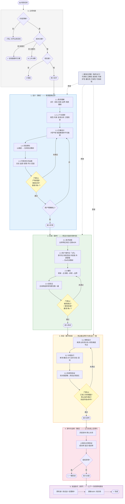

# CodingModel 思维引擎

> **定位**：CodingModel 的执行逻辑层。模型在每个节点沿此路径思考、判断、决策。
> 文字部分是思考路径，Mermaid 图是同一路径的可视化——两者是同一内容的两种形式。
>
> **配套文档**：
> - `../testing/be-testcase-strategy.md` — 测试策略专章
> - `../../skills/phase2-coding/coding-skill.md` — Coding SKILL 执行入口
> - `./be-coding-ai-anti-patterns.md` — **AI Coding 反模式库**（LLM 生成代码专项防御，6 类高频反模式 + 检测信号 + 防御动作 + 实测案例）

---

## ae-sdd Rust daemon 项目绑定（11 维结论）

> 本节是 `projectKey=ae-sdd` 的 CodingModel 具体结论，优先级高于本文后续通用 Java/HTTP/DB/MQ 示例。后续示例只用于说明思考方法，不得据此为 ae-sdd 引入 JVM、HTTP server、远程数据库、Redis 或 MQ。实现必须同时遵守 `constraints/*.md`、正式 DR/Story 与已批准 `state.executionPlan`。

| 维度 | 本项目是否适用 | 已冻结实现结论 | 必须验证的失败边界 |
| --- | --- | --- | --- |
| ① 原子性 | 是 | 项目 mutation 使用跨进程锁与 `<state-dir>/mutation-journal/v1` 的 typed PREPARED/COMMITTED authority，再执行同目录 staged file、fsync、atomic replace、目录 fsync；SQLite transaction 只在 COMMITTED 后更新可重建 index | disk full、multi-target replace/fsync crash、PREPARED/COMMITTED kill point 不得产生 fake commit/event；无法证明则 EXTERNAL_STATE_CONFLICT |
| ② 并发安全 | 是 | 每个 Work Item 由有界 actor mailbox 串行；持久边界仍强制 lease TTL、revision CAS、单调 fencing、idempotency 与跨进程 lock；长 Gate/host/build job 在 mailbox 外运行 | stale lease/revision/fencing、restart、旧 client、mailbox saturation 只能单提交或稳定拒绝 |
| ③ 幂等性 | 是 | operation 使用 idempotencyKey + canonical payload hash + receipt；session、Hook、delegation.create、host command/ACK、ChildResult 与 memory cleanup 都有 durable unique receipt；event 使用 eventStoreId + global eventSeq + decision digest；compact 使用 compactId + session/generation | 同 key 同 payload重放原 response；同 key 异 payload冲突；restart 后 duplicate prompt/event/ACK 仍不产生第二次 correction/spawn/side effect |
| ④ 解耦与异步 | 是 | FlowRuntime 是纯 reducer；runtime 以跨 restart 全局 cursor 和 typed bounded event payload/outbox 驱动 FlowSupervisor、Delegation、HostAction 与 ContextProjection；Hook fast path 只鉴权、读预计算 delta 或入队 | 禁止 digest-only replay、同步递归扫描、等待 spawn/compact/build；cancel/timeout/orphan 必须收敛到显式终态 |
| ⑤ 数据一致性 | 是 | project state/lease/docs/memory/evidence/review/artifact 是业务权威；SQLite 保存可重建 runtime metadata；Gate commit 绑定 state/policy/inventory/input freshness | SQLite/project 冲突以 project revision/hash 为准；hash 变但 revision 未增进入 EXTERNAL_STATE_CONFLICT；STALE 结果不提交 |
| ⑥ 外部依赖容错 | 是 | 外部依赖仅为 Agent host、git、toolchain、test runner、OS service 与文件系统；全部经 typed adapter、deadline、cancellation、bounded output 和 capability negotiation；不经 shell 字符串调用 | daemon/host unavailable、protocol mismatch、panic、timeout、unsupported 均 fail closed 或显式降级，绝不映射 PASS/physical proof/compact context-restored |
| ⑦ 性能 | 是 | 容量基线 100 session/10 workspace；warm handshake p95<=50 ms、cached read<=100 ms、cached Hook RPC p95<=50 ms、invalidated non-external Hook p95<=250 ms；ChildResult<=64 KiB、summary<=8 KiB、root projection<=64 KiB | 记录 p50/p95/p99/max/CPU/RSS；slow subscriber、queue 满、cache miss 时 backpressure/fail-closed，不允许 OOM 或同步长作业 |
| ⑧ 资源隔离 | 是 | workspace/Work Item actor、scheduler semaphore、bounded mailbox、blocking/DB worker 与 subscription queue 都有配额；root/series/task/reviewer memory/context 由 delegation grant 隔离 | 单 workspace/Agent 不得饿死其他请求；cross-workspace/cross-role access=0；background task 必须可 join/cancel/recover |
| ⑨ 安全 | 是 | IPC 仅当前 OS 用户：Windows Named Pipe 当前 SID DACL，Unix runtime dir 0700/socket+manifest 0600；256-bit endpoint secret；boot-scoped Ed25519 private key 签 capability、manifest 只给 public key；daemon-derived role/lineage；canonical path containment；secret/transcript 不入日志/SQLite/root projection | endpoint token 不能伪造 capability；fake child、ACK-only claim、path escape、cross-user、wrong compact generation、command injection 全部拒绝并审计 |
| ⑩ 可观测性 | 是 | request/session/turn/delegation/hostAction/compact/workItem/revision/event/fencing/policy/input/decision 全链路结构化关联；Gate outcome、supervisor health 与业务 correction 分离 | 重启、stale、external conflict、invalid ACK、deadline 与 backpressure 均有稳定 code/metric/evidence；不记录 prompt、claim、token、transcript 正文 |
| ⑪ 可运维性 | 是 | 用户级 service 支持 start/status/drain/stop/upgrade/recovery；workspace shadow→rust-canary→rust-sole-writer 经 drain 原子切换；回退走完整发行包 | service crash、migration failure、DB 损坏、watcher overflow、cursor gap、compact 中断均恢复到可诊断非成功状态；Monitor 不阻断核心 cutover |

### 项目实现出口

- 技术绑定：Rust edition 2024；根 `rust-toolchain.toml` 固定经验证的精确 stable；Tokio 仅启用所需 feature；本地 framed JSON-RPC over Named Pipe/UDS；SQLite WAL 默认 `rusqlite` bundled 且位于有界 blocking/DB worker。
- 依赖方向：`domain -> policy -> flow/delegation/context/operations ports -> runtime`；`protocol` 独立拥有 wire DTO；concrete adapters 向内依赖以实现 port，runtime 不依赖 concrete adapter，daemon/build binary 负责装配；CLI 仅 `client -> protocol`。`domain/policy/flow reducer` 无 I/O、clock、random、Tokio、SQLite 或宿主 API。
- 流程边界：SKILL 是声明式方法/模板/输出合同，Agent 是语义 worker，FlowRuntime/WorkItemActor 是唯一确定性流程与 mutation owner。
- 准入规则：每次 Coding 前必须针对当前 Work Item/state revision 动态加载四个上下文，重新执行 G-CODEPLAN-SRC、G-14、G-08，并核对当前 `state.executionPlan` 的显式用户批准；本文件本身不构成任何 gate PASS 或批准证据。每个实现 slice 先编译、再真实测试、再 review，禁止空 crate、stub-pass、logical spawn success 或假 compact ACK。

---

## 第0章·核心思想基座

> 来源：《编码核心思想·完整版》89条。
> 这不是参考资料，是所有决策的思想根基——每一个判断背后都有对应的思想编号支撑。

### 通用原则（基准过滤器的来源）

| # | 原则 | 释义 |
|---|---|---|
| 1 | **可用性** | 功能符合需求，系统能正常完成业务目标 |
| 2 | **正确性** | 结果符合业务规则、数据约束和边界条件 |
| 3 | **高效性** | 合理控制计算、IO、数据库、网络资源消耗 |
| 4 | **可维护性** | 代码易修改、迭代、排错；依托封装、分层、解耦实现 |
| 5 | **健壮性** | 面对异常、边界、并发冲突时能可控处理，不产生脏数据 |
| 6 | **可读性** | 命名规范、结构清晰，他人能快速理解逻辑 |
| 7 | **可演进性** | 代码能随业务变化逐步演进，不因局部修改牵一发动全身 |

### 核心设计思想（风险分析的思想来源）

| # | 思想 | 对应风险维度 |
|---|---|---|
| 24 | **幂等性** | 维度③ |
| 25 | **不变量** | 维度①原子性 |
| 26 | **状态机思想** | 维度②③ |
| 27 | **契约优先** | 1.3方案设计·接口契约 |
| 28 | **显式优于隐式** | 编码三原则② |
| 39 | **事务边界** | 维度① |
| 40 | **一致性边界** | 维度⑤ |
| 43 | **超时控制** | 维度⑥ |
| 44 | **重试与退避** | 维度⑥ |
| 45 | **熔断/降级** | 维度⑥ |
| 47 | **失败隔离** | 维度⑧ |
| 48 | **原子性** | 维度① |
| 49 | **可见性** | 维度② |
| 51 | **资源隔离** | 维度⑧ |
| 52 | **限流/削峰** | 维度⑦ |
| 55 | **锁机制** | 维度② |
| 66 | **可观测性** | 维度⑩ |
| 70 | **可回滚性** | 维度⑪ |
| 76 | **最小权限** | 维度⑨ |
| 78 | **输入不可信** | 维度⑨ |


---

## 全链路地图

> 基准过滤器（#1-#7）贯穿每一步，每个阶段出口前都要过一遍。



---

## 基准过滤器 — 每一步的通行证

> **定位**：这7条不是风险维度，不是技术选型，而是**所有决策的质量底线**。
> 设计每一项产物、写每一个类、设计每一个测试用例，结束前都要对照这7条过一遍。
> **任何一条答案是「否」，当前步骤不得完成，必须修正。**

| # | 原则 | 每步设计时问自己 | 典型违反信号 |
|---|---|---|---|
| 1 | **可用性** | 这个方案能正常完成业务目标吗？ | 设计了一个谁都用不了的接口 |
| 2 | **正确性** | 显式契约、高影响边界和已准入业务风险都有证据吗？ | 只考虑 happy path，关键风险缺少验证 |
| 3 | **高效性** | 计算 / IO / DB / 网络消耗合理吗？ | 循环内查 DB、SELECT *、无索引查询 |
| 4 | **可维护性** | 这个设计未来容易修改和排查吗？ | 一个方法500行、魔法值硬编码 |
| 5 | **健壮性** | 面对异常、边界、并发冲突能可控处理吗？ | 空 catch、无超时设置、无并发保护 |
| 6 | **可读性** | 命名和结构是否让他人能快速理解？ | 变量名 a/b/temp、注释描述「是什么」而非「为什么」 |
| 7 | **可演进性** | 局部修改会牵一发动全身吗？ | 跨层调用、强耦合、无抽象边界 |

**使用方式**：

```
设计阶段：每产出一项（业务流 / 数据模型 / 调用链路 / 接口契约）→ 对照7条
实现阶段：每写完一个类 / 方法 → 对照7条
测试阶段：测试用例设计完 → 重点对照「正确性 + 健壮性」
发布阶段：上线方案确定后 → 重点对照「可用性 + 健壮性 + 可演进性」
```

---

## 0. 立项判断

> 最被忽视、但最省成本的一步。花5分钟回答三问，能砍掉一半不该做的任务。

```
Q1：价值清晰吗？
    能用一句话说清「谁 · 在什么场景 · 得到什么收益 · 量级多大」？
       ├── 能 → 继续
       └── 不能 → 停止，先对齐业务目标，禁止进入设计

Q2：成本合理吗？
    开发 + 测试 + 上线 + 长期维护，综合代价 vs 收益
       ├── 合理 → 继续
       └── 代价远超收益 → 是否有更轻量的替代方案？
             ├── 有（配置化 / 参数化 / 复用现有能力）→ 优先走替代方案
             └── 没有 → 上升决策，不由研发单方面硬上

Q3：是不是现在做？
   ├── 是 → 进入设计阶段
   └── 否（依赖未就绪 / 更高优先级事项未完成）→ 记录并挂起
```

---

## 0.5 微任务快速通道（裁剪版流程）

> **背景**：完整流程 6 阶段（0→1→2→3→4→5）对**微任务**过重——LLM 撞微任务场景会跳过或糊弄。微任务场景需要一套**精简判定 + 升级触发**机制。
>
> **与 coding-skill.md 微任务扩展的关系**：coding-skill.md §微任务扩展是「API 入口」（如何快速调用），本节是「思维裁剪」（哪些维度要过、哪些可跳过）。

### 0.5.1 微任务判定（满足全部 4 条才算微任务）

```
□ 改动行数 ≤ 50 行（含新增 + 修改）
□ 影响文件 ≤ 2 个
□ 无架构影响（不引入新模块 / 不改接口契约 / 不改数据模型）
□ 无跨服务调用（不涉及 RPC / MQ / 分布式事务）
```

**判定为微任务 → 走 §0.5.2 快速通道**
**任一条件不满足 → 走 §1 完整设计流程**（不要贪图省事）

### 0.5.2 精简 5 步（替代完整 6 阶段）

```
步骤 1：变更前 3 问（≤ 5 分钟）
   ① 改的是什么？（字段 / 方法 / 配置 / 样式）
   ② 影响谁？（调用方 / 上下游 / 用户感知）
   ③ 是否需要回归测试？

步骤 2：风险快速扫（≤ 5 分钟）
   11 维中只需过这 5 个（按微任务常见踩坑排序）：
     ① 原子性（是否跨表 / 跨服务写入？）→ 否 → 跳过
     ② 并发安全（是否有并发修改同一行？）→ 否 → 跳过
     ③ 幂等性（写操作吗？会重复触发吗？）→ 否 → 跳过
     ⑥ 外部依赖容错（改了接口契约吗？调用方有超时吗？）→ 否 → 跳过
     ⑨ 安全（涉及用户输入 / 权限 / 敏感数据吗？）→ 否 → 跳过

步骤 3：基准过滤器 7 条（必过，≤ 3 分钟）
   可用 · 正确 · 高效 · 可维护 · 健壮 · 可读 · 可演进
   任一不过 → 升级到完整流程

步骤 4：实现 + 自验证（≤ 实际编码时间）
   按 §2.3 编码三原则，但每个类都要过 §6 反模式库扫描

步骤 5：最小测试 + 记录（≤ 10 分钟）
   测试：
     必跑：原有测试套件不挂
     加新用例：只针对变更点（1-2 个）
   记录：
     将验证结果写入 evidence manifest；任何时候都不写 changelog 或微任务过程日志
```

### 0.5.3 升级触发（微任务中途发现不简单，立即升级）

```
触发任一条件 → 立即停下，回到 §1 完整流程：
  □ 改动行数实际 > 50 行
  □ 发现影响文件 > 2 个
  □ 发现需要改接口契约 / 数据模型
  □ 发现需要跨服务协调
  □ 测试中发现隐藏 bug 超过 2 个
  □ 反模式库 §6 扫描命中 ≥ 3 个类别
```

**升级不是失败，是正确的过程决策**——微任务判定本身就是「猜」，猜错了就升级，比硬撑微任务流程导致上线事故强 100 倍。

### 0.5.4 与 §0 立项判断的关系

```
§0 立项判断 → 价值 / 成本 / 现在做
              ↓
         是否微任务？
         ├── 是（满足 §0.5.1 全部 4 条）→ §0.5 快速通道
         └── 否 → §1 完整设计
```

---

## 1. 设计阶段（事前）

### 1.1 需求理解 — 把「模糊」变成「可验收」

> **完成这5项，才算需求理解完成。**

```
① 业务目标（一句话）
   [角色] 在 [场景] 中，需要 [动作]，使得 [可量化的结果]

② 验收标准（可量化）
   功能维度：什么算正确？
   性能维度：响应时间上限、TPS 目标、数据量上限
   可用性维度：允许多少失败率？

③ 边界（明确不做的事）
   每个「不做」都要显式说出来，防止 scope 蔓延

④ 关键场景（按适用性识别；类别不构成数量配额）
   正向场景（happy path，代表性主流程）
   空 / null 场景（契约或控制流对空值有独立语义时）
   非法场景（越权、状态非法、参数错误有独立拒绝机制时）
   极值场景（有容量、并发、幂等或不可逆风险证据时）

⑤ 量级预估（所有技术决策的刻度盘）
   QPS 量级  → 决定并发方案
   数据量级  → 决定存储方案
   用户量级  → 决定部署方案
```

> **没有量级，技术选型就是在猜。**

**[基准检查]** 需求理解完成后，过基准过滤器：
- 正确性：AC、显式契约和高影响风险是否有可追溯验证？
- 可演进性：边界是否划清，不会因需求蔓延牵一发动全身？

---

### 1.2 上下文调研 — 别在真空中设计

```
调研顺序：先复用，再扩展，最后新建

Step 1：规范与约束
   代码规范 / 接口规范 / 命名规范
   性能 SLA / 安全合规要求 / 可用中间件清单

Step 2：现有实现分析（复用优先）
   相似度 ≥ 80% → 直接复用，注明复用位置
   相似度 50-80% → 抽象后复用，说明抽象方案
   相似度 < 50%  → 新建，写明新建理由

Step 3：工程现状
   技术栈版本 / 依赖版本
   已有监控体系 / CI/CD 流程
   上下游契约（谁依赖我、我依赖谁）
```

**[基准检查]** 调研完成后：
- 可维护性：是否充分复用，没有重复造轮子？
- 可演进性：上下游契约是否清晰，变更影响范围是否可控？

---

### 1.3 方案设计 — 7项产物（有因果顺序，不可跳层）

```
业务逻辑流                    ← 主流程 + 异常流程 + 分支条件
    │ 业务流中的实体和字段决定
    ↓
数据模型                      ← DO/PO/DTO/VO，字段类型和约束
    │ 每个字段的来源和去向决定
    ↓
数据映射关系                  ← 全链路5层：HTTP→BFF→SPI→DO→DB
    │ 每个数据源的读写时机决定
    ↓
数据源分析                    ← MySQL/Redis/MQ，读写类型，一致性要求
    │ 以上全部决定接口边界
    ↓
输入/输出参数                 ← 接口契约：字段 + 错误码 + 幂等性 + SLA
    │ 以上全部决定技术实现
    ↓
实现方案                      ← 技术选型 + 关键算法 + 选型依据
    │ 具体类级别落点
    ↓
调用链路                      ← 类/方法级别，标注事务边界和异步边界
```

> **跳层是 Coding 失控的根源。** 没想清楚数据模型就做技术选型，
> 没想清楚业务流就画调用链路，实现阶段一定反复推翻重来。

**[基准检查]** 每产出一项，过基准过滤器：

| 产物 | 重点检查的基准项 |
|---|---|
| 业务逻辑流 | 正确性（分支覆盖）、健壮性（异常路径） |
| 数据模型 | 正确性（类型/约束）、可维护性（命名语义） |
| 数据映射 | 正确性（全链路字段一致）、可演进性（变更影响面） |
| 数据源分析 | 高效性（读写分离）、健壮性（一致性保障） |
| 接口契约 | 正确性（错误码完整）、可演进性（兼容策略） |
| 实现方案 | 高效性（性能方案）、健壮性（容错方案） |
| 调用链路 | 可维护性（分层清晰）、健壮性（事务边界） |

---

### 1.4 风险预判 — 11维度，设计期前移

> **核心立场**：风险不是实现阶段发现了才处理，而是设计阶段就要逐项过。
> 每个维度的答案不是「怎么做」，而是：
>
> **「需不需要做」→「做到什么程度」→「有意不做的理由是什么」**
>
> 不需要追求全覆盖，但必须清楚「我是有意不做的」，而不是「没想到」。

---

#### 维度①：原子性

```
Q：这个操作涉及多个步骤，必须全成或全败吗？
    │
    ├── 否（单步操作）→ 不需要，跳过
    │
    └── 是 → Q：步骤跨越几个数据源 / 服务？
                 │
                 ├── 单数据源（单库多表）
                 │    └── 本地事务（@Transactional）
                 │         ├── 边界放在 Application 层，不在 Domain / Repository
                 │         ├── 事务内禁止外部调用（HTTP / MQ）→ 大事务红线
                 │         └── 粒度最小化：只包含必要的 DB 写操作
                 │
                 ├── 跨数据源，允许最终一致
                 │    ├── 方案A：本地消息表（DB 写 + 消息表同事务，定时扫描发送）
                 │    └── 方案B：事务消息（RocketMQ / Kafka 事务消息）
                 │
                 └── 跨数据源，要求强一致
                      ├── TCC（Try-Confirm-Cancel）：侵入大，慎用
                      ├── Seata AT 模式：侵入小，适合同类数据库
                      └── 🔴 优先说服业务方降级为最终一致，强一致代价极高
```

---

#### 维度②：并发安全

```
Q：同一条数据可能被并发修改吗？
    │
    ├── 否 → 不需要，跳过
    │
    └── 是 → Q：冲突频率 × 业务对冲突的容忍度？
                 │
                 ├── 低冲突（< 百 TPS，冲突偶发）
                 │    └── 乐观锁（CAS）
                 │         UPDATE t SET ... version=v+1 WHERE id=? AND version=v
                 │         更新行数=0 → 冲突 → 重试（上限3次）→ 超出返回业务错误
                 │
                 ├── 高冲突（> 千 TPS，冲突频发）
                 │    └── 分布式锁
                 │         SET key uuid NX PX ttl   ← 原子加锁
                 │         value = uuid             ← 防止误删他人的锁
                 │         TTL = 业务预估时长 × 3    ← 兜底自动释放
                 │         加锁失败策略：
                 │           用户实时操作 → 快速失败，返回「请稍后重试」
                 │           后台任务     → 等待重试，指数退避 + 抖动
                 │
                 └── 单写者场景（库存扣减 / 余额变更）
                      → 队列串行化（单写者模型），从根源消除并发
```

---

#### 维度③：幂等性

```
Q：这个操作重复执行会产生副作用吗？
    │
    ├── 否（只读操作）→ 天然幂等，跳过
    │
    └── 是（写操作：INSERT / UPDATE / DELETE / MQ消费 / 外部API）
         │
         └── Q：重复的来源是什么？
                  ├── 客户端重试（网络超时后重发）→ 服务端保证幂等
                  ├── MQ 重复投递（至少一次语义）  → 消费端保证幂等
                  └── 定时任务重复触发           → 任务加分布式锁

              幂等方案选择（优先级从高到低）：
              ├── 唯一业务键（最简单）
              │    唯一索引 + INSERT IGNORE 或 ON DUPLICATE KEY UPDATE
              ├── 幂等表（通用，适合 MQ 消费）
              │    消费前查幂等表 → 有则跳过 → 无则写入后处理
              └── 状态机前置校验（适合有状态流转场景）
                   只有状态符合流转条件才执行，已流转直接返回成功
```

---

#### 维度④：可解耦性（同步 / 异步）

```
Q：当前步骤的后续操作，下游结果会影响当前响应吗？
    │
    ├── 是 → 必须同步，进入「维度⑥外部依赖容错」
    │
    └── 否（通知 / 日志 / 统计 / 缓存更新 / 触发下游）→ 可以解耦
         │
         └── 解耦后逐项判断：

         ① 一致性要求：解耦后下游失败，上游需要回滚吗？
              需要  → 事务消息 / 本地消息表
              不需要 → 普通 MQ，下游失败告警即可

         ② 并行优化：解耦后多个下游可以并行执行吗？
              可以  → CompletableFuture.allOf() 并行
                       注意：独立线程池，不占用业务核心线程
              不可以 → 保持串行，或用有序 MQ（如 Kafka 分区有序）

         ③ 削峰需求：下游处理能力 < 上游产生速度吗？
              是 → MQ 天然削峰，消费端控制消费速率
                   设置消息积压告警阈值
              否 → 不需要额外削峰

         ④ 优先级：不同消息的处理优先级不同吗？
              是 → 多 Topic 分优先级，或优先级队列
              否 → 单 Topic 即可

         ⑤ 兜底机制（三问，缺一不可）
              重试几次？    → 推荐3次，指数退避 + 随机抖动
              超出重试去哪？ → 死信队列（DLQ）
              死信如何处理？ → 人工介入告警 / 自动补偿任务定期扫描
```

---

#### 维度⑤：数据一致性

```
Q：这个操作涉及多个数据源的写入吗（DB+Redis / DB+MQ / 跨库）？
    │
    ├── 否（单数据源）→ 本地事务保证，跳过
    │
    └── 是 → Q：允许短暂不一致吗？
                 │
                 ├── 允许（最终一致）
                 │    ├── 以 DB 为真相源（先写 DB，再更新 Redis / 发 MQ）
                 │    ├── Redis 更新失败 → 删除缓存（下次读时重建，不用补写）
                 │    └── MQ 发送失败   → 本地消息表 + 补偿任务扫描重发
                 │
                 └── 不允许（强一致）
                      ├── 同库跨表   → 本地事务
                      ├── 跨库同类型 → Seata AT（侵入小）
                      ├── 跨异构系统 → TCC（侵入大，仅在必要时用）
                      └── 🔴 优先说服业务方接受最终一致
                                强一致的代价是系统复杂度 × 10
```

#### ⑤ 扩展：业务不一致窗口与兜底

> 即使选了最终一致方案，**业务上仍有「不一致窗口」**——这个窗口期内用户看到的可能是脏数据，必须有兜底。

```
1. 不一致窗口长度（设计期必须量化）
   □ DB 写完到 Redis 更新完：通常 ms 级，最坏 s 级
   □ 本地消息表 → MQ → 下游消费：通常 s 级，异常可能分钟级
   □ 跨日 / 跨定时任务：可能小时级（必须明确告知业务方）

2. 对账机制（高频资金 / 订单场景必做）
   □ 定时对账（cron / xxl-job）：两侧数据源定期比对
      频率建议：核心资金 5min，订单 1h，日志类 1day
   □ 不一致告警：差异行数超过阈值（如 0.01%）立即告警
   □ 差异自动修复：能 SQL 修复的自动修，不能的人工介入
   □ 差异记录：对账日志必须留底，审计可追溯

3. 业务兜底（用户感知层的最后防线）
   □ 详情页强读 DB：避免缓存不一致导致用户看到旧数据
      （列表可缓存，详情必查 DB）
   □ 写后立即失效：写操作完成后，强制 invalidate 相关缓存 key
   □ 用户主动刷新：前端提供「刷新」按钮，走强一致路径
   □ 状态回查：支付 / 退款等关键场景，前端轮询或后端主动回调确认

4. 数据订正（不一致已发生时的兜底）
   □ 订正流程标准化：选数据 → 备份 → 修 → 验 → 通知
   □ 订正 SQL 走审批：所有数据订正必须经 TL / 架构审批
   □ 订正记录归档：操作人 / 时间 / 影响行数 / 原因
```

---

#### 维度⑥：外部依赖容错

```
Q：当前链路依赖外部服务吗（第三方API / 其他微服务）？
    │
    ├── 否 → 跳过
    │
    └── 是 → 四问必须全部回答：

         ① 超时：外部服务无响应，等多久？
              连接超时：1s（建立连接的等待上限）
              读取超时：3s（等待响应数据的上限）
              超时后动作：
                依赖在关键路径 → 抛异常，快速失败
                依赖在非关键路径 → 返回降级值，不阻塞主流程

         ② 熔断：依赖连续失败，是否继续调用？
              不加熔断 → 大量线程阻塞在失败请求，引发雪崩
              加熔断器（Sentinel / Resilience4j）：
                失败率超阈值 → 断路器打开 → 快速失败不真实调用
                半开状态    → 定期探测恢复
                恢复正常    → 关闭断路器

         ③ 降级：外部不可用时，主流程如何保证可用？
              有降级值（缓存 / 默认值）→ 返回降级值，标注来源为「降级」
              无降级值             → 返回明确错误码，让调用方感知

         ④ 重试：偶发失败是否值得重试？
              幂等操作（GET / 查询 / 幂等POST）→ 可重试（最多3次，指数退避）
              非幂等操作（支付 / 扣款）        → 禁止随意重试，必须有幂等键保障
```

---

#### 维度⑦：性能瓶颈

```
Q：这个操作的数据量或调用频率会成为瓶颈吗？
    │
    ├── 否（低频、小数据量）→ 简单实现，跳过
    │
    └── 是 → 逐项排查：

         ① SQL 性能
              WHERE 条件字段是否有索引？
              是否有 SELECT *？              → 改为 SELECT 具体字段
              是否有 N+1 查询（循环内查DB）？ → 改为 IN 查询 + 内存组装
              是否有大分页（LIMIT 10000,10）？→ 改为游标分页（基于主键 / 时间）
              写完必须用 EXPLAIN 验证执行计划

         ② 缓存三问
              穿透（查不存在的 key）  → 布隆过滤器 / 缓存空值（短 TTL）
              击穿（热点 key 过期）    → 互斥锁重建 / 逻辑过期（永不过期+异步刷新）
              雪崩（大量 key 同时过期）→ TTL 加随机抖动（基准TTL ± 随机值）

         ③ 循环内 IO（🔴 硬红线，绝对禁止）
              循环内查 DB   → 批量 IN 查询
              循环内调 Redis → pipeline 批量
              循环内调 HTTP  → 并行 CompletableFuture / 批量接口

         ④ 削峰
              可预测突发  → 令牌桶（平滑限流）
              不可预测突发 → 多级缓存 + 限流 + 降级
              不能拒绝但要削峰 → 漏桶 / 滑动窗口
              重要 vs 普通任务 → 优先级队列 / 分级线程池
```

---

#### 维度⑧：资源隔离

```
Q：这个操作会消耗大量资源，并影响其他核心链路吗？
    │
    ├── 否 → 设监控告警兜底，跳过
    │
    └── 是 → 隔离策略：
              线程隔离：独立线程池（批量 / 报表不占用核心业务线程池）
              DB 隔离：读写分离（核心写主库，统计 / 报表查从库）
              服务隔离：批量 / 离线接口与实时接口分实例部署
              缓存隔离：热点数据独立缓存实例，不与通用缓存混用
```

---

### ⚠️ 核心链路资源挤占专项门禁

> **触发条件：** 涉及以下任一场景时必须执行本门禁——  
> 回调 / Webhook / 支付 / 订单状态 / 工单状态 / 消息落库 / 批量任务 / 异步队列 / 线程池 / 外部通知 / 下游推送

以下 10 问必须逐一回答，任何一题无答案，禁止进入实现：

| # | 问题 | 结论（必填） | 方案（如需要） |
|---|------|----------|-------------|
| Q1 | 当前操作是不是核心实时链路？ | 是 / 否 | |
| Q2 | 当前操作是否和批量/离线任务共享线程池？ | 是 / 否 / 不涉及 | 共享→必须隔离 |
| Q3 | 当前操作是否和批量/离线任务共享队列/Topic？ | 是 / 否 / 不涉及 | 共享→分级队列 |
| Q4 | 当前操作是否和批量/离线任务共享 DB 连接池或热点表？ | 是 / 否 / 不涉及 | 共享→读写分离 |
| Q5 | 批量任务最大规模是多少？队列是否有上限？ | 填写数量级 | 无上限→必须设置 |
| Q6 | 拒绝策略是否会让核心线程执行低优先级任务？ | 是 / 否 / 不涉及 | 是→改策略为 AbortPolicy+DLQ |
| Q7 | 是否需要优先级队列 / 分级线程池 / 分 Topic？ | 是 / 否 | |
| Q8 | 是否有补偿/重试/DLQ（死信队列）机制？ | 是 / 否 | 无→必须补充 |
| Q9 | 是否有积压告警、P99 延迟告警、失败率告警？ | 是 / 否 | 无→必须配置 |
| Q10 | 是否设计了「批量任务满载 + 核心接口并发」混合压测场景？ | 是 / 否 | 否→必须纳入测试计划 |

**判定：**
- Q1=是 且 Q2/Q3/Q4 中任一=是 → 🔴 阻断，必须隔离后才能进入实现
- Q5 队列无上限 → 🔴 阻断，必须设置上限和拒绝策略
- Q8=否（涉及写操作）→ 🔴 阻断，必须有补偿机制
- Q10=否（Q1=是 且涉及异步/批量）→ 🟠 必须在测试计划中补充混合压测场景

---

#### 维度⑨：安全

```
逐项检查（每项给出：有 / 无 / 不适用）：

  □ 输入校验：是否对所有外部输入做参数校验？
  □ SQL 注入：是否使用参数化查询？（禁止 SQL 拼接）
  □ 越权访问：当前用户是否有权操作目标资源？（水平 / 垂直越权）
  □ 敏感数据：密码 / Token / 手机号 / 身份证是否加密存储，日志中是否脱敏？
  □ 接口鉴权：是否配置了正确的鉴权注解？
  □ 密钥管理：密钥是否走配置中心 / 环境变量，禁止硬编码？
  □ 脱敏策略：返回前端的 DTO/VO 是否对手机号 / 身份证 / 银行卡做了脱敏（138****1234）？
  □ 审计日志：涉及资金 / 权限变更 / 状态流转的操作是否有审计日志（谁 / 何时 / 改了什么）？
  □ 权限继承与数据级权限：是否有「同租户 / 同部门 / 同 owner」的数据隔离？（org_id / tenant_id 必带 WHERE）
  □ 数据出口管控：导出 / 报表 / 对外 API 是否做了行数限制 / 水印 / 限流 / 操作留痕？
```

---

#### 维度⑩：可观测性

```
三问，缺一不可：

① 出问题时能定位吗？
   关键操作是否有日志？（INFO级，含traceId，禁止打印密码 / Token）
   异常是否有完整堆栈？
   关键业务指标是否有监控埋点？

② 出问题时能看到是什么问题吗？
   是否有 Metrics（TPS / P99 / 错误率）？
   是否有 Trace（分布式链路追踪）？
   日志是否结构化（便于检索）？

③ 出问题时告警是否及时？
   核心指标是否设了告警阈值？
   告警是否会在问题扩大之前触发？
```

---

#### 维度⑪：可运维性

```
四问，缺一不可：

① 能灰度发布吗？
   是否有功能开关？（新功能默认关闭，灰度后开启）

② 能回滚吗？
   代码变更是否向前兼容？
   数据迁移是否可逆？（不可逆的迁移必须有补偿方案）

③ 关键配置能热更新吗？
   阈值 / 超时 / 开关是否走配置中心，不需要重启？

④ 接口变更有兼容策略吗？
   新增字段：向后兼容，旧客户端忽略
   废弃字段：保留 N 个版本，标注 @Deprecated
   破坏性变更：版本号隔离（/v1 /v2）
```

---

### 1.5 可观测与可运维设计

> 这不是「上线后的工作」，是「设计期就要纳入方案」的内容。
> 维度⑩⑪已包含具体检查项，此处是设计产物层面的强制要求。

```
设计阶段必须明确：

  日志规范：关键路径打什么级别、打什么字段、不打什么
  监控指标：核心接口的 TPS / P99 / 错误率由谁埋点
  告警阈值：错误率超过多少触发告警、延迟超过多少触发告警
  功能开关：新功能是否需要开关，默认值是什么
  回滚方案：数据迁移如何回滚，代码如何快速回退
```

---

### 1.6 设计阶段出口门禁（G1）

```
进入实现的通行证（全部满足才能推进）：

□ 需求理解5项完成（目标 / 验收 / 边界 / 场景 / 量级）
□ 上下文调研完成（规范 / 约束 / 复用分析 / 工程现状）
□ 方案设计7项产物完整，且遵循因果顺序
□ 11个风险维度逐一过完，每个维度明确标注：
     ✅ 需要处理 + 方案
     ⭕ 有意不做 + 理由
     — 不适用 + 理由
□ 基准过滤器7条逐项通过（有答案，无「不知道」）
□ 用户已明确确认（「确认」/「同意」/「可以实现」）
```

---

## 2. 实现阶段（事中）

### 2.1 技术选型

> **选型不是「你知道什么就用什么」，是「业务特征决定技术选择」。**

```
选型前两问（决定所有后续选型的刻度盘）：

Q1：这个操作的并发量级是多少？
    低（< 百 TPS）→ 简单方案优先，不过度设计
    高（> 千 TPS）→ 性能 / 一致性方案必须提前设计

Q2：这个操作的一致性要求是什么？
    强一致   → 本地事务 / TCC / Seata
    最终一致 → MQ 异步 + 幂等消费
    允许丢失 → 纯异步，不需要保证
```

**选型记录要求（ADR）**

```
每个非平凡的技术选择都要记录：
  候选方案：至少列两个
  选择结果：选了哪个
  选择依据：成熟度 / 团队熟悉度 / 性能 / 成本 / 与现有技术栈的匹配度
  未来影响：这个选择锁定了什么，后悔成本是多少
```

---

### 2.2 每个操作的「4问」决策链

> 写每一段代码前，动手之前过这4问。

```
Q1：这步需要原子性吗？粒度多大？
    → 查维度①决策树

Q2：失败会发生什么？需要回滚 / 补偿吗？
    → 查维度①⑤

Q3：并发执行会怎样？需要加锁吗？用什么锁？
    → 查维度②③

Q4：依赖外部资源吗？超时 / 重试 / 降级怎么做？
    → 查维度⑥
```

---

### 2.3 编码实现三原则

```
原则①：先骨架后细节
   接口签名 → 主流程 → 异常分支 → 边界条件
   每写完一层，能独立编译，再写下一层
   禁止「写完所有文件再统一编译」

原则②：显式优于隐式
   异常必须明确处理（禁止空 catch）
   依赖必须显式注入（禁止硬编码 new）
   状态流转必须显式校验（禁止隐式假设当前状态合法）
   默认值、边界规则、幂等语义 → 显式表达，不让调用方猜

原则③：设计是代码的镜子
   每写一段代码，回头核对设计
   设计写的是 A，代码实现了 B → 先判断谁对，再决定改哪边
   禁止「代码硬撑，设计错了也不改」
```

**[基准检查]** 每写完一个类 / 方法，过基准过滤器：
- 正确性：边界条件和异常分支都处理了吗？
- 健壮性：空值 / 异常 / 并发冲突能可控处理吗？
- 可维护性：函数是否 ≤ 50行、圈复杂度 ≤ 10？
- 可读性：命名是否见名知意，无魔法值？

---

### 2.4 自验证（动手构造异常，不等测试发现）

```
写完后，自己先跑以下场景：
  ├── 必填参数为空
  ├── 状态非法流转
  ├── 并发双写（如果有并发设计）
  ├── 外部依赖超时（mock 一个慢响应）
  └── 重复提交（验证幂等是否生效）

看日志 / 监控是否如预期触发
```

---

### 2.5 实现阶段出口门禁（G2）

```
进入测试的通行证（全部满足）：

□ 编译通过（父工程全量 mvn compile，所有子模块通过）
□ 服务启动成功（health 端点 UP，本 Story Bean 已注册）
□ 基准过滤器7条逐项通过
□ 设计 vs 代码一致性核查：
     代码实际行为 ↔ 调用链路 ↔ 业务逻辑流 ↔ 接口契约
     无漂移（多做 / 漏做 / 做歪）
□ 静态扫描通过（无全限定名遗留 / 无跨层误引用 / 无循环内IO）
□ 4问决策链对每个操作都走过，方案已落入代码
```

---

## 3. 测试阶段（事中校验）

### 3.1 测试用例来源法则

```
先建立有限风险登记，候选来源只允许：
  ① AC / 接口契约 / 业务不变量
  ② 有独立业务语义的代码分支
  ③ 风险分析11维度中判定为适用的决策节点
  ④ 历史缺陷 / 项目坑 / 本次改动分支

每个候选必须写明：证据来源 + 行为分区 + 独立失败机制 + 选择决策。
同一控制流、错误码、副作用和失败影响归入行为等价类，只保留代表用例。
一个用例可以覆盖多个 AC/风险；没有独立失败机制的候选必须合并或排除。
```

边界、并发、异常或分层候选的详细准入与局部上限以 `../testing/be-testcase-strategy.md` 为 SSOT。

### 3.2 测试分层

```
┌────────────────────────────────────────────────────────────┐
│ 层级          │ 测什么              │ 怎么测                 │
├────────────────────────────────────────────────────────────┤
│ 单元测试      │ 业务规则 / 算法      │ test double 仅作快速反馈  │
│ 集成测试      │ 编排 / 事务 / 持久化  │ 真实 DB；内部链不替换     │
│ API 验收      │ 接口契约 / 业务结果   │ 本地真实 HTTP → 同 buildId 测试环境 HTTP │
│ 性能 / 压测   │ SLA / 容量上限       │ 真实压力                │
│ 安全测试      │ 注入 / 越权 / 扫描   │ 渗透 / 扫描工具         │
│ 故障演练      │ 容错 / 降级 / 恢复   │ 注入超时 / 注入宕机     │
└────────────────────────────────────────────────────────────┘
```

### 3.3 六类风险候选（按适用性准入）

```
① 正向（Happy Path）：为 AC 提供代表性成功证据
② 参数异常：有独立 validator、错误映射或显式范围时准入
③ 状态异常：有独立 guard、副作用或不可逆风险时准入
④ 并发场景（有并发设计时）：
     乐观锁版本冲突、幂等重复请求、分布式锁加锁失败
⑤ 外部依赖失败（有外部调用和容错设计时）：
     超时触发降级、服务不可用返回正确错误码
⑥ 事务回滚（有真实事务边界时）：
     中途失败数据干净回滚，无脏数据残留
```

这些类别只用于发现候选，不形成数量配额。同一 validator 一个无效代表；独立字段不做笛卡尔积；同一风险选择最低充分层级。AC 与已准入风险均有证据，且剩余候选不增加新失败机制、控制流、契约、协议、断言或层级证据时，命中停止条件。

**[基准检查]** 测试用例设计完，过基准过滤器：
- 正确性：AC 和所有 `keep` 风险是否有证据？
- 健壮性：适用的高影响风险是否被覆盖，等价边界是否已去重？
- 高效性：测试执行速度是否合理（不应因低效测试拖慢 CI）？

### 3.4 测试有效性判定

```
判定标准：修改被测代码中的一行关键逻辑 → 测试必须变红

如果修改后测试仍然绿 → 测试没有测真实逻辑 → 无效

三类最常见的无效测试：
  ① 全 Mock：断言的是 Mock 行为而非业务行为
  ② 永真断言：assertEquals(1,1) 与被测代码无关
  ③ 期望值来自实际值：先跑代码得 actual，再把 actual 当 expected
```

### 3.5 测试阶段出口门禁（G3）

```
发布的通行证（全部满足）：

□ AC 覆盖率 100%，所有已准入风险有证据，停止条件满足
□ 核心落库路径有真实 DB（H2 / TestContainers）验证
□ 每个接口 AC 的 plan 为 boundary=http、stages=[local,test-env]、internalMocksAllowed=false
□ 本地真实端口走完整内部链，MockMvc 与内部 @MockBean/@SpyBean 均不计入验收
□ 同一 buildId 的测试环境真实 HTTP evidence 已通过；环境不可达保持 BLOCKED
□ 测试真实性扫描：8类伪造手段 0 命中
□ 所有测试通过，无 skip / ignore
□ 基准过滤器7条逐项通过
```

---

## 4. 发布与运维（事后）

```
发布前检查清单：
  □ 灰度开关已设置，新功能默认关闭
  □ 数据迁移脚本已验证可逆（或有补偿方案）
  □ 回滚方案已准备，能一键执行
  □ 核心监控指标已就绪，告警阈值已配置

发布后立即验证（上线后5分钟内）：
  □ 核心业务指标正常（成功率 / 延迟 / 错误率）
  □ 依赖服务健康
  □ 日志中无非预期异常
  □ 灰度比例符合预期

告警响应优先级：
  P0（核心功能不可用）   → 5分钟内响应，立即介入
  P1（核心指标下降）     → 15分钟内响应
  P2（非核心功能异常）   → 1小时内响应
```

---

## 5. 复盘迭代（闭环）

> **把「假设」变成「经验」，把「经验」变成「约束」，把「经验」变成「下一次自动避免的陷阱」。**
>
> **核心立场**：复盘不是「写个文档就完事」，是**经验沉淀到约束**的强制环节。复盘未闭环 = 下次还会撞同样的坑。

### 5.1 复盘产物（必交付，未交付 = 复盘未完成）

**落地路径**：`<project>/.auto-engineering/STORY-{ID}-BE/postmortem.md`

**模板（8 问强制结构）**：

```
### 1. 业务结果
   □ 业务目标是否达成？（用 §1.1 验收标准核对）
   □ 是否在承诺时间内上线？
   □ 上线后是否有用户反馈 / 数据异常？

### 2. 设计预判准确度（11 维逐维对照）
   逐维回答：
     维度① 原子性：预判了什么？实际发生了什么？
     维度② 并发安全：同上
     ...
     维度⑪ 可运维性：同上
   对每个维度标注：
     ✅ 预判准 + 方案生效（保持）
     ❌ 预判错 / 漏判（记录到反模式库 / ADR）
     ➖ 预判多余（标记，下次可简化）

### 3. 测试完备度
   □ 已准入风险覆盖率 = ?；被合并/排除的候选是否有选择决策和证据？
   □ 上线后发现的 bug：
      - 哪个类型？（业务规则？边界？并发？）
      - 是否有对应测试用例？（没有 → 补充用例）
   □ 是否有测试本身有 bug？（永真断言 / 全 Mock / 期望值来自实际值）

### 4. 监控告警有效度
   □ 问题发生时，告警 vs 用户反馈，谁先到？
      告警先到 → ✅ 有效
      用户反馈先到 → ❌ 监控盲区，必须补埋点
   □ 告警阈值是否合理？（误报太多 → 调阈值；漏报 → 调低）
   □ 是否有指标需要新增？

### 5. 风险预案实际触发率
   □ 上线前识别的风险点（P0 / P1），哪些实际触发了？
   □ 预案是否生效？（回滚成功？降级正常？）
   □ 有无预案但未触发？（预案过度设计 → 下次简化）

### 6. 反模式命中（必查，§6 反模式库）
   □ AP-1 幻觉 API：本 Story 撞了几次？
   □ AP-2 抄旧代码：同上
   □ AP-3 过度设计：同上
   □ AP-4 注释撒谎：同上
   □ AP-5 默认值陷阱：同上
   □ AP-6 上下文漂移：同上
   命中 ≥ 2 次 → 🔴 必须写入反模式库实测案例库

### 7. 下次更快的关键点（行动项，最多 3 条）
   每条格式：
     行动项：xxx
     原因：xxx
     负责方：架构组 / PM / TL
     完成时间：yyyy-MM-dd
     是否反哺思维引擎：是 → §? / 否（给理由）

### 8. 决策回溯（ADR）
   本 Story 中所有非平凡技术选型 → 记录最终决策 + 与初版设计的差异 + 差异原因
   新增 ADR / 更新已有 ADR
```

### 5.2 反哺链路（重点：经验如何沉淀为约束）

```
复盘 → postmortem.md（story 级经验沉淀）
     ↓
   季度回看（架构组主持）
     ↓
   高频反模式 / 漏判维度 / 测试盲区 → 写入：
     ├── 反模式库（./be-coding-ai-anti-patterns.md）实测案例
     ├── 思维引擎 11 维（新增 / 修改判定分支）
     └── 测试策略（../testing/be-testcase-strategy.md）补充维度
```

**反哺触发条件**：
- 同一反模式在 3 个 Story 内命中 ≥ 2 次 → 强制写入反模式库
- 11 维中任一维度漏判率 > 30% → 强制扩展该维度判定分支
- 测试盲区（漏测类型）出现 ≥ 2 次 → 强制更新测试策略

### 5.3 节奏与责任

| 时点 | 动作 | 责任方 |
|------|------|--------|
| Story 上线后 24h | 写 postmortem.md 初版（事实部分：业务结果 + 预判准确度 + 反模式命中） | Story 执行者 |
| Story 上线后 1 周 | postmortem.md 定版（行动项 + 反哺标记 + ADR 更新） | Story 执行者 + TL |
| 季度 | 跨 Story 复盘统计，识别系统性问题 | 架构组 |
| 年度 | 思维引擎主版本升版（v1.x → v2.0） | 架构组 |

### 5.4 闭环判定（硬标准）

```
复盘「完成」的硬标准（缺一不可）：
  □ postmortem.md 已落地（含 8 问完整回答）
  □ 行动项已分配负责人 + 完成时间
  □ 反哺标记已勾选（是 / 否 + 理由）
  □ Story 状态从「已发布」流转到「已闭环」

🔴 未闭环的 Story 不允许进入下一个 Story 的 G0 立项。
```

---

## 6. AI Coding 反模式库（LLM 专项防御）

> **背景**：思维引擎 §0-§5 全程从「人类工程师视角」设计，但 LLM 生成代码有**特殊高频反模式**（幻觉 API / 过度设计 / 上下文漂移等），人类撞是「偶发」，LLM 是「高频」。
>
> **完整库**：`./be-coding-ai-anti-patterns.md`（独立文件，6 类反模式 + 检测信号 + 防御动作 + 实测案例 + 实测防御代码模板）

### 6.1 6 类高频反模式索引

| # | 反模式 | LLM 频率 | 危害 | 与主文件维度交叉 |
|---|--------|---------|------|----------------|
| AP-1 | 幻觉 API（编造不存在的方法 / 注解 / 配置项） | **极高** | 🔴 P0 | §1.2 上下文调研 · §1.3 接口契约 |
| AP-2 | 抄旧代码（带 bug 复用 / 版本错位） | **极高** | 🔴 P0 | §1.2 上下文调研 · §2.1 技术选型 |
| AP-3 | 过度设计（无意义抽象 / 展示能力） | **极高** | 🟠 P1 | §1.3 方案设计 · §2.3 编码三原则 |
| AP-4 | 注释撒谎（注释 vs 代码漂移） | 高 | 🟠 P1 | §2.3 编码三原则 · §2.5 G2 |
| AP-5 | 默认值陷阱（hardcode 不查配置） | 高 | 🔴 P0 | §1.5 可观测 · §2.1 技术选型 |
| AP-6 | 上下文漂移（长上下文偏离需求） | **极高** | 🔴 P0 | §1.1 需求理解 · §5 复盘 |

### 6.2 强制使用时机

```
□ 设计阶段末尾：扫 6 类反模式，确认本任务会触发的具体类别
□ 实现阶段每写完一个类：回查对应类别的「检测信号」
□ Coding / CodeReview 阶段：用「检测信号」清单逐项扫代码
□ 实现完成 / CodeReview 前：跑 `ae-sdd gate coding-required`（G-CODE-1）
```

### 6.3 与 G-08 / G-09 / G-CODE / G-RA 硬门禁关系

- `G-08` CodingPlan 14 门禁 = **计划层**硬拦截（防无计划/假计划进入编码）
- `G-09` 测试真实性扫描（8 类禁止扫描）= **测试层**硬拦截（防假测试）
- `G-CODE-1` coding 真实性扫描（AP-1~AP-6 可静态命中扫描）= **代码层**硬拦截（防 Coding 反模式）
- `G-RA-4` RA 真实性扫描 = **需求层**硬拦截（防假需求）
- 本反模式库 = **思维层**参考，由 LLM 主动应用

**门禁链路**：思维层（本文件）→ 计划层（G-08）→ 代码层（G-CODE-1）→ 测试层（G-09）→ 需求层（G-RA-4 反向校验）

> 完整反模式定义 / 检测信号 / 防御动作 / 实测案例 → `./be-coding-ai-anti-patterns.md`

---

## 快速参考 — 一页纸总结

```
┌─────────────────────────────────────────────────────────────────────┐
│ 基准过滤器（每步结束前过一遍）                                         │
│ 可用 · 正确 · 高效 · 可维护 · 健壮 · 可读 · 可演进                    │
└─────────────────────────────────────────────────────────────────────┘

0. 立项       价值清晰？ · 成本合理？ · 现在做？

0.5 微任务    ≤ 50 行 + ≤ 2 文件 + 无架构影响 + 无跨服务 → 走快速通道
              5 步：变更前 3 问 → 风险扫 5 维 → 基准 7 条 → 实现+反模式扫描 → 最小测试
              触发升级（不简单）→ 立即回 §1 完整流程

1. 设计       需求5项 → 调研3步 → 产物7项（有顺序）
              风险11维（每维：需不需要 → 做多深 → 有意不做理由）
              ① 原子性  ② 并发安全  ③ 幂等  ④ 解耦/异步
              ⑤ 数据一致性（含对账/不一致窗口/兜底订正）
              ⑥ 外部依赖容错  ⑦ 性能
              ⑧ 资源隔离  ⑨ 安全（含脱敏/审计/数据级权限/数据出口）
              ⑩ 可观测  ⑪ 可运维

2. 实现       选型有依据（ADR）→ 每个操作过4问 → 骨架→主流程→异常→边界
              4问：① 原子性？ ② 失败回滚？ ③ 并发锁？ ④ 外部容错？
              每写完一个类 → §6 反模式库扫描（AP-1~AP-6）

3. 测试       用例来源：业务流分支 + 风险维度决策节点
              6类：正向 · 参数异常 · 状态异常 · 并发 · 依赖失败 · 事务回滚
              有效性：改一行关键逻辑，测试必须变红

4. 发布       灰度 → 监控验证 → 快速回滚预案

5. 复盘       postmortem.md 必交付（8 问：业务结果 / 11维准确度 / 测试完备 / 监控有效 /
              预案触发 / 反模式命中 / 行动项 / 决策回溯）
              反哺链路：story 级 → 季度 → 思维引擎 / 反模式库 / 测试策略
              硬标准：未闭环 = 下一个 Story G0 立项阻断

6. 反模式库   6 类 LLM 高频反模式（独立文件 be-coding-ai-anti-patterns.md）
              AP-1 幻觉 API · AP-2 抄旧代码 · AP-3 过度设计
              AP-4 注释撒谎 · AP-5 默认值陷阱 · AP-6 上下文漂移
              门禁链路：思维层（本文件）→ 计划层（G-08）→ 代码层（G-CODE-1）→ 测试层（G-09）→ 需求层（G-RA-4）
```

---

## 一句话心法

> **设计阶段的任务是消灭盲区：你不需要对每个风险都做完整方案，
> 但你必须清楚地知道哪些做了、哪些没做、为什么。
> 实现阶段是把每个决策翻译成代码。
> 测试是用证据证明翻译是正确的。
> 发布是把正确的东西交到用户手里。
> 复盘是让下次的判断更准。**
>
> **全链路的核心不是步骤多，而是每一层都主动思考、不留盲区。**

---

> 版本：v1.5 · 整理时间：2026-06-24
> 融合来源：CodingModel 决策树 + MiniMax 全链路框架 + 编码核心思想89条
> v1.5 增量（vs v1.0）：
>   - 新增 §0.5 微任务快速通道（裁剪版流程 + 升级触发）
>   - 新增 §6 AI Coding 反模式库（独立文件 be-coding-ai-anti-patterns.md，6 类 LLM 高频反模式；v1.5.1 接入 G-CODE-1 可执行扫描）
>   - 重写 §5 复盘迭代（结构化 8 问 + postmortem.md 落地路径 + 反哺链路 + 闭环硬标准）
>   - 扩写 §9 安全（新增脱敏 / 审计 / 权限继承 / 数据出口 4 项）
>   - 扩写 §5 一致性（新增对账 / 不一致窗口 / 兜底订正 4 节）
> v1.0（2026-06-09）：初版，953 行
