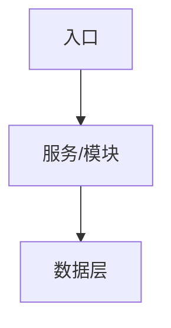
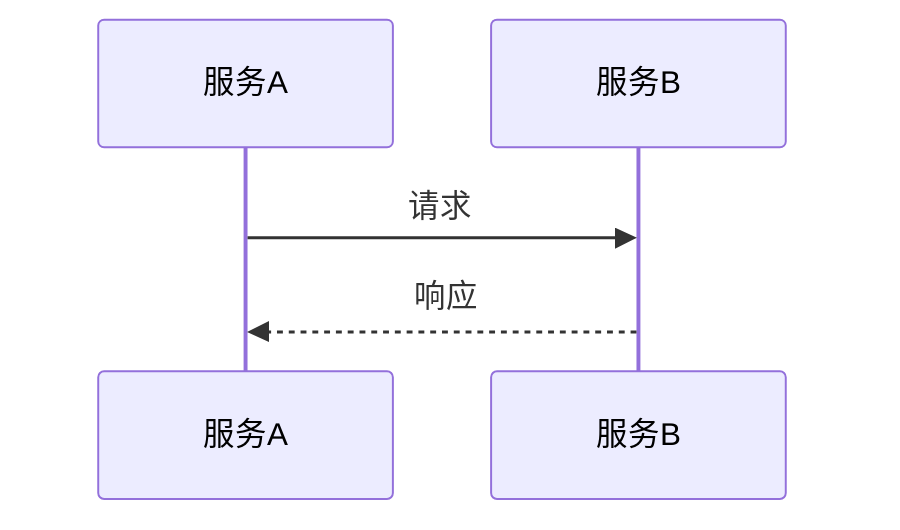
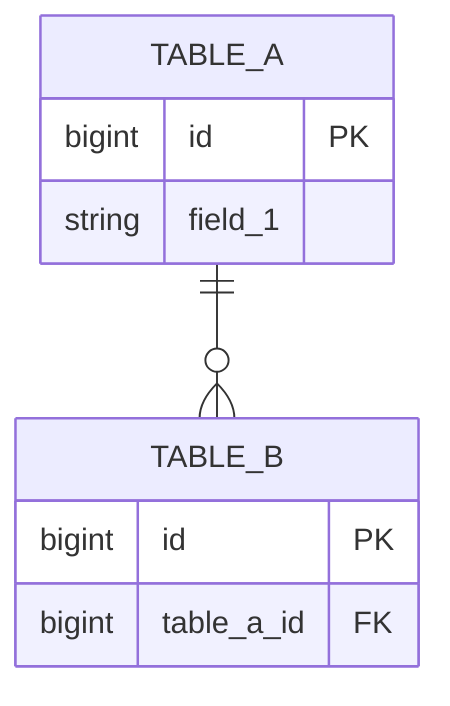
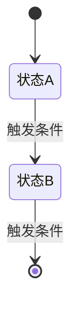

# DR-{PRD-ID}-{title}

## 1. 元信息

- 文档类型：DR 技术方案
- DR ID：DR-{PRD-ID}-{序号}
- PRD：[{PRD 标题}]({PRD 文件路径})
- 作者：
- 创建日期：
- 最后更新：
- 状态：Draft / Review / Approved / Superseded

> 示例：以下为填写示例，母版不含项目实例路径
> 示例：DR ID: DR-2C-IM-001，PRD: [2C IM 客服系统](../../prd/prd-2c-im客服系统.md)，创建日期: 2026-05-14，状态: Draft
> 示例：实际填写时替换为本项目 PRD 链接；prd/prd-2c-im客服系统.md 是 icec-cloud-boss 项目历史文件，非母版自带

> **🔴 必填规范（v3.9.3 起 — R2 强制向上归入）：**
> - `PRD` 字段值必须对应 `design/` 目录下真实存在的 PRD 文档
> - 文档内 §Story 拆分 章节必须**列出本 DR 拆分出的所有 Story ID**（关联性验证：Story 文档会反向引用本 DR 文档）
> - PRD 文档内 §DR 拆分 章节必须**列出本 DR ID**
> - 无 PRD 父级 → `PRD` 字段留空，工具判定为顶层（`DR-<特征>`）
> - 关联性不对 → 工具**阻断** + 提示去 PRD 文档补本 DR ID

---

## 使用说明

本模板用于技术方案文档（DR）的编写，作为 SDD 流程中 PRD 与 Story 之间的桥梁。

**DR 的职责：**
- 向上承接 PRD（做什么）和 constraints（怎么做的边界）
- 向下输出 Story 拆分和测试策略

**编写原则：**
- 功能流程细节不属于 DR 范畴，下沉到 Story 文档
- 每个重要决策必须写清楚"接受的代价"，不能只写优点

---

## 填写声明表

> 本模板采用"两大段"结构：本表集中声明所有章节的**填写义务**，正文每章节按"骨架 + 示例"两段组织。
> 章节标题不再标注 `必填/选填`；判定依据统一查此表。

| § | 章节 | 填写义务 | 适用条件 |
| --- | --- | --- | --- |
| 1 | 元信息 | 🔴 必填 | 全部 |
| 2 | 设计目标 | 🔴 必填 | 全部 |
| 3 | 约束承接 | 🔴 必填 | 全部 |
| 4 | 关键决策 | 🔴 必填 | 全部 |
| 5 | 架构概览 | 🔴 必填 | 全部 |
| 6 | 关键时序 | 🟡 选填（条件） | 有跨服务复杂交互 / 设计上不直觉的场景时 |
| 7 | 数据模型 | 🔴 必填 | 全部 |
| 8 | 接口契约 | 🟡 选填（条件） | 对外暴露接口时 |
| 9 | 状态与业务规则 | 🟡 选填（条件） | 有跨 Story 状态机 / 业务规则时 |
| 9.1 | └ 枚举定义 | 🟡 选填（条件） | 有跨 Story 复用的枚举时 |
| 10 | 故障模式 | 🟡 选填（条件） | 有需分析的失败场景时 |
| 11 | 权限、安全与审计 | 🟡 选填（条件） | 引入新权限模型 / 安全要求时 |
| 12 | Story 拆分 | 🔴 必填 | 全部 |
| 13 | 测试策略 | 🟡 选填（条件） | 全部（强烈建议填写） |
| 14 | 可观测性 | 🟡 选填（条件） | 全部（强烈建议填写） |
| 15 | 发布、迁移与回滚 | 🟡 选填（条件） | 全部（强烈建议填写） |
| 16 | 风险 | 🟡 选填（条件） | 全部（强烈建议填写） |
| 17 | 未决问题 | 🟡 选填（条件） | 全部（强烈建议填写） |
| 18 | 追踪 | 🔴 必填 | 全部 |

**填写义务图例：**
- 🔴 **必填** — 必须填写，不能为空，不能删章节
- 🟡 **选填（条件）** — 仅当"适用条件"成立时必填；条件不成立可整节删除

---

## 2. 设计目标

**粒度要求：** 写清楚"什么叫做完了"，不写方向性描述。每条目标必须可验证。

- 目标 1：
- 目标 2：

**非目标（明确不处理的）：**
- 不处理：
- 延后处理：

**范围：**

包含：
-

不包含：
-

> 示例：
> - 目标：用户可以通过 IM 与人工客服实时沟通，消息延迟 ≤ 3 秒
> - 非目标：不处理多媒体消息（图片/视频），延后处理

---

## 3. 约束承接

**粒度要求：** 显式列出本 DR 参考了哪些 constraints，并说明符合点或偏离点。偏离必须写明原因。

**约束文件清单（逐一检查是否有相关约束）：**
- `technology-stack.md`：技术栈选型约束
- `layered-arch.md`：分层架构与层间调用约束
- `project-structure.md`：工程结构与模块职责约束
- `api.md`：API 设计规范（URL、HTTP 方法、响应结构、错误码）
- `database.md`：数据库规范（建表、命名、索引、SQL）
- `code-style.md`：代码风格规范（异常、日志、事务、Feign）
- `security.md`：安全规范（鉴权、敏感数据、风险控制）
- `testing.md`：测试规范（分层策略、覆盖率、Mock 规则）
- `implicit-constraints.md`：隐性约定

> 示例：
>
> | 约束文档 | 关键约束 | 符合 / 偏离 | 说明 |
> | --- | --- | --- | --- |
> | technology-stack.md | Kafka 必须通过 courier 组件操作 | 偏离 | 融云消息回调为外部系统主动推送，无法通过 courier 接收，直接暴露 HTTP 端点；已在 DR 中说明原因 |
> | code-style.md | 事务方法中禁止包含 Feign 调用 | 符合 | 融云 API 调用均在事务外执行 |
> | database.md | 单表超 500 万行才考虑分库分表 | 符合 | im_message 预估日增 10 万条，初期无需分表，后续按需评估 |

---

## 4. 关键决策

**粒度要求：** 只记录有真实备选方案的决策点。显而易见的选择不需要写。每个决策必须写"接受的代价"——选了这个方案，就意味着接受了它的缺点，要显式承认。

### 决策 1：{决策点名称}

**背景：** 说明为什么需要做这个决策，面临什么约束。

**备选方案：**

| 方案 | 优点 | 缺点 |
| --- | --- | --- |
| 方案 A | | |
| 方案 B | | |

**决策：** 选择方案 X。

**理由：** 说明为什么排除其他方案。

**接受的代价：** 选择方案 X 意味着接受了……（必填，不能为空）

**决策人：**

---

### 决策 2：{决策点名称}

（同上结构）

---

> 示例：
>
> ### 决策 1：坐席路由分配并发控制方案
>
> **背景：** 多个工单同时触发路由分配时，可能导致同一坐席被超额分配，超过其 `max_concurrency`。
>
> **备选方案：**
>
> | 方案 | 优点 | 缺点 |
> | --- | --- | --- |
> | 悲观锁（SELECT FOR UPDATE） | 绝对不超额，实现简单 | 高并发下锁等待严重，吞吐量低 |
> | 乐观锁（`assignment_version` CAS） | 无锁等待，吞吐量高 | 高并发下存在重试，逻辑稍复杂 |
>
> **决策：** 选择乐观锁方案。
>
> **理由：** 客服系统并发量不极端，重试概率低；悲观锁在高峰期会造成明显延迟。
>
> **接受的代价：** 极端并发下存在少量重试，分配延迟略有上升；需保证重试逻辑幂等。
>
> **决策人：** 架构师

---

## 5. 架构概览

**粒度要求：** 聚焦模块边界和数据流，不写功能流程细节（那是 Story 的职责）。

### 架构图



### 工程清单

**粒度要求：** 列出本 DR 涉及的所有工程，明确工程名、类型和 context-path。这是 Story 生成接口 URL 的依据。

| 工程名 | 类型 | context-path | 说明 |
| --- | --- | --- | --- |
| {工程名} | BFF / Service / SPI | /xxx | |

> 示例：
>
> | 工程名 | 类型 | context-path | 说明 |
> | --- | --- | --- | --- |
> | icec-cloud-boss-agent-workbench-bff | BFF | /boss-agent-workbench-bff | 客服工作台 BFF |
> | icec-cloud-life-cs | Service | — | 客服 Service（无 HTTP 前缀，通过 SPI 调用） |
> | icec-cloud-life-im | Service | — | 消息 Service（无 HTTP 前缀，通过 SPI 调用） |

### 层级职责

**粒度要求：** 每个服务/模块用"负责什么 / 不负责什么"格式描述，边界要清晰。

**{服务/模块名}**
- 负责：
- 不负责：

**{服务/模块名}**
- 负责：
- 不负责：

> 示例：
>
> **通信层（融云）**
> - 负责：消息收发、全局时序、离线消息、多端同步
> - 不负责：任何业务逻辑、任何数据存储、任何规则校验
>
> **业务层（会话服务）**
> - 负责：会话创建、状态管理、消息落库、上下文归档
> - 不负责：任何消息传输、任何时序控制

---

## 6. 关键时序

**粒度要求：** 只画两类场景：跨服务的复杂交互、设计上不直觉的地方。不要把所有流程都画一遍，单服务内部逻辑不画。

### 场景 1：{场景名称}



### 场景 2：{场景名称}

（同上）

---

> 示例：
>
> ### 场景 1：转人工流程
>
> ```mermaid
> sequenceDiagram
>   participant C as copilot
>   participant B as 后台服务
>   participant R as 路由服务
>   participant RC as 融云
>   participant JP as 极光推送
>   C->>B: 触发转人工（sessionId, userId）
>   B->>R: 查询可用坐席（online, load < max）
>   R-->>B: 返回目标坐席
>   B->>B: 创建 cs_conversation + cs_ticket（乐观锁）
>   B->>RC: 发送系统消息通知工作台
>   B->>JP: 推送通知 APP
>   B-->>C: 返回分配结果
> ```

---

## 7. 数据模型

**粒度要求：** 重点解释非显而易见的设计——为什么加这个冗余字段、为什么用这个状态机、为什么这两张表分开建。显而易见的字段不需要逐一说明。

### 实体关系图



### 关键表说明

**{表名}**

| 字段 | 类型 | 说明 |
| --- | --- | --- |
| id | bigint | 主键 |
| {字段} | {类型} | {说明，重点解释非显而易见的设计} |

**变更清单：**

| 数据对象 / 表 | 变更类型 | 说明 |
| --- | --- | --- |
| | 新增 / 修改 / 删除 | |

---

> 示例：
>
> **`im_session`（会话表）**
>
> | 字段 | 类型 | 说明 |
> | --- | --- | --- |
> | id | bigint | 主键 |
> | user_id | bigint | 用户 ID |
> | vendor_session_id | varchar(64) | 融云会话 ID |
> | latest_message_at | datetime | 最后消息时间，用于超时判断 |
>
> 设计说明：一个用户对应一条长期会话，贯穿 AI 和人工服务全程，不随工单结束而关闭。
>
> **变更清单：**
>
> | 数据对象 / 表 | 变更类型 | 说明 |
> | --- | --- | --- |
> | im_session | 新增 | 会话主表 |
> | cs_ticket | 新增 | 工单表，关联 im_session，记录每次人工服务 |
> | im_message | 新增 | 消息落库表，基于 source_event_id 幂等 |

---

## 8. 接口契约

**粒度要求：** 列出对外暴露的接口，重点标注幂等性要求。内部实现细节不写。

| 接口 / 事件 / 外部系统 | 方向 | 核心入参 | 核心出参 | 幂等 | 对应 Story |
| --- | --- | --- | --- | --- | --- |
| | 入 / 出 | | | 是 / 否 | |

---

> 示例：
>
> | 接口 / 事件 / 外部系统 | 方向 | 核心入参 | 核心出参 | 幂等 | 对应 Story |
> | --- | --- | --- | --- | --- | --- |
> | 获取融云 Token | 入 | userId, principalType | token | 是 | STORY-001-BE |
> | 融云消息回调 | 入（融云推送） | sourceEventId, content | — | 是（基于 sourceEventId 去重） | STORY-002-BE |
> | 触发转人工 | 入（copilot 调用） | sessionId, userId | conversationId, assignedAgentId | 是 | STORY-008-BE |

---

## 9. 状态与业务规则

**粒度要求：** 只写跨 Story 的状态机和业务规则。只在单个 Story 内生效的规则，直接写进 Story 的 AC，不需要在这里重复。

### 状态机



### 枚举定义

> 只写跨多个 Story 使用的枚举定义。单 Story 内使用的枚举在 Story 文档的"枚举定义映射"节中定义，不在此处重复。
>
> **填写规则：**
> - 只列枚举 key 和业务含义，不在此处定义 Java 类结构（Java 类定义在 Story 的"枚举定义映射"节）
> - `归属 Story` = 负责定义和维护此枚举的 Story ID，其他 Story 引用时直接复用

| 枚举类名 | 涉及表/字段 | 枚举key | 业务含义 | 归属 Story | 备注 |
| --- | --- | --- | --- | --- | --- |
|  |  |  |  |  |  |

> 示例：
>
> | 枚举类名 | 涉及表/字段 | 枚举key | 业务含义 | 归属 Story | 备注 |
> | --- | --- | --- | --- | --- | --- |
> | UserStatusEnum | user.status, cs_user.status | ACTIVE | 正常 | STORY-001-BE | |
> | UserStatusEnum | user.status, cs_user.status | INACTIVE | 停用 | STORY-001-BE | |
> | TicketStatusEnum | cs_ticket.status | WAITING | 待接单 | STORY-003-BE | |
> | TicketStatusEnum | cs_ticket.status | IN_PROGRESS | 处理中 | STORY-003-BE | STORY-004-BE 引用 |
> | TicketStatusEnum | cs_ticket.status | ENDED | 已结束 | STORY-003-BE | 终态 |

### 跨功能业务规则

- BR-01：（规则描述，违反即为 bug）
- BR-02：

---

> 示例：
>
> ### 状态机
>
> ```mermaid
> stateDiagram-v2
>   [*] --> waiting : 工单创建
>   waiting --> in_progress : 坐席接单
>   waiting --> ended : 待接待超时（30 分钟）
>   in_progress --> ended : 坐席结单 / 超时自动结束
> ```
>
> ### 跨功能业务规则
>
> - BR-01：`ended` 状态不允许直接流转回 `in_progress`，工单重开必须创建新 `cs_ticket`（影响接单、结单、重开多个 Story）
> - BR-02：坐席 `current_load` 达到 `max_concurrency` 时不参与路由分配（影响路由分配和接单并发校验）

---

## 10. 故障模式

**粒度要求：** 针对关键流程，逐一分析每个依赖点的失败场景。重点关注：下游服务不可用、消息丢失、操作被重试、部分成功等情况。

**处理策略参考：** 重试（需保证幂等）、补偿（反向操作）、降级（走备用路径）、人工介入（记录异常等待处理）。

| 流程 | 故障点 | 故障场景 | 系统状态 | 处理策略 |
| --- | --- | --- | --- | --- |
| （流程名） | （依赖的服务/组件） | （具体失败场景） | （此时系统处于什么不一致状态） | （如何恢复） |

> 示例：
>
> | 流程 | 故障点 | 故障场景 | 系统状态 | 处理策略 |
> | --- | --- | --- | --- | --- |
> | 用户下单 | 库存服务 | 扣减超时 | 订单已创建，库存未扣 | 订单进入"待确认"，异步重试；超过 3 次取消订单 |
> | 用户下单 | 支付回调 | 回调处理时服务崩溃 | 支付已扣款，订单未更新 | 支付服务重试回调；订单服务幂等处理 |

---

## 11. 权限、安全与审计

**粒度要求：** 只写本 DR 引入的新权限模型或安全要求，已有的通用机制不重复描述。

- 权限模型：
- 敏感数据处理：
- 审计日志：（哪些操作需要记录操作人和时间）
- 风险控制：

---

> 示例：
> - 权限模型：坐席登录使用独立 `scene=customer_service` 参数，与普通用户账号体系隔离；工作台接口统一校验坐席身份
> - 敏感数据处理：用户手机号在对话列表和详情面板展示时必须脱敏（`138****8000`）
> - 审计日志：工单接单、结单、状态流转必须记录操作人 ID 和操作时间，写入 `cs_ticket` 的 `claimed_by`、`closed_by` 字段
> - 风险控制：融云消息回调端点加签名校验，防止伪造回调

---

## 12. Story 拆分

**拆分准则：**
- **可独立开发**：每个 Story 的实现不依赖同批并行开发的其他 Story，只依赖已完成的 Story
- **可独立交付**：每个 Story 完成后可以独立部署验证，有明确的验收标准
- **无循环依赖**：依赖关系是有向无环图，不存在 A 依赖 B、B 又依赖 A 的情况
- **前后端分离**：同一功能的前端和后端拆成两个独立 Story，前端 Story 依赖对应的后端 Story
- **粒度参考**：后端 1~3 天可完成的接口集合，或前端 1~3 天可完成的页面/组件

**Story ID 命名规范：**
- 后端 Story：`STORY-<序号>-BE`，如 `STORY-001-BE`
- 前端 Story：`STORY-<序号>-FE`，如 `STORY-001-FE`
- 纯后台任务（无前端）：`STORY-<序号>-BE`

**粒度要求：** 列出本 DR 向下拆解的所有 Story，说明每个 Story 的范围边界、依赖关系和预计开发时间。这是 DR 向下输出的核心。先完成后端 Story，前端 Story 在后端接口稳定后补充。

### 后端 Story

| Story ID | 标题 | 优先级 | 核心范围 | 依赖 Story | 预计开发时间 |
| --- | --- | --- | --- | --- | --- |
| STORY-001-BE | | P1 | | — | |
| STORY-002-BE | | P2 | | STORY-001-BE | |

### 前端 Story

> 待后端 Story 接口稳定后补充。

---

### Story 详情

**粒度要求：** 每个 Story 独立描述，说明核心范围边界、具体要做的事、对外暴露的接口。无对外接口的 Story（纯内部能力）在接口节注明"无对外接口"。

#### STORY-001-BE：{标题}

**核心范围：** 一句话说明这个 Story 的边界，以及明确不包含什么。

**要做的事：**
-
-

**接口：**

| 接口 | 方向 | 说明 |
| --- | --- | --- |
| | | |

---

> 示例：
>
> #### STORY-001-BE：融云身份注册与 Token 管理
>
> **核心范围：** 维护业务身份（用户/坐席）与融云 ID 的映射关系，提供获取融云 Token 的接口。不包含任何业务逻辑，是所有融云相关功能的前提。
>
> **要做的事：**
> - 建立 `im_identity_registry` 表，维护 `principal_type + principal_id → vendor_user_id` 映射
> - 实现融云账号注册：首次获取 Token 时若无融云账号则自动注册
> - 提供获取融云 Token 接口，供工作台和 APP 初始化融云 SDK 使用
>
> **接口：**
>
> | 接口 | 方向 | 说明 |
> | --- | --- | --- |
> | 获取融云 Token | 工作台 / APP → 后台 | 获取当前用户/坐席的融云 Token，不存在则自动注册 |

---

### 依赖关系图

```mermaid
flowchart TD
  STORY-001-BE[STORY-001-BE\n{标题}]
  STORY-002-BE[STORY-002-BE\n{标题}]
  STORY-001-BE --> STORY-002-BE
```

> 示例见实际 DR 文档，每个节点格式为 `STORY-XXX-BE\n标题`，箭头方向为"被依赖 → 依赖方"。

---

## 13. 测试策略

**粒度要求：** 说明整体分层策略和覆盖目标，不只是映射表。明确哪些必须自动化、哪些可以手工，以及理由。

**分层策略：**
- 单元测试：覆盖目标（如：核心业务规则 100% 覆盖）
- 接口测试：覆盖目标（如：所有对外接口的正常路径 + 主要异常路径）
- 集成测试：覆盖目标（如：关键跨服务流程）
- UI 测试：覆盖目标（如：核心用户路径）

**覆盖矩阵：**

| Story ID | AC ID | 测试层级 | 自动化 | 备注 |
| --- | --- | --- | --- | --- |
| STORY-001-BE | AC-001 | 单元 / 接口 / 集成 / UI | 是 / 否 | |

---

> 示例：
> - 单元测试：状态机流转逻辑 100% 覆盖，重点覆盖非法流转场景（如 ended → in_progress 必须拒绝）
> - 接口测试：转人工、接单、结单的正常路径 + 并发超额场景
> - 集成测试：融云消息回调幂等性验证（同一 sourceEventId 重复投递只落库一次）
> - 手工验证：超时自动结束（定时任务触发，难以自动化）

---

## 14. 可观测性

**粒度要求：** 上线后怎么知道系统是健康的。这不是运维的事，是设计阶段就要想清楚的。

**关键指标（Metrics）：**
- （指标名）：（说明正常范围和告警阈值）

**关键日志（Logs）：**
- （哪些操作必须打日志，日志里必须包含哪些字段）

**告警规则（Alerts）：**
- （触发条件）→（告警级别）→（处理预案）

---

> 示例：
> - 关键指标：工单路由分配成功率（告警阈值 < 95%）、融云消息回调处理延迟（告警阈值 > 500ms）、超时任务执行延迟（告警阈值 > 2min）
> - 关键日志：工单每次状态流转必须打 `info` 日志，含 `ticketId`、`fromStatus`、`toStatus`、`operatorId`；融云回调处理失败打 `error` 日志含 `sourceEventId`
> - 告警规则：路由分配失败率 > 5% → P1 告警 → 检查坐席在线状态和并发配置

---

## 15. 发布、迁移与回滚

- 发布步骤：（按顺序列出，说明各步骤的依赖关系）
- 数据迁移：（是否需要，迁移脚本和验证方式）
- 回滚策略：（如何回滚，回滚后数据是否一致）
- 兼容性：（是否有 API 版本兼容问题，是否有客户端强制升级要求）

---

> 示例：
> - 发布步骤：1. 先发 Service（建表 + SPI 接口上线），2. 再发 BFF（调用新 SPI），3. 最后发 copilot 侧配置
> - 数据迁移：全新表结构，无存量数据迁移；建表 DDL 在发布前由 DBA 审核执行
> - 回滚策略：BFF 先回滚（关闭入口），Service 后回滚；表结构保留不删，数据可手动清理
> - 兼容性：APP 侧需升级以支持新的会话状态推送格式，需与移动端协商发布节奏

---

## 16. 风险

| 风险 | 影响 | 概率 | 缓解方式 | 状态 |
| --- | --- | --- | --- | --- |
| | 高 / 中 / 低 | 高 / 中 / 低 | | Open |

---

> 示例：
>
> | 风险 | 影响 | 概率 | 缓解方式 | 状态 |
> | --- | --- | --- | --- | --- |
> | 融云服务不可用 | 高（消息收发中断） | 低 | 消息落库后异步重试；降级为系统提示"消息发送失败，请稍后重试" | Open |
> | 坐席并发超额（乐观锁重试失败） | 中（工单分配失败） | 低 | 重试 3 次后进入待分配队列，触发告警 | Open |

---

## 17. 未决问题

| 问题 | 影响范围 | 负责人 | 截止时间 | 状态 |
| --- | --- | --- | --- | --- |
| | | | | Open |

---

> 示例：
>
> | 问题 | 影响范围 | 负责人 | 截止时间 | 状态 |
> | --- | --- | --- | --- | --- |
> | 坐席最大并发数是否支持按坐席单独配置（当前方案为全局统一值） | 影响路由分配逻辑和 cs_user 表设计 | 产品 | 2026-05-20 | Open |
> | 超时自动结束是否需要通知用户可重新发起咨询 | 影响 STORY-020-BE 通知文案和 STORY-009-BE 推送逻辑 | 产品 | 2026-05-20 | Open |

---

## 18. 追踪

- Story 文档：
- 用例设计：
- 相关任务：
- PR / MR：
