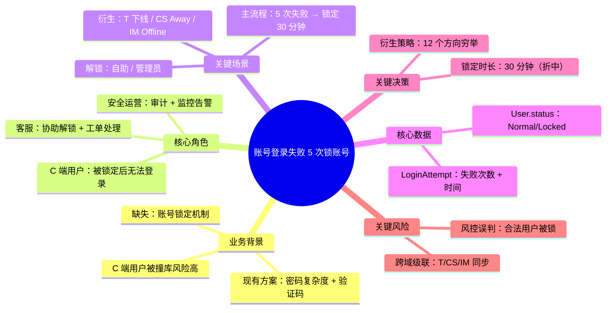

# 需求分析报告：{需求名称}

> **文档信息**
> - RA ID：RA-{编号}
> - 关联 PRD：PRD-{编号}
> - 关联业务模块：{module-name}
> - 迭代号：{YYYY-MM-DD}
> - 创建日期：YYYY-MM-DD
> - 分析者：{AI 辅助} + {人工确认}
> - 状态：草稿 / 待确认 / 已确认
> - 版本：v1.0

## 0. 文档信息
- PRD ID / RA ID / 关联业务模块 / 迭代号 / 创建日期 / 分析者 / 状态 / 版本

---

## 填写声明表

> 本模板采用"两大段"结构：本表集中声明所有章节的**填写义务**，正文每章节按"骨架 + 示例"两段组织。
> 章节标题不再标注 `必填/选填`；判定依据统一查此表。

| § | 章节 | 填写义务 | 适用条件 |
| --- | --- | --- | --- |
| 0.5 | RequirementAnalysisModel 决策记录 | 🔴 必填 | 全部 |
| 0.6 | 需求风险预判 | 🔴 必填 | 全部 |
| 2 | 角色分析 | 🔴 必填 | 全部 |
| 2.2 | └ 角色 × 需求 × 效果矩阵 | 🔴 必填 | 全部 |
| 3 | 场景分析 | 🔴 必填 | 全部 |
| 4 | 业务流程 | 🔴 必填 | 全部 |
| 5 | 数据要素 | 🔴 必填 | 全部 |
| 6 | 业务规则与约束 | 🔴 必填 | 全部 |
| 6.5 | └ 衍生规则登记表 | 🟡 选填（条件） | 有衍生规则时 |
| 7 | 设计方向论证 | 🔴 必填 | 全部 |
| 8 | 验收标准雏形 | 🔴 必填 | 全部 |
| 8.5 | └ 衍生 AC 登记表 | 🟡 选填（条件） | 有衍生 AC 时 |
| 9 | 隐性假设与验证 | 🔴 必填 | 全部 |
| 9.3 | └ 实现视角七要素 | 🔴 必填 | 全部 |
| 11 | 规模裁定 | 🔴 必填 | 全部 |
| 14 | RA ↔ DR/Story/Task 关联矩阵 🆕 | 🔴 必填 | 全部 |
| 14.1 | └ 下游文档清单 | 🔴 必填 | 全部 |
| 14.3 | └ RA 修订影响历史 | 🔴 必填 | 全部 |

**填写义务图例：**
- 🔴 **必填** — 必须填写，不能为空，不能删章节
- 🟡 **选填（条件）** — 仅当"适用条件"成立时必填；条件不成立可整节删除

---

## 0.5 RequirementAnalysisModel 决策记录

| 维度 | 结论 | 证据 | 风险等级 | 后续动作 |
| --- | --- | --- | --- | --- |
| RA-01 输入保真 | {原文事实与 AI 推断已分离} | {PRD §X / Issue / 用户对话轮次} | 🔴/🟠/🟡/🟢 | {动作} |
| RA-02 目标与成功标准 | {目标树 + 成功指标 + 非目标} | {来源} | {等级} | {动作} |
| RA-03 角色与权限边界 | {角色/权限/冲突结论} | {来源} | {等级} | {动作} |
| RA-04 场景拓扑 | {主/异常/边界/组合场景结论} | {来源} | {等级} | {动作} |
| RA-05 状态与生命周期 | {状态机/生命周期/反向流程结论} | {来源} | {等级} | {动作} |
| RA-06 数据语义与所有权 | {实体/字段/所有权结论} | {assets.table()/PRD} | {等级} | {动作} |
| RA-07 业务规则与衍生规则 | {R/R' 结论} | {PRD §X / H.5/H.6} | {等级} | {动作} |
| RA-08 跨域级联 | {受影响域/事件/缓存/MQ 结论} | {assets.module()/api()/search()} | {等级} | {动作} |
| RA-09 现有能力复用 | {复用/不复用结论} | {assets.search()/component()/api()} | {等级} | {动作} |
| RA-10 非功能与约束 | {性能/安全/合规/审计/可观测结论} | {PRD/standards/assets} | {等级} | {动作} |
| RA-11 AC 与测试可验证性 | {AC 可验证性结论} | {场景/规则/数据映射} | {等级} | {动作} |
| RA-12 规模与路由置信度 | {规模 + 路由 + 置信度 + 反例} | {§11 评分证据} | {等级} | {动作} |

**阻断项：** {N} 个  
**未决项：** {N} 个  
**结论：** - [ ] 可进入 8 维度挖掘 / - [ ] 不可进入，需补充输入

---

## 0.6 需求风险预判

| 风险维度 | 是否命中 | 证据 | 强制动作 | 落地章节 |
| --- | --- | --- | --- | --- |
| 输入缺失 | 是/否 | {来源} | {追问/补文档/接受模糊} | §10 |
| 角色冲突 | 是/否 | {来源} | {冲突方案} | §2.3 |
| 状态复杂 | 是/否 | {来源} | {状态机 + 衍生规则/AC} | §4/§6.5/§8.5 |
| 跨域级联 | 是/否 | {来源} | {H.6 级联表} | §9-ter |
| 数据敏感 | 是/否 | {来源} | {合规/审计/脱敏} | §5/§6.3 |
| 复用风险 | 是/否 | {assets 调用} | {复用扫描} | §7 |
| 验收风险 | 是/否 | {来源} | {补 AC} | §8 |
| 路由风险 | 是/否 | {评分证据} | {反例/置信度} | §11 |

---

## 1. 业务全景

### 1.1 业务背景
{3-5 段：业务问题 / 现状痛点 / 解决方案}

### 1.2 核心价值
- 对业务：{...}
- 对用户：{...}

### 1.3 业务边界
- **In Scope**：{...}
- **Out of Scope**：{...}

### 1.4 🆕 业务全景图（v3.2 新增 — Mermaid mindmap，30 秒读懂需求）

> **🔴 强制：** §1.4 业务全景图必须填写，目的是让任何读者 30 秒内看懂"这个需求在做什么 / 涉及谁 / 解决什么问题"。**禁止用纯文字描述代替图。**

```mermaid
mindmap
  root((需求：{需求名称}))
    业务背景
      现状痛点
      解决方案
      预期效果
    核心角色
      角色 1：{描述}
      角色 2：{描述}
      角色 3：{描述}
    关键场景
      主流程 1：{描述}
      主流程 2：{描述}
      异常场景：{描述}
    核心数据
      实体 1：{描述}
      实体 2：{描述}
    关键决策
      决策 1：{方案选择}
      决策 2：{方案选择}
    关键风险
      风险 1：{描述}
      风险 2：{描述}
```

> 示例（账号登录失败 5 次锁账号）：



**绘制原则：**
- 第一层（root）：**需求名称**（一句话）
- 第二层：6 个固定类别（业务背景 / 核心角色 / 关键场景 / 核心数据 / 关键决策 / 关键风险）
- 第三层及以下：每个类别下放 3-7 个要点，**禁止超过 10 个**（多了就太杂）
- 禁止写完整句子（mindmap 是关键词 + 短句，不是叙述）
- 颜色 / 样式不需要配置（Mermaid 默认即可）

---

## 2. 角色分析

### 2.1 角色枚举（穷举）
- 角色 1：{...}（如"C 端用户"）
- 角色 2：{...}（如"运营人员"）

### 2.2 角色 × 需求 × 效果矩阵

| 角色 | 核心需求 | 完成动作 | 期望效果 | 不希望发生 | 优先级 |
| --- | --- | --- | --- | --- | --- |
| {角色} | {需求} | {动作} | {效果} | {不希望} | P0/P1/P2 |

### 2.3 角色冲突识别
- 冲突 1：{角色 A} vs {角色 B}，冲突点：{xxx}，建议方案：{xxx}
- 冲突 2：{...}

### 2.4 角色优先级
1. 核心：{xxx}
2. 边缘：{xxx}

---

## 3. 场景分析

### 3.1 主流程场景
1. 场景 1：{xxx}
2. 场景 2：{xxx}

### 3.2 异常场景
- **业务异常**：
  - {xxx}：触发条件 / 处理动作 / 用户提示
- **系统异常**：
  - {xxx}
- **数据异常**：
  - {xxx}
- **并发异常**：
  - {xxx}

### 3.3 边界场景
- 空数据 / 超长字段 / 弱网 / 离线 / 大数据量 / 国际化

### 3.4 跨场景组合
- {大文件 + 弱网}：{处理方式}

---

## 4. 业务流程

### 4.1 状态机
```
{状态 A} ──→ {状态 B} ──→ {状态 C}
{状态 B} ──→ {状态 D}（异常）
```

### 4.2 主流程时序
1. 用户操作 {xxx}
2. 系统调用 {xxx}
3. 返回结果 {xxx}

### 4.3 异常处理矩阵

| 异常类型 | 触发条件 | 检测点 | 处理动作 | 用户提示 |
| --- | --- | --- | --- | --- |
| {xxx} | {xxx} | {xxx} | {xxx} | {xxx} |

---

## 5. 数据要素

### 5.1 核心实体列表
- 实体 1：{xxx}（主表/关系表/历史表）
- 实体 2：{xxx}

### 5.2 实体关系图
```
{实体 1} 1:N {实体 2}
{实体 2} 1:1 {实体 3}
```

### 5.3 字段约束矩阵
- 实体 1.字段 a：类型 / 约束 / 枚举 / 默认值 / 业务含义
- 实体 1.字段 b：{...}

### 5.4 数据生命周期
| 实体 | 创建时机 | 读取方 | 更新场景 | 删除/归档 |
| --- | --- | --- | --- | --- |
| {xxx} | {xxx} | {xxx} | {xxx} | {xxx} |

### 5.5 数据所有权
| 实体 | 创建方 | 修改方 | 查询方 |
| --- | --- | --- | --- |
| {xxx} | {xxx} | {xxx} | {xxx} |

---

## 6. 业务规则与约束

### 6.1 业务规则列表
- R1：{xxx}
- R2：{xxx}

### 6.2 平台约束
- 接口路径：{xxx}
- 数据隔离：{xxx}
- 分页规范：{xxx}

### 6.3 合规要求
- 数据脱敏：{xxx}
- 审计日志：{xxx}
- 等保要求：{xxx}

### 6.4 性能约束
- P99 < {xxx}ms
- TPS > {xxx}

### 6.5 衍生规则登记表

| 规则 # | 主规则 R | 衍生规则 R' | 衍生模式命中 | R' 优先级 | R' 验证方式 |
| --- | --- | --- | --- | --- | --- |
| R1 | {主规则} | R1.1 {衍生规则} | H.5 模式 {编号}.{影响编号} | P0/P1/P2 | 用户确认 / 资产反查 / 代码反查 |

> 不涉及状态变更时，必须写明"不适用"的证据，而不是留空。

---

## 7. 设计方向论证

### 7.1 备选方案
- 方案 A：{xxx}
- 方案 B：{xxx}
- 方案 C：{xxx}

### 7.2 方案对比

| 方案 | 复杂度 | 性能 | 可维护性 | 可扩展性 | 影响面 |
| --- | --- | --- | --- | --- | --- |
| A | 中 | 高 | 中 | 低 | {xxx} |
| B | 低 | 中 | 高 | 高 | {xxx} |

### 7.3 取舍说明
- 选定方案：{xxx}
- 选定理由：{xxx}
- 接受代价：{xxx}

---

## 8. 验收标准雏形

| AC ID | Given | When | Then | 覆盖场景 |
| --- | --- | --- | --- | --- |
| AC-001 | {xxx} | {xxx} | {xxx} | 主流程场景 1 |
| AC-002 | {xxx} | {xxx} | {xxx} | 异常场景 1 |
| AC-003 | {xxx} | {xxx} | {xxx} | 边界场景 1 |

### 8.5 衍生 AC 登记表

| AC # | 主场景 | 衍生场景 | 衍生动作 | 时效要求 | Given-When-Then | 对应规则 R' | 状态 |
| --- | --- | --- | --- | --- | --- | --- | --- |
| AC-衍生-001 | {主场景} | {衍生场景} | {动作} | {X 秒内} | Given {前置} / When {触发} / Then {结果} | R1.1 | ✅/🟡 |

### 8.6 衍生覆盖率

| 维度 | 数量 | 覆盖率 |
| --- | --- | --- |
| 主场景 AC（原始）| {N} | — |
| 衍生规则 R' 总数 | {M} | — |
| 已配套衍生 AC 数 | {K} | {K/M} |
| 衍生 AC 时效要求明确率 | {T} | {T/K}（要求 100%）|
| 衍生 AC 跨域覆盖数 | {C} | — |

---

## 9. 隐性假设与验证

| 假设 | 验证方式 | 验证结果 |
| --- | --- | --- |
| {xxx} | {xxx} | 已确认 / 已反驳 / 待确认 |

### 9.1 业务模式匹配表

| 套用的模式 | 模式 # | 命中的衍生影响编号 | 转化为业务规则 R# | 转化为 AC # | 备注（不适用理由）|
| --- | --- | --- | --- | --- | --- |
| 账号状态变更 | 1 | {①③④... / 无} | {R3/R4/...} | {AC-004/...} | {不适用理由或链接} |
| 订单状态变更 | 2 | {编号 / 无} | {R# / —} | {AC# / —} | {理由} |
| 支付状态变更 | 3 | {编号 / 无} | {R# / —} | {AC# / —} | {理由} |
| 登录态变更 | 4 | {编号 / 无} | {R# / —} | {AC# / —} | {理由} |
| 权限变更 | 5 | {编号 / 无} | {R# / —} | {AC# / —} | {理由} |
| 定时任务状态 | 6 | {编号 / 无} | {R# / —} | {AC# / —} | {理由} |

### 9.2 跨域级联效应表

| 触发动作 | 受影响域 | 受影响状态机 / 事件 / 缓存 / MQ | 触发方式 | 时效要求 | 反向影响 |
| --- | --- | --- | --- | --- | --- |
| {动作} | {域} | {状态机/事件/缓存/MQ} | 同事务 / 事件 / MQ / WebSocket | {X 秒内} | {是否回写触发方} |

### 9.3 实现视角七要素

> **用途：** 本节回答"开发怎么做"。缺本节时，DR/Coding 会被迫补猜数据源、数据流、字段定义、复用边界和成本取舍。

#### 9.3.1 数据源清单（I1）

| 来源类型 | 名称 | 读/写 | owner | 权威源 | 证据 |
| --- | --- | --- | --- | --- | --- |
| DB 表 / view | {table/view} | 读/写 | {owner} | {DB/API/配置/三方} | {assets/db/schema/代码路径} |
| API / RPC | {method path} | 读/写 | {provider} | {接口提供方} | {controller/client/assets api} |
| MQ / 事件 | {topic/event} | 生产/消费 | {owner} | {topic 定义} | {consumer/producer 代码} |
| 缓存 / Redis | {key pattern} | 读/写/失效 | {owner} | {DB/API} | {cache config/代码路径} |
| 配置 / Nacos | {config key} | 读 | {owner} | {配置中心} | {配置文件/控制台} |
| 文件 / OSS / 第三方 / 前端状态 / 日志指标 | {name} | {读写} | {owner} | {权威源} | {证据} |

#### 9.3.2 数据流链路（I2）

| 来源 | 入口 | 处理 | 落点 | 输出 | 事务/一致性 | 观测 |
| --- | --- | --- | --- | --- | --- | --- |
| {source} -> {API/event/job} | {endpoint/topic/job} | {service/domain} | {DB/cache/MQ/file} | {response/event/log} | {事务边界/幂等/补偿} | {log/metric/audit/tracing} |

#### 9.3.3 术语 / 定义 / 不变量（I3）

| 术语/字段/状态 | 定义 | 枚举/单位/空值 | 不变量 | ID/唯一性 | 权威源 |
| --- | --- | --- | --- | --- | --- |
| {name} | {定义} | {enum/unit/null} | {必须成立的约束} | {ID 规则} | {表/API/配置} |

#### 9.3.4 现有实现 / 复用证据（I4）

| 对象 | 代码/路径/class/method/表/API/assets/git 证据 | 复用结论 | 不复用/改造理由 |
| --- | --- | --- | --- |
| {module/class/api/table} | {src/... / table / endpoint / git grep / assets query} | 复用 / 改造 / 新建 / 不复用 | {理由} |

#### 9.3.5 高成本 / 难实现设计反驳（I5）

| 方案 | 成本/风险 | 不采用理由 | 替代 / 更低成本方案 | 是否保留为后续 |
| --- | --- | --- | --- | --- |
| {方案} | {迁移/一致性/性能/团队/影响面成本} | {为什么不该做} | {分阶段/复用/降级方案} | 是/否 |

#### 9.3.6 开发者疑问答复矩阵（I6）

| 开发者问题 | 答案/答复 | 证据 | 状态 | 是否阻断 DR |
| --- | --- | --- | --- | --- |
| {开发者写 DR 前会问的问题？} | {答案} | {PRD/资产/代码/用户确认} | 已解决 / 待确认 | 是/否 |

#### 9.3.7 DR 生成交接包（I7）

| DR 输入 | 内容 |
| --- | --- |
| 接口/API/event/job | {路径、入参、出参、错误码、事件体} |
| 数据模型/表/cache/topic/config | {表、字段、索引、缓存 key、MQ topic、配置 key} |
| 状态/事务/一致性 | {状态机、事务边界、幂等、补偿、失败处理} |
| 非功能/权限/审计/观测 | {性能、安全、权限、审计日志、指标告警} |
| 测试/验收 | {主流程、异常、边界、衍生 AC、数据一致性验证} |
| 迁移/回滚/灰度 | {迁移脚本、开关、灰度、回滚、监控} |

---

## 10. 缺口与未决问题

### 10.1 缺口清单

| 缺口ID | 描述 | 严重程度 | 解决方案 | 状态 |
| --- | --- | --- | --- | --- |
| GAP-001 | {xxx} | 🔴 阻断 | 已请用户确认 | 已解决 |
| GAP-002 | {xxx} | 🟡 一般 | 接受模糊，标注 | 已解决 |

### 10.2 未决问题
- Q1：{xxx}（负责人：{xxx}，截止：{xxx}）
- Q2：{xxx}

---

## 11. 规模裁定

### 11.1 5 维评分

| 维度 | 评分（1=微 2=小 3=中 4=大） | 说明 |
| --- | --- | --- |
| 服务范围 | {1/2/3/4} | {xxx} |
| 接口变更 | {1/2/3/4} | {xxx} |
| 架构决策 | {1/2/3/4} | {xxx} |
| 数据变更 | {1/2/3/4} | {xxx} |
| 测试层级 | {1/2/3/4} | {xxx} |

### 11.2 特殊场景判定
- BUG 类（实现与文档不符，需改代码）？是/否
- 配置/文档类（不需改代码）？是/否

### 11.3 规模结果
- **规模 = {大/中/小/微/特殊-BUG/特殊-非代码}**

### 11.4 路由决策
- **下游 SKILL = {dr-generate-skill / story-generate-skill / task-generate-skill / coding-skill}**
- **路径 = {ae-sdd-doc/iterations/{date}/xxx/}**

---

## 12. 自检清单

- [ ] RequirementAnalysisModel 12 维决策已完成，且每维有证据
- [ ] 需求风险预判命中项已全部落地到对应章节
- [ ] 8 个维度（A 角色 / B 场景 / C 流程 / D 数据 / E 规则 / F 设计方向 / G AC / H 假设）已全部挖掘
- [ ] 每条结论 5 问自检（证据/反例/边界/冲突/缺口）通过
- [ ] 衍生规则 R' 与衍生 AC 已按适用情况补齐
- [ ] 跨域级联效应已按适用情况补齐
- [ ] 实现视角七要素已补齐（数据源/数据流/定义/复用证据/成本反驳/开发者疑问/DR交接包，G-RA-6）
- [ ] 所有冲突已识别并方案化
- [ ] 所有缺口已解决或显式标注
- [ ] 规模裁定评分完整
- [ ] 路由决策有依据
- [ ] 用户已确认本报告

---

## 13. RA 质量闸自检（RA-G01~RA-G16）

| # | 门禁 | 状态 | 证据 |
| --- | --- | --- | --- |
| RA-G01 | 输入保真 | - [ ] | {证据} |
| RA-G02 | RAModel 12 维完整 | - [ ] | {证据} |
| RA-G03 | 风险预判闭环 | - [ ] | {证据} |
| RA-G04 | 角色穷举 | - [ ] | {证据} |
| RA-G05 | 场景拓扑完整 | - [ ] | {证据} |
| RA-G06 | 状态与生命周期完整 | - [ ] | {证据} |
| RA-G07 | 数据语义真实 | - [ ] | {证据} |
| RA-G08 | 主规则与衍生规则完整 | - [ ] | {证据} |
| RA-G09 | 跨域级联完整 | - [ ] | {证据} |
| RA-G10 | 复用扫描完成 | - [ ] | {证据} |
| RA-G11 | AC 可验证 | - [ ] | {证据} |
| RA-G12 | 衍生 AC 覆盖 | - [ ] | {证据} |
| RA-G13 | 5 问自检通过 | - [ ] | {证据} |
| RA-G14 | 缺口管理闭环 | - [ ] | {证据} |
| RA-G15 | 规模与路由有依据 | - [ ] | {证据} |
| RA-G16 | 实现视角与落盘审核完成 | - [ ] | §9.3 + G-RA-6 扫描结果 + {落盘/审核证据} |

---

## 14. RA ↔ DR/Story/Task 关联矩阵 🆕

> **🔴 强制：** RA 文档必须维护"下游文档关联矩阵"。本矩阵是"RA 修订触发下游重审"的唯一依据（见 requirement-analysis-skill §RA 修订影响分析）。
>
> **🔴 关键：** 每次 RA 修订必须显式标注"本次修订影响了哪些下游文档"，驱动下游文档重审闭环。

### 14.1 下游文档清单

> **🔴 权威来源：** 本清单必须镜像 daemon `flow.snapshot` 投影的 `documentTree`（PRD 下挂哪些 DR、每个 DR 下挂哪些 Story）；用户提供并经 `workitem.create providedDocuments` 采纳的文档同样必须入表，来源列标"用户指定采纳"。投影与本表不一致时，以 `documentTree` 为准修订本表。

| # | 下游文档类型 | 文档 ID | 当前版本 | 路径 | 来源 | 状态 | 上次重审时间 |
| --- | --- | --- | --- | --- | --- | --- | --- |
| 1 | DR | DR-{ID} | v{N}.{m} | ae-sdd-doc/iterations/{date}/DR/{DR-ID}-vN.m.md | ae-sdd 生成 / 用户指定采纳 | 🟢 通过 / 🟡 Review 中 / 🔴 阻断 | {YYYY-MM-DD} |
| 2 | Story | STORY-{ID} | v{N} | ae-sdd-doc/iterations/{date}/Story/{STORY-ID}-vN.md | ae-sdd 生成 / 用户指定采纳 | 🟢 / 🟡 / 🔴 | {YYYY-MM-DD} |
| 3 | Task | Task-{ID} | — | ae-sdd-doc/iterations/{date}/Task/{Task-ID}/ | ae-sdd 生成 / 用户指定采纳 | 🟢 / 🟡 / 🔴 | {YYYY-MM-DD} |
| 4 | Coding 报告 | Coding-{ID} | r{N} | ae-sdd-doc/iterations/{date}/Coding/{Coding-ID}-rN.md | ae-sdd 生成 | 🟢 / 🟡 / 🔴 | {YYYY-MM-DD} |
| 5 | Code Review 报告 | CR-{ID} | vN.m | ae-sdd-doc/iterations/{date}/CR/CR-{ID}-vN.m.md | ae-sdd 生成 | 🟢 / 🟡 / 🔴 | {YYYY-MM-DD} |

### 14.2 RA 维度 ↔ 下游章节 双向映射表

> **用途：** 当 RA §X 维度变更时，反查"哪些下游章节会被影响"。

| RA 维度 | RA 章节 | 影响的 DR 章节 | 影响的 Story 章节 | 影响的 Task |
| --- | --- | --- | --- | --- |
| 角色 | §2 | DR §11 权限模型 | Story §2 角色 + Story §6 任务映射 | Task 涉及角色权限 |
| 场景 | §3 | DR §6 关键时序 + §10 故障模式 | Story §3 主流程 + §3.x 异常 | Task 主流程分支 |
| 状态机 | §4 | DR §9 状态机 | Story §4 状态流转 | Task 状态变更 |
| 数据要素 | §5 | DR §7 数据模型 | Story §5 数据模型 | Task 涉及数据 |
| 业务规则 | §6 + §6.5 衍生 | DR §9 业务规则 | Story §6 业务规则 | Task 业务校验 |
| 设计方向 | §7 | DR §4 关键决策 | Story §7 实现方案 | Task 技术选型 |
| AC | §8 + §8.5 衍生 | DR §13 验收标准 | Story §8 AC 清单 | Task 测试用例 |
| 假设 | §9 | DR §16 风险 | Story §9 风险 | Task 风险规避 |
| 业务模式 | §9-bis | DR §9 + §10 | Story §3 + §6 | Task 异常处理 |
| 跨域级联 | §9-ter | DR §17 跨域影响 | Story §11 集成 + 跨域 | Task 跨服务调用 |
| 实现视角七要素 | §9-quater | DR 接口/数据模型/状态事务/非功能/发布迁移 | Story 数据流/复用边界/开发疑问 | Task 代码路径/数据源/测试/回滚 |

### 14.3 RA 修订影响历史

> **用途：** 追溯每次 RA 修订影响了哪些下游文档，确保闭环。

| RA 版本 | 修订时间 | 修订触发 | 修订摘要 | 受影响下游文档 | 重审触发状态 |
| --- | --- | --- | --- | --- | --- |
| v1.0 | {YYYY-MM-DD} | 首次创建 | — | — | ✅ N/A |
| v1.1 | {YYYY-MM-DD} | dr-review RA-DEFECT | 新增 §6.5 衍生规则 R3.5 | DR-{ID} → dr-review 新一轮 | ✅ 已触发 |
| v2.0 | {YYYY-MM-DD} | PRD 业务方补充 | 角色 X 新增 Y 权限 | DR-{ID}, STORY-{ID} | 🟡 Review 中 |

### 14.4 RA ↔ PRD 关联

| # | PRD ID | PRD 版本 | 修订时间 | 差异说明 |
| --- | --- | --- | --- | --- |
| 1 | PRD-{ID} | v{N} | {YYYY-MM-DD} | {本次 RA 修订与 PRD 的差异说明} |

### 14.5 关联矩阵维护 SOP

```
每次 RA 修订
    ↓
第 1 步：在 §14.1 列出当前下游文档清单
    ↓
第 1-bis 步：用户提供文档经 workitem.create providedDocuments 采纳后必须入 §14.1 表（来源列=用户指定采纳），并以 daemon flow.snapshot 投影的 documentTree 为权威核对 PRD→DR→Story 父子关系
    ↓
第 2 步：在 §14.2 反查受影响的 DR/Story/Task 章节
    ↓
第 3 步：在 §14.3 追加本次修订记录（带版本号 + 时间 + 触发原因 + 摘要）
    ↓
第 4 步：触发下游重审（按 §14.1 状态列决定是否触发）
    ↓
第 5 步：在 CR/ChangeLog/RA-DEFECT-闭环-{RA-ID}.md 追加闭环审计行
```

---

> **下一步**：按 §11 路由决策触发下游 SKILL
